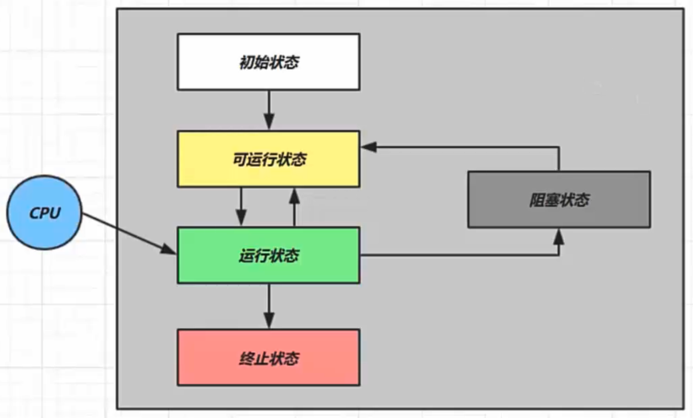
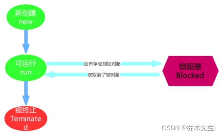

## 五种状态

这是从 操作系统 层面来描述的

* 【初始状态】仅是在语言层面创建了线程对象，还未与操作系统线程关联
* 【可运行状态】**（就绪状态）** 指该线程已经被创建（与操作系统线程关联），可以由 CPU 调度执行
* 【运行状态】指获取了 CPU 时间片运行中的状态
	-  当 CPU 时间片用完，会从【运行状态】转换至【可运行状态】，会导致线程的上下文切换
* 【阻塞状态】
	- 如果调用了阻塞 API，如 BIO 读写文件，这时该线程实际不会用到 CPU，会导致线程上下文切换，进入【阻塞状态】
	- 等 BIO 操作完毕，会由操作系统唤醒阻塞的线程，转换至【可运行状态】
* 与【可运行状态】的区别是，对【阻塞状态】的线程来说只要它们一直不唤醒，调度器就一直不会考虑调度它们
* 【终止状态】表示线程已经执行完毕，生命周期已经结束，不会再转换为其它状态

## 六种状态

这是从 Java API 层面来描述的

在API中 `java.lang.Thread.State` 这个枚举中给出了六种线程状态：

| 线程状态               | 导致状态发生条件                                                                                                            |
| :----------------- | :------------------------------------------------------------------------------------------------------------------ |
| NEW（新建）            | 线程刚被创建，但是并未启动。还没调用start方法。                                                                                          |
| Runnable（可运行）      | 线程可以在java虚拟机中运行的状态，可能正在运行自己代码，也可能没有，这取决于操作系统处理器。**而在该状态，可以在操作系统中分为`Ready`(就绪)和`Running`(运行)状态、`Blocked`(阻塞)状态** |
| Blocked（锁阻塞）       | 当一个线程试图获取一个对象锁，而该对象锁被其他的线程持有，则该线程进入Blocked状态；当该线程持有锁时，该线程将变成Runnable状态。                                             |
| Waiting（无限等待）      | 一个线程在等待另一个线程执行一个（唤醒）动作时，该线程进入Waiting状态。进入这个状态后是不能自动唤醒的，必须等待另一个线程调用`notify`或者`notifyAll`方法才能够唤醒。                     |
| TimedWaiting（计时等待） | 同waiting状态，有几个方法有超时参数，调用他们将进入Timed Waiting状态。这一状态将一直保持到超时期满或者接收到唤醒通知。带有超时参数的常用方法有`Thread.sleep` 、`Object.wait`。     |
| Teminated（被终止）     | 因为run方法正常退出而死亡，或者因为没有捕获的异常终止了run方法而死亡。                                                                              |

> 简单来说，Runnable可以代表操作系统中的可运行状态、运行状态、阻塞状态。而其他的状态都只是Java层面上的状态。

假设有线程 `Thread t`
### NEW

线程刚被创建，但是还没有调用 start() 方法。

当调用 `t.start()` 方法时，由 **NEW --> RUNNABLE**

### RUNNABLE

Java API 层面的 RUNNABLE 状态涵盖了操作系统层面的【可运行状态】、【运行状态】和【阻塞状态】（由于 BIO 导致的线程阻塞，在 Java 里无法区分，仍然认为是可运行）

> BLOCKED ， WAITING ， TIMED_WAITING 都是 Java API 层面对【阻塞状态】的细分。

### WAITING

`Wating`状态在API中介绍为：**一个正在无限期等待另一个线程执行一个特别的（唤醒）动作的线程处于这一状态。**

**情况1：**
t 线程用 `synchronized(obj)` 获取了锁对象后：
- 调用 `obj.wait()` 方法时，t 线程从 **RUNNABLE --> WAITING**
- 调用 `obj.notify()` 、 `obj.notifyAll()` 、 `t.interrupt()` 方法时
	- 竞争锁成功，t 线程从 **WAITING --> RUNNABLE**
	- 竞争锁失败，t 线程从 **WAITING --> BLOCKED**

**情况2：**
当前线程调用 `t.join()` 方法时，当前线程从 **RUNNABLE --> WAITING**

> 注意是当前线程在 t 线程对象的监视器上等待

t 线程运行结束，或调用了当前线程的 `interrupt()` 时，当前线程从 **WAITING --> RUNNABLE**

**情况3：**
当前线程调用 `LockSupport.park()` 方法会让当前线程从 **RUNNABLE --> WAITING**。

调用 `LockSupport.unpark(目标线程)` 或调用了线程 的 `interrupt()` ，会让目标线程从 **WAITING -->RUNNABLE**

### TIMED_WAITING

`Timed Waiting`在API中的描述为：**一个正在限时等待另一个线程执行一个（唤醒）动作的线程处于这一状态。**

**情况1：**
t 线程用 `synchronized(obj)` 获取了对象锁后
- 调用 `obj.wait(long n)` 方法时，t 线程从 **RUNNABLE --> TIMED_WAITING**
- 等待时间超过 n 毫秒，或调用`obj.notify()`、`obj.notifyAll()`、`t.interrupt()`时
	- 竞争锁成功，t 线程从 **TIMED_WAITING --> RUNNABLE**
	- 竞争锁失败，t 线程从 **TIMED_WAITING --> BLOCKED**

**情况2：**
当前线程调用 `t.join(long n)` 方法时，当前线程从**RUNNABLE --> TIMED_WAITING**

> 注意是当前线程在t 线程对象的监视器上等待

线程等待时间超过 n 毫秒，或 t 线程运行结束，或调用了当前线程的`interrupt()` 时，当前线程从**TIMED_WAITING --> RUNNABLE**

**情况3：**
当前线程调用 `Thread.sleep(long n)` ，当前线程从 **RUNNABLE --> TIMED_WAITING**

当前线程等待时间超过了 n 毫秒，当前线程从 **TIMED_WAITING --> RUNNABLE**

**sleep与锁无关，线程睡眠到期自动苏醒，并返回到Runnable（可运行）状态**。
 

情况4：
当前线程调用 `LockSupport.parkNanos(long nanos)` 或 `LockSupport.parkUntil(long millis)` 时，当前线程从 **RUNNABLE --> TIMED_WAITING**

调用 `LockSupport.unpark(目标线程)` 或调用线程的 `interrupt()` ，或是等待超时，会让目标线程从**TIMED_WAITING--> RUNNABLE**

### BLOCKED

`Blocked`状态在API中的介绍为：**一个正在阻塞等待一个监视器锁（锁对象）的线程处于这一状态**。

t 线程用 `synchronized(obj)` 获取了对象锁时如果竞争失败，从 **RUNNABLE --> BLOCKED**
- 持 obj 锁线程的同步代码块执行完毕，会唤醒该对象上所有 BLOCKED 的线程重新竞争，如果其中 t 线程竞争
- 成功，从 **BLOCKED --> RUNNABLE** ，其它失败的线程仍然 BLOCKED

### TERMINATED

 当前线程所有代码运行完毕，会从 **RUNNABLE --> TERMINATED**