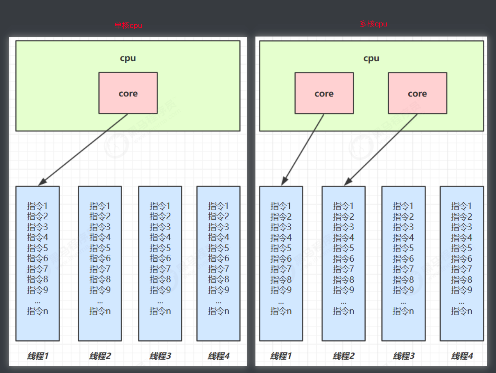
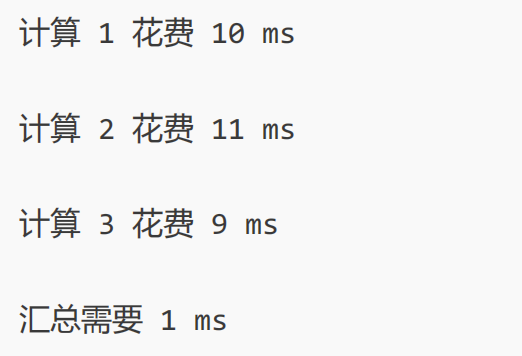

---
tags:
  - Java/并发编程
---


## 进程与线程

### 进程

程序由指令和数据组成，但这些指令要运行，数据要读写，就必须将指令加载至 CPU，数据加载至内存。在指令运行过程中还需要用到磁盘、网络等设备。进程就是用来加载指令、管理内存、管理 IO 的当一个程序被运行，从磁盘加载这个程序的代码至内存，这时就开启了一个进程。

进程就可以视为程序的一个实例。大部分程序可以同时运行多个实例进程（例如记事本、画图、浏览器等），也有的程序只能启动一个实例进程（例如网易云音乐、360 安全卫士等）。

### 线程

一个进程之内可以分为一到多个线程。

一个线程就是一个指令流，将指令流中的一条条指令以一定的顺序交给 CPU 执行。

Java 中，线程作为最小调度单位，进程作为资源分配的最小单位。 在 windows 中进程是不活动的，只是作为线程的容器。

### 二者对比

- 进程基本上相互独立的，而线程存在于进程内，是进程的一个子集
    
- 进程拥有共享的资源，如内存空间等，供其内部的线程共享
    
- 进程间通信较为复杂
    
    - 同一台计算机的进程通信称为 IPC（Inter-process communication）
        
    - 不同计算机之间的进程通信，需要通过网络，并遵守共同的协议，例如 HTTP
        
- 线程通信相对简单，因为它们共享进程内的内存，一个例子是多个线程可以访问同一个共享变量
    
- 线程更轻量，线程上下文切换成本一般上要比进程上下文切换低
    

## 并行与并发

单核 cpu 下，线程实际还是 **串行执行** 的。操作系统中有一个组件叫做任务调度器，将 cpu 的时间片（windows下时间片最小约为 15 毫秒）分给不同的程序使用，只是由于 cpu 在线程间（时间片很短）的切换非常快，人类感觉是同时运行的 。总结为一句话就是： **微观串行，宏观并行**，一般会将这种线程轮流使用 CPU 的做法称为并发 `concurrent`。

多核 cpu下，每个 核（core） 都可以调度运行线程，这时候线程可以是并行的。




引用 Rob Pike (golang 语言的创造者) 的一段描述：

- 并发（concurrent）是同一时间应对（dealing with）多件事情的能力
    
- 并行（parallel）是同一时间动手做（doing）多件事情的能力

**Java代码获取当前电脑CPU个数：**

```java
Runtime runtime = Runtime.getRuntime();
int cpuNums = runtime.availableProcessors();
```

## 线程调度

- **分时调度：** 所有线程轮流使用 CPU 的使用权，平均分配每个线程占用 CPU 的时间。
- **抢占式调度：** 优先让优先级高的线程使用 CPU，如果线程的优先级相同，那么会随机选择一个（线程随机性），Java使用的是抢占式调度。可以设置线程调度的优先级。

大部分操作系统都支持多进程并发运行，现在的操作系统几乎都支持同时运行多个程序。此时，这些程序是在同时运行，“感觉这些软件好像在同一时刻运行着”，实际上，CPU(中央处理器)使用抢占式调度模式在多个线程间进行着高速的切换。对于CPU的一个核而言，某个时刻，只能执行一个线程，而 CPU的在多个线程间切换速度相对我们的感觉要快，看上去就是在同一时刻运行。 其实，多线程程序并不能提高程序的运行速度，但能够提高程序运行效率，让CPU的使用率更高。

## 应用

### 异步调用

以调用方角度来讲，如果

- 需要等待结果返回，才能继续运行就是同步
    
- 不需要等待结果返回，就能继续运行就是异步
    

#### 设计

多线程可以让方法执行变为异步的（即不要巴巴干等着）比如说读取磁盘文件时，假设读取操作花费了 5 秒钟，如果没有线程调度机制，这 5 秒 cpu 什么都做不了，其它代码都得暂停...

#### 结论

- 比如在项目中，视频文件需要转换格式等操作比较费时，这时开一个新线程处理视频转换，避免阻塞主线程
    
- tomcat 的异步 servlet 也是类似的目的，让用户线程处理耗时较长的操作，避免阻塞 tomcat 的工作线程
    
- ui 程序中，开线程进行其他操作，避免阻塞 ui 线程
    

### 提高效率

充分利用多核 cpu 的优势，提高运行效率。想象下面的场景，执行 3 个计算，最后将计算结果汇总。



如果是串行执行，那么总共花费的时间是 10 + 11 + 9 + 1 = 31ms

但如果是四核 cpu，各个核心分别使用线程 1 执行计算 1，线程 2 执行计算 2，线程 3 执行计算 3，那么 3 个线程是并行的，花费时间只取决于最长的那个线程运行的时间，即 11ms 最后加上汇总时间只会花费 12ms （需要在多核 cpu 才能提高效率，单核仍然时是轮流执行）

1. 单核 cpu 下，多线程不能实际提高程序运行效率，只是为了能够在不同的任务之间切换，不同线程轮流使用 cpu ，不至于一个线程总占用 cpu，别的线程没法干活
2. 多核 cpu 可以并行跑多个线程，但能否提高程序运行效率还是要分情况的
    1. 有些任务，经过精心设计，将任务拆分，并行执行，当然可以提高程序的运行效率。但不是所有计算任务都能拆分（参考后文的【阿姆达尔定律】）
    2. 也不是所有任务都需要拆分，任务的目的如果不同，谈拆分和效率没啥意义
3. IO 操作不占用 cpu，只是我们一般拷贝文件使用的是【阻塞 IO】，这时相当于线程虽然不用 cpu，但需要一直等待 IO 结束，没能充分利用线程。所以才有后面的【非阻塞 IO】和【异步 IO】优化

## 线程运行原理

### 栈与栈帧

Java Virtual Machine Stacks （Java 虚拟机栈）

JVM 中由堆、栈、方法区所组成，其中栈内存就是给线程使用的，每个线程启动后，虚拟机就会为其分配一块栈内存。

* 每个栈由多个栈帧（Frame）组成，对应着每次方法调用时所占用的内存
* 每个线程只能有一个活动栈帧，对应着当前正在执行的那个方法


### 线程上下文切换（Thread Context Switch）

因为以下一些原因导致 cpu 不再执行当前的线程，转而执行另一个线程的代码

* 线程的 cpu 时间片用完
* 垃圾回收
* 有更高优先级的线程需要运行
* 线程自己调用了 sleep、yield、wait、join、park、synchronized、lock 等方法

当 Context Switch 发生时，需要由操作系统保存当前线程的状态，并恢复另一个线程的状态，Java 中对应的概念就是程序计数器（Program Counter Register），它的作用是记住下一条 jvm 指令的执行地址，是线程私有的

* 状态包括程序计数器、虚拟机栈中每个栈帧的信息，如局部变量、操作数栈、返回地址等
* Context Switch 频繁发生会影响性能