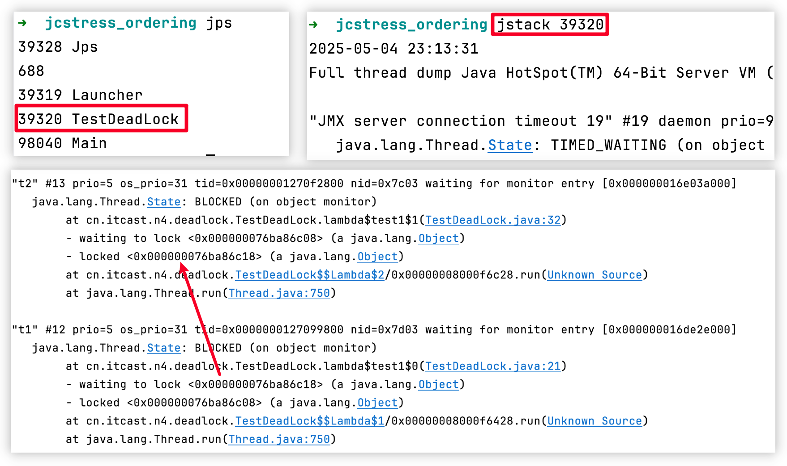
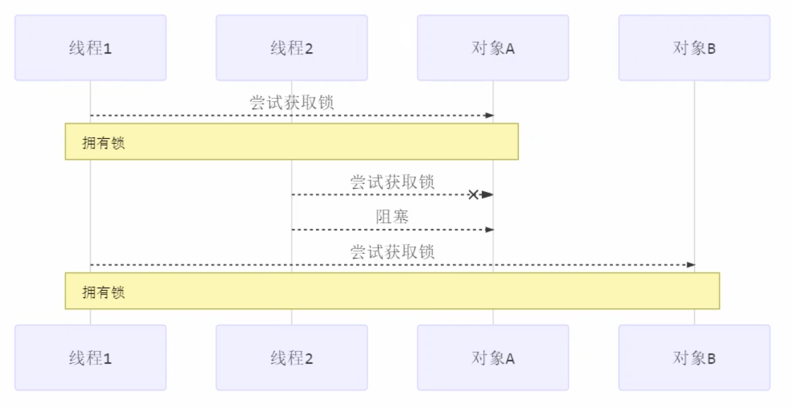

## 多把锁

一间大屋子有两个功能：睡觉、学习，互不相干。

现在A要学习，B要睡觉，但如果只用一间屋子（一个对象锁）的话，**并发度很低**，解决方法是准备多个房间（多个对象锁）。

```java
class BigRoom {
	private final Object studyRoom = new Object();
	private final Object bedRoom = new Object();
	
	public void sleep() {
		// synchronized (this) {
		synchronized (bedRoom) {
			log.debug("sleeping 2 小时");
			Sleeper.sleep(2);
		}
	}
	public void study() {
		// synchronized (this) {
		synchronized (studyRoom) {
			log.debug("study 1 小时");
			Sleeper.sleep(1);
		}
	}
}
```

将锁的粒度细分
- 好处，是可以增强并发度
- 坏处，如果一个线程需要同时获得多把锁，就容易发生死锁

## 死锁

有这样的情况：一个线程需要同时获取多把锁，这时就容易发生死锁。

避免死锁要注意加锁顺序，另外如果由于某个线程进入了死循环，导致其它线程一直等待，对于这种情况 linux 下可以通过 top 先定位到 CPU 占用高的 Java 进程，再利用 top -Hp 进程id 来定位是哪个线程，最后再用 jstack 排查。

`t1 线程` 获得 `A对象` 锁，接下来想获取 `B对象` 的锁 `t2 线程` 获得 `B对象` 锁，接下来想获取 `A对象` 的锁。

例：
```java
Object A = new Object();
Object B = new Object();

Thread t1 = new Thread(() -> {
	synchronized (A) {
		log.debug("lock A");
		sleep(1);
		synchronized (B) {
			log.debug("lock B");
			log.debug("操作...");
		}
	}
}, "t1");

Thread t2 = new Thread(() -> {
	synchronized (B) {
		log.debug("lock B");
		sleep(0.5);
		synchronized (A) {
			log.debug("lock A");
			log.debug("操作...");
		}
	}
}, "t2");

t1.start();
t2.start();
```

## 定位死锁

检测死锁可以使用 jconsole工具，或者使用 jps 定位进程 id，再用 jstack 定位死锁：

 **jconsole工具：**
 


**JPS定位死锁：**

下图可以看到，t1线程等待的锁，被t2线程锁着，所以造成死锁。



## 活锁

活锁出现在两个线程互相改变对方的结束条件，最后谁也无法结束，例如：

```java
static volatile int count = 10;  
static final Object lock = new Object();  

public static void main(String[] args) {  
    new Thread(() -> {  
        // 期望减到 0 退出循环  
        while (count > 0) {  
            sleep(0.2);  
            count--;  
            log.debug("count: {}", count);  
        }  
    }, "t1").start();  
    new Thread(() -> {  
        // 期望超过 20 退出循环  
        while (count < 20) {  
            sleep(0.2);  
            count++;  
            log.debug("count: {}", count);  
        }  
    }, "t2").start();  
}
```

可以让两个线程的执行交错开，基本可以解决活锁的问题。

## 饥饿

大部分的定义：一个线程由于优先级太低，始终得不到 CPU 调度执行，也不能够结束

不按顺序加锁，容易发生死锁：


顺序加锁，容易发生饥饿：
