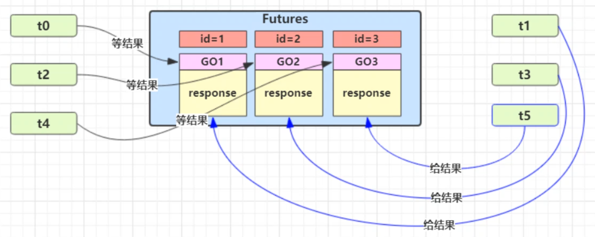

即 Guarded Suspension，用在一个线程等待另一个线程的执行结果
- 有一个结果需要从一个线程传递到另一个线程，让他们关联同一个 GuardedObject
- 如果有结果不断从一个线程到另一个线程那么可以使用消息队列（见生产者/消费者）
- JDK 中，**join 的实现、Future 的实现，采用的就是此模式**，因为要等待另一方的结果，因此归类到同步模式

## GuardedObject


示例：
```java
class GuardedObject {  
    // 结果  
    private Object response;  
    // 获取结果  timeout 表示要等待多久 2000
    public Object get(long timeout) {  
        synchronized (this) {  
            // 开始等待的时间
            long begin = System.currentTimeMillis();  
            // 已经等待的时间  
            long passedTime = 0;  
            while (response == null) {  
                // 这一轮循环应该等待的时间
                long waitTime = timeout - passedTime;  
                // 已经等待的时间超过了需要等待时间，退出循环  
                if (timeout - passedTime <= 0) {  
                    break;  
                }  
                try {  
	                // 可能会被其他不相关的线程唤醒，唤醒后继续等待
                    this.wait(waitTime);
                } catch (InterruptedException e) {  
                    e.printStackTrace();  
                }  
                // 可能会被其他不相关的线程唤醒，唤醒后继续等待
                passedTime = System.currentTimeMillis() - begin;
            }  
            return response;  
        }  
    }  
  
    // 产生结果  
    public void complete(Object response) {  
        synchronized (this) {  
            // 给结果成员变量赋值  
            this.response = response;  
            this.notifyAll();  
        }  
    }  
}
```

运行上述代码：
```java
public static void main(String[] args) {
	GuardedObject guardedObject = new GuardedObject();
	new Thread(() -> {
		try {
			// 子线程执行下载
			List<String> response = download();
			log.debug("download complete...");
			guardedObject.complete(response);
		} catch (IOException e) {
			e.printStackTrace();
		}
	}).start();

	log.debug("waiting...");
	// 主线程阻塞等待，最多2秒
	Object response = guardedObject.get(2000);
	log.debug("response: [{}] size", ((List<String>) response).size());
}
```


## 多任务版 GuardedObject

上述代码如果有多个线程，需要传递GuardedObject对象进行业务处理，在实际应用中传递操作会比较复杂，为了解决这个问题，需要支持多任务的管理，在常用的RPC框架中，就使用了这个模式。

图中 Futures 就好比居民楼一层的信箱（每个信箱有房间编号），左侧的 t0，t2，t4 就好比等待邮件的居民，右侧的 t1，t3，t5 就好比邮递员。

如果需要在多个类之间使用 GuardedObject 对象，作为参数传递不是很方便，因此设计一个用来解耦的中间类，这样不仅能够解耦【结果等待者】和【结果生产者】，还能够同时支持多个任务的管理。





GuardedObject类逻辑保持不变，增加id功能：
```java
class GuardedObject {  
    // 通过id进行标识，唤醒对应的线程
    private int id;  
    public GuardedObject(int id) {  this.id = id;  }  
    public int getId() {  return id;  }  
  
    // 结果  
    private Object response;  
  
    // 获取结果
    public Object get(long timeout) {  
        synchronized (this) {  
            long begin = System.currentTimeMillis(); 
            long passedTime = 0;  
            while (response == null) {  
                long waitTime = timeout - passedTime;  
                if (timeout - passedTime <= 0) {  
                    break;  
                }  
                try {  
                    this.wait(waitTime);
                } catch (InterruptedException e) {  
                    e.printStackTrace();  
                }  
                passedTime = System.currentTimeMillis() - begin;
            }  
            return response;  
        }  
    }  
    
    // 产生结果  
    public void complete(Object response) {  
        synchronized (this) {  
            this.response = response;  
            this.notifyAll();  
        }  
    }  
}
```


Mailboxes比较通用，主要当生产者和消费者的工具类：
```java
class Mailboxes {  
	// Hashtable 线程安全
    private static Map<Integer, GuardedObject> boxes = new Hashtable<>(); 
    private static int id = 1;  
  
    // 产生唯一 id
    private static synchronized int generateId() {  return id++;  }  
  
    public static GuardedObject getGuardedObject(int id) {  
	    // 该业务是一次性业务，用完就删除，防止占用内存
        return boxes.remove(id);  
    }  
  
    public static GuardedObject createGuardedObject() {  
	    // 通过该方法创建对象，保证id唯一
        GuardedObject go = new GuardedObject(generateId());  
        boxes.put(go.getId(), go);  
        return go;  
    }  
  
    public static Set<Integer> getIds() {  
        return boxes.keySet();  
    }  
}
```

邮递员类，用于从Mailboxes中获取需要被操作的业务进行送信：
```java
class Postman extends Thread {  
    private int id;  
    private String mail;  
  
    public Postman(int id, String mail) {  
        this.id = id;  
        this.mail = mail;  
    }  
  
    @Override  
    public void run() {  
        GuardedObject guardedObject = Mailboxes.getGuardedObject(id);  
        log.debug("送信 id:{}, 内容:{}", id, mail);  
        guardedObject.complete(mail);  
    }  
}
```

收信类，如果需要收信，则开启等待，最多等待五秒钟：
```java
class People extends Thread {  
    @Override  
    public void run() {  
        // 收信  
        GuardedObject guardedObject = Mailboxes.createGuardedObject();  
        log.debug("开始收信 id:{}", guardedObject.getId());  
        Object mail = guardedObject.get(5000);  
        log.debug("收到信 id:{}, 内容:{}", guardedObject.getId(), mail);  
    }  
}
```


主方法，模拟三个需要收信的线程，和对于这三个线程的送信线程：
```java
public static void main(String[] args) throws InterruptedException {  
    for (int i = 0; i < 3; i++) {  
        new People().start();  
    }  
    Sleeper.sleep(1);  
    for (Integer id : Mailboxes.getIds()) {  
        new Postman(id, "内容" + id).start();  
    }  
}
```