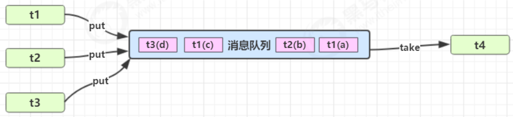

与前面的保护性暂停中的 GuardObject 不同，异步模式不需要产生结果和消费结果的线程一一对应。
消费队列可以用来平衡生产和消费的线程资源，生产者仅负责产生结果数据，不关心数据该如何处理，而消费者专心处理结果数据。
消息队列是有容量限制的，满时不会再加入数据，空时不会再消耗数据。JDK 中各种阻塞队列，采用的就是这种模式。




## 消息队列

消息类：
生产者和消费者通信的对象

```java
@Getter  
final class Message {  
    private final int id;  
    private final Object value;  
  
    public Message(int id, Object value) {  
        this.id = id;  
        this.value = value;  
    }  
      
    @Override  
    public String toString() {  
        return "Message{" +  
                "id=" + id +  
                ", value=" + value +  
                '}';  
    }  
}
```


消息队列：
生产者和消费者通信的操作

```java
class MessageQueue {  
    // 消息的队列集合  
    private final LinkedList<Message> list = new LinkedList<>();  
    // 队列容量  
    private final int capcity;  
  
    public MessageQueue(int capcity) {  
        this.capcity = capcity;  
    }  
  
    // 获取消息  
    public Message take() {  
        // 检查队列是否为空  
        synchronized (list) {  
            while (list.isEmpty()) {  
                try {  
                    log.debug("队列为空, 消费者线程等待");  
                    list.wait();  
                } catch (InterruptedException e) {  
                    e.printStackTrace();  
                }  
            }  
            // 从队列头部获取消息并返回  
            Message message = list.removeFirst();  
            log.debug("已消费消息 {}", message);  
            list.notifyAll();  
            return message;  
        }  
    }  
  
    // 存入消息  
    public void put(Message message) {  
        synchronized (list) {  
            // 检查对象是否已满  
            while (list.size() == capcity) {  
                try {  
                    log.debug("队列已满, 生产者线程等待");  
                    list.wait();  
                } catch (InterruptedException e) {  
                    e.printStackTrace();  
                }  
            }  
            // 将消息加入队列尾部  
            list.addLast(message);  
            log.debug("已生产消息 {}", message);  
            // 通知消费者有消息可以消费了
            list.notifyAll();  
        }  
    }  
}
```


测试生产者和消费者：

```java
public static void main(String[] args) {  
    MessageQueue queue = new MessageQueue(2);  
    for (int i = 0; i < 3; i++) {  
        int id = i;  
        new Thread(() -> {  
            queue.put(new Message(id, "值" + id));  
        }, "生产者" + i).start();  
    }  
    new Thread(() -> {  
        while (true) {  
            sleep(1);  
            Message message = queue.take();  
        }  
    }, "消费者").start();  
}
```