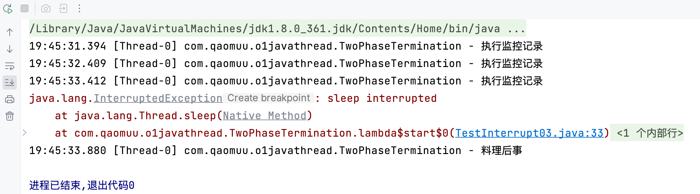

Two Phase Termination

> 在一个线程 T1 中如何“优雅”终止线程 T2？这里的【优雅】指的是给 T2 一个料理后事的机会。

**错误思路：**
- 使用线程对象的 stop() 方法停止线程：stop 方法会真正杀死线程，如果这时线程锁住了共享资源，那么当它被杀死后就再也没有机会释放锁，其它线程将永远无法获取锁
- 使用 System.exit(int) 方法停止线程：目的仅是停止一个线程，但这种做法会让整个程序都停止

**两阶段终止模式：**


## 利用`isInterrupted`

interrupt 可以打断正在执行的线程，无论这个线程是在 sleep，wait，还是正常运行。

代码实现：

```java
public class TestInterrupt03 {
    public static void main(String[] args) throws InterruptedException {
        TwoPhaseTermination t1 = new TwoPhaseTermination();
        t1.start();
        Thread.sleep(3500);
        t1.stop();
    }
}

@Slf4j
class TwoPhaseTermination {
    private Thread thread;

    // 开启监控线程
    public void start() {
        thread = new Thread(() -> {

            while (true) {
                Thread current = Thread.currentThread();
                if (current.isInterrupted()) {
                    log.debug("料理后事");
                    break;
                }
                
                try {
                    Thread.sleep(1000); // 情况1:睡眠的时候被打断
                    log.debug("执行监控记录");  // 情况2:操作的时候被打断
                } catch (InterruptedException e) {
                    e.printStackTrace();
                    // 如果睡眠的时候被打断，打断标记会被重置
                    // 所以这里重新设置打断标记
                    current.interrupt();
                }
                
            }
            
        });
        
        thread.start();
    }

    // 停止监控线程
    public void stop() {
        thread.interrupt();
    }
}
```




## 利用停止标记 volatile

```java
// 监控线程  
private Thread monitorThread;  
// 停止标记  
private volatile boolean stop = false;  

// 启动监控线程  
public void start() {  
    monitorThread = new Thread(() -> {  
        while (true) {  
            Thread current = Thread.currentThread();  
            // 是否被打断  
            if (stop) {  
                log.debug("料理后事");  
                break;  
            }  
            try {  
                Thread.sleep(1000);  
                log.debug("执行监控记录");  
            } catch (InterruptedException e) {  
            }  
        }  
    }, "monitor");  
    monitorThread.start();  
}  

// 停止监控线程  
public void stop() {  
    stop = true;  
    monitorThread.interrupt();  
}
```


