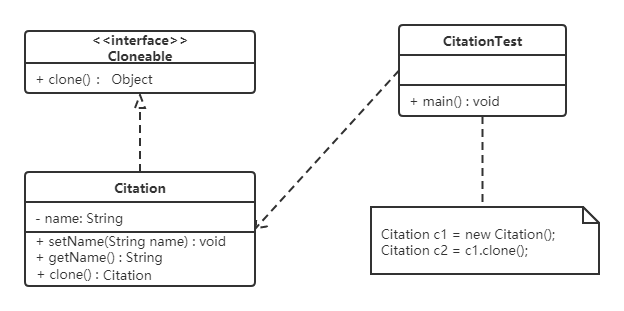

用一个已经创建的实例作为原型，通过复制该原型对象来创建一个和原型对象相同的新对象。

原型模式包含如下角色：

* 抽象原型类：规定了具体原型对象必须实现的的 clone() 方法。
* 具体原型类：实现抽象原型类的 clone() 方法，它是可被复制的对象。
* 访问类：使用具体原型类中的 clone() 方法来复制新的对象。


原型模式的克隆分为浅克隆和深克隆。


> 浅克隆：创建一个新对象，新对象的属性和原来对象完全相同，对于非基本类型属性，仍指向原有属性所指向的对象的内存地址。

> 深克隆：创建一个新对象，属性中引用的其他对象也会被克隆，不再指向原有对象地址。


## 浅克隆

Java中的Object类中提供了`clone()`方法来实现浅克隆。 Cloneable 接口是上面的类图中的抽象原型类，而实现了Cloneable接口的子实现类就是具体的原型类。代码如下：

Realizetype（具体的原型类）：

```java
public class Realizetype implements Cloneable {
    public Realizetype() {
        System.out.println("具体的原型对象创建完成！");
    }
​
    @Override
    protected Realizetype clone() throws CloneNotSupportedException {
        System.out.println("具体原型复制成功！");
        // 因为所有类继承Object类，所以调用父类的克隆方法，
        // 就是调用Object类的克隆方法，是浅克隆
        return (Realizetype) super.clone();
    }
}
```


PrototypeTest（测试访问类）：

```java
public class PrototypeTest {
    public static void main(String[] args) throws CloneNotSupportedException {
        Realizetype r1 = new Realizetype();
        Realizetype r2 = r1.clone();
        System.out.println("对象r1和r2是同一个对象？" + (r1 == r2));
    }
}
```


## 深克隆

同一学校的“三好学生”奖状除了获奖人姓名不同，其他都相同，可以使用原型模式复制多个“三好学生”奖状出来，然后在修改奖状上的名字即可。



奖状类：

```java
public class Citation implements Cloneable, Serializable {

    private Student stu;

    public Student getStu() {
        return stu;
    }

    public void setStu(Student stu) {
        this.stu = stu;
    }

    public void show() {
        System.out.println(stu.getName() + "同学：在2020学年第一学期中表现优秀，被评为三好学生。特发此状！");
    }

    @Override
    public Citation clone() {
        //创建对象输出流对象
        try (ObjectOutputStream oos = new ObjectOutputStream(Files.newOutputStream(Paths.get("D:\\b.txt")))) {
            //将c1对象写出到文件中
            oos.writeObject(this);
        } catch (IOException e) {
            throw new RuntimeException(e);
        }
        //创建对象出入流对象
        try (ObjectInputStream ois = new ObjectInputStream(Files.newInputStream(Paths.get("D:\\b.txt")))) {
            //读取对象
            return (Citation) ois.readObject();
        } catch (ClassNotFoundException | IOException e) {
            throw new RuntimeException(e);
        }
    }
}
```


学生类：

```java
public class Student implements Serializable {
    private String name;
    private String address;

    public Student(String name, String address) {
        this.name = name;
        this.address = address;
    }

    public Student() {
    }

    public String getName() {
        return name;
    }

    public void setName(String name) {
        this.name = name;
    }

    public String getAddress() {
        return address;
    }

    public void setAddress(String address) {
        this.address = address;
    }
}
```


测试类：

```java
public static void main(String[] args) {
    Citation c1 = new Citation();
    Student stu = new Student("张三", "西安");
    c1.setStu(stu);
    Citation c2 = c1.clone();
    //获取c2奖状所属学生对象
    Student stu1 = c2.getStu();
    stu1.setName("李四");
    //判断stu对象和stu1对象是否是同一个对象
    System.out.println("stu和stu1是同一个对象？" + (stu == stu1));
    c1.show();
    c2.show();
}
```


