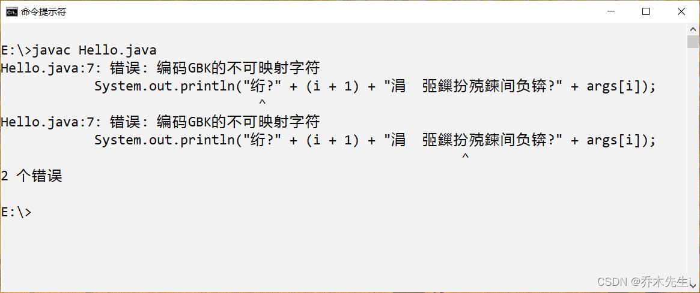

## 报错案例



## 解决方案

编译时加上` -encoding utf-8 `

例如我的java文件是`Hello.java`：

```java
javac -encoding utf-8 Hello.java
```

此时就编译成功


## 错误原因

由于JDK是国际版的，在用javac编译时，编译程序首先会获得操作系统默认采用的编码格式（GBK），然后JDK就把Java源文件从GBK编码格式转换为Java内部默认的Unicode格式放入内存中，然后javac把转换后的Unicode格式的文件编译成class类文件。

此时，class文件是Unicode编码的，它暂存在内存中，JDK将此以Unicode格式编码的class文件保存到操作系统中形成class文件。当不加设置就编译时，相当于使用了参数：`javac -encoding GBK Test.java`，就会出现不兼容的情况。
