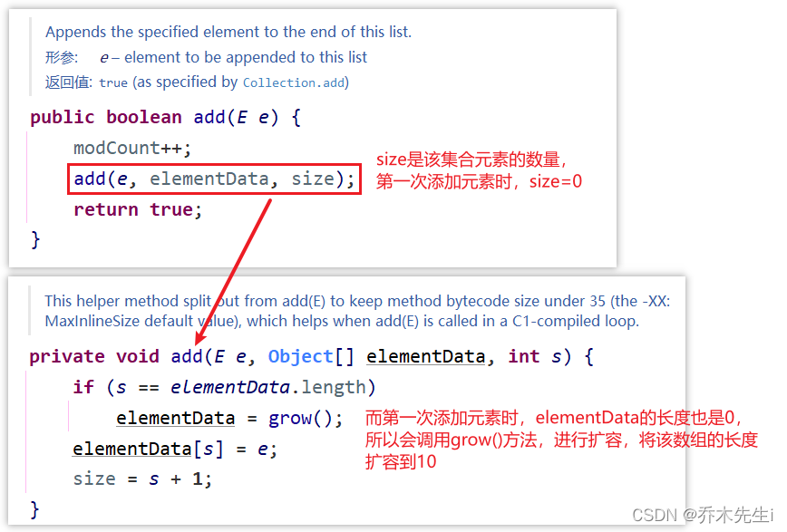
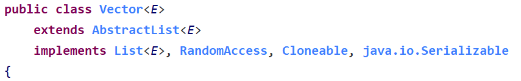
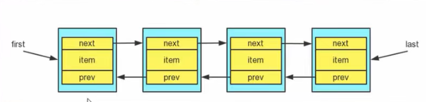
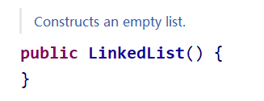
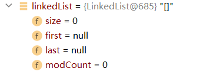
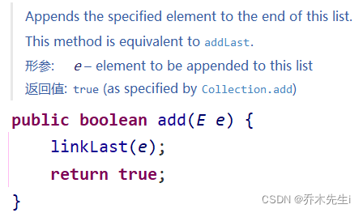
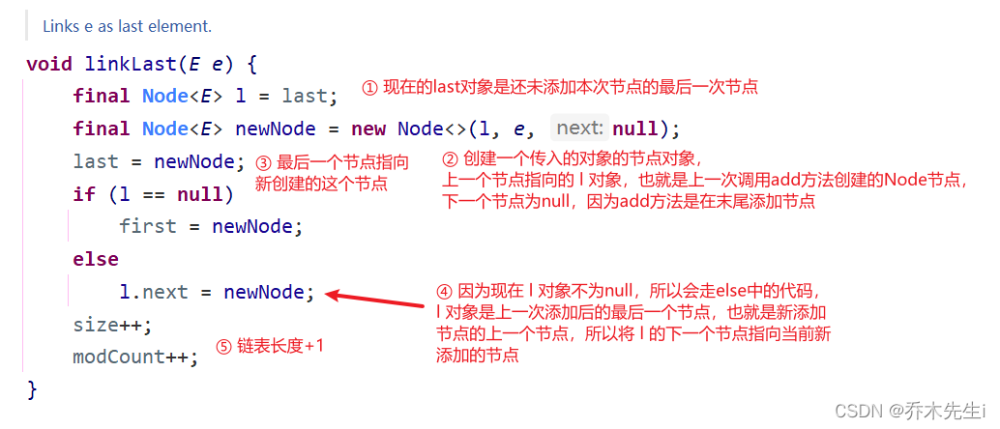

## List接口

`java.util.List`接口继承自`Collection`接口，是单列集合的一个重要分支，习惯性地会将实现了List接口的对象称为**List集合**。

**在List集合中允许出现重复的元素**，所有的元素是以一种线性方式进行存储的，在程序中可以通过索引来访问集合中的指定元素。**List集合是元素有序的，即元素的存入顺序和取出顺序一致。**

**List接口特点：**
> - 元素存取有序。例如，存元素的顺序是11、22、33。那么集合中，元素的存储就是按照11、22、33的顺序完成的。
> - 带有索引，通过索引就可以精确的操作集合中的元素（与数组的索引是一个道理）
> - 集合中可以有重复的元素，通过元素的equals方法，来比较是否是重复的元素。

### 常用方法

List作为Collection集合的子接口，不但**继承了Collection接口中的全部方法**，而且还**增加了一些根据元素索引来操作集合的特有方法**。

`void add(int index, E element)`：将指定的元素，添加到该集合中的指定位置上。
`boolean addAll(int index, Collection<? extends E> c)`：将指定集合中的所有元素，添加到该集合中的指定位置上。

`E get(int index)`：返回集合中指定位置的元素。

`int indexOf(Object o)`：返回o在集合中首次出现的位置，没有则返回-1。
`int lastIndexOf(Object o)`：返回o在集合中最后一次出现的位置，没有则返回-1。
 
`E remove(int index)`：移除列表中指定位置的元素，返回的是被移除的元素。

`E set(int index, E element)`：用指定元素替换集合中指定位置的元素，返回值的更新前的元素。相当于替换。

`List<E> subList(int fromIndex, int toIndex)`：返回从fromIndex位置到toIndex位置的子集合，前闭后开，不包含toIndex位置的元素。
 
 
 ### List集合的三种遍历方式
 
 **第一种：** 迭代器
```java
Iterator iter = list.itertor();
while(iter.hasNext()) {
	Object o = iter.next();
}
```

**第二种：** 增强for

```java
for(Object o : list) {
}
```

**第三种：** 普通for

```java
for(int i = 0; i < list.size(); i++) {
	Object o = list.get(i);
}
```

## ArrayList

`java.util.ArrayList`是大小可变的数组的实现，存储在内的数据称为元素。此类提供一些方法来操作内部存储的元素。 ArrayList中可不断添加元素，其大小也自动增长。

ArrayList可以加入`null`，并且可以多个。
> ArrayList基本等同于Vector，但是ArrayList是线程不安全的(执行效率更高)，所以在多线程的情况下，不建议使用ArrayList。

```java
// 基本格式：
ArrayList<String> list = new ArrayList<String>();

// 在JDK 7后，右侧泛型的尖括号之内可以留空，但是<>仍然要写。简化格式：
ArrayList<String> list = new ArrayList<>();
```

**常用方法**和List接口、Collection接口一样。

```java
public class Demo01ArrayListMethod {
    public static void main(String[] args) {
        //创建集合对象
        ArrayList<String> list = new ArrayList<String>();
        //添加元素
        list.add("hello");
        list.add("world");
        list.add("java");
        //public E get(int index):返回指定索引处的元素
        System.out.println("get:"+list.get(0));
        System.out.println("get:"+list.get(1));
        System.out.println("get:"+list.get(2));
        //public int size():返回集合中的元素的个数
        System.out.println("size:"+list.size());
        //public E remove(int index):删除指定索引处的元素，返回被删除的元素
        System.out.println("remove:"+list.remove(0));
        //遍历输出
        for(int i = 0; i < list.size(); i++){
            System.out.println(list.get(i));
        }
    }
}
```

### 【源码】扩容机制

> ArrayList中维护了一个Object类型的数组elementData
> **transient**关键字：表示瞬间、短暂的，改属性不会被序列化


> 当创建ArrayList对象时，如果使用的是无参构造器，则初始elementData容量为0，第一次添加时，扩容为10，如需再次扩容，则扩容为elementData的1.5倍。
> ① 当new一个ArrayList对象的时候会进入空参构造，并初始化一个长度为0的空数组。
> ② 调用add方法时，会先确定是否需要扩容，然后再将元素存入集合中。




后面再次扩容时，就是按照1.5倍扩容。然后将原数组的数据，使用Arrays.copyOf()方法拷贝到新的数组中。


> 如果使用的是指定大小的构造器，则初始elementData容量为指定的大小，如需扩容，则直接扩容elementData的1.5倍。
> ① 当new一个ArrayList对象的时候会进入有参构造，并初始化一个长度为传入的大小的数组。
> ② 这里就和上面的一样了，调用add方法时，会先确定是否需要扩容，然后再将元素存入集合中。

## Vector



Vector底层也是一个对象数组，`protected Object[] elementData;`。
Vector是线程同步的，即线程安全，Vector类的操作方法带有`synchronized`关键字。
所以，在开发中，需要线程同步安全时，使用Vector。

> **扩容机制与ArrayList类似。**

## Vector和ArrayList的比较

|  | 底层结构 | 版本 | 线程安全(同步)、效率 | 扩容机制 |
|:----|:----|:----|:----|:----|
| ArrayList | 可变数组 | JDK 1.2 | 不安全，效率高 | 如果有参构造1.5倍，如果无参构造：1. 第一次是10；2. 从第二次扩容开始，按1.5倍 |
| Vector | 可变数组 | JDK 1.0 | 安全，效率不高 | 如果无参构造，默认10，第二次开始按2倍扩容。如果有参构造，每次按2倍扩容 |


## LinkedList

`java.util.LinkedList`集合数据存储的结构是链表结构，方便元素添加、删除的集合，LinkedList是一个双向链表。

**可以添加任意元素，并且可以重复，包括null。**

> **线程不安全，没有实现同步。**

所以LinkedList提供了大量首尾操作的方法。LinkedList是List的子类，List中的方法LinkedList都是可以使用，LinkedList集合也可以作为堆栈、队列的结构使用。

### 常用方法

因为LinkedList实现了List接口，所以List接口中的所有方法LinkedList也可以使用，这里列出了LinkedList常用的独有的方法。

`void addFirst(E e)`：将指定元素插入此列表的开头
`void addLast(E e)`：将指定元素添加到此列表的结尾

`E getFirst()`：返回此列表的第一个元素
`E getLast()`：返回此列表的最后一个元素

`E removeFirst()`：移除并返回此列表的第一个元素
`E removeLast()`：移除并返回此列表的最后一个元素

`E pop()`：从此列表所表示的堆栈处弹出一个元素

`void push(E e)`：将元素推入此列表所表示的堆栈

`boolean isEmpty()`：如果列表不包含元素，则返回true

### 模拟简单链表

LinkedList中维护了两个属性，`first`和`last`分别指向了首节点和尾结点，每个节点(Node对象)，里面又维护了`prev`、`next`、`item`三个属性，其中通过`prev`指向前一个，通过`next`后一个，最终实现双向链表。

因为LinkedList的元素添加和删除不是通过数组完成的，所以效率相对来说较高。



定义一个Node类：

```java
//定义一个Node类，Node对象表示双向链表的一个节点
class Node {
    // 存放的数据
    public Object item;
    // 下一个节点
    public Node next;
    // 上一个节点
    public Node prev;

    public Node(Object item) {
        this.item = item;
    }
    
    @Override
    public String toString() {
        return "Node item = " + item;
    }
}
```

测试类：使用双向链表

```java
public class LinkedList01 {
    public static void main(String[] args) {
        // 模拟一个双向链表
        Node tom = new Node("tom");
        Node jack = new Node("jack");
        Node arbor = new Node("arbor");

        // 连接三个节点，形成双向链表
        // tom → jack → arbor
        tom.next = jack;
        jack.next = arbor;

        // arbor → jack → tom
        arbor.prev = jack;
        jack.prev = tom;

        // 定义一个头节点，指向tom
        Node first = tom;
        // 定义一个尾结点，指向arbor
        Node last = arbor;

        // 链表添加节点 在jack和arbor之间插入zhangsan节点
        // 因为没有数组，不用扩容和拷贝，所以增删更快
        Node zhangsan = new Node("zhangsan");
        zhangsan.prev = jack;
        zhangsan.next = arbor;
        jack.next = zhangsan;
        arbor.prev = zhangsan;

        // 链表删除节点 删除jack节点
        tom.next = zhangsan;
        zhangsan.prev = tom;

        // 使用双向链表，从头节点到尾节点遍历
        while (true) {
            if (first == null) {
                break;
            }
            System.out.println(first);
            first = first.next;
        }

        System.out.println("-------------------");

        // 使用双向链表，从尾节点到头节点遍历
        while (true) {
            if (last == null) {
                break;
            }
            System.out.println(last);
            last = last.prev;
        }
    }
}
```

### LinkedList源码

#### add方法

当使用空参构造new一个LinkedList时，空参构造是没有语句执行的。



此时，长度为0，第一个节点和最后一个节点都是null。



当程序走到`linkedList.add(1);`时，走的是下面这个方法：



进入linkLast方法，进行以下分析：


再次执行add方法，新增加一个节点，又会进入linkLast方法：



#### remove方法

调用空参的`remove()`方法，会删除链表的第一个节点。


进入`removeFirst()`方法可以看到，会先判断first节点是否为空(也就是判断是否为空链表)，如果不是空的话，进行删除：


通过分析


## ArrayList和LinkedList的比较

|  | 底层结构 | 增删的效率 | 改查的效率 |
|:----|:----|:----|:----|
| ArrayList | 可变数组 | 较低，扩容数组 | 较高 |
| LinkedList | 双向链表 | 较高，链表追加 | 较低 |

> 如果改查多，选择ArrayList
> 如果增删多，选择LinkedList


