## Map

Java提供了专门的集合类用来存放这种对象关系的对象，即`java.util.Map`接口。

Map接口下的集合与Collection接口下的集合存储数据的形式不同。

> Collection中的集合，元素是孤立存在的（理解为单身），向集合中存储元素采用一个个元素的方式存储。
> Map中的集合，元素是成对存在的(理解为夫妻)。每个元素由键与值两部分组成，**通过键可以找对所对应的值**。

Collection中的集合称为单列集合，Map中的集合称为双列集合。
**Map中的集合不能包含重复的键，值可以重复，每个键只能对应一个值。**
所以key只能有一个null，value可以有多个null。

Map接口中的集合都有两个泛型变量`<K,V>`，在使用时，要为两个泛型变量赋予数据类型。两个泛型变量`<K,V>`的数据类型可以相同，也可以不同。所以，**key和value可以使任何引用类型，会封装到`HashMap$Node`对象中。** `Node`类实现了`Map.Entry`接口。

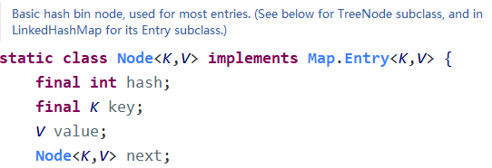

### Entry键值对对象

> Map中存放的是两种对象，一种称为key(键)，一种称为value(值)，它们在在Map中是一一对应关系，这一对对象又称做Map中的一个Entry(项)。Entry将键值对的对应关系封装成了对象。即键值对对象，这样我们在遍历Map集合时，就可以从每一个键值对（Entry）对象中获取对应的键与对应的值。

为了**方便遍历**，Map还会创建一个EntrySet集合，**该集合存放Entry类型的元素。**`EntrySet`是`HashMap`的一个内部类。**所以实际上`EntrySet`里面存放的元素还是`Node`类型的元素。**

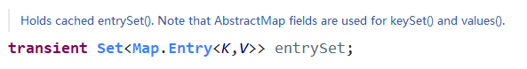

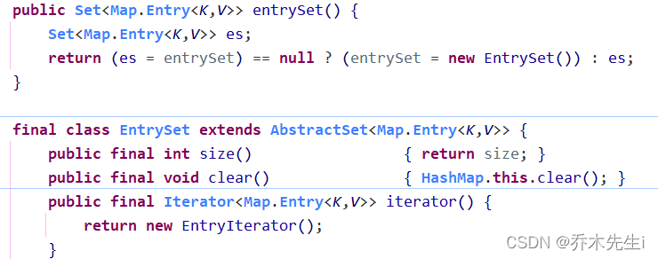

在Entry类中，有两个方法，`getKey()`和`getValue()`，可以获取Node中的key和value：


还有个方法`keySet()`，可以获得map中key的Set集合对象，拿到Set可以遍历得到对应的value值

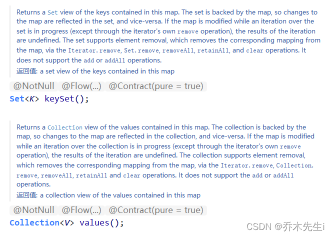

#### 常用方法

既然Entry表示了一对键和值，那么也同样提供了获取对应键和对应值得方法：

`K getKey()`：获取Entry对象中的键
`V getValue()`：获取Entry对象中的值

在Map集合中也提供了获取所有Entry对象的方法：
`Set<Map.Entry<K,V>> entrySet()`：获取到Map集合中所有的键值对对象的集合(Set集合)


#### 遍历键值对方式

键值对方式：即通过集合中每个键值对(Entry)对象，获取键值对(Entry)对象中的键与值。

步骤：
> ① 获取Map集合中，所有的键值对(Entry)对象，以Set集合形式返回。使用entrySet()。
> ② 遍历包含键值对(Entry)对象的Set集合，得到每一个键值对(Entry)对象。
> ③ 通过键值对(Entry)对象，获取Entry对象中的键与值。 使用getkey() getValue()。

所以遍历Map的一种方法：

```java
Map map = new HashMap();
map.put("aaa", "arbor");
map.put("bbb", "boyboy");
Set set = map.entrySet();
for (Object obj : set) {
	Map.Entry entry = (Map.Entry) obj;
	System.out.println("key: " + entry.getKey() + "\t value: " + entry.getValue());
}
```

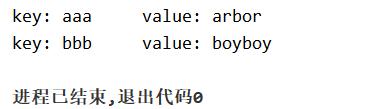

>Map集合不能直接使用迭代器或者foreach进行遍历。但是转成Set之后就可以使用了。
> - 当给HashMap中存放自定义对象时，如果自定义对象作为key存在，这时要保证对象唯一，必须复写对象的hashCode和equals方法。
> - 如果要保证map中存放的key和取出的顺序一致，可以使用java.util.LinkedHashMap集合来存放。
> 
> HashMap保证成对元素唯一，并且查询速度很快，可是成对元素存放进去是没有顺序的，在HashMap下面有一个子类LinkedHashMap，它是链表和哈希表组合的一个数据存储结构，有序，速度快。


### Map常用方法

`V put(K key, V value)`：把指定的键与指定的值添加到Map集合中。

`V remove(Object key)`：把指定键对应的键值对元素在Map集合中删除，返回被删除元素的值。
`clear()`：清空Map中的元素。

`V get(Object key)`：根据指定的键，在Map集合中获取对应的值。
`int size()`：获取元素个数。

`containsKey(Object key)`：判断集合中是否包含指定的键。
`boolean isEmpty()`：判断Map是否为空。

`Set<K> keySet()`：获取Map集合中所有的键，存储到Set集合中(只是引用，并非复制)。
`Collection<V> values()`：获取Map集合中所有的值，存储到Collection集合中(只是引用，并非复制)。

`Set<Map.Entry<K,V>> entrySet()`：获取到Map集合中所有的键值对对象的集合(Set集合)。

```java
public class MapDemo {
    public static void main(String[] args) {
        //创建 map对象
        Map<String, String> map = new HashMap<>();

        //添加元素到集合
        map.put("黄晓明", "杨颖");
        map.put("邓超", "孙俪");
        System.out.println(map);

        //String remove(String key)
        System.out.println(map.remove("邓超"));
        System.out.println(map);

        // 想要查看 黄晓明的媳妇 是谁
        System.out.println(map.get("黄晓明"));
        System.out.println(map.get("邓超"));    
    }
}
```

> 使用put方法时，若指定的键(key)在集合中没有，则没有这个键对应的值，返回null，并把指定的键值添加到集合中；若指定的键(key)在集合中存在，则返回值为集合中键对应的值（该值为替换前的值），并把指定键所对应的值，替换成指定的新值。

### 遍历Map

Map集合不能直接使用迭代器或者foreach进行遍历，但是转成Set之后就可以使用了。

> - 当给HashMap中存放自定义对象时，如果自定义对象作为key存在，这时要保证对象唯一，必须重写对象的hashCode和equals方法。
> - 如果要保证map中存放的key和取出的顺序一致，可以使用 `java.util.LinkedHashMap` 集合来存放。


#### ① 获取所有的Key，找对应的Value

```java
Map map = new HashMap();
map.put("aaa", "AAA");
map.put("bbb", "BBB");
map.put("ccc", "CCC");
Set keySet = map.keySet();
// 这里也可以使用迭代器，不做演示啦
for (Object key : keySet) {
    System.out.println(key + "-->" + map.get(key));
}
```

#### ② 直接取出所有的Value

```java
Map map = new HashMap();
map.put("aaa", "AAA");
map.put("bbb", "BBB");
map.put("ccc", "CCC");
Collection values = map.values();
// 这里也可以使用迭代器，不做演示啦
for (Object value : values) {
    System.out.println(value);
}
```

#### ③ 使用Entry对象遍历

这个上面**遍历键值对方式**有写过

```java
Map map = new HashMap();
map.put("aaa", "arbor");
map.put("bbb", "boyboy");
Set set = map.entrySet();
for (Object obj : set) {
	Map.Entry entry = (Map.Entry) obj;
	System.out.println(entry.getKey() + "-->" + entry.getValue());
}
```

## HashMap

`HashMap<K,V>`：存储数据采用的哈希表结构，元素的存取顺序不能保证一致。由于要保证键的唯一、不重复，需要重写键的hashCode()方法、equals()方法。

> HashMap有一个子类LinkedHashMap，它是链表和哈希表组合的一个数据存储结构，有序，速度快。

HashMap是Map接口中使用频率最高的实现类。
Key不能重复，Value可以重复，可以使用`null`来做Key或者Value。

如果添加相同的Key，会替换原有该Key的Value值，相当于修改。

该源码在HashMap的`putVal()`方法：


和HashSet一样，不保证映射的顺序，因为底层是以hash表的方式来存储的。
**HashMap没有实现同步，所以线程不安全。**

HashMap底层存放Key和Value的是`Node`对象，该对象实现了`Map.Entry<K,V>`。
HashMap在jdk7使用的是【数组+链表】，在jdk8使用的是【数组+链表+红黑树】。


### HashMap底层机制

HashMap底层维护的是Node类型的数组table，默认为null。

当创建对象时，将加载因子(loadfactor)初始化为0.75。

当添加key-val时，通过key的哈希值得到在table的索引，然后判断该索引处是否有元素，如果没有，直接添加；如果有，则判断索引处元素的key是否和准备添加的key是否相等，如果相等，替换val，如果不相等，判断是树结构还是链表结构，做出相应的处理；如果添加时发现容量不足，则扩容。

第一次添加，table的容量会扩容为16，临界值(threshold)是12(容量 * 加载因子)。

之后扩容，table的容量为原来的2倍，临界值也是原来的2倍，依次类推。

在Java8中，如果一条链表的原数个数超过了`TREEIFY_THRESHOLD`(默认是8)，并且table的容量大于等于`MIN_TREEIFY_CAPACITY`(默认为64)，就会进行树化(红黑树)

---

执行下面代码：

```java
HashMap map = new HashMap();
map.put("java", 10);
map.put("php", 10);
map.put("java", 20);
```

看源码：

① 执行构造方法，初始化加载因子，加载因子为0.75

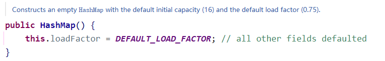

并且此时的`HashMap$Node[] table = null`

② 执行put方法：

这里会先执行`hash`方法计算key的哈希值，然后再进入`putVal`方法


hash方法：

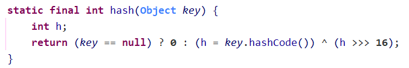

③ 第一次进入`putVal`方法执行：

```java
final V putVal(int hash, K key, V value, boolean onlyIfAbsent,
                   boolean evict) {
    Node<K,V>[] tab; Node<K,V> p; int n, i;
    // 1. 因为第一次，table为空，所以第一个if条件成立
    if ((tab = table) == null || (n = tab.length) == 0)
   		// 2. 然后调用resize方法扩容table，走完这一步
   		// 走完这一步，table的容量为16，因为使用的是默认值
        n = (tab = resize()).length;
    // 3. 因为是第一次添加，所以计算出索引的位置是没有元素的
    if ((p = tab[i = (n - 1) & hash]) == null)
    	// 没有元素的话，直接把key-val在这里添加到索引的位置
        tab[i] = newNode(hash, key, value, null);
    else {
		// 这里还有代码，先省略...
    }
    // 4. 添加修改次数和长度
    ++modCount;
    // 5. 判断是否需要扩容数组：
    // threshold是临界值，16*0.75=12，因为第一次添加，不到临界值，不扩容
    if (++size > threshold)
        resize();
    afterNodeInsertion(evict);
    return null;
}
```

`resize`方法：

```java
final Node<K,V>[] resize() {
    Node<K,V>[] oldTab = table;
    // 1. 如果是第一次调用put方法，这里oldCap为0
    int oldCap = (oldTab == null) ? 0 : oldTab.length;
    int oldThr = threshold;
    int newCap, newThr = 0;
    if (oldCap > 0) {
        if (oldCap >= MAXIMUM_CAPACITY) {
            threshold = Integer.MAX_VALUE;
            return oldTab;
        }
        else if ((newCap = oldCap << 1) < MAXIMUM_CAPACITY &&
                 oldCap >= DEFAULT_INITIAL_CAPACITY)
            newThr = oldThr << 1; // double threshold
    }
    else if (oldThr > 0) // initial capacity was placed in threshold
        newCap = oldThr;
    else {               // zero initial threshold signifies using defaults
    	// 2. 如果第一次调用put方法，会进入这里
    	// 会使用默认初始容量16
        newCap = DEFAULT_INITIAL_CAPACITY;
        newThr = (int)(DEFAULT_LOAD_FACTOR * DEFAULT_INITIAL_CAPACITY);
    }
    if (newThr == 0) {
        float ft = (float)newCap * loadFactor;
        newThr = (newCap < MAXIMUM_CAPACITY && ft < (float)MAXIMUM_CAPACITY ?
                  (int)ft : Integer.MAX_VALUE);
    }
    threshold = newThr;
    // 3. new一个Node类型的数组【核心】
    @SuppressWarnings({"rawtypes","unchecked"})
    Node<K,V>[] newTab = (Node<K,V>[])new Node[newCap];
    table = newTab;
    
    // ...这里还有很多代码  没看了  不是很重要
    
    return newTab;
}
```

④ 第二次进入`putVal`方法执行：

```java
final V putVal(int hash, K key, V value, boolean onlyIfAbsent,
                   boolean evict) {
    Node<K,V>[] tab; Node<K,V> p; int n, i;
    // 1. 因为第二次，table不是null，长度也不为0，这里if不会进去
    if ((tab = table) == null || (n = tab.length) == 0)
        n = (tab = resize()).length;
    // 2. 第二次添加的hash计算出的索引和第一次的不一样
    // 所以计算出索引的位置是没有元素的
    if ((p = tab[i = (n - 1) & hash]) == null)
    	// 没有元素的话，直接把key-val在这里添加到索引的位置
        tab[i] = newNode(hash, key, value, null);
    else {
		// 这里还有代码，先省略...
    }
    // 3. 添加修改次数和长度
    ++modCount;
    // 4. 判断是否需要扩容数组
    if (++size > threshold)
        resize();
    afterNodeInsertion(evict);
    return null;
}
```

⑤ 第三次进入`putVal`方法：

这里第三次的key和第一次的key是一样的

```java
final V putVal(int hash, K key, V value, boolean onlyIfAbsent,
               boolean evict) {
    Node<K,V>[] tab; Node<K,V> p; int n, i;
    // 1. table不为null，if不会进去
    if ((tab = table) == null || (n = tab.length) == 0)
        n = (tab = resize()).length;
    // 2. 这里通过hash计算出的索引和第一次的一样
    // 第一次已经在该索引处添加了一个元素了，所以这里if进不去
    if ((p = tab[i = (n - 1) & hash]) == null)
        tab[i] = newNode(hash, key, value, null);
    else {
    	// 因为索引的位置已经有元素了，所以会进入else里面
        Node<K,V> e; K k;
        // 3. 如果hash相同，内容也相同，就使用现在的val替换掉原来的val
        if (p.hash == hash &&
            ((k = p.key) == key || (key != null && key.equals(k))))
            e = p;
        // 4. 如果当前索引的位置是一个红黑树，则按照红黑树的方式添加元素
        else if (p instanceof TreeNode)
            e = ((TreeNode<K,V>)p).putTreeVal(this, tab, hash, key, value);
        // 5. 如果现在该索引位置还是链表，则会和链表中的元素一个个比较
        // 比较是否和链表中的元素相同，相同的话替换val
        // 不同的话则添加到链表末尾
        // 如果table满足树化要求的话，则会进行树化
        else {
            for (int binCount = 0; ; ++binCount) {
            	// 5.2 如果没有与原来key相同的，就将新的元素放在链表的最后
                if ((e = p.next) == null) {
                    p.next = newNode(hash, key, value, null);
                    // 5.3 加入链表后，判断链表的节点数是否到达8个了
                    // 如果到了8个，就进入转换为红黑树的方法
                    // 进入该方法不一定会树化，还需要table的长度大于等于64
                    if (binCount >= TREEIFY_THRESHOLD - 1) // -1 for 1st
                        treeifyBin(tab, hash);
                    break;
                }
                // 5.1 这里就是比较key与原来已经存在的key是否相同
                if (e.hash == hash &&
                    ((k = e.key) == key || (key != null && key.equals(k))))
                    break;
                p = e;
            }
        }
        // 6. 在这里会被替换掉原来的val
        if (e != null) { // existing mapping for key
            V oldValue = e.value;
            if (!onlyIfAbsent || oldValue == null)
                e.value = value;
            afterNodeAccess(e);
            return oldValue;
        }
    }
    // 7. 添加修改次数和map的长度并判断是否需要扩容数组
    ++modCount;
    if (++size > threshold)
        resize();
    afterNodeInsertion(evict);
    return null;
}
```

**剪枝：**

假如有一条链表已经变成一颗红黑树，并且删除了一定元素后，会将红黑树重新转换为链表(数据量小时，没必要红黑树)。

### 触发扩容、树化情况

模拟树化情况，重写`hashCode`方法：

```java
class A {
    private int num;
    public A(int num) {
        this.num = num;
    }
    @Override
    public int hashCode() {
        return 100;
    }
}
```

这样，每个A对象的hashCode值都是100，会更容易触发树化机制。
因为没有重写equals方法，所以每个对象又不相同。

在map中存入12个对象：

```java
HashMap map = new HashMap();
for (int i = 0; i < 12; i++) {
    map.put(new A(i), "hello");
}
```

① 当一次次put时，可以看到所有的key-val都挂在了索引为4的链表上


② 当`i`等于8时，也就是第9次进行put，此时索引为4的链表是已经8个节点了，此时的第9次put，会触发扩容机制

- 先判断链表的长度是否大于等于8
- 如果大于等于8，进入`treeifyBin`方法
- 再判断table表的长度是否大于等于64
- 如果没有大于等于64，则进行扩容

可以看到，元素为9的时候，table的长度为32，以此类推，元素数量为10的时候，table表会扩容到64。

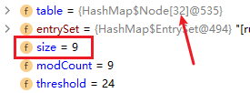

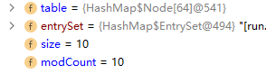

③ 此时，这个map满足table的长度大于等于64，链表的长度大于等于8，如果再添加元素，则会将该链表进行树化。但是table不会再被扩容了。

>未加入第11个元素前，索引第36的元素类型：
>


>加入第11个元素后，索引第36的元素类型：
>


④ 如果再次加入元素，putVal方法会走这条线：

因为此时的p节点已经是红黑树了

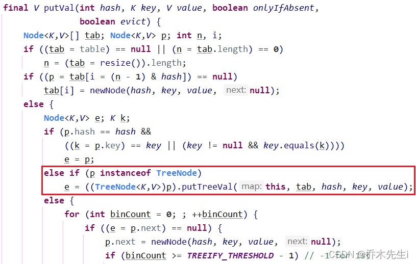

⑤ 而table的扩容是数组的元素到了临界值(数组的长度 * 0.75)就会进行扩容。

## HashTable

基本介绍：

> ① 存放的元素是键值对：Key-Value
> ② HashTable的键和值都不能为null
> ③ HashTable的使用方法基本和HashMap一样
> ④ HashTable是线程安全的，HashMap是线程不安全的


HashTable在方法上加了`synchronized`关键字。


### HashTable底层

① HashTable底层也是个数组，初始化大小为11，数组的类型是`HashTable$Entry`，这个Entry类实现了`Map$Entry`

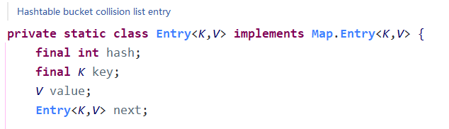

② 加载因子是0.75，所以第一次的临界值是`8 = 11 * 0.75 `

③ **扩容机制**：
- 数组的元素要超过8个(临界值)才进行第一次扩容
- 第一次扩容后，table的长度为23，(`原先的长度 * 2 + 1`)
- 新的临界值为：`17 = 23 * 0.75`

当执行put方法时，实际上添加到table的方法是`addEntry`方法。

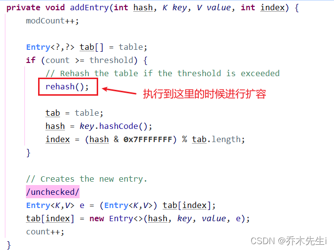


## HashMap和HashTable的比较

|  | JDK版本 | 线程安全(同步) | 效率 | 允许null键null值 |
|:----|:----|:----|:----|:----|
| **HashMap** | 1.2 | 不安全 | 高 | 可以 |
| **HashTable** | 1.0 | 安全 | 较低 | 不可以 | 