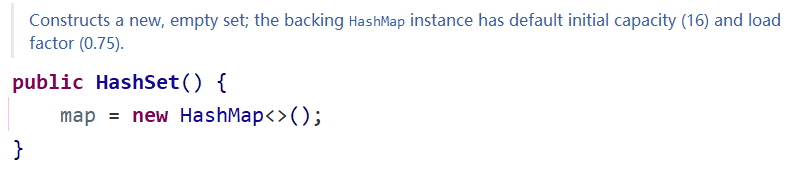
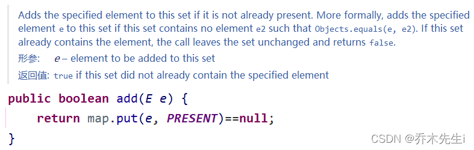
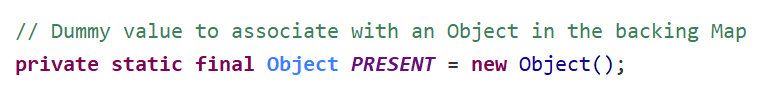
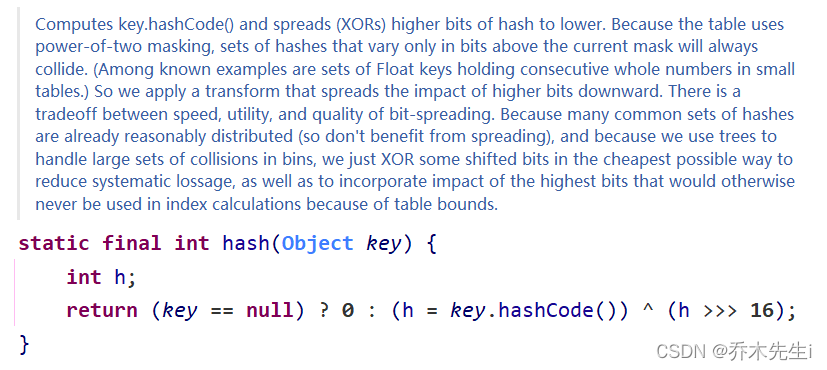
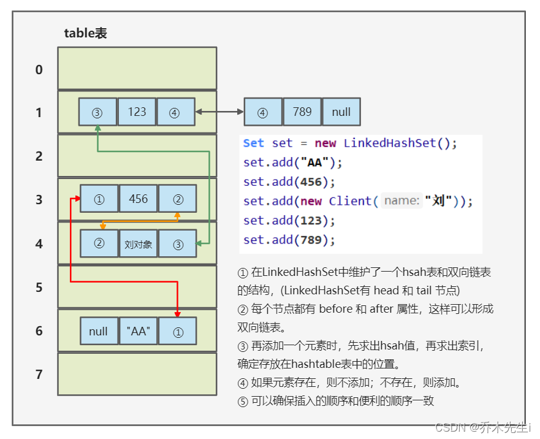

## Set集合

`java.util.Set`接口和`java.util.List`接口一样，同样继承自`Collection`接口，它与`Collection`接口中的方法基本一致，并没有对`Collection`接口进行功能上的扩充，只是比`Collection`接口更加严格了。

与List接口不同的是，**Set接口中元素无序，并且都会以某种规则保证存入的元素不出现重复，没有索引。** 最多包含一个null值。

Set集合取出元素的方式可以采用：迭代器、增强for。

## HashSet

`java.util.HashSet`是Set接口的一个实现类，**它所存储的元素是不可重复的，并且元素都是无序的(即存取顺序不一致)。** `java.util.HashSet`底层的实现是一个`java.util.HashMap`支持。

而HashMap的底层是通过数组+链表+红黑树实现的。

HashSet是根据对象的哈希值来确定元素在集合中的存储位置，因此具有良好的存取和查找性能。保证元素唯一性的方式依赖于：**hashCode与equals方法**。

### 简单模拟 数组+链表

链表的节点对象：

```java
// 节点对象，存储数据，可以指向下一个节点，从而形成链表
class Node {
    // 存放数据
    Object item;
    // 下一个节点
    Node next;

    // 有参构造，方便传输数据
    public Node(Object item) {
        this.item = item;
    }

    @Override
    public String toString() {
        return "Node{" +
                "item=" + item +
                '}';
    }
}
```

测试类：实现数组+链表

```java
public static void main(String[] args) {
    // 创建一个数组，可以称之为表
    Node[] table = new Node[8];
    // 创建一个节点，存储到数组的第四个元素
    Node tom = new Node("tom");
    table[3] = tom;
    // 创建另一个节点，挂载到tom对象，此时tom和jack形成链表
    Node jack = new Node("jack");
    tom.next = jack;
    // 创建第三个对象，挂载到jack，此时该链表有三个节点
    Node arbor = new Node("arbor");
    jack.next = arbor;
    // 创建节点，存储到数组的第六个元素
    Node zhangsan = new Node("zhangsan");
    table[5] = zhangsan;
    // 此时该Node[]就是数组+链表的形式
}
```

通过debug获取执行到上述代码最后一行时，Node[]中各元素的值，可以看到索引为3的元素是一个链表。


### 【源码详解】[HashMap](JavaMap.md#hashmap)扩容机制

> ① HashSet底层是HashMap。
> ② 添加一个元素时，先得到hash值，转换成索引值。
> ③ 找到存储数据表table，看这个索引位置是否已经存有元素。
> ④ 如果没有元素，直接存入。
> ⑤ 如果有元素，调用equals方法比较，如果相同，放弃添加；如果不同，添加到最后。
> ⑥ 在Java8中，如果一条链表的元素个数达到`TREEIFY_THRESHOLD`(默认是8)，并且table的大小 **大于等于** `MIN_TREEIFY_CAPACITY`(默认是64)，就会进行树化(红黑树)。

运行下方代码，分析源码：
```java
public static void main(String[] args) {
    HashSet hashSet = new HashSet();
    hashSet.add("java");
    hashSet.add("c++");
    hashSet.add("java");
    System.out.println("hashSet = " + hashSet);
}
```

① 当执行第一行的创建对象时，执行无参构造器，其实是创建了一个`HashMap`对象。



② 执行`add`方法时，底层会调用HashMap对象的`put`方法。put方法的key就是传入的值，而value是常量`PRESENT`。



因为Map集合是以 `key | value` 的形式存储的，这里的value，主要起占位的作用，没有意义。



③ 然后会进入put方法，这里先看静态方法`hash()`。


hash方法中会拿到传入对象的HashCode值，并进行方法中算法，得到key对应的hash值(不等价HashCode值)。为的是时哈希值不一样，以免发生碰撞。



④ **【重点】** 第一次执行add方法，hash方法得到哈希值后，执行`putVal()`方法，这个方法是源码的核心。

```java
final V putVal(int hash, K key, V value, boolean onlyIfAbsent,
               boolean evict) {
    // 1. 定义辅助变量
    Node<K,V>[] tab; Node<K,V> p; int n, i;
    // 2. table是HashMap的一个属性，是一个Node类型的数组，类似于上面实现“链表+数组”结构的table
    // 3. 在执行第一个add方法时，table还没有初始化，所以table的值为null，会进入第一个if中
    if ((tab = table) == null || (n = tab.length) == 0)
    	// 4. 走到这里，会执行一个resize()方法，往下拉，看④.①介绍该方法
    	// 将得到的数组对象赋值给tab，并且将数组的长度赋值给n
        n = (tab = resize()).length;
    // 5. 根据key得到的hash值，计算key应该存放到table表的哪个索引位置
    // 并把这个位置的对象赋值给p，然后判断p是不是为null
    if ((p = tab[i = (n - 1) & hash]) == null)
    	// 5.1 如果p为空，说明table的该索引位置没有元素，直接存入该索引位置即可
    	// key就是要存入的元素，value就是占位的Object对象，
    	// 存hash的目的是为了进行后续存入的比较，最后一个null值，是下一个节点引用，现在还没有，所以为null
        tab[i] = newNode(hash, key, value, null);
    else {
        Node<K,V> e; K k;
        if (p.hash == hash &&
            ((k = p.key) == key || (key != null && key.equals(k))))
            e = p;
        else if (p instanceof TreeNode)
            e = ((TreeNode<K,V>)p).putTreeVal(this, tab, hash, key, value);
        else {
            for (int binCount = 0; ; ++binCount) {
                if ((e = p.next) == null) {
                    p.next = newNode(hash, key, value, null);
                    if (binCount >= TREEIFY_THRESHOLD - 1) // -1 for 1st
                        treeifyBin(tab, hash);
                    break;
                }
                if (e.hash == hash &&
                    ((k = e.key) == key || (key != null && key.equals(k))))
                    break;
                p = e;
            }
        }
        if (e != null) { // existing mapping for key
            V oldValue = e.value;
            if (!onlyIfAbsent || oldValue == null)
                e.value = value;
            afterNodeAccess(e);
            return oldValue;
        }
    }
    // 6. 表示修改次数+1
    ++modCount;
    // 7. 如果加入后的元素是否大于临界值，如果大于，进行扩容
    if (++size > threshold)
        resize();
    // 8. 这个方法是留给HashMap子类实现的，比如LinkedHashMap，但是对于HashMap来说是一个空方法
    afterNodeInsertion(evict);
    // 9. 返回null，表示添加成功，如果不成功，返回的是旧的值(已经加进来的对象)
    return null;
}
```

④.① 这里是`resize`方法简单的介绍。

```java
final Node<K,V>[] resize() {
	// 1. 因为是第一次调用add方法添加元素，所以table还是null
    Node<K,V>[] oldTab = table;
    // 2. 所以这里oldCap的值为0 
    int oldCap = (oldTab == null) ? 0 : oldTab.length;
    int oldThr = threshold;
    int newCap, newThr = 0;
    if (oldCap > 0) {
        if (oldCap >= MAXIMUM_CAPACITY) {
            threshold = Integer.MAX_VALUE;
            return oldTab;
        }
        else if ((newCap = oldCap << 1) < MAXIMUM_CAPACITY &&
                 oldCap >= DEFAULT_INITIAL_CAPACITY)
            newThr = oldThr << 1;
    }
    else if (oldThr > 0)
        newCap = oldThr;
    else {
    	// 3. oldCap 值为0时，会进入这个else中，
    	// 而DEFAULT_INITIAL_CAPACITY的值为16
        newCap = DEFAULT_INITIAL_CAPACITY;
        // newThr是临界值DEFAULT_LOAD_FACTOR的值为0.75
        // 所以这里临界值的值为12，当table现在16的空间，用到12时，就准备扩容table的空间
        newThr = (int)(DEFAULT_LOAD_FACTOR * DEFAULT_INITIAL_CAPACITY);
    }
    if (newThr == 0) {
        float ft = (float)newCap * loadFactor;
        newThr = (newCap < MAXIMUM_CAPACITY && ft < (float)MAXIMUM_CAPACITY ?
                  (int)ft : Integer.MAX_VALUE);
    }
    threshold = newThr;
    @SuppressWarnings({"rawtypes","unchecked"})
    // 4. 根据得到的新空间，new一个对应空间的Node数组，并将对象赋值给属性table
    Node<K,V>[] newTab = (Node<K,V>[])new Node[newCap];
    table = newTab;
    if (oldTab != null) {
        for (int j = 0; j < oldCap; ++j) {
            Node<K,V> e;
            if ((e = oldTab[j]) != null) {
                oldTab[j] = null;
                if (e.next == null)
                    newTab[e.hash & (newCap - 1)] = e;
                else if (e instanceof TreeNode)
                    ((TreeNode<K,V>)e).split(this, newTab, j, oldCap);
                else { // preserve order
                    Node<K,V> loHead = null, loTail = null;
                    Node<K,V> hiHead = null, hiTail = null;
                    Node<K,V> next;
                    do {
                        next = e.next;
                        if ((e.hash & oldCap) == 0) {
                            if (loTail == null)
                                loHead = e;
                            else
                                loTail.next = e;
                            loTail = e;
                        }
                        else {
                            if (hiTail == null)
                                hiHead = e;
                            else
                                hiTail.next = e;
                            hiTail = e;
                        }
                    } while ((e = next) != null);
                    if (loTail != null) {
                        loTail.next = null;
                        newTab[j] = loHead;
                    }
                    if (hiTail != null) {
                        hiTail.next = null;
                        newTab[j + oldCap] = hiHead;
                    }
                }
            }
        }
    }
    // 5. 然后返回创建的数组对象
    return newTab;
}
```

⑤ 第二次执行add方法，hash方法得到哈希值后，还是执行`putVal()`方法。

```java
final V putVal(int hash, K key, V value, boolean onlyIfAbsent,
               boolean evict) {
    // 1. 定义辅助变量
    Node<K,V>[] tab; Node<K,V> p; int n, i;
    // 2. 因为此时的table不是null，所以这里的if不会进去
    if ((tab = table) == null || (n = tab.length) == 0)
        n = (tab = resize()).length;
    // 3. 根据key得到的hash值，计算key应该存放到table表的哪个索引位置
    // 并把这个位置的对象赋值给p，然后判断p是不是为null
    if ((p = tab[i = (n - 1) & hash]) == null)
    	// 3.1 第二次执行add方法，因为传入的值和第一次不一样，并且hash计算后
    	// 存放第二次传入的值是table中的另一个索引值，所以也会走这一步
        tab[i] = newNode(hash, key, value, null);
    else {
        Node<K,V> e; K k;
        if (p.hash == hash &&
            ((k = p.key) == key || (key != null && key.equals(k))))
            e = p;
        else if (p instanceof TreeNode)
            e = ((TreeNode<K,V>)p).putTreeVal(this, tab, hash, key, value);
        else {
            for (int binCount = 0; ; ++binCount) {
                if ((e = p.next) == null) {
                    p.next = newNode(hash, key, value, null);
                    if (binCount >= TREEIFY_THRESHOLD - 1) // -1 for 1st
                        treeifyBin(tab, hash);
                    break;
                }
                if (e.hash == hash &&
                    ((k = e.key) == key || (key != null && key.equals(k))))
                    break;
                p = e;
            }
        }
        if (e != null) { // existing mapping for key
            V oldValue = e.value;
            if (!onlyIfAbsent || oldValue == null)
                e.value = value;
            afterNodeAccess(e);
            return oldValue;
        }
    }
    // 4. 表示修改次数+1
    ++modCount;
    // 5. 如果加入后的元素是否大于临界值，如果大于，进行扩容
    if (++size > threshold)
        resize();
    // 6. 这个方法是留给HashMap子类实现的，比如LinkedHashMap，但是对于HashMap来说是一个空方法
    afterNodeInsertion(evict);
    // 7. 返回null，表示添加成功，如果不成功，返回的是旧的值(已经加进来的对象)
    return null;
}
```

⑤ **【重点】** 第三次执行add方法，因为第三次添加的值和第一次一样，所以这里会添加失败。

```java
final V putVal(int hash, K key, V value, boolean onlyIfAbsent,
               boolean evict) {
    // 1. 定义辅助变量
    Node<K,V>[] tab; Node<K,V> p; int n, i;
    // 2. 因为此时的table不是null，所以这里的if不会进去
    if ((tab = table) == null || (n = tab.length) == 0)
        n = (tab = resize()).length;
    // 3. 根据key得到的hash值，计算key应该存放到table表的哪个索引位置
    // 并把这个位置的对象赋值给p，然后判断p是不是为null
    // 因为存入的是同一个对象，所以算出的hash值和索引值也是一样的，
    // 因此这里的p不为null
    if ((p = tab[i = (n - 1) & hash]) == null)
        tab[i] = newNode(hash, key, value, null);
    else {
    	// 3.1 p不等于null的话，会走else这里
    	// 定义辅助变量
        Node<K,V> e; K k;
        // 3.2 p是table中对应索引的第一个节点对象，判断p的hash是否和需要新添加的对象hash一样
        // 并且 p对象的key和本次传进来的key相等(key是调用add方法时传入的值)
        //     或者 本次调用add方法传入的对象不是null，和p的key还相等
        // 简而言之，先算出本次传入对象的索引，然后和该索引处的第一个节点对象比较这两个对象是否相等
        if (p.hash == hash &&
            ((k = p.key) == key || (key != null && key.equals(k))))
            e = p;
        // 3.3 如果不相等的话，判断p是不是一颗红黑树，如果是的话将此节点添加到树里
        else if (p instanceof TreeNode)
            e = ((TreeNode<K,V>)p).putTreeVal(this, tab, hash, key, value);
        // 3.4 如果table对应的索引已经是一个链表
        // 使用for循环遍历链表，并且与传入的对象比较，如果发现相等，立刻跳出循环，
        // 如果都不相等，将该对象放在链表的末尾，然后跳出循环
        else {
            for (int binCount = 0; ; ++binCount) {
            	// 判断当前节点的下一个节点是否有指向，没有的话创建对象，并存入
            	// 这里 e 就是下一个节点对象(第一次循环指向第二个节点，第二次指向第三个节点)
                if ((e = p.next) == null) {
                    p.next = newNode(hash, key, value, null);
                    // 加入后 判断链表的节点是否大于等于成为红黑树的临界点
                    // TREEIFY_THRESHOLD的值是8，也就是说当前链表节点有八个
                    // 达到八个时，就将当前链表进行树化，当前链表，不是所有
                    // 在转成红黑树时，会再进行一个判断：table的长度要等于64时
                    // 这个判断是在treeifyBin(tab, hash);方法中判断的
                    // 如果不等于64，会先扩容，所以，转成红黑树有两个条件：table长度等于64，当前链表节点数大于等于8
                    if (binCount >= TREEIFY_THRESHOLD - 1) // -1 for 1st
                        treeifyBin(tab, hash);
                    break;
                }
                // 如果不为null，则比较两个对象是否相等，相等的话直接跳出
                if (e.hash == hash &&
                    ((k = e.key) == key || (key != null && key.equals(k))))
                    break;
                // 将p指向下一个对象，以此遍历链表
                p = e;
            }
        }
        if (e != null) { // existing mapping for key
            V oldValue = e.value;
            if (!onlyIfAbsent || oldValue == null)
                e.value = value;
            afterNodeAccess(e);
            return oldValue;
        }
    }
    // 4. 表示修改次数+1
    ++modCount;
    // 5. 如果加入后的元素是否大于临界值，如果大于，进行扩容
    if (++size > threshold)
        resize();
    // 6. 这个方法是留给HashMap子类实现的，比如LinkedHashMap，但是对于HashMap来说是一个空方法
    afterNodeInsertion(evict);
    // 7. 返回null，表示添加成功，如果不成功，返回的是旧的值(已经加进来的对象)
    return null;
}
```

### 结论

> ① HashSet底层是HashMap，第一次添加时，table数组扩容至16，临界值(threshold)是 16 * 加载因子(loadFactor)是 0.75 = 12
> ② 如果table数组使用到了临界值(12)，就会扩容到16 * 2 = 32，新的临界值就是 32 * 0.75 = 24，以此类推
> ③ table扩容是根据size的大小扩容的，不是链表的个数。
> ④ 在Java8中，如果一条链表的元素个数到达TREEIFY_THRESHOLD(默认是8)，并且table的大小 >= MIN_TREEIFY_CAPACITY(默认是64)，就进行树化(红黑树)，否则仍然采用数组扩容机制。

## LinkedHashSet

在HashSet下面有一个子类`java.util.LinkedHashSet`，LinkedHashSet底层是[LinkedHashMap](JavaMap.md)，它是双向链表和数组组合的一个数据存储结构。
LinkedHashSet根据元素的hashCode值来决定元素的存储位置，同时使用链表维护元素的次序，所以使得元素看起来是**有序**保存的。



### 结论

> ① LinkedHashSet加入顺序和取出顺序是一致的
> ② LinkedHashSet底层维护的是LinkedHashMap(是HashMap的子类)
> ③ LinkedHashSet底层是 数组table+双向链表
> ④ 当第一次添加元素时，会直接将数组(table)扩容到16，存放的节点类型是 LinkedHashMap$Entry
> 
> ⑤ 但是底层的数组(table)是`HashMap$Node`类型的，`LinkedHashMap$Entry`是`HashMap$Node`的子类。
> ⑥ 当调用LinkedHashSet的add方法是，执行的是父类的HashSet的add方法，而HashSet的add方法执行的是HashMap的put方法。


