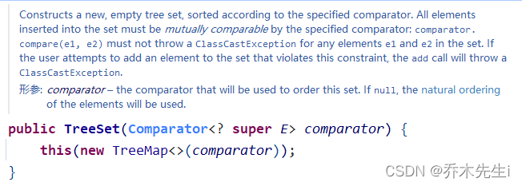
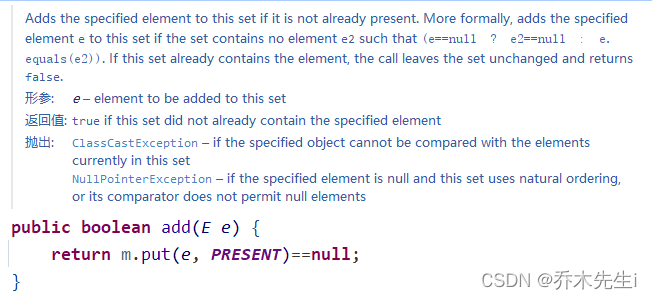

## TreeSet

TreeSet实现了Set接口，是一个有序的集合。它继承了`AbstractSet`抽象类，实现了`NavigableSet<E>`，`Cloneable`，Serializable接口。`TreeSet`是基于`TreeMap`实现的，TreeSet的元素支持2种排序方式：**自然排序或者根据提供的Comparator进行排序**。

使用方式和Set集合差不多

自然排序是默认的，也可以使用Comparator进行排序：

```java
TreeSet treeSet = new TreeSet(new Comparator() {
    @Override
    public int compare(Object o1, Object o2) {
        // 自定义按照字符串的顺序升序排序
        return o1.toString().compareTo(o2.toString());
    }
});
treeSet.add("zhangsan");
treeSet.add("lisi");
treeSet.add("arbor");
treeSet.add("wangwu");
```

① 调用的是带有比较器的构造方法，可以看到在内部，new了一个`TreeMap`的对象，并把比较器传给了`TreeMap`。



② TreeMap中有一个comparator属性，会将默认的比较器替换为传入的比较器。


③ 调用add方法，可以看到，底层调用的是put方法，实际上也是TreeMap的put方法



④ 而在put方法中：

> **重点：** 如果比较器得到的结果为0，是不添加该元素，而是替换value的值，因为TreeSet没有value，所以直接不添加元素。
> .
> 比如，按照两个字符串的长度排序，如果字符串长度一样，就添加不进去。


```java
public V put(K key, V value) {
    Entry<K,V> t = root;
    
    // 这里省略一些代码，主要作用是：
    // 第一次添加元素时，也会触发比较器，自己和自己比较
    // 主要是为了预防传入null值
    
    int cmp;
    Entry<K,V> parent;
    
    // cpr就是自己传入的比较器
    // 然后根据比较规则添加元素
    Comparator<? super K> cpr = comparator;
    if (cpr != null) {
        do {
            parent = t;
            cmp = cpr.compare(key, t.key);
            if (cmp < 0)
                t = t.left;
            else if (cmp > 0)
                t = t.right;
            else
            	// 如果比较的时候相等，cmp==0的情况下：
            	// 这个数据就不加入(因为是set集合，单列的)
            	// 如果不是从TreeSet过来的，会替换value值
                return t.setValue(value);
        } while (t != null);
    }
    // 如果没有传比较器，就走这条线，按照默认规则排序
    else {
        if (key == null)
            throw new NullPointerException();
        @SuppressWarnings("unchecked")
            Comparable<? super K> k = (Comparable<? super K>) key;
        do {
            parent = t;
            cmp = k.compareTo(t.key);
            if (cmp < 0)
                t = t.left;
            else if (cmp > 0)
                t = t.right;
            else
                return t.setValue(value);
        } while (t != null);
    }
    Entry<K,V> e = new Entry<>(key, value, parent);
    if (cmp < 0)
        parent.left = e;
    else
        parent.right = e;
    fixAfterInsertion(e);
    size++;
    modCount++;
    return null;
}
```

## TreeMap

TreeMap的使用方式和Map接口使用方式差不多。

Java中的`TreeMap`用于存储与`HashMap`类非常相似的键值对。区别在于`TreeMap`提供了一种以排序顺序存储键/值对的有效方法。它是基于红黑树的`NavigableMap`实现。

key不能为null，但value可以为null。

TreeMap的元素支持2种排序方式：**自然排序或者根据提供的Comparator进行排序**。

```java
TreeMap treeMap = new TreeMap(new Comparator() {
    @Override
    public int compare(Object o1, Object o2) {
        return o1.toString().length() - o2.toString().length();
    }
});
treeMap.put("zhangsan", "张三");
treeMap.put("lisi", "李四");
treeMap.put("arbor", "乔木先生");
treeMap.put("wangwu", "王五");
treeMap.put("xiaoming", "小明");
```

执行过程和`TreeSet`一样，不同的是如果调用compare方法，得到的结果为0，则替换value值。
而`TreeSet`因为没有value，所以不会添加元素。