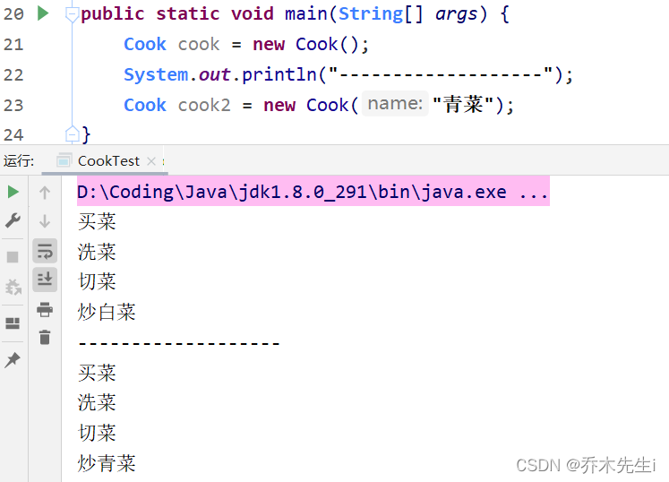
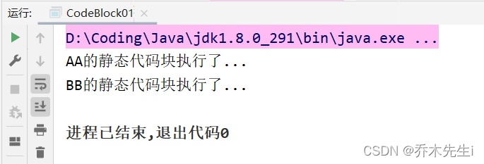
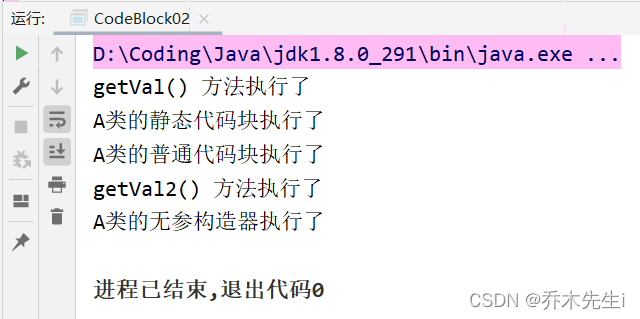
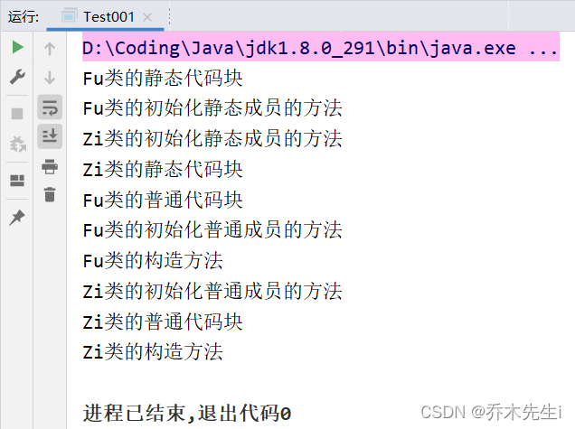

**代码块**又称为**初始化块**，属于类中的成员(类的一部分)，类似于方法，可以将逻辑语句封装在方法体中，使用`{}`包围。

和方法不同，代码块**没有方法名，没有返回，没有参数**，只有方法体，而且**不通过对象或者类显式调用**，而是加载类或创建对象时隐式调用。

**基本语法：**

```java
[修饰符] {
	// 代码
};
```

> •  修饰符可选，如果写的话只能写`static`
> •  代码块分为两类，没有`static`修饰的叫普通代码块、非静态代码块；有`static`修饰的叫静态代码块
> •  代码块中可以写任意业务逻辑语句
> •  `;`可以省略，也可以写上

**代码块的作用：**

相当于是另一种形式的构造器，可以做初始化操作。例如：如果多个构造器中有重复的语句，可以抽取到代码块中，提高代码的重用性。

## 代码块的调用顺序优先于构造器

创建一个有代码块的类：

```java
public class Cook {
	// 代码块
    {
        System.out.println("买菜");
        System.out.println("洗菜");
        System.out.println("切菜");
    }
    
    public Cook() {
        System.out.println("炒白菜");
    }

    public Cook(String name) {
        System.out.println("炒" + name);
    }
}
```

执行测试方法可以看到以下结果：



可见，代码块的执行顺序是在构造方法之前

## 代码块详解

### 1. static代码块也叫静态代码块，作用就是对类进行初始化，而它随着类的加载而执行，并且只会执行一次，如果是普通的代码块，每创建一个对象就执行。
创建一个类

```java
class AAA {
    // 静态代码块
    static {
        System.out.println("AAA的静态代码块执行了...");
    }

    // 普通代码块
    {
        System.out.println("AAA的普通代码块执行了...");
    }
}
```

执行以下代码：

```java
public static void main(String[] args) {
     AA aa = new AA();
     AA aa2 = new AA();
}
```

可以看到，类只会被加载一次，所以**静态代码块也只会执行一次**，而普通代码块会随着类实例的创建而执行


### 2. 类是么时候被加载？

#### ① 创建对象实例时（new）

```java
class AA {
    // 静态代码块
    static {
        System.out.println("AA的静态代码块执行了...");
    }
}
```

执行下面代码，可以看到如下结果，说明创建对象时类有被加载

```java
public static void main(String[] args) {
    // 创建对象实例时（new）
    AA aa = new AA();
}
```


#### ② 创建子类对象实例时，父类也会被加载

创建一个子类BB类，是AA类的子类

```java
class BB extends AA {
    // 静态代码块
    static {
        System.out.println("BB的静态代码块执行了...");
    }
}
```

执行下面代码，可以看到如下结果

```java
public static void main(String[] args) {
    // 创建子类对象实例时，父类也会被加载
    BB bb = new BB();
}
```

可以看到父类会先被加载，子类后被加载，继承时有说到过




#### ③ 使用类的静态成员时（静态属性、静态方法）

创建一个带有静态成员的CC类

```java
class CC {
    public static int n1 = 100;
    
    // 静态代码块
    static {
        System.out.println("CC的静态代码块执行了...");
    }
}
```

执行以下代码：

```java
public static void main(String[] args) {
    // 使用类的静态成员时（静态属性、静态方法）
    System.out.println(CC.n1);
}
```

可以看到如下结果：


因为在main方法中调用了CC类的静态属性，所以类会被加载

### 3. 创建一个对象时，在一个类中的调用顺序：

#### ① 静态属性初始化和静态代码块

> 静态属性初始化和静态代码块的优先级一样，如果有多个静态代码块和静态变量初始化，则按照代码定义的顺序。

定义一个A类：

```java
class A {
    private static int n1 = getVal();

    static {
        System.out.println("A类的静态代码块执行了");
    }

    public static int getVal() {
        System.out.println("getVal() 方法执行了");
        return 10;
    }
}
```

执行以下代码：

```java
public static void main(String[] args) {
    A a = new A();
}
```

可以看到，静态变量初始化先被执行，因为静态变量初始化调用了`getVal`方法，所以该方法会先执行，然后将值赋给`n1`，然后代码继续向下执行，会继续执行静态代码块


#### ② 普通属性初始化和普通代码块

> 普通属性初始化和普通代码块的优先级一样，如果有多个普通代码块和成员变量初始化，则按照代码定义的顺序。

增加A的代码：

```java
class A {
    {
        System.out.println("A类的普通代码块执行了");
    }
    private static int n1 = getVal();
    private int n2 = getVal2();
    static {
        System.out.println("A类的静态代码块执行了");
    }
    public static int getVal() {
        System.out.println("getVal() 方法执行了");
        return 10;
    }
    public int getVal2() {
        System.out.println("getVal2() 方法执行了");
        return 20;
    }
}
```

执行以下代码：

```java
public static void main(String[] args) {
    A a = new A();
}
```

因为静态时随着类加载的，所以静态的会先执行，而非静态的也是根据顺序执行的。


#### ③ 构造器

在A类上增加一个无参构造器：

```java
class A {
    {
        System.out.println("A类的普通代码块执行了");
    }
    private static int n1 = getVal();
    private int n2 = getVal2();
    static {
        System.out.println("A类的静态代码块执行了");
    }
    public A() {
        System.out.println("A类的无参构造器执行了");
    }
    public static int getVal() {
        System.out.println("getVal() 方法执行了");
        return 10;
    }
    public int getVal2() {
        System.out.println("getVal2() 方法执行了");
        return 20;
    }
}
```

执行以下代码：

```java
public static void main(String[] args) {
    A a = new A();
}
```

可以看到构造器时最后执行的



### 4. 构造器最前面隐含了super()和调用普通代码块

```java
class 类名 extends 父类名 {
	public 类名() {	// 构造器
		// 1. 这里隐藏了调用父类构造的super();
		super();	// 继承有提到
		
		// 2. 这里隐藏了调用普通代码块的语句

		// 3. 我们自己写的构造器逻辑
		// 如果有手动调用父类构造，则前面的super()方法将会被替代
		...
	}
}
```

所以到目前为止，一个类的执行顺序应该是：

> 父类静态代码块→本类静态代码块→父类的普通代码块→父类的构造器→本类的普通代码块→本类的构造器

因为在构造器中先有super再执行普通代码块的，所以会一直追溯到Object类，到Object类时没有父类了，就开始执行Object的普通代码块（虽然没有），然后执行Object类的构造方法，执行后会往下找下一级的普通代码块，然后是构造方法，以此类推，所以**普通代码块的执行顺序是优先于构造方法的**。

### 5. 有继承关系的静态代码块、静态属性初始化、普通代码块、普通代码初始化、构造方法的调用顺序：

#### ① 父类静态代码块和静态属性初始化（优先级按代码顺序执行）

#### ② 子类静态代码块和静态属性初始化（优先级按代码顺序执行）

#### ③ 父类普通代码块和普通属性初始化（优先级按代码顺序执行）

如果父类属性初始化时调用了方法，并且子类重写了该方法，执行的是子类的方法

#### ④ 父类构造方法

#### ⑤ 子类普通代码块和普通属性初始化（优先级按代码顺序执行）

#### ⑥ 子类构造方法

创建测试方法，看下执行什么：

```java
package object05;

public class Test001 {
    public static void main(String[] args) {
        new Zi();
    }
}

class Fu {
    {
        System.out.println("Fu类的普通代码块");
    }

    static {
        System.out.println("Fu类的静态代码块");
    }

    private static int n1 = getInt1();
    private int n2 = getInt2();

    public Fu() {
        System.out.println("Fu类的构造方法");
    }

    public static int getInt1() {
        System.out.println("Fu类的初始化静态成员的方法");
        return 10;
    }

    public int getInt2() {
        System.out.println("Fu类的初始化普通成员的方法");
        return 10;
    }
}

class Zi extends Fu {
    private static int n3 = getInt3();
    private int n4 = getInt4();

    {
        System.out.println("Zi类的普通代码块");
    }

    static {
        System.out.println("Zi类的静态代码块");
    }

    public Zi() {
        System.out.println("Zi类的构造方法");
    }

    public static int getInt3() {
        System.out.println("Zi类的初始化静态成员的方法");
        return 10;
    }

    public int getInt4() {
        System.out.println("Zi类的初始化普通成员的方法");
        return 10;
    }
}
```



因为父类会先被加载并且父类的静态代码块在上面，所以先执行父类的静态代码块再执行父类的初始化静态成员的方法。

然后加载子类，子类的静态成员在静态代码块的上面，所以会先被初始化，然后执行子类的静态代码块。

当类加载完后，会先执行父类的普通代码块和普通成员初始化，也是根据代码顺序执行的。

再然后执行父类的构造方法。

父类执行完毕后，就轮到子类了，也是根据顺序执行普通代码块和普通成员初始化，最后执行子类构造。

### 6. 静态代码块只能对用静态成员（静态属性和静态方法），普通代码块可以调用任意成员

```java
class C {
    private int n1 = 10;
    private static int n2 = 20;

    {
        System.out.println(n1);
        System.out.println(n2);
    }
    
    static {
        // System.out.println(n1);  // 错误
        System.out.println(n2);
    }
}
```
