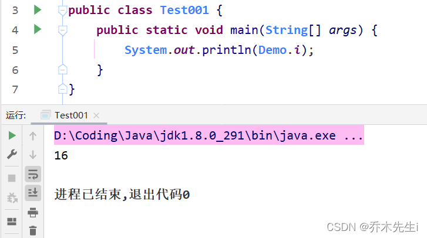

Java提供了`final`关键字，用于修饰不可改变内容。可以用于修饰类、方法属性和局部变量。final修饰的属性又叫常量，一般用`XXX_XXX_XXX`来命名(所有字母大写，单词之间用下划线分隔)。

- **类：** 被修饰的类，不能被继承。
- **方法：** 被修饰的方法，不能被重写。
- **变量：** 被修饰的变量，不能被重新赋值。被final修饰的常量名称，一般都有书写规范，所有字母都大写，单词之间用下划线分隔。

可能有以下需求时，会使用`final`关键字：

- 当不希望类被继承时，可以使用`final`关键字修饰类
- 当不希望父类的某个方法被子类覆盖/重写(overide)时，可以使用`final`关键字修饰父类的方法。
- 当不希望类的某个属性的值被修改时，可以使用`final`关键字修饰类的属性。
- 当不希望某个局部变量被修改时，可以使用`final`关键字修饰局部变量

## 修饰类

### ① 被final修饰的类不能被继承，但是可以实例化对象。

### ② 包装类(Integer，Double，String等)都是final修饰的类，无法被继承。

```java
final class 类名 { 
}
```

## 修饰方法

### ③ 如果final修饰的是方法，则该方法不能被重写，如果此类没有被final修饰，则该类是可以被继承的。

### ④ 如果一个类已经是final类，没有必要再用final修饰该类中的方法。

### ⑤ final不能修饰构造方法。

```java
修饰符 final 返回值类型 方法名(参数列表){ 
	//方法体
}
```

重写被final修饰的方法，编译时就会报错。

## 修饰属性

### ⑥ final修饰的属性在定义时，必须赋初值，并且不能被修改。

> 可以在定义时赋值
> 可以在构造器中赋值
> 可以在代码块中赋值

如果final修饰的属性是**静态**的，**初始化的位置**只能是**定义时**或者**静态代码块**中。

**定义时：**

```java
public class User {
    final String USERNAME = "张三"; // 普通属性
    final static int AGE = 20;	// 静态属性
    private int age;
}
```

**构造器：**

静态属性不能使用构造方法进行赋值

```java
public class User {
    final String USERNAME ;
    private int age;
    public User(String username, int age) { 
        this.USERNAME = username;
        this.age = age;
    }
}
```

**代码块：**

```java
public class User {
    final String USERNAME; // 普通属性
    final static int AGE;	// 静态属性
	
	static {
		AGE = 20;
	}
	
	{
		USERNAME = "lisi";
	}
}
```

## 修饰局部变量

> **局部变量 基本类型：** 基本类型的局部变量，被final修饰后，只能赋值一次，不能再更改。

代码如下：

```java
public class FinalDemo1 {
    public static void main(String[] args) { 
        // 声明变量，使用final修饰
        final int a;
        // 第一次赋值
        a = 10;
        // 第二次赋值
        a = 20; // 报错,不可重新赋值
        // 声明变量，直接赋值，使用final修饰
        final int b = 10;
        // 第二次赋值
        b = 20; // 报错,不可重新赋值
    }
}
```

> **局部变量 引用类型：** 引用类型的局部变量，被final修饰后，只能指向一个对象，地址不能再更改。但是不影响对象内部的成员变量值的修改。

```java
public class FinalDemo2 {
    public static void main(String[] args) {
        // 创建 User 对象
        final User u = new User();
        // 创建 另一个 User对象
        u = new User(); // 报错，指向了新的对象，地址值改变。 
        // 调用setName方法
        u.setName("张三"); // 可以修改
    }
}
```

## 提高效率

> `final`和`static`搭配使用，效率更高，底层编译器做了优化处理
> .
> 类一般是在静态属性或者方法被调用时、创建对象时、子类创建对象时被加载，而同时使用`final`和`static`修饰的属性被调用时，类是不会被加载的。
> 所以一起使用效率更高


比如：

```java
class Demo {
	public static final int i = 16;
	
	static {
		System.out.println("类被加载了...");
	}
}
```

可以看到，运行下面的主方法，Demo类并没有被加载



