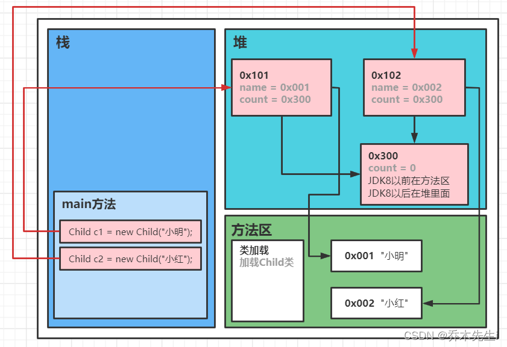

`static`关键字可以用来修饰的成员变量和成员方法，被修饰的成员是属于类的，而不是单单是属于某个对象的。既然属于类，就可以不用创建对象来调用。
`static`修饰的内容是随着类的加载而加载的，且只加载一次，存储于一块固定的内存区域（静态区），可以直接被类名调用，它优先于对象存在，可以被所有对象共享。

## 类变量、静态变量
当`static`修饰成员变量时，该变量称为**类变量**，也叫做**静态变量**、**静态属性**。该类的每个对象都共享同一个类变量的值。任何一个该类的对象都可以访问到同一个值；修改该类变量值的时候，修改的也是同一个值；也可以在不创建该类的对象的情况下对类变量进行操作。

**静态变量的访问修饰符的访问权限和范围和普通属性是一样的**

```java
// 定义语法：
访问修饰符 static 数据类型 变量名;	// 推荐使用
static 访问修饰符 数据类型 变量名;
// 举例：
public static int count = 0;

// 访问语法：
类名.静态变量名	// 推荐使用
对象名.静态变量名
// 举例：
int childCount = Child.count;
```


## static变量的内存布局
Child类的代码：
```java
class Child {
    private String name;
    public static int count = 0;
    
    public Child (String name) {
        this.name = name;
    }

    public void join() {
        System.out.println(name + "加入了游戏...");
    }
}
```

当new了两次Child对象时内存布局：



不管static变量在哪里，static变量是同一个类的所有对象共享的
**static是在类加载的时候就生成的**


> **(1) 当需要让某个类都共享一个变量的时候，就可以考虑使用静态变量**
> **(2) 静态变量是该类的所有对象共享的，而示例变量是每个对象独享的**
> **(3) 加上static关联字的变量成为类变量或者静态变量，否则称为实例变量、普通变量、非静态变量**
>  **(4) 类变量可以通过`类名.类变量名`或者`对象名.类变量名`来访问，但Java的设计者更推荐使用前者的方式来访问**


## 类方法、静态方法
当 static 修饰成员方法时，该方法称为类方法 。静态方法在声明中有 static ，建议使用类名来调用，而不需要创建类的对象。调用方式非常简单。

**静态方法的访问修饰符的访问权限和范围和普通方法是一样的**

```java
// 定义语法：
访问修饰符 static 数据返回类型 方法名() { };	// 推荐使用
static 访问修饰符 数据返回类型 方法名() { };
// 举例：
public static int getPersonCount() {...};

// 访问语法：
类名.静态方法名(形参列表); 	// 推荐使用
对象名.静态方法名(形参列表); 
// 举例：
int count = Person.getPersonCount();
```

当方法中不涉及到对象相关成员的时候可以将方法设计成静态方法，可以提高开发效率


> **(1) 类方法和普通方法都是随着类的加载而加载的，将结构信息存储在方法区，所以类方法中没有并且不能使用this和super，而普通方法是有this参数的**
> **(2) 类方法可以通过类名调用，也可以通过对象名调用**
> **(3) 类方法可以直接访问类变量和类方法**
> **(4) 类方法不能直接访问普通成员变量或成员方法，可以在类方法中创建自己类对象进行调用**
> **(5) 成员方法可以直接访问类变量或类方法**
