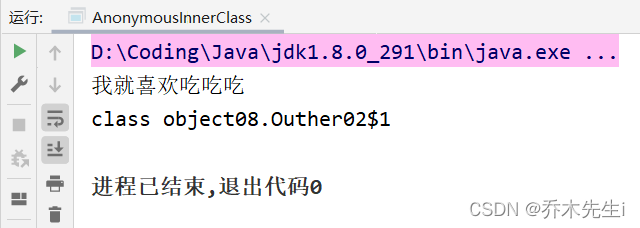

将一个类A定义在另一个类B里面，里面的那个类A就称为内部类，B则称为外部类。
内部类最大的特点就是可以直接访问私有属性，并且可以体现类的包含关系。

**内部类的本质还是一个类。**

**基本语法：**

```java
class 外部类类名 { 
    class 内部类类名{
    }
}

class 外部其他类类名{
}
```


## 局部内部类

定义在外部类的局部位置，比如方法中，并且有类名。

**语法格式：**

```java
class 外部类名 {

    public 返回值 方法名(参数列表) {
        // 局部内部类是定义在外部类的局部位置，通常是方法
        class 内部类名 {
        }
        
    }
}
```

### ① 可以直接访问外部类中的所有成员，包含私有的的成员。

```java
class Outher {
    private int n1 = 100;

    public void m1() {
    	// 内部类
        class Inner {	
        	// 内部类的方法
            public void f1() {
            	// 内部类可以直接访问外部类的私有成员
                System.out.println("n1 = " + n1);
            }
        }
    }

}
```

### ② 不能添加访问修饰符，本质是一个局部变量，局部变量是不能使用访问修饰符的，可以使用final

因为final修饰符局部变量也可以使用

```java
class Outher {
    public void m1() {
        // public class Inner {}  编译不能通过
        // final class Inner {}  编译可以通过，但是此内部类不能被继承
        class Inner{}    // 编译可以通过，此内部类可以被继承
        class InnerZi extends Inner {}  // 内部类的继承内部类
    }

}
```

### ③ 作用域：只有在定义该内部类的方法中或代码块中可以访问。

```java
class Outher {

    {
        class Inner{}   // 代码块中也可以定义内部类 
    }

    public void m1() {
        class Inner{}
        Inner inner = new Inner();  // 使用内部类，创建内部类对象，注意代码顺序

    }

    public void m2() {
        // Inner inner = new Inner(); 另一个方法就不能访问其他方法中的内部类
    }
}
```

### ④ 局部内部类可以直接访问外部类的成员

```java
class Outher {
    private int n1 = 100;
    
    public void m1() {
        class Inner{
            public void f1() {
                System.out.println("n1 = " + n1);   // 访问外部类的成员变量
                m2();   // 访问外部类的成员方法
            }
        }
    }

    public void m2() {}
}

```

### ⑤ 如果外部类和局部内部类的成员重名时，默认遵循就近原则，如果想访问外部类的成员，可以使用：外部类名.this.成员 进行访问

如果不加this关键字的话调用的是静态的成员，`外部类名.this`的本质是外部类对象，谁调用就是谁

```java
class Outher {
	// 外部类的n1成员变量
    private int n1 = 100;

    public void m1() {
        class Inner{
        	// 内部类的n1成员变量
            private int n1 = 200;
            
            public void f1() {
            	// 方法同理
                System.out.println("n1 = " + n1);   // 访问内部类的成员变量
                System.out.println("n1 = " + Outher.this.n1);   // 访问外部类的成员变量
            }
        }
    }
}
```


## 匿名内部类

匿名内部类是定义在外部类的局部位置，比如方法中，并且没有类名

匿名内部类没有名字，但是系统会分配一个名字，匿名内部类同时还是一个对象。

**语法格式：**

```java
new 类名或者接口名(参数列表){ 
	// 类体
};
```

举个例子：

**正常的接口实现方式：**

```java
interface A {   // 一个接口
    public void eat();
}

class B implements A {  // 接口的实现类
    @Override
    public void eat() {
        System.out.println("我就喜欢吃吃吃");
    }
}

class Outher02 {
    public void method() {
        // 创建接口实现类对象
        A a = new B();
        // 调用接口中的方法
        a.eat();
    }
}
```

**匿名内部类实现方式：**

如果实现类只使用一次的话，这样会方便很多。

```java
interface A {   // 一个接口
    public void eat();
}

class Fa {  // 一个普通的类
    public Fa(String name) {}
    public void test() {}
}

class Outher02 {    // 外部类
    public void method() {
        // 创建接口实现类对象
        A a = new A(){	// 匿名内部类
            @Override
            public void eat() {
                System.out.println("我就喜欢吃吃吃");
            }
        };
        // 调用接口中的方法
        a.eat();
    }
}
```

### ① 匿名内部类的底层是系统创建一个类实现了接口或继承了父类，系统会分配类名

在上面的例子中，编译时会生成一个新的类，实现了A接口，这个类的类名是`外部类类名` + `$` + `编号`，比如这里就是`Outher02$1`

```java
class Outher02 {    // 外部类
    public void method() {
        // 创建接口实现类对象
        A a = new A(){	// 匿名内部类
            @Override
            public void eat() {
                System.out.println("我就喜欢吃吃吃");
            }
        };
        // 调用接口中的方法
        a.eat();
       // 查看变量a的运行类型
        System.out.println(a.getClass());
    }
}
```

通过以上代码，可以看到以下结果



所以在底层，会分配一个匿名类，这个类的名字是`Outher02$1`，类的方法体就是匿名内部类的方法体，应该是下面这样：

```java
class Outher02$1 implements A {  // 系统底层创建的接口的实现类
    @Override
    public void eat() {
        System.out.println("我就喜欢吃吃吃");
    }
}
```

然后创建对象的时候将该对象的引用返回给给变量a，这是变量a的运行类型是A接口，编译类型实际上是`Outher02$1`实现类。

### ② 匿名内部类使用一次就不能再使用了，但是创建的这个对象是还可以继续使用的。

```java
class Outher02 {    // 外部类
    public void method() {
        A a = new A(){ // 匿名内部类
            @Override
            public void eat() { 
                System.out.println("我就喜欢吃吃吃");
            }
        };
        a.eat();
        a.eat();
        a.eat();
    }
}
```

对象可以多次使用，但是匿名内部类就不能再创建对象了，就算`new Outher02$1()`也不行。

### ③ 匿名内部类可以实现接口，也可以继承类，原理是一样的。

这里创建的fu对象的运行类型和编译类型都是Fu这个类

```java
class Fu {  // 一个普通的类
    public Fu(String name) {}
    public void test() {}
}

class Outher02 {    // 外部类
    private int n = 100;

    public void method() {
        Fu fu = new Fu("zhangsan");
    }
    
}
```

但是如果将创建的对象变成匿名内部类对象的话，这里的运行类型是Fu，而编译类型就是匿名内部类对象了，jdk底层也会为其创建一个一次性的类，类名可能就是`Outher02$2`

```java
class Outher02 {    // 外部类
    private int n = 100;

    public void method() {
        Fu fu = new Fu("zhangsan") {
            
        };
    }

}
```

加上大括号之后就是匿名内部类，相当于继承了new的这个类，所以底层生成的这个类应该是：

```java
class Outher02$2 extends Fu{
     public Outher02$2(String name) {
        super(name);
    }
}
```

如果在大括号中重写了父类的方法，则也是**按照动态绑定机制使用编译类型的方法**。

### ④ 基于抽象类或接口的匿名内部类必须实现抽象方法

```java
abstract class Fu {  // 一个抽象类
    public abstract void test();
}

class Outher02 {    // 外部类
    private int n = 100;

    public void method() {
        // 匿名内部类
        Fu fu = new Fu() {
        	// 实现抽象方法
            @Override
            public void test() {
            }
        };
    }
}
```

### ⑤ 可以直接访问外部类的所有成员，包含私有的成员
同上局部内部类的第一条

### ⑥ 不能添加访问修饰符，他的本质是一个局部变量，作用域也是定义的方法体或代码块中
同上局部内部类的第二条和第三条

### ⑦ 如果外部类和匿名内部类的成员重名时，匿名内部类需要访问，则遵循就近原则，如果想访问外部类的成员，可以使用：外部类名.this.成员 进行访问
同上局部内部类第五条


## 成员内部类

成员内部类是定义在外部类的成员位置，并且没有static修饰

**语法格式：**

```java
class 外部类 { 
    访问修饰符 class 内部类{
    }
}
```

### ① 可以直接访问外部类的所有成员，包含私有的

成员内部类可以理解为类的一个成员，类中的成员是可以访问该类的其他成员的。

```java
class Outher03 {
    
    private int n1 = 300;
    public String name = "zhangsan";
    
    // 成员内部类
    class Inner {
        public void say() {
            // 可以访问外部类的所有成员，包含私有的
            System.out.println(n1);
            System.out.println(name);
        }
    }
}
```

### ② 可以添加任意访问修饰符，成员内部类的本质是一个成员

```java
class Outher03 {

    public class Inner01 {
    }

    protected class Inner02 {
    }

    class Inner03 {
    }

    private class Inner04 {
    }
}
```

### ③ 成员内部类的作用域和其他成员一样，可以在外部类中创建对象，如果有权限则也可以在其他外部类中可以使用。

```java
// 定义类：
public class Person {
    private boolean live = true;
    // 如果成员内部类是私有的，则其他外部类无法创建该内部类的对象
    public class Heart {
        public void jump() {
            // 直接访问外部类成员
            if (live) {
                System.out.println("心脏在跳动");
            } else {
                System.out.println("心脏不跳了");
            }
    	}
	}
	
	public void m1() {
		// 成员内部类可以类外部类中直接创建对象调用并使用
		Heart heart = new Heart();
		heart.jump();
	}
}

// 定义测试类：
class InnerDemo {
    public static void main(String[] args) { 
    	// 成员内部类在其他外部类中，需要先创建外部类的对象，通过外部类的对象再创建内部类的对象，才可调用并使用
        // 创建外部类对象
        Person p = new Person();
        // 创建内部类对象
        Person.Heart heart = p.new Heart();
        // 调用内部类方法
        heart.jump();
    }
}
// 输出结果:
// 心脏在跳动
```


### ④ 成员内部类在其他外部类创建对象的三种方式

**第一种：** `外部类名.内部类名 变量名 = new 外部类().new 成员内部类();`

```java
class Outher03 {
    // 成员内部类
    public class Inner01 {
    }
}

class Test {
    // 创建成员内部类对象的测试方法
    public void test() {
        Outher03.Inner01 inner01 = new Outher03().new Inner01();
    }
}
```

**第二种：** `外部类名 外部类变量名 = new 外部类();`
`外部类名.内部类名 内部类变量名 = 外部类变量名.new 内部类();`

```java
class Outher03 {
    // 成员内部类
    public class Inner01 {
    }
}

class Test {
    // 创建成员内部类对象的测试方法
    public void test() {
        Outher03 outher03 = new Outher03();
        Outher03.Inner01 inner01 = outher03.new Inner01();
    }
}
```

**第三种：** 使用get方法

```java
class Outher03 {
    // 成员内部类
    public class Inner01 {
    }
    
    // get方法
    public Inner01 getInner() {
        return new Inner01();
    }
    
}

class Test {
    // 创建成员内部类对象的测试方法
    public void test() {
        Outher03 outher03 = new Outher03();
        Outher03.Inner01 inner = outher03.getInner();
    }
}
```

### ⑤ 如果外部类和内部类成员重名时，内部类访问则按照就近原则，如果想访问外部类成员，可以使用：外部类名.this.成员

同局部内部类第五条


## 静态内部类

静态内部类是定义在外部类的成员位置，并且有static修饰

```java
class 外部类 {
    访问修饰符 static class 内部类 {
    }
}
```

### ① 可以访问外部类的所有静态成员，但是不能直接访问非静态成员

```java
class Outher04 {
    
    private static String name = "lisi";
    private int age = 10;
    
    static class Inner04 {
        // 静态内部类访问外部类的静态成员，非静态成员无法直接访问
        public void m1() {
            System.out.println(name);
        }
        
    }
}
```

### ② 可以添加任意访问修饰符，静态内部类本质是一个静态成员。

同成员内部类的第二条

### ③ 作用域：同其他成员，为类的整体

```java
class Outher04 {
    private static String name = "lisi";

    static class Inner04 {
        public void m1() {
            System.out.println(name);
        }
    }
    
    public void say() {
        // 外部类访问静态内部类的非静态成员方法
        Inner04 inner04 = new Inner04();
        inner04.m1();
    }
}
```


```java
class Outher04 {
    private static String name = "lisi";

    static class Inner04 {
        public static void m2() {
            System.out.println(name);
        }
    }

    public void say02() {
        // 外部类访问静态内部类的静态成员方法
        Inner04.m2();
    }
}
```

### ④ 其他外部类访问静态内部类的方式：

**第一种：** `外部类名.静态内部类名 变量名 = new 外部类.内部类();`
跟成员内部类是不一样

```java
class Outher04 {
    static class Inner04 {
        public void m1() {
        }
    }
}

class Test02 {
    public void test() {
        Outher04.Inner04 inner04 = new Outher04.Inner04();
    }
}
```

**第二种：** 使用get方法

get方法也可以设计成静态的，或许会更方便一些。

```java
class Outher04 {
    static class Inner04 {
        public void m1() {
        }
    }
    
    // get方法
    public Inner04 getInner04(){
        return new Inner04();
    }
}

class Test02 {
    public void test() {
        Outher04 outher04 = new Outher04();
        Outher04.Inner04 inner04 = outher04.getInner04();
    }
}
```

### ⑤ 如果外部类和静态内部类成员重名时，静态内部类访问则按照就近原则，如果想访问外部类成员，可以使用：外部类名.成员

同局部内部类第五条，只不过这里是静态的，无需使用this