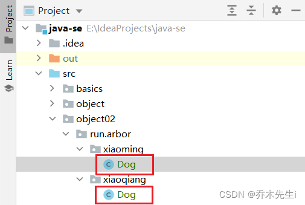

---
tags:
- Java
---

## 包的三大作用

1. 区分相同名字的类
2. 当类很多时，可以很好的管理
3. 控制访问范围

## 基本语法

`package run.arbor;`

- `package`：关键字，表示打包，用于声明当前类所在的包，需要放在class的最上面，一个类中最多只能有一个package语句。
- `run.arbor`：表示包名


## 包的本质
实际上就是创建不同的文件夹(目录)来保存类文件。

`run.arbor`的本质就是run文件夹下有个arbor的文件夹。

## 包的使用

在同一个包中不可以创建相同类名的文件，不同包中就可以



在使用的时候可以，引入不同包的类，但是同名的类只能引入一个，同时引入两个的话则会报错


如果有这样的需求，可以引入全类名进行使用

```java
package object02.run.arbor.test;

import object02.run.arbor.xiaoming.Dog;

public class Test {
    public static void main(String[] args) {
        // run.arbor.xiaoming.Dog;
        Dog dog = new Dog();

        // run.arbor.xiaoqiang.Dog
        object02.run.arbor.xiaoqiang.Dog dog1 = new object02.run.arbor.xiaoqiang.Dog();
    }
}

```


## 包命名

### 命名规则

只能包涵数字、字母、下划线、小圆点，不能使用数字开头，不能是关键字或者保留字，如果有多个单词，建议全小写。

例如：`parkhouse`，`park` 和 `house` 两个单词组成，更建议是`park.house`

### 命名规范

一般是小写字母+小圆点，一般是：`公司网址后缀.公司网址.项目名.业务模块名`。

例如：`run.arbor.oa.user`

网址是 `arbor.run`，项目名是oa系统，业务模块是用户模块

## 常用包

一个包下可以有很多个类，而java中常用的包有：

- `java.lang.*`：基本包，默认引入，不需要再次引入
- `java.util.*`：工具包，里面有很多常用的工具类
- `java.net.*`：网络包，网络开发
- `java.awt.*`：界面开发包，GUI

## 引入包

语法：`import 包;`

- `import`：用于引入类，放在package的下面，在类定义前面，可以有多句，没有顺序要求，同一个包下不需要引入

比如引入 `Scanner` 类，就写`import java.util.Scanner;`，此时就只是引入了util包中的`Scanner`类。

而`import java.util.*;`，则是引入util包中的所有类。**建议需要哪个类，就引入哪个类，不建议使用 `*` 全部引入。**
