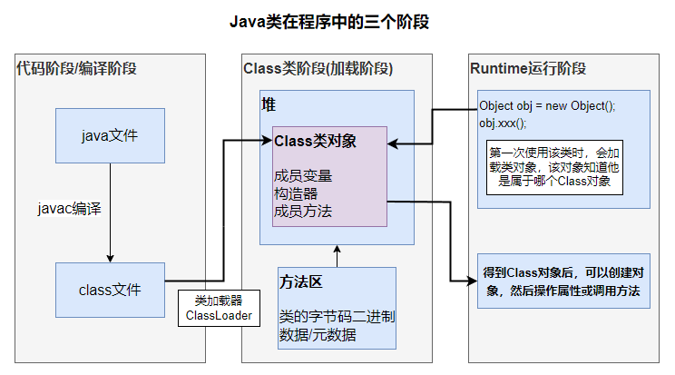

JAVA反射机制是在运行状态中，对任意一个类，都能知道这个类的所有属性和方法；对任意一个对象，都能够调用它的任意方法和属性，这种动态获取信息以及动态调用对象方法的功能称为java语言的反射机制。

反射(Reflect)是在运行时动态访问类与对象的技术，是JDK1.2版本后的高级特性，隶属于java.lang.reflect，大多数Java框架都基于反射实现参数配置、动态注入等特性。

> 加载完类之后，在队中就产生了一个Class类型的对象(一个类只有一个Class对象)，这个对象包含了累的完整结构信息。


* 可以在程序运行过程中，操作这些对象。
* 可以解耦，提高程序的可扩展性。





## 反射机制的相关类


* **Class类**：代表类的实体，在运行的Java应用程序中表示类和接口，Class对象表示某个类加载后在堆中的对象
* **Field类**：代表类的成员变量（成员变量也称为类的属性）
* **Method类**：代表类的方法
* **Constructor类**：代表类的构造方法


**Field类、Method类和Constructor类**下面三个类对象都有`setAccessible()` 方法，作用是启动和禁用访问安全检查的开关。

* true表示反射的对象在使用时取消访问检查，提高反射效率。
* false表示反射的对象执行访问检查。


## 反射的优点和缺点

* **优点**：可以动态的创建和使用对象，使用灵活，没有反射机制，框架技术就失去底层支撑。
* **缺点**：使用反射基本是解释执行，对执行速度有影响。


反射机制是Java实现动态语言的关键。

* **静态加载**：编译时加载相关的类，如果没有则报错，依赖性太强。
* **动态加载**：运行是加载需要的类，如果运行时不用该类，即使不存在也不报错，降低了依赖性。


## 类被加载的时机

1. 静态加载：创建对象(new)
2. 静态加载：当子类被加载时，父类也会加载
3. 静态加载：调用类中的静态成员
4. 动态加载：反射


### 静态加载

```java
public static viod main(String[] args) {
    Cat cat = new Cat();     // 此时，如果没有Cat类，则会在编译的时候就报错
    cat.eat();
}
```


### 动态加载

```java
public static void main(String[] args) {
    Class cls = Class.forName("Dog");    // 此时，如果没有Dog类，编译时不会报错，代码走到这一行的时候会报错
    Object obj = cls.newInstance();
    Method m = cls.getMethod("hi");

    m.invoke(o);
}
```


## 类的加载


### 加载阶段

JVM在该阶段主要是将字节码从不同的数据源(可能是class文件，也可能是jar包、网络等)转化为二进制字节流加载到内存中，并生成一个该表该类的Class对象。


### 连接阶段

#### 验证

目的是为了确保class文件的字节流中包含的信息符合当前虚拟机的要求，并且不会危害虚拟机自身的安全。包括但不限于：文件格式验证(是否以魔数0xcafebabe开头)、元数据验证、字节码验证和符号引用验证。

可以考虑使用`-Xverify:none` 参数来关闭大部分的类验证措施，缩短虚拟机类加载的时间。


#### 准备

JVM会在该阶段对静态变量分配内存并初始化(对应数据类型的初始值，如 0、0L、null、false)。这些变量所使用的内存都会在方法区中进行分配。

> 如果是`final` 修饰的静态常量，会直接赋最终的值。


#### 解析

虚拟机将常量池内的符号引用替换为直接引用的过程。

> 比如：一个常量的引用是A类的一个对象，在这一步之前这个常量引用的是一个符号来指向A类，但不是对象；而到这一步之后，会将该常量引用具体的内存地址值。（符号是相对的，引用是绝对的）


### 初始化

到初始化阶段，才真正开始执行类中的Java代码，此阶段是执行`<clinit>()` 方法的过程。该方法是由编译器按语句在源文件中出现的顺序，依次自动**收集类中所有的静态变量的赋值动作和静态代码块中的语句**，并进行合并。

虚拟机会保证一个类的`<clinit>()` 方法在多线程的环境中被正确的加锁、同步，如果多个线程同时去初始化一个类，那么会只有一个线程去执行这个类的`<clinit>()` 方法，其他线程都需要阻塞等待，直到活动线程执行`<clinit>()` 方法完毕。

## Class类

Class也是类，继承与Object类，Class类对象不是new出来的，是在加载类的时候系统创建的，因此一个类的Class对象在内存中只有一份，因为类只加载一次。

通过Class对象可以获得该类的结构信息和一些其他信息。

Class类对象是放在堆中的，类的字节码二进制数据是放在方法区的。

> 在类第一次被加载时，会进入ClassLoader类中的loadClass方法创建Class对象。


**有Class类对象的类型有：**

* 外部类、成员内部类、静态内部类、局部内部类、匿名内部类
* 接口
* 数组
* 枚举
* 注解
* 基本数据类型
* void


### 获取成员变量

* `getFields()`：获取所有public修饰的成员变量，包括父类的。
* `getField(String name)`：获取指定名称的public修饰的成员变量，包括父类的。

* `getDeclaredFields()`：获取所有的成员变量，不考虑修饰符，包括父类的。
* `getDeclaredField(String name)`：获取指定名称的成员变量，包括父类的。


### 获取构造方法


* `getConstructor(Class...<?> parameterTypes)`：获得该类中与参数类型匹配的公有构造方法。
* `getConstructors()`：获得该类的所有公有构造方法。

* `getDeclaredConstructor(Class...<?> parameterTypes)`：获得该类中与参数类型匹配的构造方法。
* `getDeclaredConstructors()`：获得该类所有构造方法。


### 获取成员方法


* `getMethod(String name, Class...<?> parameterTypes)`：获得该类某个公有的方法，包括父类的。
* `getMethods()`：获得该类所有公有的方法，包括父类的。

* 
* `getDeclaredMethod(String name, Class...<?> parameterTypes)`：获得该类某个方法，包括父类的。
* `getDeclaredMethods()`：获得该类所有方法，包括父类的。


### 获取类、类对象


* `类名.class`：通过类名的属性class获取，多用于参数的传递。同一个字节码文件(\*.class)在一次程序运行过程中，只会被加载一次，不论通过哪一种方式获取的Class对象都是同一个。
* `对象.getClass()`：此方法在Object类中定义。多用于对象的获取字节码的方式。
* `forName(String className)`：根据类名返回类的对象，多用于配置文件，将类名定义在配置文件中。读取文件，加载类。
* `getName()`：获得类的完整路径名字。


* `getClassLoader()`：获得类的加载器。
* `newInstance()`：创建类的实例。调用的是类的无参构造。
* `getPackage()`：获得类的包。
* `getSimpleName()`：获得类的名字。
* `getSuperclass()`：获得当前类继承的父类的名字。
* `getInterfaces()`：获得当前类实现的类或是接口。


* `getClasses()`：返回一个数组，数组中包含该类中所有公共类和接口类的对象。
* `getDeclaredClasses()`：返回一个数组，数组中包含该类中所有类和接口类的对象。
* `Cast`：把对象转换成代表类或是接口的对象。
* `asSubclass(Class<U> clazz)`：把传递的类的对象转换成代表其子类的对象。

### 获取类中注解


* `getAnnotation(Class<A> annotationClass)`：返回该类中与参数类型匹配的公有注解对象。
* `getAnnotations()`：返回该类所有的公有注解对象。

* `getDeclaredAnnotation(Class<A> annotationClass)`：返回该类中与参数类型匹配的所有注解对象。
* `getDeclaredAnnotations()`：返回该类所有的注解对象。


### 获取Class对象的方式

第一种：已知一个类的全类名，且该类在类路径下，可以通过Class类的静态方法`forName()` 方法获取，如果获取不到，会抛出`ClassNotFoundException` 异常。

```java
Class catCls = Class.forName("run.arbor.Cat");
```

> 一般用于配置文件，读取类的全路径，加载类。


第二种：若已知具体的类，可以通过累的class获取，该方式最安全可靠，程序性能最高。

```java
Class dogCls = Dog.class;
```

> 一般用于参数传递，比如通过反射得到对应构造器对象。


第三种：已知一个类的实例，调用该实例的`getClass()` 方法来获取Class对象。

```java
Cat cat = new Cat();
Class catCls2 = cat.getClass(); // 获取到的是运行类型
```

> 通过创建好的对象，获取Class对象


第四种：通过ClassLoader的方式。

```java
ClassLoader cl = cat.getClass().getClassLoader();
Class catCls3 = cl.loadClass();
```


第五种：获取基本数据类型的Class类对象，会自动转为包装类。

```java
Class cls = int.class;
```


第六种：基本数据类型对应的包装类，可以通过`.type` 得到Class类对象

```java
Class cls = Integer.TYPE;
```


## Constructor类 构造方法

* `T newInstance(Object... initargs)` ：使用由此 Constructor对象表示的构造函数，使用指定的初始化参数来创建和初始化构造函数的声明类的新实例。 
* `void setAccessible(true)`：暴力反射，将此反射对象的 accessible标志设置为指示的布尔值。


### 获取相关信息

* `getModifiers()` ：以int形式返回修饰符，0 默认修饰符、1 public、2 private、4 protected、8 static、16 final。
* `getName()`：获取方法名。
* `getParameterTypes()`：以Class\[\]返回参数类型数组。


```java
public class ReflectTest {
    public static void main(String[] args) throws Exception {
        // 1. 获取User的Class对象
        Class<?> userClass = Class.forName("run.arbor.reflect.User");

        // 2. 通过public的无参构造器创建实例
        Object user = userClass.newInstance();
        System.out.println("public的无参构造：" + user);

        // 3. 通过public的有参构造创建实例
        Constructor<?> constructor = userClass.getConstructor(String.class);
        // 此时的constructor对象就代表了public User(String name)构造器
        Object arbor = constructor.newInstance("arbor");
        System.out.println("public的有参构造：" + arbor);

        // 4. 通过非public的有参构造创建实例
        Constructor<?> declaredConstructor = userClass.getDeclaredConstructor(String.class, int.class);
        // 4.1 因为是私有的，无法使用该对象创建对象，抛出了java.lang.IllegalAccessException
        // 4.2 所以需要使用暴力反射来调用非public的方法或者属性，true为暴力反射，默认为false
        declaredConstructor.setAccessible(true);
        Object arbor1 = declaredConstructor.newInstance("arbor", 25);
        System.out.println("非public的有参构造：" + arbor1);
    }
}

class User {
    private String name = "乔木先生";
    private int age = 23;

    public User() {
    }

    public User(String name) {
        this.name = name;
    }

    private User(String name, int age) {
        this.name = name;
        this.age = age;
    }

    @Override
    public String toString() {
        return "User{" + "name='" + name + '\'' + ", age=" + age + '}';
    }
}
```


## Method类 方法

### 执行方法

* `Object invoke(Object obj, Object... args)` ：在具有指定参数的指定对象上调用此 方法对象表示的基础方法。

### 获取方法名称

* `String getName()`：获取方法名，返回由该方法对象表示的方法的名称，作为 String 。 
* `void setAccessible(true)`：暴力反射，将此反射对象的 accessible标志设置为指示的布尔值。 
* `boolean isAnnotationPresent(Class<? extends Annotation> annotationClass)`：判断该方法是否被添加指定的注解

### 获取相关信息

* `getModifiers()` ：以int形式返回修饰符，0 默认修饰符、1 public、2 private、4 protected、8 static、16 final。
* `getReturnType()`：以Class形式获取返回类型。
* `getName()`：获取方法名。
* `getParameterTypes()`：以Class\[\]返回参数类型数组。


```java
public class ReflectTest {
    public static void main(String[] args) throws Exception {
        // 1. 获取Boss的Class对象
        Class<?> bossClass = Class.forName("run.arbor.reflect.Boss");

        // 2. 通过public的无参构造器创建实例
        Object boss = bossClass.newInstance();
        System.out.println("无参构造创建的对象：" + boss);

        // 3. 使用反射调用hi方法
        Method hi = bossClass.getMethod("hi", String.class);
        hi.invoke(boss, "arbor");

        // 4. 使用反射调用say方法
        Method say = bossClass.getDeclaredMethod("say", int.class, String.class, char.class);
        // 4.1 因为say方法是私有的，如果想访问，需要暴力反射
        say.setAccessible(true);
        // 4.2 因为say方法是static的，如果想设置属性，可以不传入对象，传入一个null即可
        // Object invoke = say.invoke(boss,  20, "arbor", '大');
        Object invoke = say.invoke(null, 20, "arbor", '大');
        System.out.println(invoke);

    }
}

class Boss {

    public Boss() {
    }

    private static String say(int n, String s, char c) {
        return n + " " + s + " " + c;
    }

    public void hi(String s) {
        System.out.println("hi, " + s);
    }
}
```

## Field类 成员变量
### 设置值

* `void set(Object obj, Object value)`：将指定的对象参数中由此 Field对象表示的字段设置为指定的新值。

### 获取值


* `void get(Object obj)`：返回由该 Field表示的字段在指定对象上的值。


忽略访问权限修饰符的安全检查：

* `void setAccessible(true)`：暴力反射，将此反射对象的 accessible标志设置为指示的布尔值。


### 获取相关信息

* `getModifiers()` ：以int形式返回修饰符，0 默认修饰符、1 public、2 private、4 protected、8 static、16 final。

> 如果是 public static 则返回相加得到的数字，就是 1 + 8 = 9。得到的结果不会重复，所以能算出有哪些修饰符。

* `getType()`：以Class形式返回类型。
* `getName()`：返回属性名。


```java
public class ReflectTest {
    public static void main(String[] args) throws Exception {
        // 1. 获取Student的Class对象
        Class<?> studentClass = Class.forName("run.arbor.reflect.Student");

        // 2. 通过public的无参构造器创建实例
        Object student = studentClass.newInstance();
        System.out.println("无参构造创建的对象：" + student);

        // 3. 使用反射操作age属性
        Field age = studentClass.getField("age");
        System.out.println("获取对象的age属性值：" + age.get(student));
        age.set(student, 25);
        System.out.println("修改age属性后的对象：" + student);

        // 4. 使用反射操作name属性
        Field name = studentClass.getDeclaredField("name");
        // 4.1 因为name属性是私有的，如果想访问，需要暴力反射
        name.setAccessible(true);
        // 4.2 因为name属性是static的，如果想设置属性，可以不传入对象，传入一个null即可
        // name.set(student, "arbor");
        name.set(null, "arbor");
        System.out.println("修改name属性后的对象：" + student);

    }
}

class Student {
    private static String name = "乔木先生";
    public int age = 23;

    public Student() {
    }

    @Override
    public String toString() {
        return "Student{" + "name='" + name + '\'' + ", age=" + age + '}';
    }
}
```

