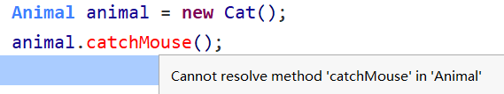
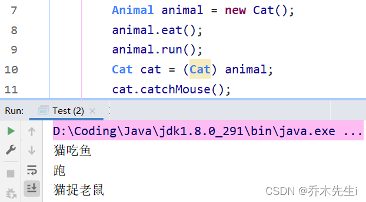
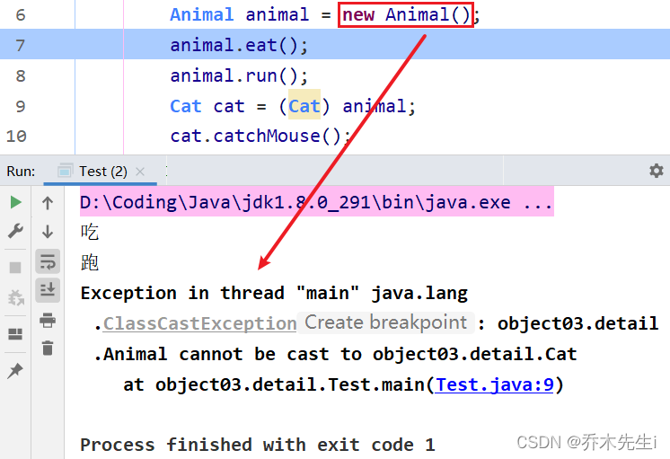

方法或对象具有多种形态。是面向对象的第三大特征，多态是建立在封装和继承基础之上的。

## 方法的多态

**重载和重写就体现出方法的多态**

当一个方法被重载时，使用不同的传参列表，可以调用不同的方法


而重写，则是根据方法对象的不同调用对应的方法


## 对象的多态

实际开发的过程中，父类类型作为方法形式参数，传递子类对象给方法，进行方法的调用，更能体现出多态的扩展性与便利。

- 一个对象的编译类型和运行类型可以不一致
- 编译类型在定义对象时就确定了，不能改变
- 运行类型是可以变化的
- 编译类型看定义时`=`左边的，而运行类型看`=`右边的

比如：

```java
Animal animal = new Dog();	// 编译类型是Animal，运行类型是Dog
animal = new Cat();	// 运行类型是可以改变的，变成了Cat，但是编译类型依然是Animal
```

当使用多态方式调用方法时，首先检查父类中是否有该方法，如果没有，则编译错误；如果有，**执行的是子类重写后方法**。所以不重写对象的多态则没有意义。

```java
// 定义父类：
public class Animal {
	public void eat(){
		System.out.println("吃东西");
	}
}

// 定义子类：
class Cat extends Animal {
    public void eat() {
    	System.out.println("吃鱼");
    }
}

class Dog extends Animal {
	public void eat() {
		System.out.println("吃骨头");
	}
}

// 定义测试类：
public class Test {
    public static void main(String[] args) { 
        // 多态形式，创建对象
        Animal a1 = new Cat();
        // 调用的是 Cat 的 eat
        a1.eat();
        // 多态形式，创建对象
        Animal a2 = new Dog();
        // 调用的是 Dog 的 eat
        a2.eat();
    }
}
```

## 多态详解

定义初始类：

```java
// 父类
public class Animal {

    public void eat() {
        System.out.println("吃");
    }
    
    public void run() {
        System.out.println("跑");
    }
    
    public void sleep() {
        System.out.println("睡");
    }

}
```

```java
// 子类
public class Cat extends Animal{

    public void eat() {
        System.out.println("猫吃鱼");
    }

    public void catchMouse() {
        System.out.println("猫捉老鼠");
    }
}
```

### 1. 向上转型：编译类型看左边，运行类型看右边。可以调用父类中的所有可调用的(访问权限)成员，不能调用子类中特有的成员。

**语法：**

```java
父类类型 变量名 = new 子类对象； 
变量名.方法名();
```


这里可以看到，调用子类中特有方法时，报错了，提示无法解析。
> **能调用哪些成员，是由编译类型决定的，调用的是运行类型的方法。**
> **如果运行类型中没有该方法，则去父类中查找，如果父类中没有，则报错**

如果运行类型中有该方法，并且可以访问，则执行运行类型中的该方法，也就是Cat类中的方法。
如果没有，则去父类中查找，如果有并且可以访问，则执行父类的，否则继续往上找。

**运行效果如下：**


### 2. 向下转型：只能强转父类的引用，不能强转父类的对象，要求父类的引用必须指向的是当前目标类型的对象，可以调用子类类型中所有的成员。
**语法：**

```java
子类类型 引用名 = (子类类型) 父类引用;
```


可以给对象的引用，但是不能给对象

**运行效果如下：**



但是，**父类的引用必须是强转目标类型的对象**，否则就转换不了



### 3. 属性没有重写之说，属性的值看编译类型。

**直接上代码+结果：**


### 4. 类型转换异常：ClassCastException

```java
public class Test {
    public static void main(String[] args) {
        // 向上转型
        Animal a = new Cat();
        a.eat(); // 调用的是 Cat 的 eat
        // 向下转型
        Dog d = (Dog)a;
        d.watchHouse(); // 调用的是 Dog 的 watchHouse 【运行报错】 
    }
}
```

这段代码可以通过编译，但是运行时，却报出了 `ClassCastException 类型转换异常`。
这是因为，创建Cat类型对象运行时，不能转换成Dog对象。这两个类并没有任何继承关系，不符合类型转换的定义。

为了避免`ClassCastException`的发生，Java提供了 `instanceof` 关键字，给引用变量做类型的校验。


### 5. `instanceof`比较操作符，用于判断对象的类型是否为XX类型或者XX类型的子类型

这里bb对象是BBB类的对象，所以返回true


```java
BBB bb = new BBB();
System.out.println(bb instanceof BBB);  // true
System.out.println(bb instanceof AAA);  // true
AAA aa = new BBB();
System.out.println(aa instanceof BBB);  // true
System.out.println(aa instanceof AAA);  // true
Object obj = new Object();
System.out.println(obj instanceof AAA);  // false
```

## Java动态绑定机制【重要】

- 当调用对象方法的时候，该方法会和该对象的内存地址/运行类型绑定
- 当调用对象属性时，没有动态绑定机制，哪里声明哪里使用

下面代码输出多少？
```java
public class Dynamic {
    public static void main(String[] args) {
        A a = new B();
        System.out.println(a.sum());
        System.out.println(a.sum1());
    }
}

class A {
    public int i = 10;
    public int sum() {
        return getI() + 10;
    }
    public int sum1() {
        return i + 10;
    }
    public int getI() {
        return i;
    }
}

class B extends A {
    public int i = 20;
    public int getI() {
        return i;
    }
}
```

**语句`System.out.println(a.sum());`解析：**

1. 当调用`a.sum()`的时候，会去找B类中的`sum()`方法，因为变量`a`的运行类型是B类
2. 发现B类中没有`sum()`方法，则会去父类寻找，也就是A类
3. 发现A类有`sum()`方法，调用
4. 执行到`getI()`方法时，发现B类中有该方法，则会动态绑定到B类中的方法
5. 执行B类中的方法得到20
6. 再和10相加，得到30，然后打印输出

**语句`System.out.println(a.sum1());`解析：**

1.  当调用`a.sum1()`的时候，会去找B类中的`sum1()`方法，因为变量`a`的运行类型是B类
2. 发现B类中没有`sum1()`方法，则会去父类寻找，也就是A类
3. 发现A类有`sum1()`方法，调用
4. 因为属性是绑定到编译类型的，也就是A类，所以这里的`i`从A类中调用
5. 找到A类中`i`的值并和10相加，得到20，打印输出

