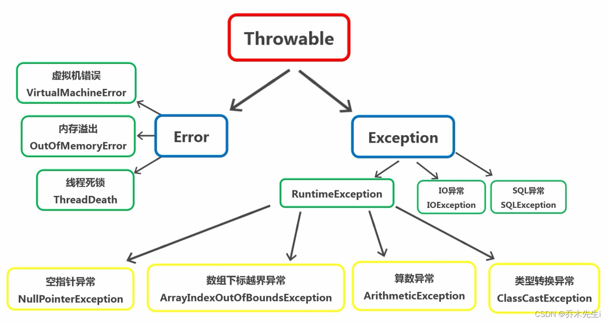
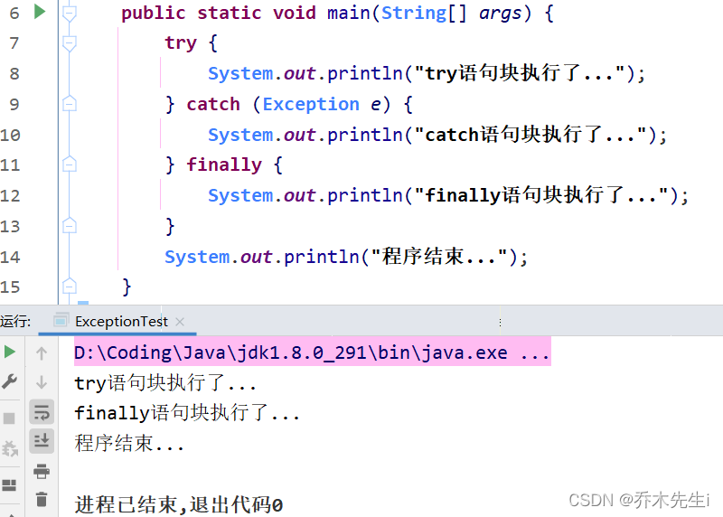
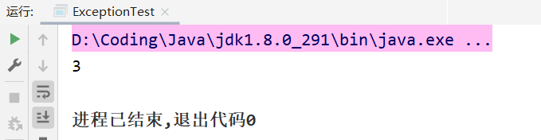
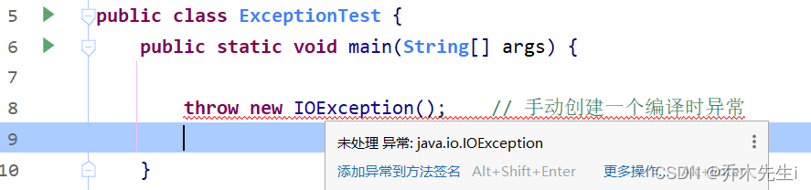
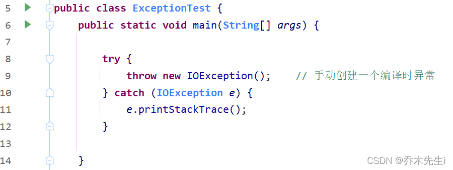

**异常**指的是程序在执行过程中，出现的非正常的情况，最终会导致JVM的非正常停止。

在Java等面向对象的编程语言中，异常本身是一个类，产生异常就是创建异常对象并抛出了一个异常对象。Java处理异常的方式是中断处理。异常指的并不是语法错误，语法错了，编译不通过，不会产生字节码文件，根本不能运行。

## 异常体系

**Error：** 严重错误Error，Java虚拟机无法解决的错误，只能事先避免。常见的错误有虚拟机错误（VirtualMachineError）、内存溢出（OutOfMemoryError）、线程死锁（ThreadDeath）。

**Exception：** 表示异常，因为编程错误或偶然的外在因素导致的一般问题，可以视同针对性的代码进行处理。分为非检查异常（UncheckedException），检查异常（CheckedException），非检查异常允许忽略，检查异常必须捕捉或者声明抛出。

而运行时异常指的是`java.lang.RuntimeException`类以及它的子类。编译时异常指的是Exception类的子类除去运行时异常的其他异常。



异常机制其实是帮助我们找到程序中的问题，异常的根类是 `java.lang.Throwable` ，其下有两个子类：`java.lang.Error` 与 `java.lang.Exception` ，平常所说的异常指`java.lang.Exception`。

## 常见的运行时异常

`NullPointerException` 空指针异常：当应用程序试图在需要对象的地方使用null时，会抛出该异常。

比如调用一个null引用的变量进行调用方法：

```java
Object obj = null;
System.out.println(obj.hashCode());
```

`ArithmeticException` 数学运算异常：当出现异常的运算条件时，会抛出此异常。

比如一个整数除以0时：

```java
int i = 10 / 0;
```

`ArrayIndexOutOfBoundsException` 数组下标越界异常：用非法所有访问数组时跑出的异常。如果索引为负数或者大于等于数组的大小，则会抛出次异常。

比如一个数组只有三个元素，索引应为0,1,2，但访问索引为3的元素时：

```java
int[] arr = new int[3];
arr[3] = 10;
```

`ClassCastException` 类型转换异常：当试图将对象强制转换为不是实例的子类时，跑出该异常。

比如A类是B类的父类，也是C类的父类，但是B类和C类没有继承关系，这时将B类的对象转成C类时：

```java
public class ExceptionTest {
    public static void main(String[] args) {
        A a = new B();
        C c = (C) a;
    }
}

class A {}
class B extends A {}
class C extends A {}
```

## 异常处理

Java异常处理的五个关键字：try、catch、finally、throw、throws


### 捕获异常 try-catch-finally

try-catch的方式就是捕获异常，Java中对异常有针对性的语句进行捕获，可以对出现的异常进行指定方式的处理。

`try`：该代码块中编写可能产生异常的代码。
`catch`：用来进行某种异常的捕获，实现对捕获到的异常进行处理。
`finally`：有一些特定的代码无论异常是否发生，都需要执行。

**语法格式：**

```java
try{
    // 捕获异常
    // 编写可能会出现异常的代码 
}catch(异常类型 异常变量名){  
	// 当发生异常时，系统将异常封装到形参的对象中，传递给catch块
	// 然后根据自己的需求处理捕获到的异常
	// 记录日志/打印异常信息/继续抛出异常等等
}finally{
	// 无论是否有异常，都执行
}
```

#### ① try块后可接零个或多个catch块，如果没有catch块，则必须跟一个finally块。try、catch和finally都不能单独使用，必须连用。

这样的写法如果出现了异常，结果是和没有捕获异常的情况是一样的，程序会直接崩掉

```java
try {
    System.out.println("可以没有catch块");
} finally {
    System.out.println("如果没有catch块，必须要有finally块");
}
```

```java
try {
    System.out.println("也可以没有finally块");
} catch (ClassCastException e) {
    // 可以有多个catch块
    System.out.println("第一个catch块");
} catch (NullPointerException e) {
    System.out.println("第二个catch块");
}
```

#### ② 如果有多个catch子句，要求父类异常在后，子类异常在前。并且如果遇到异常，多个catch块只会匹配最近的一个。


因为异常会引发程序跳转，导致有些语句执行不到，所以

#### ③ 在finally代码块中存放的代码都是一定会被执行的。

例如，在try语句块中打开了一些物理资源（磁盘文件/网络连接/数据库连接等），都得在使用完之后，最终关闭打开的资源，一般这些代码放在finally代码块中。




#### ④ 如果finally有return语句，永远返回finally中的结果，避免该情况。

当只有在try或者catch中调用退出JVM的相关方法，此时finally才不会执行，否则finally永远会执行。终止JVM的方法：`System.exit(非0的数);`

执行下面代码可以看到，结果为3：

```java
public class ExceptionTest {
    public static void main(String[] args) {
        System.out.println(getI());
    }

    public static int getI(){
        try {
            return 1;
        } catch (Exception e) {
            return 2;
        } finally {
            return 3;
        }
    }
}
```




### 声明异常 throws

**关键字`throws`运用于方法声明之上** ，表示当前方法不处理异常，提醒该方法的调用者来处理异常（抛出异常）。若该方法可能有多种异常情况产生，那么在throws后面可以写多个异常类，用逗号隔开。

一般用于一个方法中可能出现某个异常，但是不能确定如何处理这个异常，则这个方法可以声明抛出异常。

**语法格式：**

```java
修饰符 返回值类型 方法名(参数) throws 异常类名1,异常类名2 … {   
} 
```

当子类重写父类抛出异常的方法时，声明的异常必须是父类方法所声明异常的同类或子类。

```java
public static void main(String[] args) throws IOException {  
	read("a.txt");  
}

public static void read(String path) 
    throws FileNotFoundException, IOException {  
	if (!path.equals("a.txt")) {   
		// 假设如果不是 a.txt 则认为该文件不存在，抛出异常
		throw new FileNotFoundException("文件不存在");  
	}  
	if (!path.equals("b.txt")){  
		throw new IOException();  
	}  
}  
```

#### ① 如果没有捕获异常，一直声明异常，最终会被JVM处理，JVM的处理方式就是输出异常信息和退出程序。

如果发现异常，输出异常信息，并且退出程序


#### ② 对于编译时异常，程序中必须处理，可以使用try-catch或者throws

如果不处理的话会报错。



可以将其声明在方法上：


也可以使用try-catch包围进行解决：



#### ③ 对于运行时异常，程序中如果没有处理，则默认会声明throws XXXException


#### ④ 如果父类抛出了多个异常，子类重写父类方法时，可以抛出和父类相同的异常、父类异常的子类、不抛出异常。

下面B类、C类、D类都是可以通过编译的：

```java
class A {
    public void m1() throws IOException, SQLException {}
}

class B extends A {
    @Override
    public void m1() throws IOException {}
}

class C extends A {
    @Override
    public void m1() {}
}

class D extends A {
    // FileNotFoundException是IOException的子类
    @Override
    public void m1() throws FileNotFoundException {}
}
```

#### ⑤ 父类方法没有抛出异常，子类重写父类该方法时不可抛出异常，只能捕获处理，不能声明抛出。

这样就不能通过编译


## 抛出异常 throw

`throw`用在方法内，用来抛出一个异常对象，将这个异常对象传递到调用者处，并结束当前方法的执行。`throw`抛出的只能够是可抛出类`Throwable`或者其子类的实例对象。

**语法格式：**

```java
// 自己抛出，调用者处理
返回值 方法名(参数) throws 异常类名{
	throw new 异常类名(参数);  
}
```
```java
// 自己抛出，自己处理
try{
	// 代码块1
    throw new 异常类名(参数);
} catch (异常类名 变量名){
	// 代码块2
}
```

如果产生了问题，throw 就会将异常进行抛出，也就是将问题返回给调用者。调用者可以进行捕获处理，或者使用 throws 声明处理。

```java
public static void main(String[] args) {  
	//创建一个数组  
	int[] arr = {2,4,52,2};  
	//根据索引找对应的元素  
	int element = getElement(arr, 4);  
	System.out.println(element);  
}

/* 
* 根据 索引找到数组中对应的元素 
*/  
public static int getElement(int[] arr, int index){  
	//判断 索引是否越界  
	if(index < 0 || index > arr.length‐1){  
		/*
        判断条件如果满足，执行完throw抛出异常对象后，方法无法继续运算，
        就会结束当前方法的执行，并将异常告知给调用者。
		*/  
		throw new ArrayIndexOutOfBoundsException("哥们，角标越界了~~~")  
	}  
	int element = arr[index];  
	return element;  
}
```


## 自定义异常类

使用Java内置的异常类可以描述在编程时出现的大部分异常情况，也可以通过自定义异常描述特定业务产生的异常类型。

**自定义异常类：定义一个类，去继承Throwable类或者它的子类。**

**定义编译期异常：** 继承于`java.lang.Exception`。
**定义运行期的异常：** 继承于`java.lang.RuntimeException`。

```java
 // 业务逻辑异常  
 public class RegisterException extends RuntimeException{  
     /** 
     * 空参构造 
     */  
     public RegisterException() {  
     }  
     
    /** 
     * 有参构造
     * @param message 表示异常提示 
     */  
     public RegisterException(String message) {  
         super(message);  
    }  
 }  
```

## throw和throws的区别

|   | 描述 | 使用位置 | 后面跟的代码 |
|:----|:----|:----|:----|
| throw | 抛出异常，手动生成一个异常对象的关键字 | 方法体中 | 异常对象 |
| throws | 异常处理的一种方式 | 方法声明处 | 异常类型 |