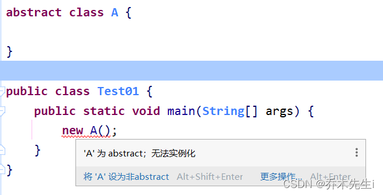
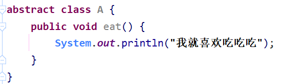
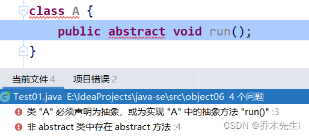
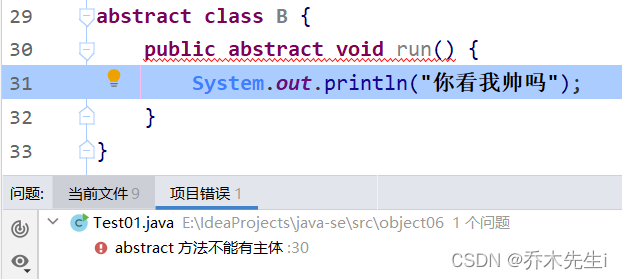
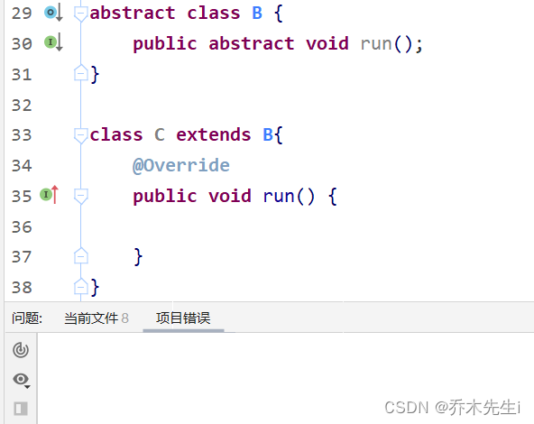
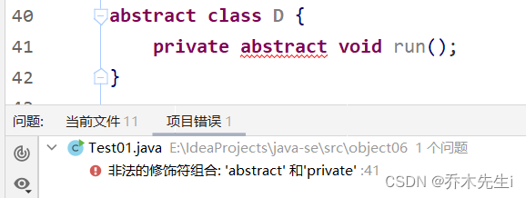
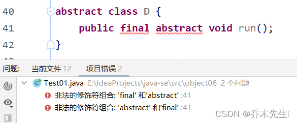

父类中的方法，被它的子类们重写，子类各自的实现都不尽相同。那么父类的方法声明和方法主体，只有声明还有意义，而方法主体则没有存在的意义了。没有方法主体的方法称为抽象方法。Java语法规定，包含抽象方法的类就是抽象类。

简而言之，当父类的一些方法不能确定时，可以用`abstract`关键字来修饰该方法，这个方法就是抽象方法，然后用`abstract`来修饰该类就是抽象类。

- **抽象方法 ：** 没有方法体的方法（子类实现该方法）。
- **抽象类：** 包含抽象方法的类。

## 语法

### 抽象方法

使用`abstract`关键字修饰方法，该方法就成了抽象方法，抽象方法只包含一个方法名，而没有方法体。

```java
修饰符 abstract 返回值类型 方法名 (参数列表);
```

举例：

```java
public abstract void run();	// 没有方法体
```

### 抽象类

如果一个类包含抽象方法，那么该类必须是抽象类，该类必须使用`abstract`关键字修饰。

```java
abstract class 类名字 {
}
```

举例：
```java
public abstract class Animal { 
	public abstract void run();
}
```

### 抽象的使用

继承抽象类的子类必须重写父类所有的抽象方法。否则，该子类也必须声明为抽象类。最终，必须有子类实现该父类的抽象方法，否则，从最初的父类到最终的子类都不能创建对象，失去意义。

抽象类：

```java
public abstract class Animal { 
	public abstract void run();
}
```

抽象类的子类：

```java
public class Cat extends Animal {
    public void run (){
    	System.out.println("小猫在墙头走~~~")；
    }
}
```

测试类：
```java
public class CatTest {
    public static void main(String[] args) { 
        // 创建子类对象
        Cat c = new Cat();
        // 调用run方法
        c.run();
    }
}
```


## 抽象类详解

### ① 抽象类不能被实例化

抽象类不能创建对象，如果创建，编译无法通过而报错，只能创建其非抽象子类的对象。




### ② 抽象类可以没有抽象方法，可以有普通的方法

抽象类中，不一定包含抽象方法，但是有抽象方法的类必定是抽象类。未包含抽象方法的抽象类，目的就是不想让调用者创建该类对象，通常用于某些特殊的类结构设计。


### ③ 一旦类包含了抽象方法，这个类必须是抽象类

抽象类中，不一定包含抽象方法，但是有抽象方法的类必定是抽象类。

可以看到如果一个类里面有抽象方法，但该类不是抽象类，则编译失败。



### ④ abstract只能修饰类或方法，不能修饰属性和其它的

如果用来修饰属性，则编译失败


### ⑤ 抽象类的本质还是类，可以有任意成员，比如：非抽象方法、构造器、静态属性等

抽象类中，可以有构造方法，是供子类创建对象时，初始化父类成员使用的。子类的构造方法中，有默认的super()，访问父类构造方法。

下面代码idea没有报错，说明编译可以通过


### ⑥ 抽象方法不能有主体（方法体），即不能实现

抽象类中的抽象方法不能有方法体，如果有，编译不能通过



### ⑦ 如果一个类继承了抽象类，则必须实现该抽象类的所有抽象方法，除非子类本身也是抽象类

抽象类的子类，必须重写抽象父类中所有的抽象方法，否则，编译无法通过而报错。除非该子类也是抽象类。


如果C类是抽象类，则编译通过，就不报错了


如果C类实现了B类(父类抽象类)中的抽象方法，也可以编译成功
在java中实现方法，只要在该类中声明了该方法，即使方法体是空的，也算实现



### ⑧ 抽象方法不能使用private、final、static关键字来修饰，这三个关键字和重写是相悖的

> 如果加static的话，类加载时该方法是没有方法体的，用不了，所以不行
> 
> 如果加private的话，子类继承该类但是没有权限来重写该方法，所以不行
> 
> 如果加final的话，被final修饰的方法本身是不能被重写的，所以不行

下面是加了这三种修饰符的报错信息：





