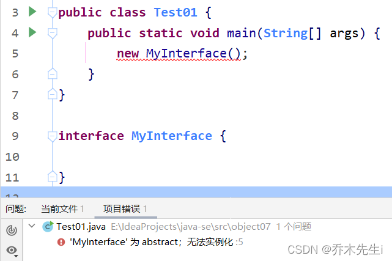
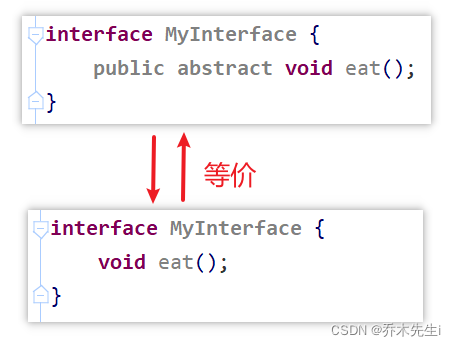
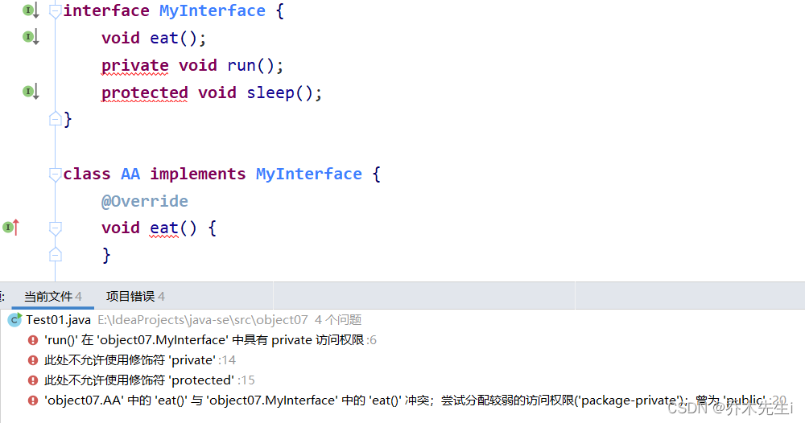
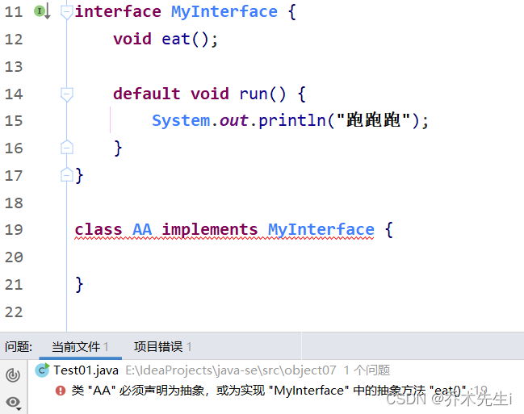
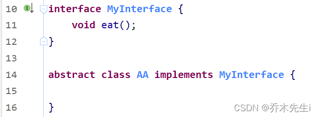
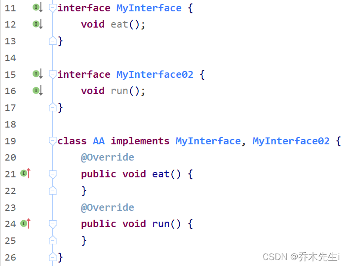
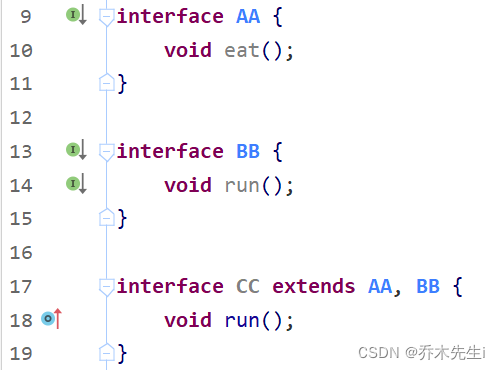
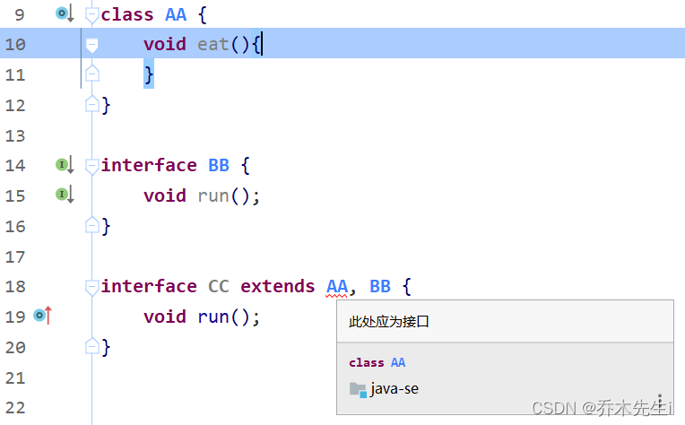
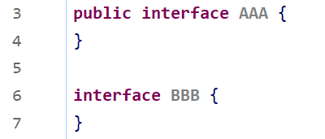

**接口就与给出一些没有实现的方法，封装到一起，等某个类需要用的时候，根据情况实现接口中的方法。**

接口是Java语言中一种引用类型，是方法的集合，如果说类的内部封装了成员变量、构造方法和成员方法，那么接口的内部主要就是封装了方法，**包含抽象方法（JDK 7及以前），默认方法和静态方法（JDK 8），私有方法（JDK 9）**。

接口的定义，它**与定义类方式相似**，但是使用`interface`关键字。它也会被编译成`.class`文件，但一定要明确它并**不是类**，而是另外一种引用数据类型。

**引用数据类型：数组，类，接口。**


## 定义接口

```java
public interface 接口名称 { 
    // 抽象方法	JDK7
    // 默认方法	JDK8
    // 静态方法	JDK8
    // 私有方法	JDK9
}
```

举例：

```java
public interface LiveAble {
    // 定义抽象方法
    public abstract void eat();
    public abstract void sleep();
}
```

#### 接口的抽象方法

使用 `abstract` 关键字修饰，可以省略，没有方法体。该方法供子类实现使用。

```java
public interface 接口名 { 
	public abstract void 方法名(形参列表);
}
```

#### 接口的默认方法

使用 `default` 修饰，不可省略，供子类调用或者子类重写。

```java
public interface 接口名{ 
	public default void 方法名(形参列表) {
		// 执行语句
	}
}
```

#### 接口的静态方法

使用 `static` 修饰，供接口直接调用。

```java
public interface 接口名{ 
	public static void 方法名(形参列表) {
		// 执行语句
	}
}
```

#### 接口的私有方法和私有静态方法

**JDK9及以上版本**才可使用 `private` 修饰，供接口中的默认方法或者静态方法调用。

```java
public interface 接口名{ 
    private void 方法名(形参列表) {
    	// 执行语句
    }
}
```

### 定义实现类

类与接口的关系为实现关系，即类实现接口，该类可以称为接口的实现类，也可以称为接口的子类。实现的动作类似继承，格式相仿，只是关键字不同，实现使用`implements`关键字。

**非抽象子类实现接口：**
- 必须重写接口中所有抽象方法。
- 继承了接口的默认方法，即可以直接调用，也可以重写。

```java
class 类名 implements 接口名 { 
	// 重写接口中抽象方法【必须】
	// 重写接口中默认方法【可选】
}
```

举例：

```java
public class Animal implements LiveAble { 
    @Override
    public void eat() {
    	System.out.println("吃东西");
    }
    @Override
    public void sleep() {
    	System.out.println("晚上睡");
    }
}
```

### 接口多实现

在继承体系中，一个类只能继承一个父类。而对于接口而言，一个类是可以实现多个接口的，这叫做接口的多实现。并且，一个类能继承一个父类，同时实现多个接口。

```java
class 类名 [extends 父类名] implements 接口名1,接口名2... { 
	// 重写接口中抽象方法【必须】
	// 重写接口中默认方法【不重名时可选】
}
//[ ]： 表示可选操作。
```

#### 抽象方法

接口中，有多个抽象方法时，实现类必须重写所有抽象方法。如果抽象方法有重名的，只需要重写一次。

```java
// 定义多个接口：
interface A {
	public abstract void showA();
	public abstract void show();
}
interface B {
	public abstract void showB();
	public abstract void show();
}

// 定义实现类：
public class C implements A,B{
	@Override
	public void showA() {
		System.out.println("showA");
	}
	@Override
	public void showB() {
		System.out.println("showB");
	}
    @Override
    public void show() {
    	System.out.println("show");
    }
}
```

#### 默认方法

接口中，有多个默认方法时，实现类都可继承使用。**如果默认方法有重名的，必须重写一次。**

```java
// 定义多个接口：
interface A {
	public default void methodA(){} 
	public default void method(){}
}
interface B {
	public default void methodB(){} 
	public default void method(){}
}

// 定义实现类：
public class C implements A,B{
    @Override
    public void method() {
    	System.out.println("method");
    }
}
```

#### 静态方法

接口中，存在同名的静态方法并不会冲突，只能通过各自接口名访问静态方法。

#### 优先级的问题

当一个类，既继承一个父类，又实现若干个接口时，父类中的成员方法与接口中的默认方法重名，子类就近选择执行父类的成员方法。

```java
// 定义接口：
interface A {
	public default void methodA(){
		System.out.println("AAAAAAAAAAAA");
	}
}

// 定义父类：
class D {
    public void methodA(){
    	System.out.println("DDDDDDDDDDDD");
    }
}

// 定义子类：
class C extends D implements A {
	// 未重写methodA方法
}

// 定义测试类：
public class Test {
    public static void main(String[] args) { 
        C c = new C();
        c.methodA();
    }
}

输出结果:
DDDDDDDDDDDD
```

### 接口的多继承

一个接口能继承另一个或者多个接口，这和类之间的继承比较相似。接口的继承使用`extends`关键字，子接口继承父接口的方法。**如果父接口中的默认方法有重名的，那么子接口需要重写一次。**

```java
定义父接口：
interface A {
	public default void method(){
		System.out.println("AAAAAAAAAAAAAAAAAAA");
	}
}

interface B {
    public default void method(){
        System.out.println("BBBBBBBBBBBBBBBBBBB");
    }
}

定义子接口：
interface D extends A,B{
    @Override
    public default void method() {
    	System.out.println("DDDDDDDDDDDDDD");
    }
}

子接口重写默认方法时，default关键字可以保留。 
子类重写默认方法时，default关键字不可以保留。
```


## 接口详解

### ① 接口本身是抽象的概念，接口不能被实例化，不能创建对象。



### ② 接口中所有的方法都是public方法，使用其他权限修饰符无法编译成功，抽象方法的abstract和public可以省略。



使用其他权限修饰符不能编译成功



### ③ 一个普通类实现接口，必须实现该接口中的所有抽象方法。

这里可以看到，如果不实现eat方法，则编译失败，这一点是和抽象类的抽象方法一样的，接口是使用`implements`实现接口，而抽象类是使用`extends`继承抽象类。



### ④ 抽象类实现接口，可以不用实现接口的方法。

一个实现接口的类（可以看做是接口的子类），需要实现接口中所有的抽象方法，创建该类对象，就可以调用方法了，否则它必须是一个抽象类。

抽象类AA没有实现eat方法，也没有编译报错



### ⑤ 一个类可以实现多个接口，单继承多实现。

一个类可以同时实现多个接口，用逗号隔开，但是多个接口中的所有抽象方法都要实现



### ⑥ 接口中的属性只能是静态常量，必须使用 public static final修饰，这三个修饰符可以省略不写。

接口无法定义成员变量，但是可以定义常量，其值不可以改变，默认使用`public static final`修饰。


### ⑦ 接口不能继承其他类，但是可以继承一个或多个别的接口。

**这里是继承`extends`，不是实现**

CC接口可以继承AA接口和BB接口，没有报错，编译成功



但如果AA是一个普通类，则就会报错，因为接口不能继承类，只能继承接口



### ⑨ 接口的修饰符只能是public和默认的，这里和类的权限修饰符是一样的。



### ⑩ 接口没有构造方法，也没有静态代码块。


###  ⑪ JDK9及以后可以在接口中添加私有方法，JDK8不行


