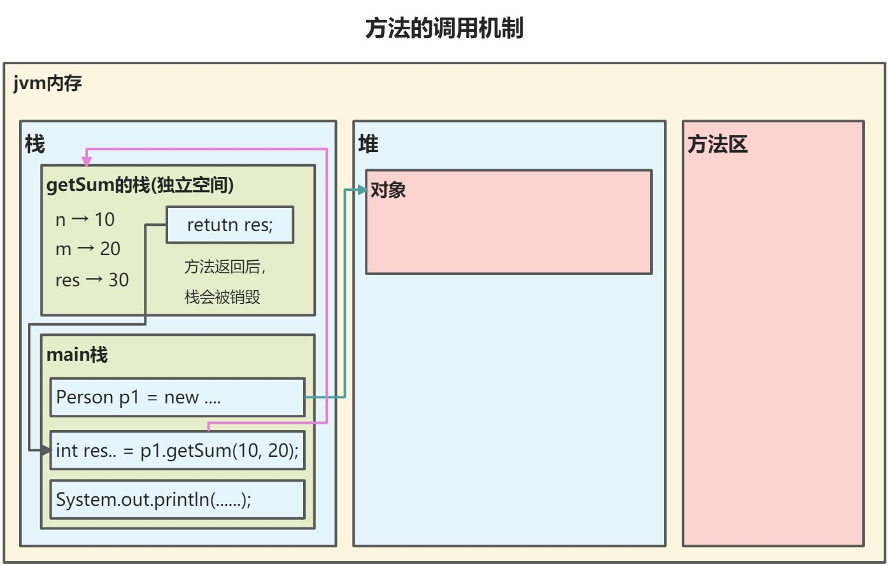
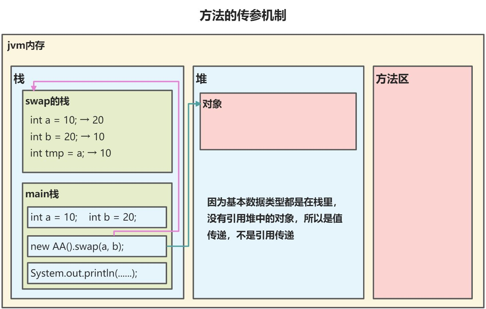
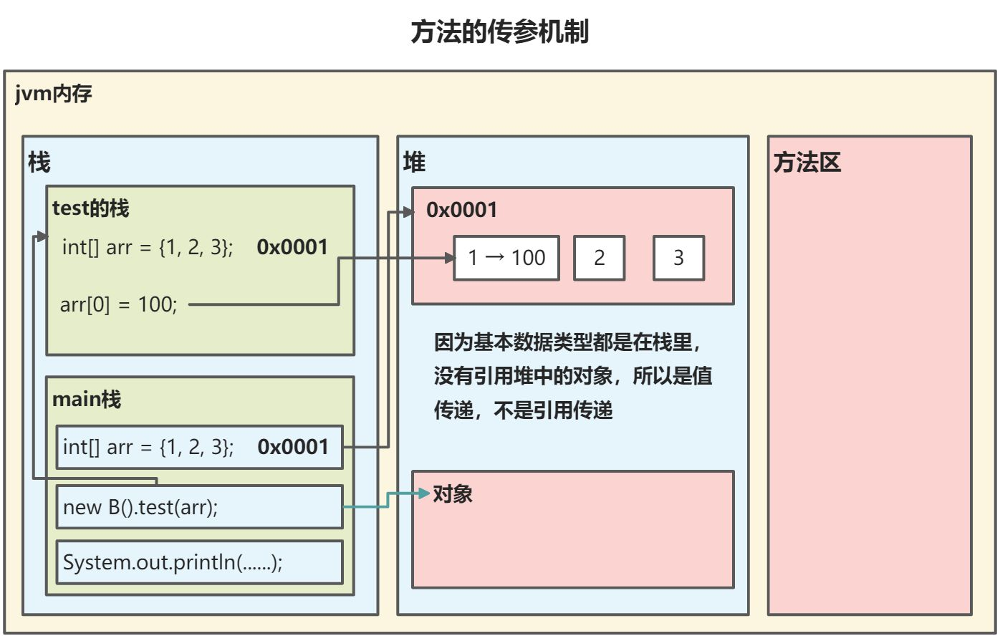

**方法**就是将一个**功能**抽取出来，把代码单独定义在一个大括号内，形成一个单独的功能。 当需要这个功能的时候，就可以去调用。这样即实现了代码的复用性，也解决了代码冗余的现象。

```java
修饰符 返回值类型 方法名 （参数列表）｛ 
    代码... 
    return 返回值; 
｝
```


**定义格式解释：**

* **修饰符**： 用于控制方法使用的范围，权限修饰符、静态修饰符、final修饰符 。
* **返回值类型**：表示方法运行的结果的数据类型，方法执行后将结果返回到调用者。一个方法只能有一个返回值。void表示没有返回值。
* **方法名**：为我们定义的方法起名，满足标识符的规范，用来调用方法。
* **参数列表**： 方法在运算过程中的未知数据，调用者调用方法时传递。可以没有参数，也可以有多个参数，用逗号隔开。参数类型可以为任意类型，可以使用基本类型和引用类型。当调用该方法时，传入的参数要与参数列表顺序相同或者兼容的类型的参数。
* **return**：将方法执行后的结果带给调用者，方法执行到 return ，整体方法运行结束。如果没有返回值，该语句不是必须的，但是也可以写return，当代码执行到的时候，表示方法结束。

方法必须定义在一类中方法外，不能定义在另一个方法的里面，定义方法需明确返回值类型和参数列表，返回值类型，必须要和 return 语句返回的类型相同，否则编译失败。不能在 return 后面写代码， return 意味着方法结束，所有后面的代码永远不会执行，属于无效代码。

方法定义时的参数叫形参，方法调用时的参数叫实参，实参和形参的类型要一直或兼容，个数、顺序必须一致。

**方法不能嵌套定义！！**

同一个类中的方法可以直接调用，跨类调用需要通过对象名调用，比如`对象名.方法名(参数);`，方法的调用还和访问修饰符相关。

```java
public class Method01 {
    public static void main(String[] args) {
        // 方法的使用
        // 定义好方法后，如果不调用，则不会执行
        // 先创建对象，然后进行调用
        Person p1 = new Person();
        p1.speak(); // 这里调用方法
        p1.cal01();
        p1.cal02(1000); // 传入的是1000，则n=1000
        p1.cal02(5); // 一个对象的方法可以调用多次

        // 将该方法返回的int值 赋值给 sum 变量
        int sum = p1.getSum(10, 20); // 传参是10,20，则n = 10, m = 20，使用int sum来接收方法的返回值
        System.out.println("getSum方法得到的返回值为：" + sum);
    }
}

class Person {
    String name;
    int age;

    // 方法(成员方法)
    // 输出“我是一个好人”
    // public：表示方法是公开的
    // void：表示方法没有返回值
    // speak：方法名
    // ()：形参列表
    // {}：方法体，就是要执行的代码
    public void speak() {
        System.out.println("我是一个好人");
    }

    // 计算1+...+100
    public void cal01() {
        // 进行循环
        int res = 0;
        for (int i = 1; i <= 100; i++) {
            res += i;
        }
        System.out.println("cal01计算结果：" + res);
    }

    // 计算1+...+n
    // (int n)：形参列表，表示当前方法可以传入一个int的值
    public void cal02(int n) {
        int res = 0;
        for (int i = 1; i <= n; i++) {
            res += i;
        }
        System.out.println("cal02计算结果：" + res);
    }

    // 计算两个数的和，并返回
    // public后面的int：表示方法执行后，返回给调用者一个int的值
    // (int n, int m)：有两个形参，表示当前方法可以接收两个参数
    // return res;：表示把res的值返回给调用者
    public int getSum(int n, int m) {
        int res = m + n;
        return res;
    }
}
```


## 方法的调用机制

(参考上面代码)



1. 当程序执行到方法时，就会开辟出一个独立的空间(栈空间)
2. 当方法执行完毕，或者执行到return语句时，就会返回
3. 返回到调用的地方
4. 返回后继续执行方法后面的代码
5. 当main方法执行完毕后，程序就退出了


## 方法的传参机制

```java
public class MethodParameter01 {
    //编写一个 main 方法
    public static void main(String[] args) {
        int a = 10;
        int b = 20;
        //创建 AA 对象 名字obj 
        AA obj = new AA();
        obj.swap(a, b);//调用 swap
        System.out.println("\nmain 方法 a=" + a + " b=" + b);//a=10 b=20
    }
}

class AA {
    public void swap(int a, int b) {
        System.out.println("\na 和 b 交换前的值\na=" + a + "\tb=" + b);//a=10 b=20 
        // 完成了 a 和 b 的交换 
        int tmp = a;
        a = b;
        b = tmp;
        System.out.println("\na 和 b 交换后的值\na=" + a + "\tb=" + b);//a=20 b=10 
    }
}
```

基本数据类型传递的是值(值拷贝)，形参的任何改变不影响实参

当执行`obj.swap(a, b);`的时候会进入swap方法中，在该方法中，该方法的参数a和b完成了值的交换，但是main方法中的a和b并没有交换，所以输出如下：




---

```java
public class MethodParameter02 {
    //编写一个 main 方法
    public static void main(String[] args) {
        B b = new B();
        int[] arr = {1, 2, 3};
        b.test(arr);  //调用方法
        System.out.println(" main 的 arr 数组 ");

        //遍历数组
        for (int i = 0; i < arr.length; i++) {
            System.out.print(arr[i] + "\t");
        }
        System.out.println();
    }
}

class B {
    public void test(int[] arr) {
        arr[0] = 200;   //修改元素 
        // 遍历数组 
        System.out.println(" test100 的 arr 数组 ");
        for (int i = 0; i < arr.length; i++) {
            System.out.print(arr[i] + "\t");
        }
        System.out.println();
    }
}
```

引用类型传递的是地址（传递也是值，但是值是地址），可以通过形参影响实参！




## 方法​重载

java 中允许同一个类中，多个同名方法的存在，但要求**形参列表不一致**。只要它们的参数列表不同即可，与修饰符和返回值类型无关。 比如：`System.out.println();` out 是 PrintStream 类型。

* **参数列表：** 个数不同，数据类型不同，顺序不同。如果参数列表类型、顺序、数量相同，参数名不同，不构成重载。
* 返回类型：如果参数列表相同，方法名相同，返回值不同，不构成重载。
* **重载方法调用：** JVM通过方法的参数列表，调用不同的方法。

```java
public class OverLoad01 {
    public static void main(String[] args) {
        MyCalculate mc = new MyCalculate();
        System.out.println(mc.calculate(1, 2));        // 打印结果：3
        System.out.println(mc.calculate(3, 4.5));    // 打印结果：7.5
        System.out.println(mc.calculate(1.2, 2));    // 打印结果：3.2
        System.out.println(mc.calculate(1, 4, 7));    // 打印结果：12
    }
}

// 这个类的四个calculate方法构成了重载
// 方法名一样，参数列表的类型不一样
class MyCalculate {
    // 两个整数的和
    public int calculate(int n1, int n2) {
        return n1 + n2;
    }

    // 这个方法和上面的方法不构成重载，因为参数列表的类型相同
//    public int calculate(int a1, int a2) {
//        return a1 + a2;
//    }

    // 一个整数和一个浮点数的和
    public double calculate(int n1, double n2) {
        return n1 + n2;
    }

    // 一个浮点数和一个整数的和
    public double calculate(double n1, int n2) {
        return n1 + n2;
    }

    // 三个整数的和
    public int calculate(int n1, int n2, int n3) {
        return n1 + n2 + n3;
    }
}
```


## 可变参数

Java允许将同一个类 **多个同名 同功能** 但 **参数个数不同**的方法，封装成一个方法。在JDK1.5之后，如果定义一个方法需要接收多个参数，并且多个参数类型一致，可以对其简化成如下格式：

```java
修饰符 返回值类型 方法名(参数类型... 形参名){ }
```


```java
public class ChangeParam01 {
    // 计算两个数的和，三个数的和，四个数的和，五个数的和....
    // 可以使用方法重载
    public int sum(int n1, int n2) {return n1 + n2;}
    public int sum(int n1, int n2, int n3) {return n1 + n2 + n3;}
    public int sum(int n1, int n2, int n3, int n4) {return n1 + n2 + n3 + n4;}

    // 上面三个方法名称相同，功能相同，只有参数个数不同，可以使用可变参数优化
    // int... 表示该参数是可变参数，类型是int，可以接收多个int类型的参数(0-n个参数)
    public int sums(int... nums) {
        // 使用可变参数时，可以当做数组使用，所以nums是一个数组
        System.out.println("接收的参数个数为：" + nums.length);
        int sum = 0;
        for (int i = 0; i < nums.length; i++) {
            sum += nums[i];
        }
        return sum;
    }

    public static void main(String[] args) {
        ChangeParam01 cp = new ChangeParam01();
        int res = cp.sums(0, 1, 2, 3, 4, 5, 6, 7);
        System.out.println("返回的结果为：" + res);

        int[] arr = {3, 6, 9};
        // 可变参数的实参可以传入数组
        int res2 = cp.sums(arr);
        System.out.println("res2的结果：" + res2);
    }
}
```

* 使用可变参数时，参数可以当做数组使用，同样是数组，但是在调用这个带有可变参数的方法时，不用创建数组，直接将多个相同类型的元素作为实际参数进行传递。
* 在jvm编译成class文件时，会将这些元素封装到一个数组中，然后再进行传递。这些动作都在编译.class文件时，自动完成了。
* 可变参数的实参可以为数组。
* 可变参数可以和普通类型的参数放在形参列表，但必须保证可变参数在最后。
  * 例如：`public void sums(String str, double... nums) {}`
* 一个形参列表中只能出现一个可变参数


## 作用域

在Java中，主要的变量就是成员变量和局部变量。

在同一个类中，成员变量和局部变量可以重名，访问时遵循就近原则；但是在同一个作用域中，比如在同一个成员方法中，两个局部变量不能重名。

**默认值：**

* **成员变量：**有默认值，可以直接使用。
* **局部变量：**没有默认值，需要先赋值后使用。


**生命周期：**

* **成员变量：**生命周期较长，伴随着对象的创建而创建，随着对象的销毁而销毁。
* **局部变量：**生命周期较短，伴随着他的代码块的执行而创建，随着代码块的结束而销毁(就是在一次方法的调用中开始，方法结束，变量随之销毁)。


**作用域：**

* **成员变量：**作用域为整个类，可以本类使用，或者其他类使用(通过对象调用)。
* **局部变量：**只能在本类中应对的方法(代码块)中使用。


**修饰符：**

* **成员变量：**可以加修饰符。
* **局部变量：**不可以加修饰符。


## 构造方法

构造方法又叫构造器(constructor)，是类的一种特殊的方法，它的主要作用是完成对新对象的初始化。当一个对象被创建时候，构造方法用来初始化该对象，给对象的成员变量赋初始值。

```java
[修饰符] 方法名(形参列表){
    方法体;
}
```

* 构造器的修饰符可以默认，也可以是 public protected private
* 构造器没有返回值，也不需要void
* 方法名和类名字必须相同
* 参数列表 和 成员方法一样的规则，既可以定义参数，也可以不定义参数
* 在创建对象时，系统会自动的调用该类的构造器完成对象的初始化。
* **构造器是完成对象的初始化，并不是创建对象**
* 一个类可以定义多个不同构造器，是可以重载的。
* 如果没有定义构造器，系统会自动给出一个默认无参的构造器，也叫做默认构造器
* 如果定义了构造器，默认的构造器会被覆盖，除非手动创建一个无参构造

```java
package object;

public class Constructor {
    public static void main(String[] args) {
        // 使用两种不同的构造器
        Person p = new Person("张三", 25);
        System.out.println("name：" + p.name);
        System.out.println("age：" + p.age);

        Person p1 = new Person("李四");
        System.out.println("name：" + p1.name);
        System.out.println("age：" + p1.age);
    }
}

class Person {

    String name;
    int age;

    // 构造器没有返回值，也不需要写void
    // 构造方法的方法名必须和类名一样
    // 形参列表和其他方法一样
    public Person(String pName, int pAge) {
        System.out.println("构造器执行了....");
        name = pName;
        age = pAge;
        System.out.println("构造器完成了对属性的初始化...");
    }

    // 构造器可以重载
    public Person(String pName) {
        name = pName;
    }

    // 如果我们定义了构造器，则默认构造器会被覆盖，如果需要，可以手动创建无参构造
    // 默认的无参构造访问修饰符也是默认的
    public Person() {

    }
}
```

可以使用javap工具反编译，能看到反编译后的结果中有定了一个 访问修饰符为默认 方法名为类名的方法。


## 对象创建的流程

```Plain Text
class Person {
    String name;
    int age = 90;

    // 构造器
    Person(String n, int a) {
        name = n;
        age = a;
    }
}

// 对象创建时发生了什么
Person p = new Person("张三", 20);
```


1. 加载Person类信息(Person.class)，只会加载一次，不会重复加载
2. 在堆中分配空间(地址)
3. 完成对象的初始化(默认初始化 age = 0 → 显式初始化 age = 90 → 构造器初始化 age = 20)
4. 把对象在堆中的地址赋值给p(对象名)


## this关键字

Java虚拟机会给每个对象分配this， 代表所在类的当前对象的引用（地址值），即对象自己的引用。方法被哪个对象调用，方法中的this就代表那个对象。即谁在调用，this就代表谁，方法中只有一个变量名时，默认也是使用 this 修饰，可以省略不写。

```java
class Dog {
    String name;
    int age;

    // 不使用this，name则等于该方法中的name（就近原则）
//    public Dog(String name, int age){
//        name = name;
//        age = age;
//    }

    // 使用this 相当于是Dog对象.name，指的是Dog类中的属性，而没有加this的name指的是方法中的name
    public Dog(String name, int age) {
        this.name = name;
        this.age = age;
    }
}
```


* this关键字可以访问本类的属性、方法、构造器
* this用于区分当前类的属性和局部变量
* 访问成员方法的语法：`this.方法名(参数列表);`
* 访问构造器语法：`this(参数列表);`，只能在构造器中使用(并且必须放在第一行)

* this不能再类定义的外部使用，只能在类定义的方法中使用

