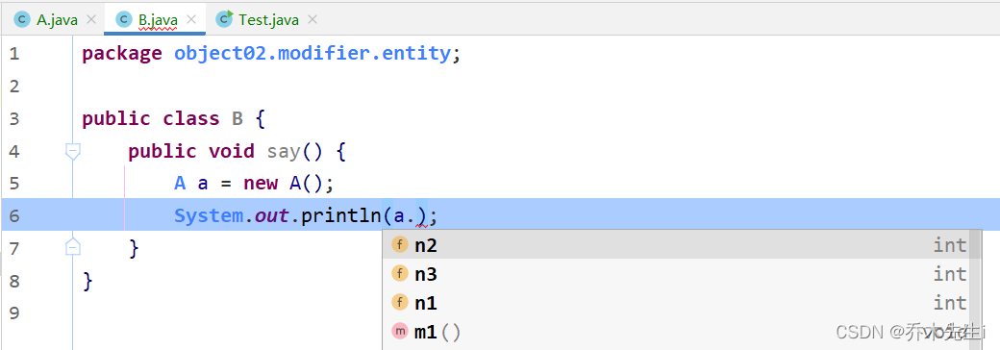

在Java中提供了四种访问权限，用于控制方法和属性(成员变量)的访问权限。使用不同的访问权限修饰符修饰时，被修饰的内容会有不同的访问权限。

* `public`：公共的，对外公开
* `protected`：受保护的，对子类和同一个包中的类公开
* `default`：默认的(可以不写)，对同一个包中的类公开
* `private`：私有的，只有类本身可以访问，不对外公开


| |**public(公开的)**|**protected(受保护的)**|**default(默认的)**|**private(私有的)**|
| :----- | :-----: | :-----: | :-----: | :-----: |
|**同一类中**|√|√|√|√|
|**同一包中**|√|√|√| |
|**不同包子类**|√|√| | |
|**无关类**|√| | | |

修饰符可以用来修饰类和类中的属性(成员方法)、方法，类只能用默认的和`public`修饰

定义一个类，这个类在`object02.modifier.entity`包中，分别使用四种不同的访问修饰符，这里可以看到同一个类中，四种不同的修饰符的成员变量在同一个类的方法中都是可以访问到的。

```java
package object02.modifier.entity;

public class A {

    public int n1 = 100;
    protected int n2 = 200;
    int n3 = 300;
    private int n4 = 400;

    public void m1() {
        System.out.println("n1 = " + n1);
        System.out.println("n2 = " + n2);
        System.out.println("n3 = " + n3);
        System.out.println("n4 = " + n4);
    }
}
```
在同一个包下定义另一个类，这时可以看到，被private修饰的n4变量不能被访问了




```java
package object02.modifier.entity;

public class B {
    public void say() {
        A a = new A();
        System.out.println("n1 = " + a.n1);
        System.out.println("n2 = " + a.n2);
        System.out.println("n3 = " + a.n3);
    }
}
```
如果子类在同一个包中，那么这个类中的默认的修饰符修饰的属性也是可以被子类访问的，因此，在不同包中定义一个子类

```java
package object02.modifier.pkg;

import object02.modifier.entity.A;

public class C extends A {
    public void sayC() {
        System.out.println("n1 = " + n1);
        System.out.println("n2 = " + n2);
    }
}
```
同样，在不同包的类就只能访问public修饰的属性或者方法了

```java
package object02.modifier.pkg;

import object02.modifier.entity.A;

public class D {
    public void sayD(){
        A a = new A();
        System.out.println("n1 = " + a.n1);
    }
}
```
