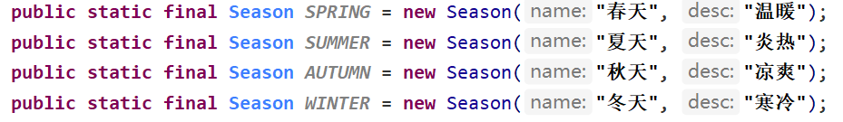
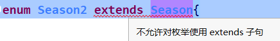

枚举英文是：enumeration
枚举是一组常量的集合，可以理解为，枚举是一种特殊的类，里面只包含一组有限的特定对象。

## 自定义枚举类

> 不需要提供setXxx方法，因为枚举对象的值通常为只读
> 枚举对象/属性使用`final` + `static`共同修饰，实现底层优化
> 枚举对象名通常使用全部大写，参考常量的命名规范
> 枚举对象根据需要可以有多个属性

```java
// 自定义枚举类的测试类，下面的类是自定义的枚举类
public class EnumTest01 {
    public static void main(String[] args) {
        // 6. 调用SPRING对象的名字并打印出来
        System.out.println(Season.SPRING.getName());

    }
}
/* 这里每一个Season对象的属性的值是都不可以修改的，都是固定的 也是常量
 * 使用static关键字修饰可以直接使用类名调用，因为这里把构造私有化了，无法在其他类中再创建对象
 * 使用final关键字修饰可以在调用改静态成员的时候不加载类，直接使用(虽然new的时候也会加载类)
 */
class Season {
    
    // 5. 使用静态的方法创建常量对象，这里的对象中的属性的值是固定的不可被修改
    public static final Season SPRING = new Season("春天", "温暖");
    public static final Season SUMMER = new Season("夏天", "炎热");
    public static final Season AUTUMN = new Season("秋天", "凉爽");
    public static final Season WINTER = new Season("冬天", "寒冷");

    // 1. 创建属性
    private String name;
    private String desc;

    // 2. 将构造器私有化，防止使用者创建对象
    private Season(String name, String desc) {
        this.name = name;
        this.desc = desc;
    }

    // 3. 提供get方法，以便用户只取其中某一个值
    // 4. 不提供set方法，防止用户修改对象中属性的值
    public String getName() {
        return name;
    }

    public String getDesc() {
        return desc;
    }
}
```

## 使用enum关键字实现枚举类

上面的Season类如何使用enum来创建呢？

```java
public class EnumTest01 {
    public static void main(String[] args) {
        // 6. 调用SPRING对象的名字并打印出来
        System.out.println(Season2.SPRING.getName());

    }
}

// 1. 创建枚举类，使用enum关键字，替代了class
enum Season2 {

    /* 5. 将 public static final Season2 SPRING = new Season2("春天", "温暖") 改成 SPRING("春天", "温暖")
    * 他们是等价的，只是使用了enum关键字后的简写方式
    * 
    * 如果有多个对象，可以用逗号隔开，这里就是创建了四个枚举对象
    * 必须将枚举的列表放在枚举类的最前面，否则编译不通过，这是固定语法
    *  */
    SPRING("春天", "温暖"),
    SUMMER("夏天", "炎热"),
    AUTUMN("秋天", "凉爽"),
    WINTER("冬天", "寒冷");

    // 2. 创建属性
    private String name;
    private String desc;

    // 3. 将构造器私有化，防止使用者创建对象
    private Season2(String name, String desc) {
        this.name = name;
        this.desc = desc;
    }

    // 4. 提供get方法，以便用户只取其中某一个值
    // 5. 不提供set方法，防止用户修改对象中属性的值
    public String getName() {
        return name;
    }

    public String getDesc() {
        return desc;
    }
}
```

## 枚举类详解

### ① 当使用enum关键字创建一个枚举类时，默认会继承Enum类

通过 [`javap`命令](javap命令使用.md) 将上面的Season2枚举类反编译，可以看到Season2类是一个final修饰的类，同时继承了`java.lang.Enum`类。

同时


### ② 传统的 public static final 枚举类名 变量名 = new 枚举类名(构造参数列表) 简化成 变量名(构造参数列表)

传统的 `public static final 枚举类名 变量名 = new 枚举类名(构造参数列表) `简化成 `变量名(构造参数列表)`

最开始的这样：



变成枚举类后是这样的：


### ③ 如果使用无参构造器创建枚举对象，则实参列表的小括号也可以省略。

```java
enum Season2 {
    SPRING(),
    SUMMER(),	// 小括号可以省略
    AUTUMN,
    WINTER;

    private Season2() {
    }
}
```

### ④ 当有多个枚举对象时，使用 , 间隔，最后一个使用分号结尾，并且必须放在枚举类的行首。

可以参考第③条中的写法

### ⑤ 根据Enum类的源码可以看到，如果没有重写toString方法并且直接打印枚举类的对象，得到的是枚举对象的名字。


执行下面的方法，得到的结果：

```java
public class EnumTest01 {
    public static void main(String[] args) {
        System.out.println(Season2.SPRING);
    }
}
```


### ⑥ 使用enum关键字之后，就不能继承其他类了，因为会自动继承Enum类，Java是单继承。



### ⑦ 枚举类和普通类一样，可以实现接口。

```java
enum 枚举类名 implements 接口1, 接口2...{
	// 枚举类类体
}
```


## Enum常用的方法
`toString()`：Enum类已经重写过了，返回的是当前对象的名字，枚举类可以重写该方法，用于返回该枚举对象的属性信息。

`name()`：返回当前枚举对象的名字，不能重写

`ordinal()`：返回当前枚举对象在枚举类中的顺序，从0开始

`values()`：返回当前枚举类中所有的常量的数组

`valueOf(String 枚举对象名)`：将字符串转换成枚举对象，要求字符串必须为已有的常量名，否则报异常

`compareTo(枚举对象)`：比较两个枚举常量，比较的是位置号，返回一个int类型的数值，0为两个枚举对象一样

```java
public static void main(String[] args) {
    Season2 autumn = Season2.AUTUMN;
    // name方法：输出枚举对象的名字
    System.out.println(autumn.name());
    // ordinal方法：输出枚举对象在枚举类中的位置，从0开始
    System.out.println(autumn.ordinal());
    // values方法：反编译可以看到values方法，返回的是枚举对象数组 Season2[]
    Season2[] values = Season2.values();
    for (Season2 value : values) {
        // 因为枚举类中没有重写toString方法，这里输出的是枚举对象的名字
        System.out.println(value);
    }
    // valueOf方法：将字符串转换为枚举对象，传入的字符串必须是枚举类中有的常量名，如果没有的话则会报错
    Season2 spring = Season2.valueOf("SPRING");
    // compareTo方法：比较两个枚举常量，比较的就是编号
    // 如果返回值是0，两个枚举对象是一样，如果返回值不是0，两个枚举对象就是不一样的
    int i = autumn.compareTo(spring);
    System.out.println(i);
}
```
