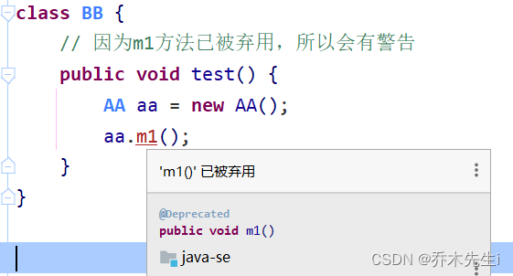

注解(Annotation)也被称因为元数据(Metadata)，用于修饰解释包、类、方法、属性、构造器、局部变量等数据信息。

- **注解：** 说明程序的。给计算机看的
- **注释：** 用文字描述程序的。给程序员看的

**定义：注解（Annotation）**，也叫元数据。一种代码级别的说明。它是JDK1.5及以后版本引入的一个特性，与类、接口、枚举是在同一个层次。它可以声明在包、类、字段、方法、局部变量、方法参数等的前面，用来对这些元素进行说明，注释。

注解不影响程序的逻辑，但注解可以被编译或运行，相当于嵌入代码中的补充信息。

**概念描述：** JDK1.5之后的新特性、说明程序的
**使用注解：** `@注解名称`

**作用分类：**
>  **① 编写文档：** 通过代码里标识的注解生成文档【生成文档doc文档】  
>  **② 代码分析：** 通过代码里标识的注解对代码进行分析【使用反射】 
>  **③ 编译检查：** 通过代码里标识的注解让编译器能够实现基本的编译检查【Override】

## JDK中预定义的注解

`@Override`：限定某个方法是重写父类的方法，该注解只能用于方法

```java
class AA {
    public void m1() {}
}

class BB extends AA{
    
    // 使用@Override注解，表示该m1方法继承了父类的m1方法
    // 该注解可以不加，加上了之后程序的会去检查该方法是否重写
    // 是的话不报错，不是的话报错，并且程序的可读性变强
    // 一眼就知道这个方法重写了父类的方法；
    @Override
    public void m1() {}

    // 如果父类没有该方法并且使用了@Override注解，则编译报错
    // @Override
    public void m2() {}
    
}
```

`@Deprecated`：用于表示某个程序元素(类、方法等)已过时，已过时的程序元素不推荐使用，但是还是可以用的，主要可以用做新旧版本的兼容和过渡

```java
class AA {
    @Deprecated
    public void m1() {}
}

class BB {
    public void test() {
        AA aa = new AA();
        aa.m1();
    }
}   
```

当使用过时方法时，编译器也会给出提示


`@SuppressWarnings`：压制警告，作用范围是和放置的位置有关，放在方法上范围就是方法

**@SuppressWarning 中的属性介绍以及属性说明：**
all，抑制所有警告
boxing，抑制与封装/拆装作业相关的警告
cast，抑制与强制转型作业相关的警告
dep-ann，抑制与淘汰注释相关的警告
deprecation，抑制与淘汰的相关警告
fallthrough，抑制与switch陈述式中遗漏break相关的警告
finally，抑制与未传回finally区块相关的警告
hiding，抑制与隐藏变数的区域变数相关的警告
incomplete-switch，抑制与switch陈述式(enum case)中遗漏项目相关的警告
javadoc，抑制与javadoc相关的警告
nls，抑制与非nls字串文字相关的警告
null，抑制与空值分析相关的警告
rawtypes，抑制与使用raw类型相关的警告
resource，抑制与使用Closeable类型的资源相关的警告
restriction，抑制与使用不建议或禁止参照相关的警告
serial，抑制与可序列化的类别遗漏serialVersionUID栏位相关的警告
static-access，抑制与静态存取不正确相关的警告
static-method，抑制与可能宣告为static的方法相关的警告
super，抑制与置换方法相关但不含super呼叫的警告
synthetic-access，抑制与内部类别的存取未最佳化相关的警告
sync-override，抑制因为置换同步方法而遗漏同步化的警告
unchecked，抑制与未检查的作业相关的警告
unqualified-field-access，抑制与栏位存取不合格相关的警告
unused，抑制与未用的程式码及停用的程式码相关的警告




## 元注解

元注解：用于描述注解的注解
`@Target`：描述注解能够作用的位置

ElementType取值： 
> `TYPE`：可以作用于类上 
> `METHOD`：可以作用于方法上 
> `FIELD`：可以作用于成员变量上

`@Retention`：描述注解被保留的阶段

取值：
> `RetentionPolicy.SUORCE`：编译器使用后，直接丢弃这种策略的注解
> `RetentionPolicy.CLASS`：编译器将把注解记录在class文件中，当运行Java程序时，jvm不会保留注解，这是默认值
>  `RetentionPolicy.RUNTIME`：编译器将把注解记录到class文件中，当运行Java程序时，jvm会保留注解，程序可以通过反射获取该注解

`@Documented`：用于指定该元注解修饰的注解类将被javadoc工具提取成文档，即在生成文档时，可以看到该注解。

> 使用该注解的注解类必须设置`@Retention`的值为`RetentionPolicy.RUNTIME`

`@Inherited`：被它修饰的注解类的注解具有继承性，如果某个类使用该注解修饰，则该类的子类自动具有该注解