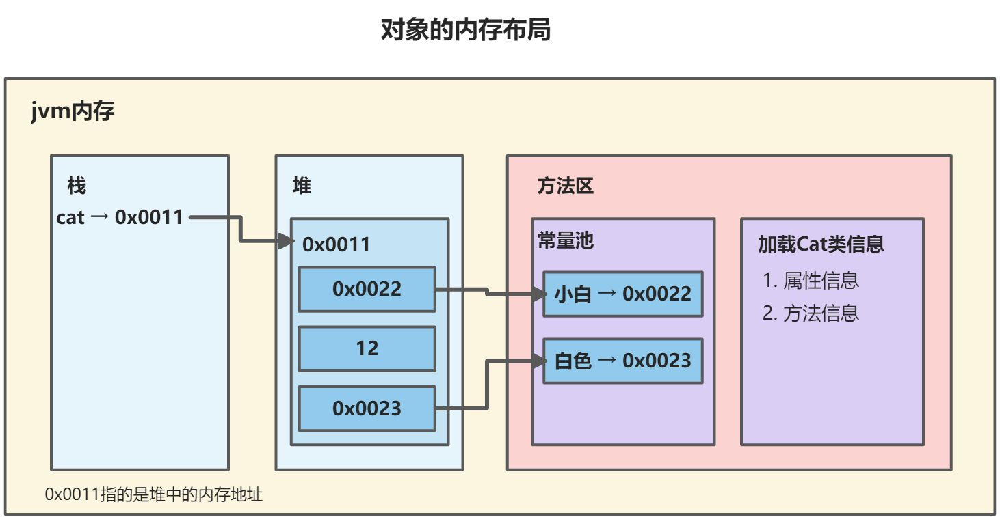

## 面向对象

面向对象编程（Object-Oriented Programming **简称 OOP**）是一种程序设计思想和编码架构。 Java 是完全面向对象的， 必须熟悉 OOP 才能够编写 Java 程序。

面向对象的程序是由对象组成的，每个对象包含对用户公开的特定功能部分和隐藏的实现部分。程序中的很多对象来自标准库，还有一些是自定义的。在 OOP 中，不必关心对象的具体实现，只要能够满足用户的需求即可。

*Alan Kay(面向对象编程思想的创始人之一)* 总结了其五大基本特征：

> 1. **万物皆对象**。可以从要解决的问题身上抽象出概念性的组件，然后在程序中将其表示为一个对象。
> 2. **程序是一组对象，通过消息传递来告知彼此该做什么。**要请求调用一个对象的方法，需要向该对象发送消息。
> 3. **每个对象都有自己的存储空间，可容纳其他对象**。通过封装现有对象，可制作出新型对象。
> 4. **每个对象都有一种类型**。每个对象都是某个“类”的一个“实例”。一个类最重要的特征就是“能将什么消息发给它？”。
> 5. **同一类所有对象都能接收相同的消息**。由于类型为“圆”的一个对象也属于类型为“形状”的一个对象，所以一个圆完全能接收发送给”形状”的消息。这意味着可让程序代码统一指挥“形状”，令其自动控制所有符合“形状”描述的对象，其中自然包括“圆”。这一特性称为对象的“可替换性”，是OOP最重要的概念之一。

一个对象具有自己的状态，行为和标识。这意味着对象有自己的内部数据(提供状态)、方法 (产生行为)，并彼此区分（每个对象在内存中都有唯一的地址）。

面向对象思想是一种更符合我们思考习惯的思想，它可以将复杂的事情简单化，并将我们从执行者变成了指挥者。面向对象的语言中，包含了三大基本特征，**即封装、继承和多态**。

**类(class)是构造对象的模板或蓝图。 我们可以将类想象成制作小甜饼的切割机，将对 象想象为小甜饼。 由类构造(construct)对象**的过程称为创建类的**实例(instance)**。

在类之间， 最常见的关系有：

* **依赖(uses-a)：**依赖(dependence)，即“uses-a”关系，是一种最明显的、最常见的关系。如果一个类的方法操纵另一个类的对象，我们就说一个类依赖于另一个类。应该尽可能地将相互依赖的类减至最少(让类之间的耦合度最小)。
* **聚合(has-a)：**聚合(aggregation)，即“has-a” 关系，是一种具体且易于理解的关系。聚合关系意味着类A的对象包含类B的对象。
* **继承(is-a)：**继承(inheritance)，即“is-a”关系，是一种用于表示特殊与一般关系的。如果类A扩展类B，类A不但包含从类B继承的方法，还会拥有一些额外的功能是继承。


### 抽象

所有编程语言都提供抽象机制。


## 类与对象

**类与对象的关系：**

类是对一类事物的描述，是**抽象的**。可以看做是自定义的数据类型。

对象是一类事物的实例，是**具体的**。

**类是对象的模板，对象是类的实体**。

**类的定义格式：**

```java
权限修饰符 class 类名 {
    //成员变量
    //成员方法
}
```


## 成员变量

**成员变量(属性)**是类的一个组成部分，一般是基本数据类型，也可是引用类型(对象，数组)。

比如前面定义猫类的`int age`就是属性。

属性的定义语法同变量，示例：

```java
访问修饰符 属性类型 属性名;
```


有四种访问修饰符 `public`，`proctected`，`默认`，`private`。


**定义成员变量：**

```java
class Cat{
    String name;
    int age;
    String color;
    double weight;
}
```


**访问成员变量：**

使用对象访问类中的成员：

```java
对象名.成员变量;
对象名.成员方法();
```


**成员变量的默认值：**

属性的定义类型可以为任意类型，包含基本类型或引用类型，引用类型如果不符值，则默认值为null。

|                  | **数据类型**                   | **默认值** |
| ---------------- | ------------------------------ | ---------- |
| **基本数据类型** | 整型（byte，short，int，long） | 0          |
|                  | 浮点型（float，double）        | 0.0        |
|                  | 字符（char）                   | '\\u0000'  |
|                  | 布尔（boolean）                | false      |
| **引用数据类型** | 数组，类，接口                 | null       |


## 创建对象

在对象与对象变量之间存在着一个重要的区别。一个对象变量并没有实际包含一个对象， 而仅仅引用一个对象。任何对象变量的值都是对存储在另外一个地方的一个对象的引用。new操作符的返回值也是一个引用。

`Cat cat1 = new Cat();`，cat1是对象的名字，new Cat() 是创建对象的空间，是真正的对象。

```java
Date deadline; 
// 定义了一个对象变量deadline, 它可以引用 Date 类型的对象。
// 但是现在还不是一个对象，因为他没有引用到一个对象
// 因此，下面的语句将编译失败
s = deadline.toString();    // 编译失败

// 必须首先初始化变量deadline，才可使用
// 有两种方法：
// 1. 可以用新构造的对象初始化这个变量
deadline = new Date();
// 2. 可以让这个变量引用一个已存在的对象
deadline = birthday;

// 表达式 new Date()，构造了一个Date类型的对象，并且它的值是对新创建对象的引用。
// 这个引用存储在变量 deadline 中。

// 也可以将对象变量设置为 null，表明这个对象变量目前没有引用任何对象。
deadline = null;
// 如果讲一个方法应用于一个值为null的对象上，会产生运行时错误
String s = birthday.toString();    // 此行会报错
```


```java
public class ObjectDome01 {
    public static void main(String[] args) {

        // 使用面向对象解决
        // 实例化一只猫[创建一个猫的对象]
        /*
        * 1. new Cat(); 创建一只猫的对象
        * 2. Cat cat1 = new Cat(); 将猫的对象赋值给 cat1
        * 3. cat1 就是一个对象
        * */
        Cat cat1 = new Cat();
        cat1.name = "小白";
        cat1.age = 3;
        cat1.color = "白色";
        cat1.weight = 10;
        // 创建第二只猫，并赋值给 cat2
        Cat cat2 = new Cat();
        cat2.name = "小花";
        cat2.age = 100;
        cat2.color = "花色";
        cat2.weight = 20;

        // 使用
        System.out.println("第一只猫信息：" + cat1.name + " " + cat1.age + " " + cat1.color + " " + cat1.weight);
        System.out.println("第二只猫信息：" + cat2.name + " " + cat2.age + " " + cat2.color + " " + cat2.weight);
    }
}

// 使用面向对象解决养猫问题
class Cat{
    // 自定义属性
    String name;
    int age;
    String color;
    double weight;
}
```





### 对象分配机制、创建的过程

#### 类和对象的内存分配机制

| **内存** | **分析**                                                   |
| -------- | ---------------------------------------------------------- |
| 栈       | 一般存放基本数据类型(局部变量)                             |
| 堆       | 存放对象(对象、数组等)                                     |
| 方法区   | 常量池(常量、字符串等)，类加载信息(类的成员变量和成员方法) |


#### 创建对象的简单过程

```java
Person zhangsan = new Person();
zhangsan.name = "张三";
zhangsan.age = 10;
```

**简单分析：**

1. 先加载`Person`类信息(成员变量和成员方法信息，只会加载一次)
2. 在堆中分配空间，进行默认初始化，比如`name`的默认值为`null`，`age`的默认值为`0`
3. 把该对象在堆中的地址赋给变量`zhangsan`，此时`zhangsan`就指向该对象4. 进行指定初始化，比如`zhangsan.name = "张三"`，`zhangsan.age = 10`


## 匿名对象

创建对象时，只有创建对象的语句，却没有把对象地址值赋值给某个变量。虽然是创建对象的简化写法，但是应用场景非常有限。

**匿名对象 ：**没有变量名的对象。

```java
new 类名(参数列表);
```


**应用场景：**创建匿名对象直接调用方法，没有变量名。

```java
new Scanner(System.in).nextInt();
```


一个匿名对象，只能使用一次，一旦调用两次方法，就是创建了两个对象，造成浪费。

```java
new Scanner(System.in).nextInt(); 
new Scanner(System.in).nextInt();
```


匿名对象可以作为方法的参数和返回值

**作为参数：**

```java
class Test {
    public static void main(String[] args) { 
        // 普通方式
        Scanner sc = new Scanner(System.in); 
        input(sc);
        //匿名对象作为方法接收的参数
        input(new Scanner(System.in));
    }
    public static void input(Scanner sc){
        System.out.println(sc);
    }
}
```


**作为返回值：**

```java
class Test2 {
    public static void main(String[] args) {
        // 普通方式
        Scanner sc = getScanner();
    }
    public static Scanner getScanner(){
        //普通方式
        //Scanner sc = new Scanner(System.in); 
        //return sc;
        //匿名对象作为方法返回值
        return new Scanner(System.in);
    }
}
```