继承可以解决代码复用，让编程更加靠近人类思维。当多个类存在相同的属性(变量)和方法时，可以从这些类中**抽象出父类**，在父类中定义这些相同的属性和方法，所有的子类不需要重新定义这些属性和方法，只需要通过 extends 来 **声明继承父类**即可。

* **父类又叫超类、基类**
* **子类又叫派生类**


**继承的基本语法：**

```java
class 子类类名 extends 父类类名{
}
```


**继承的示意图：**​​

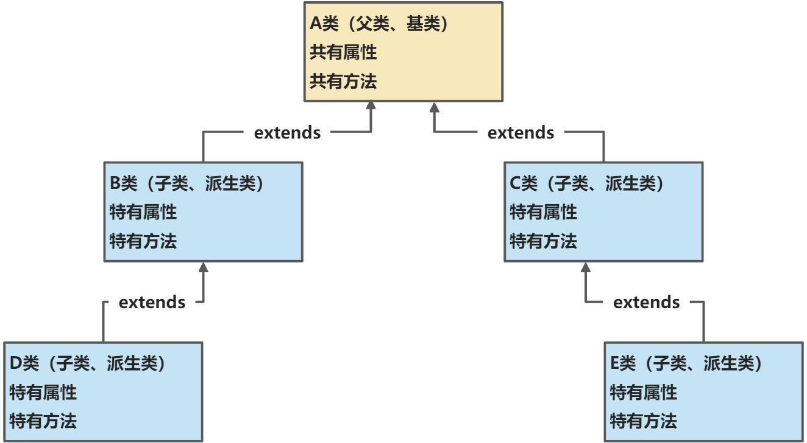


## 快速入门

**定义一个父类**

```java
package object02.extend_;

/**
 * 父类，是Pupil和Graduate的父类
 */
public class Student {

    // 三个共有的属性
    public String name;
    public int age;
    private double score;   // 成绩


    // 两个共有的方法
    public void setScore(double score) {
        this.score = score;
    }

    public void showInfo() {
        System.out.println("学生名：" + name);
        System.out.println("年龄：" + age);
        System.out.println("成绩：" + score);
    }

}
```

**定义两个子类**

```java
package object02.extend_;

/**
 * 继承学生类
 */
public class Pupil extends Student{

    // 只要写不一样的方法就可以
    public void testing() {
        System.out.println("小学生" + name + "正在考小学数学...");
    }

}
```

```java
package object02.extend_;

/**
 * 继承学生类
 */
public class Graduate extends Student{

    // 只要写不一样的方法就可以
    public void testing() {
        System.out.println("大学生" + name + "正在考大学数学...");
    }

}
```

**测试方法**

```java
package object02.extend_;

public class Test {
    public static void main(String[] args) {
        Graduate graduate = new Graduate();
        graduate.name = "张大三";
        graduate.age = 20;
        graduate.testing();
        graduate.setScore(89);
        graduate.showInfo();

        Pupil pupil = new Pupil();
        pupil.name = "张小三";
        pupil.age = 9;
        pupil.testing();
        pupil.setScore(67);
        pupil.showInfo();
    }
}
```

**输出结果**


## 继承详解

1. 子类继承了所有父类的属性和方法，非私有的属性和方法可以在子类直接访问，但是私有属性和方法不能在子类直接访问，需要通过公共方法去访问。
2. 子类必须调用父类的构造器，完成父类的初始化
3. 当使用super调用父类构造器时，必须将super()语句放在子类构造器的第一行。
4. 如果希望指定调用父类的某个构造器，可以手动的显式调用
5. this()和super()都只能放在构造器的第一行，所以在同一个构造器中不能同时出现这两个方法
6. 在Java中，所有类都是Object的子类，Object类是所有类的父类(默认继承，所以没有extends关键字)
7. 当子类创建对象时，父类的构造器的调用不限于直接父类，将一直追溯到Object类 （图）
8. Java是单继承机制。一个子类最多直接继承一个父类
9. 不能滥用继承，子类和父类之间必须满足is-a的逻辑关系


定义一个父类，父类中分别有四个权限修饰符所修饰的属性和方法，还有一个无参的构造器

```java
public class Base {
    public int n1 = 100;
    protected int n2 = 200;
    int n3 = 300;
    private int n4 = 400;
    public Base() {
        System.out.println("Base的无参构造执行了");
    }
    public void test01() {
        System.out.println("test01执行了");
    }
    protected void test02() {
        System.out.println("test02执行了");
    }
    void test03() {
        System.out.println("test03执行了");
    }
    private void test04() {
        System.out.println("test04执行了");
    }
}
```

定义一个子类，有一个无参的构造器

```java
public class Sub extends Base {
    public Sub() {
        System.out.println("Sub的无参构造执行了");
    }

    public void sayOk(){
    }
}
```

测试方法

```java
public class Test {
    public static void main(String[] args) {
        Sub sub = new Sub();
    }
}
```


> 子类继承了所有父类的属性和方法，非私有的属性和方法可以在子类直接访问，但是私有属性和方法不能在子类直接访问，需要通过公共方法去访问。

哪怕当父类和子类在同一个包中的时候，子类访问不到父类的私有属性和私有方法。

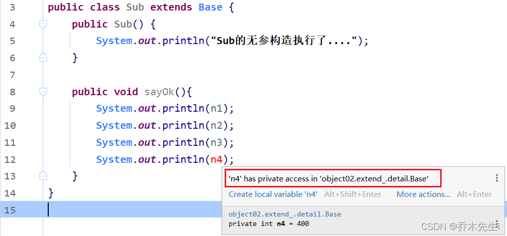


如果想调用，可以父类提供间接访问的方法，比如`set`和`get`方法，或者其他方法折中调用等等，下面的代码加入到父类中可以间接的访问私有的属性和方法（我不能做的事情，可以叫别人帮忙做）。

```java
    public int getN4() {
        return n4;
    }
    public void getTest04() {
        test04();
    }
```

而通过debug工具，可以发现私有属性`n4`被被子类Sub继承了，所以**子类继承了所有父类的属性和方法**，包括私有的属性和方法。

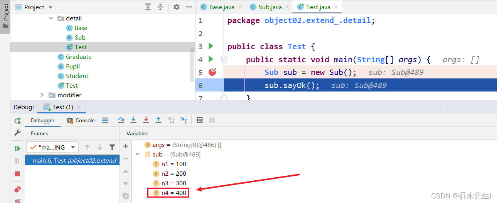


> 子类必须调用父类的构造器，完成父类的初始化

执行测试方法，可以看到以下结果


这里相当于是在子类的构造器中的第一行使用了`super`关键字，如果父类有无参构造器，`super()`可以省略不写，系统会自动调用。

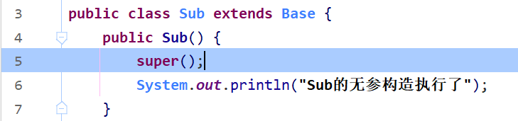

当**创建子类对象的时候**不管使用的是子类的哪个构造器(无参或者有参构造)，默认情况下**都会调用父类的无参构造器**，**如果父类没有无参构造器**，则**必须在子类的构造器的第一行使用`super(参数列表)`去调用父类的构造器**，否则编译不通过
此时给父类和子类都加上一个有参构造器，如下


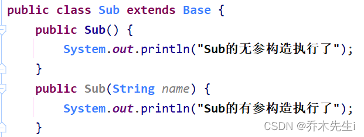

再次运行测试方法，可以证实：**在默认的情况下，不管子类调用哪个构造器，父类都会调用无参构造**。


把父类的无参构造器注释，只保留有参构造


这时可以看到，子类的两个构造器直接报错

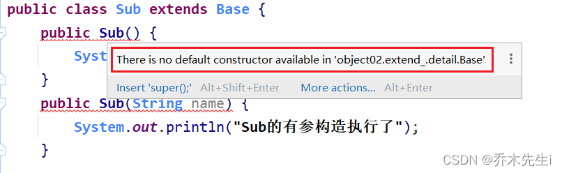

并且必须把`super()`语句写在子类构造器的第一行


> 当使用super调用父类构造器时，必须将super()语句放在子类构造器的第一行。


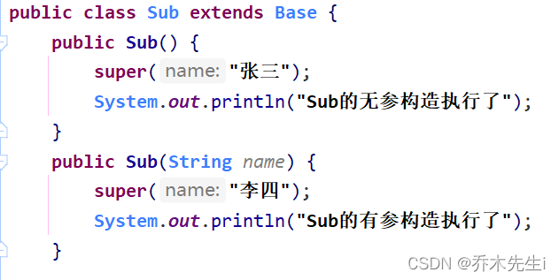

此时执行测试方法，可以看到调用的是父类的有参构造器


> 如果希望指定调用父类的某个构造器，可以手动的显式调用

现在将父类构造器恢复成一个有参构造和一个无参构造，此时的子类是可以使用super关键字手动调用父类的任何一个构造器，当然，如果不手动调用，则会默认调用无参构造。

现在的代码是子类无参构造器调用父类的有参构造器，子类的有参构造器调用父类的无参构造器

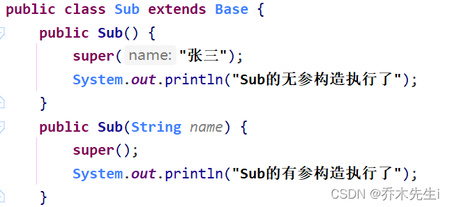

可以看到输出结果


> this()和super()都只能放在构造器的第一行，所以在同一个构造器中不能同时出现这两个方法

可以看到，当同时调用的时候，直接报错

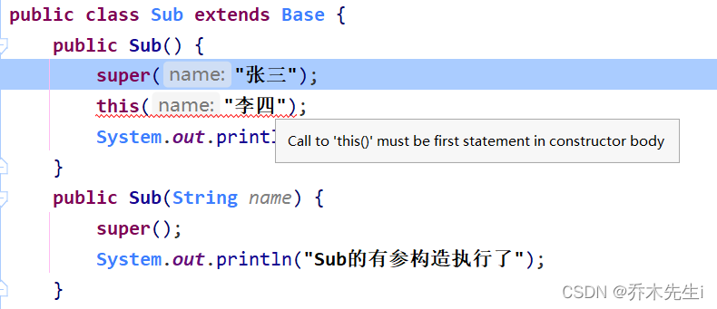


> 在Java中，所有类都是Object的子类，Object类是所有类的父类(默认继承，所以没有extends关键字)

在idea中，使用快捷键`Ctrl + H`快捷键可以调出类的继承关系，可以看到，定义的`Sub类`的父类是`Base类`，而`Base类`又是`Object类`的子类，所以，`Sub类`也是`Object类`的子类。

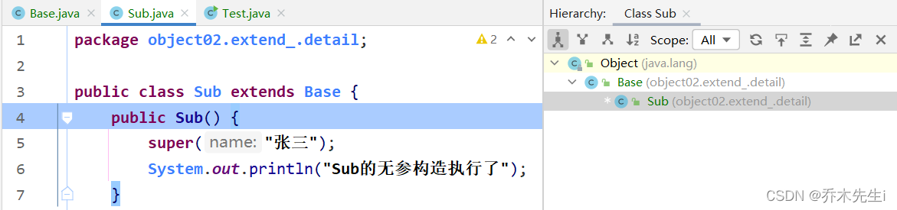


> 当子类创建对象时，父类的构造器的调用不限于直接父类，将一直追溯到Object类


创建这三个类，每个类中都有一个无参构造，无参构造会输出一句话，关系图如下

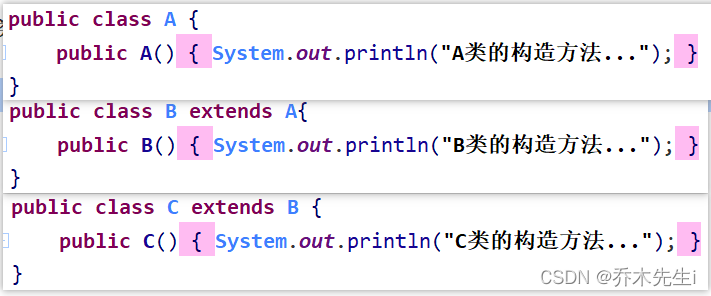


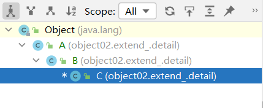

可以看到，当创建C类对象的时候，构造器会从顶级父类开始执行，因为Object类的构造器没有输出（**实际上A类的构造器中也隐藏了`super()`语句，也会去调用Object类的无参构造器**），所以从A类开始输出，一直输出到C类结束


> Java是单继承机制。一个子类最多直接继承一个父类

不可以多继承


如果C类既想继承A类又想继承B类，可以让A类继承B类，然后C类继承A类，或者B类继承A类，再C类继承B类


> 不能滥用继承，子类和父类之间必须满足is-a的逻辑关系

比如Cat类(猫)继承Animal类(动物)是合理的，因为猫有动物的特征，Animal类可以从Cat类或者Dog类中抽取出共同的方法或属性。

但是Person类(人)继承Music类(音乐)，没有共同特征，不合适继承。


## 继承的本质

如图，从右往左看


