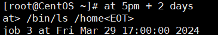
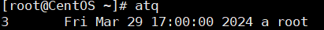

任务调度：是指系统在某个时间执行的特定的命令或程序。
任务调度分类：
1. 系统工作：必须周而复始地执行，如病毒扫描等。
2. 用户工作：用户可能希望执行某些程序，如mysql的数据备份。

**基本语法**

```bash
crontab [选项]

# 编辑crontab定时任务
crontab -e
# 查询crontab任务
crontab -l
# 删除当前用户所有的crontab任务
crontab -r

# 重启任务调度
service crond restart
```

**常用选项**

| 选项 | 说明 |
|----|----|
| `-e` | 编辑crontab定时任务 | 
| `-l` | 查询crontab任务 |
| `-r` | 删除当前用户所有的crontab任务 |

例如：
```bash
# 每分钟执行一次 ls -l /etc/ > /tmp/to.txt
*/1 * * * * ls -l /etc/ > /tmp/to.txt
```


**占位符说明**
| 占位符 | 含义 | 范围 |
|----|----|----|
| 第一位 | 一小时中的第几分钟 | 0-59 |
| 第二位 | 一天中的第几小时 | 0-23 |
| 第三位 | 一月中的第几天 | 1-31 |
| 第四位 | 一年中的第几月 | 1-12 |
| 第五位 |  一周中的星期几 | 0-7 （ 0 和 7 都代表星期日）|

**特殊符号说明**
| 符号 | 说明 |
|----|----|
| `*` | 代表任何时间，比如第一位为 `*` ，表示一小时中的每分钟执行一次 | 
| `,` | 代表不连续的时间，比如 `0 8,12,16 * * *` ，表示在8点整，12点整，16点整都执行一次 |
| `-` | 代表连续的时间范围，比如 `0 5 * * 1-6`，表示周一到周六每天5点整执行一次 |
| `*/n` | 代表隔多久执行，比如 `*/10 * * * *` ，表示每隔10分钟执行一次 |


**例如：**
| 时间 | 说明 |
|----|----|
| `45 22 * * *` | 22:45执行 | 
| `0 17 * * 1` | 每周一的17:00执行 |
| `0 5 1,15 * *` | 每月1日和15日05:00执行 |
| `40 4 * * 1-5` | 每周一至周五的04:00执行 |
| `*/10 4 * * *` | 每天04:00，每隔10分钟执行 |
| `0 0 1,15 * 1` | 每月的1日和15日，每周一的 00:00 执行 |

> 第三位和第五位最好不要同时使用，第三位定义的是每个月的第几天，第五位定义的是每周的第几天，都是定义天，非常容易使人混乱。


## 定时任务
`at` 命令是一次性定时计划任务，执行完后不会再次执行。`at` 的守护进程 `atd` 会以后台模式运行，检查任务队列运行。
默认情况下 `atd` 守护进程每60秒检查任务队列，有任务时，会检查任务运行时间是否与当前时间匹配，匹配则执行任务。

在使用 `at` 命令时，一定要保证 `atd` 进程启动，否则无法执行任务。
```bash
# 查看 atd 是否在运行
ps -ef | grep atd
```

**基本语法**
```bash
at [选项] [时间]

# 结束 at 命令的输入，需要按两次
Ctrl + D
```


**常用选项**

| 选项 | 说明 |
|----|----|
| `-m` | 当任务完成后，给用户发邮件，即使没有标准输出 | 
| `-I` | atq的别名 | 
| `-d` | atrm的别名 | 
| `-v` | 显示任务将被执行的时间 | 
| `-c` | 打印任务的内容到标准输出 | 
| `-V` | 显示版本信息 | 
| `-q <队列>` | 使用指定的队列 | 
| `-f <文件>` | 从指定文件读入任务 | 
| `-t <时间参数>` | 以时间参数的形式提交要运行的任务 | 


**指定时间说明**
1. 接受当天的 `hh:mm` (小时:分钟) 格式的时间指定，假如当天该时间已过，则第二天执行。
2. 使用 `midnight` (深夜)， `noon` (中午)， `teatime` (下午茶，一般是下午四点) 等比较模糊的词语来指定时间。
3. 采用12小时计时制，在时间后面加上 `AM` (上午)， `PM` (下午) 来说明是上午还是下午。
4. 具体日期，格式为 `month day` (月 日) ， `mm/dd/yy` (月/日/年)，`mm.dd.yy` (月.日.年)，日期必须跟在时间的后面，例如：`04:00 04/01/2024`。
5. 相对计时法，格式为：`now + count time-units`，now为当前时间，time-units是实践单位（minutes、hours、days、weeks），count是时间的数量（几天、几小时），例如：`now + 5 minutes`。
6. 直接使用 `today` (今天)，`tomorrow` (明天) 来指定时间。

**例如：**

- 两天后的下午5点执行 `/bin/ls /home`


- `atq` 命令查看系统任务

- 删除已设置的任务 `atrm 编号`

