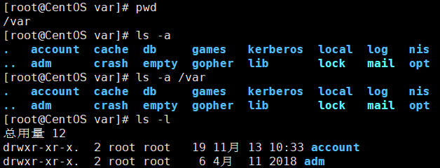
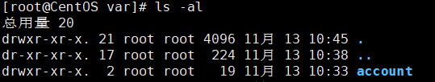
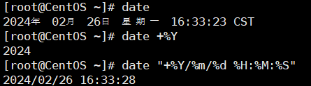

## 运行级别

- 0：关机
- 1：单用户【找回丢失密码】
- 2：多用户状态没有网络服务
- 3：多用户状态有网络服务
- 4：系统未使用保留给用户
- 5：图形界面
- 6：系统重启

> 常用的运行级别是 3 和 5 ，也可以指定默认的运行级别。

### 切换运行级别

```bash
init [ 0 1 2 3 4 5 6 ]
```


### 查询、设置默认运行级别

查询默认运行级别：

```bash
systemctl get-default
```

设置默认运行级别：

```bash
# 设置运行级别为 3
systemctl set-default multi-user.target

# 设置运行级别为 5
systemctl set-default graphical.target
```

设置后重启生效。

> CentOS7之前是在 `/etc/inittab` 文件中设置

## 帮助指令

### man 获得帮助信息

```bash
man [命令 或 配置文件]
```

### help 指令

获得shell内置命令的帮助信息
```bash
help 命令
```

## 常用指令

- `clear` 或 `crtl + L`：清屏
- `Ctrl+C`：退出动态监控

## 文件目录类指令

### pwd 指令

显示当前工作目录的绝对路径
```bash
pwd
```

### ls 指令

查看目录的所有内容信息
```bash
ls [选项] [目录 或 文件]
```

可选项：
- `-a` ：查看目录的所有目录和文件，包括隐藏文件
- `-l` ：以列表的方式显示信息
- `-h` ：文件大小以k、M、G的形式显示

> 在Linux中，隐藏文件以 `.` 开头命名。
>  `ll` 指令等同于 `ls -l`





### cd 指令

切换到指定目录
```bash
cd [参数]
```

相对路径：
- `cd ~` 或 `cd` ：回到自己的home目录，如果是root用户，则会回到 `/root` 目录
- `cd ..` 回到当前目录的上一级目录：

> 可以使用tab键来补全文件路径
>
例如：`cd ../../root`

绝对路径：
例如：`cd /home`

### mkdir 指令

用于创建目录
```bash
mkdir [选项] 要创建的目录
```

常用选项：
- `-p` ：创建多级目录

例如：
```bash
mkdir /home/aaa

mkdir -p /aaa/bbb/ccc
```

### rmdir 指令

删除指定空目录

```bash
rmdir [选项] 要删除的空目录
```
> 如果要删除非空目录，可以使用 `rm -rf 需要删除的目录` 指令，慎用！！

### touch 指令

创建空文件
```bash
touch 文件名称
```

例如：`touch aaa.txt`

### cp 指令

拷贝文件到指定目录
```bash
cp [选项] source dest
```

常用选项：
- `-r` ：递归复制整个文件夹

例如：
```bash
# 将 /home/hello.txt 拷贝到 /home/bbb 目录中
cp hello.txt /home/bbb
# 或者
cp /home/hello.txt /home/bbb

# 递归拷贝整个文件夹
cp -r /home/bbb /opt
# 如果 /opt 文件夹中已经有bbb文件夹，会提示覆盖
# 强制覆盖，不提示：
\cp -r /home/bbb /opt

# 将a.txt复制到上一层目录中
cp a.txt ../
```

### rm 指令

移除文件或目录
```bash
rm [选项] 要删除的文件或目录
```
常用选项：
- `-r`：递归删除整个文件夹
- `-f`：强制删除不提示

例如：
```bash
# 删除 /home/hello.txt
rm /home/hello.txt

# 递归删除 /home/bbb 整个文件夹，并且不提示
rm -rf /home/bbb
```

### mv 指令

移动文件或目录(不同目录)
重命名文件或目录(同一个目录)

```bash
mv 旧文件名 新文件名
# 例如：将 hello.txt 重命名为 hi.txt
# mv hello.txt hi.txt

mv 旧文件地址 新文件地址
# 例如：将 hi.txt 移动到 temp 文件夹
# mv /home/hi.txt /temp
```

### cat 指令

查看文件内容
```bash
cat [选项] 要查看的文件
```
常用选项：
- `-n`：显示行号

例如：
```bash
cat /etc/profile

cat -n /etc/profile | more
# | more 管道符：把得到的结果交给more处理
```

### more 指令

以全屏幕的方式按页显示文本文件的内容，基于 VI 编辑器的文本过滤器。
```bash
more 要查看的文件
```

操作说明：
- `空白键(space)`：下一页
- `Enter`：下一行
- `q`：退出 more
- `Ctrl + F`：滚动下一屏
- `Ctrl + B`：滚动上一屏
- `=`：输入当前行的行号
- `:f`：输出文件名和当前行的行号

例如：
```bash
more /etc/profile
cat -n /etc/profile | more
```

### less 指令

分屏查看文件内容，与 `more` 指令相似，但是比 `more` 指令更强大，支持各种显示终端。
> less 指令在显示文件内容时，并不是将整个文件加载后才显示，而是根据显示需要加载内容，所以对于大型文件具有较高的效率。

```bash
less 要显示的文件
```

操作说明：
- `空白键(space)`：下一页
- `[Page Down]`：下一页
- `[Page Up]`：上一页
- `/ 字串`：向下搜索，`n` 下一个，`N` 上一个
- `? 字串`：向上搜索，`n` 下一个，`N` 上一个
- `q`：退出 less


### echo 指令

输出内容到控制台。

```bash
echo [选项] [输出内容]
```

例如：
```bash
# 输出环境变量
echo $PATH
echo $HOSTNAME

# 输出hello
echo "hello"
```

### head 指令

用于显示文件的开头部分内容，默认情况下head指令显示文件的前10行内容。
```bash
# 查看文件的前10行内容
head 文件

# 查看文件的前5行内容，5可以是任意数字
head -n 5 文件
```

### tail 指令

用于显示文件的结尾部分内容，默认情况下tail指令显示文件的最后10行内容。
```bash
# 查看文件的最后10行内容
tail 文件

# 查看文件的最后5行内容，5可以是任意数字
tail -n 5 文件

# 实时追踪该文档的所有更新
tail -f 文件
```

例如：
```bash
# 查看 error.log 的最后20行
tail -n 20 /home/error.log

# 试试监控 error.log 文件的变化
tail -f /home/error.log
```

### `>` 指令 和 `>>` 指令

`>` 指令输出重定向 
`>>` 指令追加

例如：
```bash
# 将列表的内容写入到文件中(覆盖)
ls -l > 文件

# 将内容追加到文件中(不覆盖)
echo "内容" >> 文件
```

### ln 指令

软链接，也称为符号链接，类似于Windows中的快捷方式，主要存放了链接其他文件的路径。

```bash
# 创建一个软链接
ln -s [原文件或目录] [软链接名]
```

> 当使用 `pwd` 指令查看目录时，仍看到的是软链接所在的目录。

例如：
```bash
# 在 /home 目录下创建软链接 myroot，链接到 /root 目录
ls -s /root /home/myroot
```

### history 指令

查看已经执行过的历史命令，也可以执行历史命令。

例如：
```bash
# 显示所有的历史命令
history

# 显示最近使用过的10个指令
history 10

# 执行历史编号为5的指令
!5
```

## 日期时间类指令

### date指令——显示当前日期

1. `date`：显示当前时间
2. `date + %Y`：显示当前年份
3. `date + %m`：显示当前月份
4. `date + %d`：显示当前是哪一天
5. `date "+%Y-%m-%d %H:%M:%S"`：显示年月日时分秒



### date指令——设置日期

```bash
date -s 字符串时间

# 例如：
date -s "2020-01-20 20:20:20"
```

### cal指令

查看日历指令
```bash
cal [选项]  # 不加选项则为当前月份

# 例如：
cal 2024
```

## 搜索查找类指令

### find指令
find指令将从指定目录向下递归遍历其各个子目录，将满足条件的文件或目录显示在终端。

```bash
find [搜索范围] [选项]
```

**选项：**
- `-name<查询方式>`：按照指定的文件名查找模式查找文件
- `-user<用户名>`：查找属于用户名所有文件
- `-size<文件大小>`：按照指定的文件大小查找文件

```bash
find /home -name hello.txt
find /home -name "hello*"  # hello开头的文件

find /opt -user root
find /opt -user root | more  # 并分页

# +n 大于；-n 小于；n 等于。单位：k、M、G
find / -size +200M
```

### locate指令

locate指令可以快速定位文件路径。locate指令利用事先建立的系统中所有文件名以及路径的locate数据库实现快速定位给定的文件。locate指令无需遍历整个文件系统，查询速度较快。为保证查询结果的准确度，管理员必须定期更新locate时刻。

```bash
locate 搜索文件

# 由于locate基于数据库查询，第一次运行前，使用updatedb指令创建locate数据库。
updatedb
```

### which指令

可以查看某个指令在那个目录下。

例如查看`ls`指令在哪个目录：
```bash
which ls
```

### grep指令 和 管道符 |

grep过滤查找，可传入正则表达式。

管道符`|`，表示将前一个命令的处理结果输出传递给后面的命令处理。

```bash
grep [选项] 查找内容 源文件
```
**选项：**
- `-n`：显示匹配以及行号
- `-i`：忽略字母大小写

例如：
```bash
# 在hello.txt中查找“yes”所在行，并显示行号
# 写法1：
cat /home/hello.txt | grep "yes"

# 写法2：
grep -n "yes" /home/hello/txt
```

## 压缩和解压类指令

### gzip指令 gunzip指令

gzip用于压缩文件，gunzip用于解压文件

- `gzip 文件`：压缩文件，只能将文件压缩为*.gz文件
- `gunzip 文件.gz`：解压文件

例如：
```bash
gzip /home/hello.txt

gunzip /home/hello.txt.gz
```

### zip指令 unzip指令

zip用于压缩文件，gunzip用于解压文件

- `zip [选项] XXX.zip 需要压缩的内容`：压缩文件或目录的命令
- `unzip 文件.zip`：解压文件

**zip常用选项：**
- `-r`：递归压缩，即压缩目录

**unzip常用选项：**
- `-d<目录>`：指定解压后文件的存放目录

```bash
zip -r myhome.zip /home

unzip -d /opt/tmp /home/myhome.zip
```


### tar指令

tar指令是打包指令，打包后的文件是 `.tar` 的文件。
tar可结合gzip或其他压缩工具实现打包压缩，扩展名`.tar.gz`。

```bash
# 打包目录
tar [选项] XXX.tar 打包的内容
```

**选项：**
- `-c`：产生`.tar`打包文件
- `-v`：显示详细信息
- `-f`：指定压缩后的文件名
- `-z`：调用gzip压缩命令进行压缩
- `-x`：解包`.tar`文件
- `-C`：指定解压目录


```bash
# 同时压缩多个文件
tar -zcvf animal.tar.gz /home/pig.txt /home/cat.txt
# 压缩文件夹
tar -zcvf myhome.tar.gz /home/
# 解压
tar -zxvf animal.tar.gz
tar -zxvf myhome.tar.gz -C /opt/tmp
```