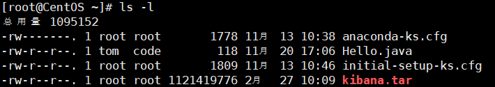

## 权限说明

**0-9位说明**

- **第0位：** 确定文件类型，【`d`，`-`，`l`，`c`，`b`】
	- `-`：普通文件
	- `l`：链接，相当于Windows的快捷方式
	- `d`：目录，相当于Windows的文件夹
	- `c`：字符设备文件，鼠标、键盘
	- `b`：设备，比如硬盘
- **第1-3位：** 所有者（该文件的所有者）拥有该文件的权限。---User
-  **第4-6位：** 所属组（同用户组）拥有该文件的权限。---Group
- **第7-9位：** 其他用户拥有该文件的权限。---Other

> **Linux三种文件类型**
> - 普通文件： 包括文本文件、数据文件、可执行的二进制程序文件等。
> - 目录文件： Linux系统把目录看成是一种特殊的文件，利用它构成文件系统的树型结构。 
> - 设备文件： Linux系统把每一个设备都看成是一个文件


**rxw作用到文件**
- `r`：**可读（read）**，可以读取、查看
- `w`：**可写（write）**，可以修改，但不能删除，删除需要当前目录的可写权限
- `x`：**可执行（execute）**，可以被执行

**rxw作用到目录**
- `r`：**可读（read）**，可以读取，通过ls查看目录内容
- `w`：**可写（write）**，可以修改，在目录内 创建（目录或文件）、删除、重命名目录
- `x`：**可执行（execute）**，可以进入该目录


## 修改权限
通过 chmod 命令，修改文件或目录的权限

> u：所有者；g：所有组；o：其他人；a：所有人（u、g、o的总和）


**使用 `+`、`-` 、`=` 变更权限**

```bash
chmod  u=rwx,g=rx,o=x  文件/目录名
chmod  o+w  文件/目录名
chmod  a-x  文件/目录名
```

**使用数字变更权限**
> - r = 4
> - w = 2
> - x = 1
> - r + w = 6
> - r + x = 5
> - w + x = 3
> - r + w + x = 7

```bash
chmod  u=rwx,g=rx,o=x  文件/目录名
#    ↑↑↑
#   相当于
#    ↓↓↓
chmod 751 文件/目录名
```


## 修改文件所有者
```bash
# 改变所有者
chown newowner 文件/目录

# 改变所有者和所在组
chown newowner:newgroup 文件/目录
```

- `-R`：如果是目录，使其下所有子文件和目录递归生效

例如：
```bash
chown tom /home/abc.txt

chown -R tom /home/test
```
## 修改文件所在组
```bash
chgrp newgroup 文件/目录
```
- `-R`：如果是目录，使其下所有子文件和目录递归生效

例如：
```bash
chgrp testgroup /home/abc.txt

chgrp -R testgroup /home/test
```