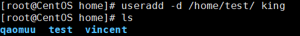
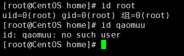
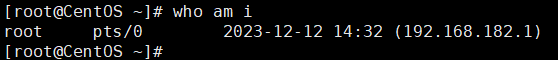
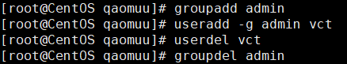
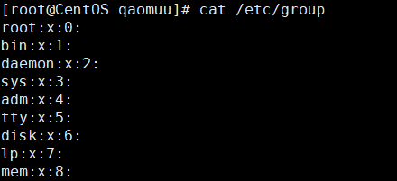

## 关机&重启命令

- shutdown -h now：立刻关机
- shutdown -h 1：1分钟后关机
- shutdown -r now：立刻重启
- halt：立刻关机(作用和上面一样)
- reboot：立刻重启(作用和上面一样)
- sync：把内存的数据同步到磁盘


> 建议关机或重启前执行 `sync` 命令，把内存中的数据写入磁盘，目前 `shutdown`、`reboot`、`halt` 等命令会在执行前进行 `sync` ，建议还是手动执行一次


## 用户登录注销

登录时尽量少用root账户，防止误操作。可以使用普通用户登录，有需要时再使用 `su - 用户名` 来切换系统管理员身份。

使用 `logout` 即可注销账户。
> `logout`命令在图形界面下使用无效，在运行级别3有效

## 用户管理

Linux系统是一个多用户多任务的操作系统。

### 添加用户

```bash
useradd 用户名

# useradd qaomuu
```

当创建一个用户后，`/home` 目录下会多一个以用户名创建的目录。

也可以指定目录：
 ```bash
 useradd -d 指定目录 用户名
# useradd -d /home/test/ king
 ```


### 设置密码

给当前用户设置密码：
```bash
passwd
```

给指定用户设置密码：
```bash
passwd 用户名
```

### 删除用户

删除用户，但不会删除 `/home` 目录中的用户目录：
```bash
userdel 用户名
```


删除用户，并删除 `/home` 目录中的用户目录：
```bash
userdel -r 用户名
```

### 查询用户信息
```bash
id 用户名
```


### 切换用户
在Linux中，如果当前用户的权限不够，可以通过 `su -` 指令切换到高权限的用户，例如 root 用户
```bash
su - 用户名
```

从权限高切换到权限低的用户时，不需要输入密码，需要返回原来的用户时：
```bash
exit
# 或者
logout
```

### 查询当前登录用户

```bash
who am i
```



## 用户组
类似角色，系统可以对又共性/权限的多个用户进行统一管理

### 新增组
```bash
groupadd 组名
```

### 删除组
```bash
groupdel 组名
```

### 新增用户时指定组
```bash
useradd -g 用户组 用户名
```
> 如果没有指定组，系统会默认创建一个以用户名创建的用户组，并将该用户加入该用户组中。



### 修改用户的组
```bash
usermod -g 用户组 用户名
```

## 用户和组相关的文件
-  `/etc/passwd` 文件
> 用户(user)的配置文件，记录用户的各种信息
> 每行的含义：
> `用户名:口令:用户标识符号:组标识符号:注释性描述:主目录:登录shell`


- `/etc/shadow` 文件
> 口令的配置文件
> 每行的含义：
> `登录名:加密口令:最后一次修改时间:最小时间间隔:最大时间间隔:警告时间:不活动时间:失效时间:标志`


- `/etc/group` 文件
> 组(group)的的配置文件，记录Linux组的信息
> 每行含义：
> `组名:口令:组标识号:组内用户列表`


