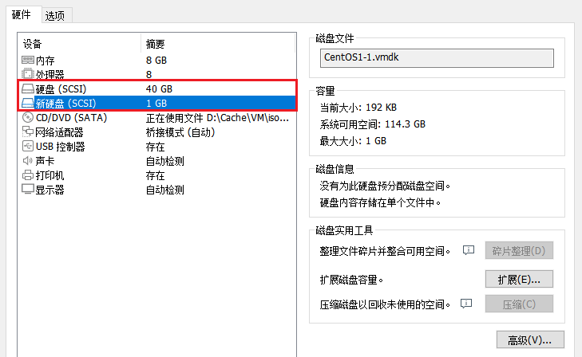
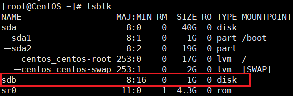
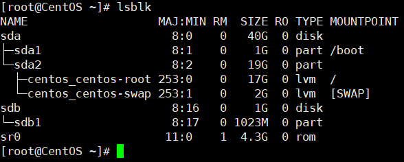
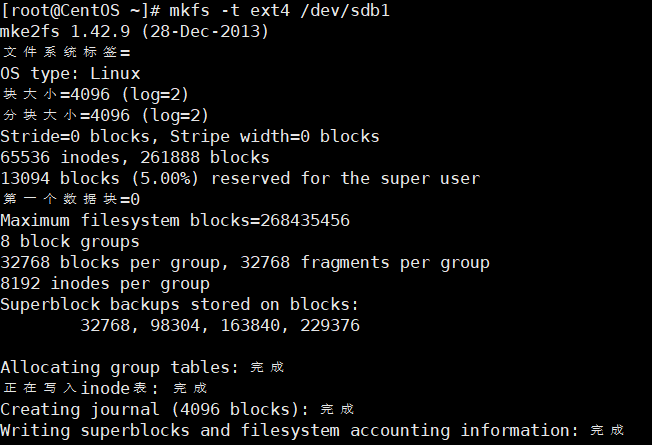
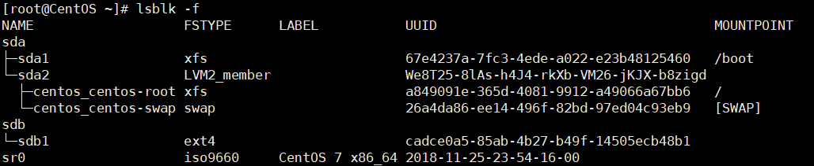
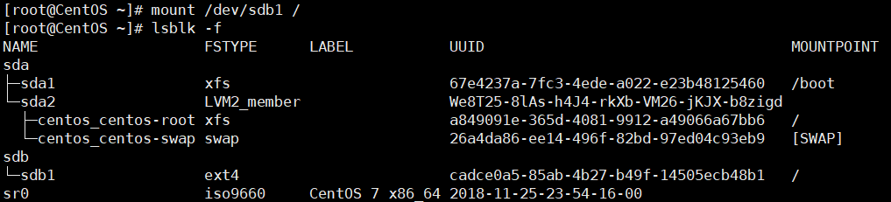
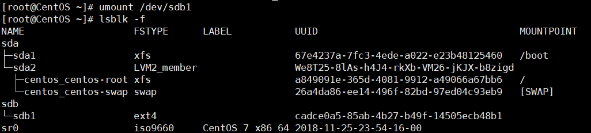
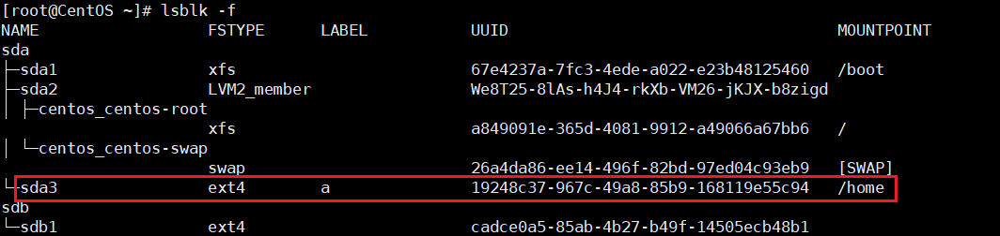
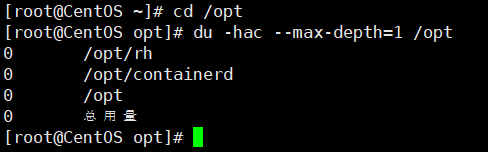
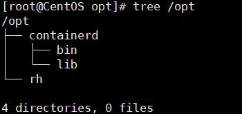

Linux无论有几个分区，分给哪一个目录使用，归根结底都只有一个根目录，独立且唯一的文件结构。
Linux中的每个分区都是用来组成整个文件系统的一部分。

Linux采用了一种“载入”的处理方法：整个文件系统包含了一整套的文件目录，且将一个分区和一个目录关联起来。这时要载入一个分区使它的存储空间在一个目录下获得。

## 硬盘
Linux硬盘分为IDE硬盘和SCSI硬盘，现在基本上都是SCSI硬盘。

对于IDE硬盘，驱动器标识符为 `hdx~`，其中 `hd` 表明分区所在设备的类型，这里是指IDE硬盘，`x` 为盘号（`a`为基本盘，`b`为从属盘，`c`为辅助主盘，`d`为辅助从属盘），`~`代表分区，前面四个分区用数字 1 - 4 表示主分区或扩展分区，从5开始表示逻辑分区。
例如：`hda3` 表示为第一个IDE硬盘上的第三个主分区或扩展分区；`hdb2`表示为第二个IDE硬盘上的第二个主分区或扩展分区。

而SCSI硬盘的标识符为 `sdx~`，SCSI硬盘是用 `sd` 表示分区所在的设备类型，其余和IDE硬盘的表示方法一样。


## 查看设备挂载情况
```bash
lsblk
# 或者
lsblk -f
```


## 为虚拟机增加一块硬盘


重启虚拟机



## 分区命令

```bash
# 操作sdb硬盘
fdisk /dev/sdb
```

- `m`：显示命令列表
- `p`：显示磁盘分区 同 `fdisk -l`
- `n`：新增分区
- `d`：删除分区
- `w`：写入并退出

> 不保存退出输入`q`。




## 格式化磁盘
```bash
mkfs -t ext4 /dev/sdb1
```

> `ext4` 是分区类型




## 挂载分区
将一个分区与一个目录联系起来

```bash
# 挂载
mount 设备名称 挂载目录
# 卸载
umount [设备名称]或者[挂载目录]
```
> 使用命令行挂载，重启后会失效

例如：
```bash
mount /dev/sdb1 /
umount /dev/sdb1
```




## 永久挂载
通过修改 `/etc/fstab` 实现挂载
添加完成后执行 `mount -a` 即刻生效




## 磁盘情况查询
查询系统整体磁盘使用情况：
```bash
df -h
```


查询指定目录的磁盘占用情况：
```bash
# 默认为当前目录
du -h
```

- `-s`：指定目录占用大小汇总
- `-h`：带计量单位
- `-a`：含文件
- `--max-depth=1`：子目录深度
- `-c`：列出明细的同时，增加汇总值

例如：查询 `/opt` 目录的磁盘占用情况，深度为1




## 实用指令

统计 `/opt` 文件夹下文件的个数
```bash
ls -l /opt | grep "^-" | wc -l
```

统计 `/opt` 文件夹下目录的个数
```bash
ls -l /opt | grep "^d" | wc -l
```

统计 `/opt` 文件夹下文件的个数，包括子文件夹中的文件
```bash
ls -lR /opt | grep "^-" | wc -l
```

以树状显示目录结构
```bash
tree /home
```
> 如果没有tree命令，使用 `yum install tree` 安装


