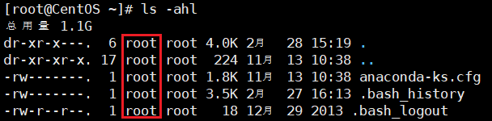
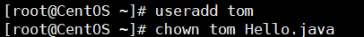

在Linux中的每个用户必须属于一个组，不能独立于组外。在Linux中每个文件有所有者、所在组、其他组的概念。

- **用户：** 用户与账户是同一概念，用于登录系统与区分资源权限，用户让系统变的更安全，同时也保护了用户的个人数字资产。
- **用户组：** 用户组就是将用户分组，隶属用户自动拥有组权限，一个用户可隶属于多个组，用户可任意切换当前组，让用户权限管理变更轻松。

## 文件/目录 所有者
一般为文件的创建者，谁创建该文件，就默认为该文件的所有者。

**查看文件的所有者：** 
```bash
ls -ahl
```



**修改文件的所有者：**
```bash
chown 用户名 文件名
```



## 文件/目录 所在组
当某个用户创建了一个文件后，这个文件的所在组就是该用户的所在组。

**查看文件/目录所在组**
```bash
ls -ahl
```

**修改文件/目录的所在组：**
```bash
chgrp 组名 文件名
```

```bash
[root@CentOS ~]# chgrp code Hello.java 
[root@CentOS ~]# ls -ahl
-rw-r--r--.  1 tom  code  118 11月 20 17:06 Hello.java
```

## 其他组
除文件的所有者和所在组的用户外，系统的其他用户都是文件的其他组。

## 改变用户所在组
在添加用户时，可以指定用户的组。

**改变用户所在组：**
```bash
usermod -g 新组名 用户名

# 改变该用户登录的初始目录（该用户要有该目录的权限）
usermod -d 目录名 用户名
```
