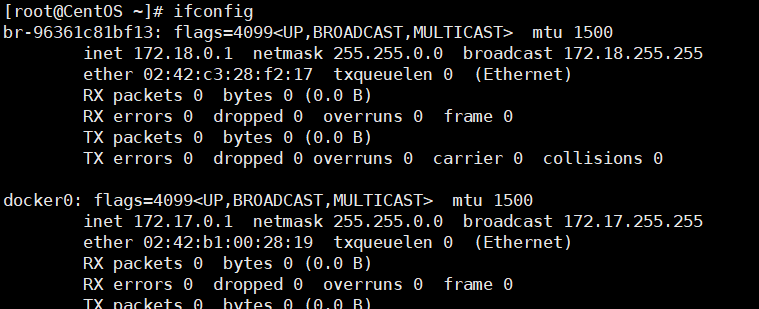
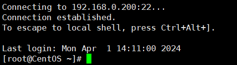
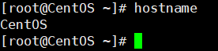
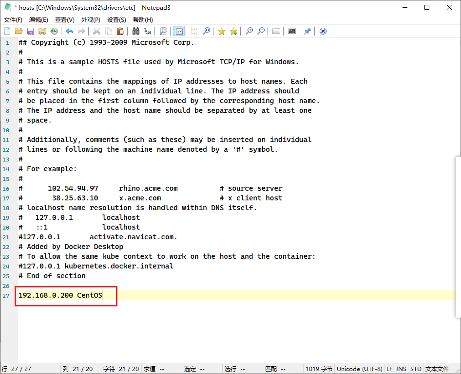
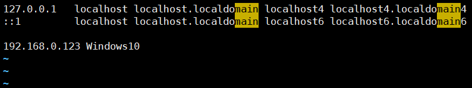
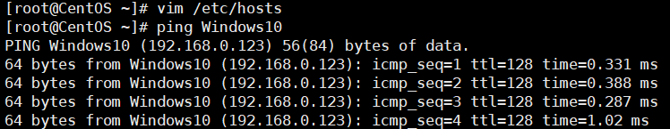

Windows查看网络信息
```bash
ipconfig
```

Linux中查看网络配置：
```bash
ifconfig
```




VMware的网络编辑器：


测试两台主机网络是否连通：
```bash
ping ip地址
```


## 自动获取IP
自动获取IP，可以避免IP冲突，但IP可能会变，使用图形界面：


## 指定IP
通过修改配置文件指定IP，并且可以连接外部网络。

修改配置文件：
```bash
vim /etc/sysconfig/network-scripts/ifcfg-ens33
```


```bash
TYPE=Ethernet
PROXY_METHOD=none
BROWSER_ONLY=no
# dhcp 为自动分配，改成 static 手动分配
# BOOTPROTO=dhcp
BOOTPROTO=static
DEFROUTE=yes
IPV4_FAILURE_FATAL=no
IPV6INIT=yes
IPV6_AUTOCONF=yes
IPV6_DEFROUTE=yes
IPV6_FAILURE_FATAL=no
IPV6_ADDR_GEN_MODE=stable-privacy
NAME=ens33
UUID=3f99505a-56e4-48da-adb4-26ce171ce8b8
DEVICE=ens33
ONBOOT=yes
ZONE=public

# 手动指定ip地址
IPADDR=192.168.0.200
# 网关
GATEWAY=192.168.0.1
# 域名解析器
DNS1=192.168.0.1
```

保存即可。然后修改虚拟网络编辑器：


重启网络服务 或者 重启系统 ：
```bash
# 重启网络
service network restart
# 重启系统
reboot
```

重新连接：


## 设置主机名
可以给Linux系统设置主机名，也可以根据需要修改。
```bash
# 查看主机名
hostname
```

修改 `/etc/hostname` 文件，重启后生效


## 设置hosts映射

可以通过主机名找到某个Linux系统。

Windows：
在 `C:\Windows\System32\drivers\etc\hosts` 文件中指定。




Linux：
在 `/etc/hosts` 文件中指定。






## 主机名解析过程

### Hosts
一个文本文件，用来记录 **IP 和 Hostname(主机名)** 的映射关系。

### DNS
DNS（Domain Name System 域名系统），是互联网上作为域名和IP地址互相映射的一个**分布式数据库**。


### 实例
1. 当用户在浏览器输入域名进行访问时，浏览器先检查浏览器的缓存中有没有该域名解析IP地址。
	- 如果有，则调用这个IP完成解析；
	- 如果没有，就检查DNS解析器缓存，如果有直接返回IP完成解析；
	- 这两个缓存可以理解为本地解析器缓存。
2. 当电脑第一次成功访问该网站后，在一定时间内，浏览器或操作系统会缓存该网站的IP地址（DNS解析记录）。
```bash
# DNS域名解析缓存
ipconfig /displaydns

# 手动清理DNS缓存
ipconfig /flushdns
```
3. 如果本地解析器缓存没有找到对应映射，先检查系统中的hosts文件有没有配置对应的域名IP映射，如果有，则完成解析并返回。
4. 如果本地DNS解析器缓存和hosts文件均没有找到对应的IP，则到域名服务DNS进行解析域。


