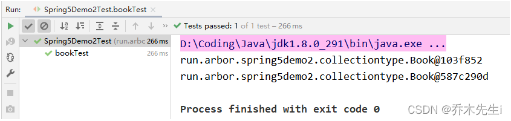

**Bean管理一般指的是两个操作：**

 1. Spring创建对象
 2. Spring注入属性

**Bean管理的两种操作方式：**

 1. 基于XML配置文件方式实现
 2. 基于注解方式实现


**Spring IOC xml配置文件的基本约束**

```xml
<?xml version="1.0" encoding="UTF-8"?>
<beans xmlns="http://www.springframework.org/schema/beans"
	xmlns:xsi="http://www.w3.org/2001/XMLSchema-instance"
	xsi:schemaLocation="http://www.springframework.org/schema/beans 
		http://www.springframework.org/schema/beans/spring-beans.xsd">
    
</beans>
```


## Bean标签
在Spring配置文件中，使用bean标签，标签里面添加对应属性，就可以实现对象的创建。

`<bean>`：用于配置对象，让 spring 来创建。默认情况下调用的是类中的无参构造函数。如果没有无参构造函数则不能创建成功。

- `id`：给对象在容器中提供一个唯一标识，用于获取对象。
- `class`：指定类的全限定类名，用于反射创建对象，**默认情况下调用无参构造函数**。如果不进行配置并且类中没有无参构造方法，则会创建失败。
- `scope`：指定对象的作用范围
	* `singleton`：默认值，单例的，spring加载配置文件的时候，就会创建对象
	* `prototype`：多例的，调用getbean方法时候创建
	* `request`：WEB 项目中，Spring 创建一个 Bean 的对象，将对象存入到 request 域中
	* `session`：WEB 项目中，Spring 创建一个 Bean 的对象，将对象存入到 session 域中
	* `globalsession`：WEB 项目中，应用在 Portlet 环境。如果没有 Portlet 环境那么globalSession 相当于 session
- `init-method`：指定类中的初始化方法名称
- `destroy-method`：指定类中销毁方法名称
- `autowire`：自动装配属性
	* `byName`：根据属性名称注入，需要注入bean的id值要和类中属性的名称一样
	* `byType`：根据属性类型注入，如果同类型的bean有两个或多个则不能使用类型注入


### 实例化 Bean 的三种方式

#### 默认无参构造函数

在默认情况下，会根据默认无参构造函数来创建类对象。如果 bean 中没有默认无参构造函数，将会创建失败。

```xml
<bean id="accountService" class="com.itheima.service.impl.AccountServiceImpl"/>
```

#### 静态工厂创建对象

Spring管理静态工厂

```java
/**
* 模拟一个静态工厂，创建业务层实现类
*/
public class StaticFactory {
	public static IAccountService createAccountService(){
		return new AccountServiceImpl();
	}
}
```

使用 `StaticFactory` 类中的静态方法 `createAccountService` 创建对象，并存入 spring 容器。

- `id`属性：指定 bean 的 id，用于从容器中获取
- `class`属性：指定静态工厂的全限定类名
- `factory-method`属性：指定生产对象的静态方法

```xml
<bean id="accountService" class="run.arbor.factory.StaticFactory" 
      factory-method="createAccountService"></bean>
```

#### 实例工厂创建对象

Spring管理实例工厂

```java
/**
* 模拟一个实例工厂，创建业务层实现类
* 此工厂创建对象，必须现有工厂实例对象，再调用方法
*/
public class InstanceFactory {
    public IAccountService createAccountService(){
    	return new AccountServiceImpl();
	}
}
```

先把工厂的创建交给Spring来管理，然后在使用工厂的 bean 来调用里面的方法。

- `factory-bean`属性：用于指定实例工厂 bean 的 id。
- `factory-method`属性：用于指定实例工厂中创建对象的方法。

```xml
<bean id="instancFactory" class="com.itheima.factory.InstanceFactory"></bean>
<bean id="accountService" factory-bean="instancFactory" 
      factory-method="createAccountService"></bean>
```

## 依赖注入

**DI：依赖注入(Dependency Injection)。** 是 spring 框架核心IOC的具体实现。

在编写程序时，通过控制反转，把对象的创建交给了 spring，但是代码中不可能出现没有依赖的情况。IOC解耦只是降低他们的依赖关系，但不会消除。例如：业务层仍会调用持久层的方法。

这种业务层和持久层的依赖关系，在使用 spring 之后，让 spring 来维护。

简单的说，就是坐等框架把持久层对象传入业务层，而不用自己去获取。

### 构造函数注入

使用类中的构造函数，给成员变量赋值。赋值的操作不是自己做的，而是通过配置的方式，让 spring 框架来注入。使用构造函数的方式，给创建对象时的属性传值，类中需要提供一个对应参数列表的构造函数。

```java
public class Order {

    private String oname;
    private String address;

    public Order(String oname, String address) {
        this.oname = oname;
        this.address = address;
    }
    
    public void testDemo() {
        System.out.println(oname);
        System.out.println(address);
    }
}
```

使用构造函数的方式，给 Order 中的属性传值，类中需要提供一个对应参数列表的构造函数。

#### constructor-arg标签

`constructor-arg`标签的作用是通过构造函数注入参数。
- `index`：指定参数在构造函数参数列表的索引位置
- `type`：指定参数在构造函数中的数据类型
- `name`：指定参数在构造函数中的名称，用这个找给谁赋值

**上面三个都是找给谁赋值，下面两个指的是赋什么值**

- `value`：它能赋的值是基本数据类型和 String 类型
- `ref`：它能赋的值是其他 bean 类型，必须得是在配置文件中配置过的 bean

在XML文件中创建对象，并使用`constructor-arg`标签

```xml
<!-- 使用有参构造注入属性 -->
    <bean id="order" class="run.arbor.spring5demo.Order">
        <!-- 在bean标签中使用 constructor-arg 标签
            name：表示形参名字
            value：表示传入的参数
        -->
        <constructor-arg name="oname" value="手机"/>
        <constructor-arg name="address" value="China"/>
    </bean>
```

### set 方法注入

在类中提供需要注入成员的 set 方法。通过配置文件给 bean 中的属性传值，使用 set 方法的方式。

```java
public class Book {

    // 创建属性
    private String bname;
    private String bauthor;

    // 使用set方法注入
    public void setBname(String bname) {
        this.bname = bname;
    }

    public void setBauthor(String bauthor) {
        this.bauthor = bauthor;
    }

    // 原始注入方式：先new一个对象，在使用set方法
    public static void main(String[] args) {
        Book book = new Book();
        book.setBname("aaa");
    }
}
```

#### property标签

`property`标签的作用是通过setter对应的方法注入。
- `name`：表示类中的属性名称
- `value`：表示要注入属性的值
- `ref`：给属性赋值是其他 bean 类型的

在XML文件中创建对象，并使用`property`标签

```xml
    <!-- 使用set方法注入属性 -->
    <bean id="book" class="run.arbor.spring5demo.Book">
        <!-- 在bean标签中使用 property 标签
            name：表示类中的属性名称
            value：表示要注入属性的值
        -->
        <property name="bname" value="Java核心技术"/>
        <property name="bauthor" value="凯 S. 霍斯特曼"/>
    </bean>
```

#### p名称空间注入

p名称空间注入是通过在 xml 中导入 p 名称空间约束，使用 `p:propertyName`来注入数据，它的本质仍然是调用类中的 set 方法实现注入功能。

需要用到p名称空间约束：
`xmlns:p="http://www.springframework.org/schema/p"`

在XML文件中创建对象，并使用p名称空间：
```xml
<beans xmlns="http://www.springframework.org/schema/beans"
	xmlns:p="http://www.springframework.org/schema/p"
	xmlns:xsi="http://www.w3.org/2001/XMLSchema-instance"
	xsi:schemaLocation=" http://www.springframework.org/schema/beans 
		http://www.springframework.org/schema/beans/spring-beans.xsd">
 
	<bean id="book2" class="run.arbor.spring5demo.Book" 
          p:bname="Java核心技术" p:bauthor="凯 S. 霍斯特曼">
	</bean>
</beans>
```

### 注入空值

在`property`标签中加入`null`标签即可

```xml
    <bean id="book3" class="run.arbor.spring5demo.Book">
        <property name="bname" value="Java核心技术"/>
        <!-- 给bauthor设置空值 -->
        <property name="bauthor">
            <null/>
        </property>
    </bean>
```

### 注入特殊符号

在`property`标签中使用`value`标签，并且使用CDATA的方式来注入参数，`<![CDATA[参数]]> `

```xml
    <bean id="book4" class="run.arbor.spring5demo.Book">
        <property name="bname" value="Java核心技术"/>
        <!-- 给bauthor设置值为<凯 S. 霍斯特曼>
            第一种方式：把<>进行转义， &lt; 和 &gt;
            第二种方式：使用CDATA方式，<![CDATA[参数]]>
         -->
        <property name="bauthor">
            <value><![CDATA[<凯 S. 霍斯特曼>]]></value>
        </property>
    </bean>
```

### 注入外部bean(其他类)

在实际的应用中，会出现属性是一个对象的情况，这个时候可以使用`ref`属性来配置。

Service层：

```java
public class UserService {
    // 创建UserDao属性，生成set方法
    private UserDao userDao;
    public void setUserDao(UserDao userDao) {
        this.userDao = userDao;
    }

    public void add() {
        System.out.println("service add()...");
        // 使用spring方式创建对象并使用
        userDao.update();
    }
}
```

Dao层：

```java
// dao层接口
public interface UserDao {
    void update();
}

// dao层实现类
class UserDaoImpl implements UserDao {
    @Override
    public void update() {
        System.out.println("dao update()...");
    }
}
```

使用`ref`属性注入dao：

```xml
<?xml version="1.0" encoding="UTF-8"?>
<beans xmlns="http://www.springframework.org/schema/beans"
       xmlns:xsi="http://www.w3.org/2001/XMLSchema-instance"
       xsi:schemaLocation="http://www.springframework.org/schema/beans http://www.springframework.org/schema/beans/spring-beans.xsd">

    <!-- 1. 创建service和dao对象 -->
    <bean id="userService" class="run.arbor.spring5demo.service.UserService">
        <!-- 2. 注入dao——userDao的对象 -->
        <!--
            name：类里面的属性名称，这里对应的是  private UserDao userDao; 的值
            ref：bean对象的id值，这里对应的是  <bean id="userDaoImpl".... 的值
        -->
        <property name="userDao" ref="userDaoImpl"/>
    </bean>

    <bean id="userDaoImpl" class="run.arbor.spring5demo.dao.impl.UserDaoImpl"/>
</beans>
```

### 注入内部bean和级联赋值

首先定义两个实体类：

```java
/**
 * 部门类
 */
public class Dept {
    private String dname;
    public void setDname(String dname) {
        this.dname = dname;
    }
}
```

```java
/**
 * 员工类
 */
public class Emp {
    private String ename;
    private String gender;
    // 员工属于某一个部门，使用对象形式
    private Dept dept;
    public void setEname(String ename) {
        this.ename = ename;
    }
    public void setGender(String gender) {
        this.gender = gender;
    }
    public void setDept(Dept dept) {
        this.dept = dept;
    }
    
    // 这个get方法在下面的第三种bean创建的方式中需要用到，没有该get方法，第三种方式将无法正常生成bean
    public Dept getDept() {
        return dept;
    }
}
```

#### 内部bean+级联赋值

```xml
<?xml version="1.0" encoding="UTF-8"?>
<beans xmlns="http://www.springframework.org/schema/beans"
       xmlns:xsi="http://www.w3.org/2001/XMLSchema-instance"
       xsi:schemaLocation="http://www.springframework.org/schema/beans http://www.springframework.org/schema/beans/spring-beans.xsd">

    <!-- 内部bean -->
    <!-- 1. 创建员工的对象 -->
    <bean id="emp" class="run.arbor.spring5demo.bean.Emp">
        <!-- 2. 设置基本属性 -->
        <property name="ename" value="乔木先生"/>
        <property name="gender" value="男"/>
        <!-- 3. 设置对象类型的属性 -->
        <property name="dept">
            <!-- 4. 内部<bean>：在<property>标签中创建对象 -->
            <!-- id="dept"：可以省略 -->
            <bean id="dept" class="run.arbor.spring5demo.bean.Dept">
              	<!-- 级联赋值，同时把dept中的属性赋值 -->
                <property name="dname" value="财务部"/>
            </bean>
        </property>
    </bean>
</beans>
```

#### 外部bean+级联赋值

```xml
<?xml version="1.0" encoding="UTF-8"?>
<beans xmlns="http://www.springframework.org/schema/beans"
       xmlns:xsi="http://www.w3.org/2001/XMLSchema-instance"
       xsi:schemaLocation="http://www.springframework.org/schema/beans http://www.springframework.org/schema/beans/spring-beans.xsd">

    <!-- 内部bean -->
    <!-- 1. 创建员工的对象 -->
    <bean id="emp" class="run.arbor.spring5demo.bean.Emp">
        <!-- 2. 设置基本属性 -->
        <property name="ename" value="乔木先生"/>
        <property name="gender" value="男"/>
        <!-- 3. 设置对象类型的属性 -->
        <!-- 这里可以获取到 <bean id="dept"... 中的 <property name="dname"... 的值-->
        <property name="dept" ref="dept"/>
    </bean>

    <!-- 4. 外部bean -->
    <bean id="dept" class="run.arbor.spring5demo.bean.Dept">
        <!-- 这里赋值后，被其他bean使用，可以直接赋值 -->
        <property name="dname" value="业务部"/>
    </bean>

</beans>
```

#### 外部bean+级联赋值+单独赋值

```xml
<?xml version="1.0" encoding="UTF-8"?>
<beans xmlns="http://www.springframework.org/schema/beans"
       xmlns:xsi="http://www.w3.org/2001/XMLSchema-instance"
       xsi:schemaLocation="http://www.springframework.org/schema/beans http://www.springframework.org/schema/beans/spring-beans.xsd">

    <!-- 内部bean -->
    <!-- 1. 创建员工的对象 -->
    <bean id="emp" class="run.arbor.spring5demo.bean.Emp">
        <!-- 2. 设置基本属性 -->
        <property name="ename" value="乔木先生"/>
        <property name="gender" value="男"/>
        <!-- 3. 设置对象类型的属性 -->
        <!-- 这里可以获取到 <bean id="dept"... 中的 <property name="dname"... 的值-->
        <property name="dept" ref="dept"/>
        <!-- 通过这种方式可以单独设置dept的某一个属性的值
                应用场景：比如有很多员工都是业务部的，只有个别的员工是技术部的
                         可以使用此方法进行简化配置，无需创建两个dept类的bean
                使用该方式时，该属性必须有get方法，先通过“<property name="dept" ref="dept"/>”
                获取到dept的对象，然后进行赋值
         -->
        <property name="dept.dname" value="技术部"/>
    </bean>

    <!-- 4. 外部bean -->
    <bean id="dept" class="run.arbor.spring5demo.bean.Dept">
        <!-- 这里赋值后，被其他bean使用，可以直接赋值 -->
        <property name="dname" value="业务部"/>
    </bean>

</beans>
```

### 注入集合属性

给类中的集合成员传值，它用的也是 set 方法注入的方式，只不过变量的数据类型都是集合。

注入集合数据

- List 结构的：array，list，set
- Map 结构的：map，entry，props，prop

实体类：

```java
public class Stu {
    // 数组类型的属性
    private String[] courses;

    // List集合类型属性
    private List<String> list;

    // Map集合类型属性
    private Map<String, String> map;

    // Set集合类型属性
    private Set<String> set;

    // Properties类型注入
    private Properties props;

    public void setCourses(String[] courses) {
        this.courses = courses;
    }

    public void setList(List<String> list) {
        this.list = list;
    }

    public void setMap(Map<String, String> map) {
        this.map = map;
    }

    public void setSet(Set<String> set) {
        this.set = set;
    }

    public void setProps(Properties props) {
        this.props = props;
    }
}
```

数组一般使用`array`标签，List集合使用`list`标签，Set集合使用`set`标签，因为本质相同，所以这三个标签可以随意使用，建议使用对应的标签，提高阅读质量

而以key和value形式的集合，可以使用`map`标签或者`props`标签，但是子标签必须对应

```xml
<?xml version="1.0" encoding="UTF-8"?>
<beans xmlns="http://www.springframework.org/schema/beans"
       xmlns:xsi="http://www.w3.org/2001/XMLSchema-instance"
       xsi:schemaLocation="http://www.springframework.org/schema/beans http://www.springframework.org/schema/beans/spring-beans.xsd">

    <bean id="stu" class="run.arbor.spring5demo2.collectiontype.Stu">
        <!-- 数组类型注入 -->
        <property name="courses">
            <!--
                这里也可以使用 list标签和set标签，
                因为数组和这两个集合结构相同，标签可以互换
            -->
            <array>
                <value>语文课</value>
                <value>数学课</value>
                <value>英语课</value>
            </array>
        </property>

        <!-- list类型注入 -->
        <property name="list">
            <list> <!-- 可以使用array标签和set标签 -->
                <value>小明</value>
                <value>张三</value>
            </list>
        </property>

        <!-- set类型注入 -->
        <property name="set">
            <set>
                <value>语文90分</value>
                <value>数学80分</value>
                <value>英语86分</value>
            </set>
        </property>

        <!-- map类型注入 -->
        <property name="map">
            <map> <!-- 这里也可以使用 props 标签 -->
                <entry key="java" value="JAVA"/>
                <entry key="c++" value="C++"/>
                <entry key="python">
                    <value>python</value>
                </entry>
            </map>
        </property>

        <!-- Properties类型注入 -->
        <property name="props">
            <props> <!-- 这里也可以使用 map 标签 -->
                <prop key="语文">
                    90分
                </prop>
                <prop key="数学">80分</prop>
            </props>
        </property>
    </bean>
</beans>
```

#### 扩展：集合中注入对象

两个实体类：

```java
class Course {
    private String cname;
    public void setCname(String cname) {
        this.cname = cname;
    }
}

public class Stu {
    // 学生的多个课程
    private List<Course> courseList;
    public void setCourseList(List<Course> courseList) {
        this.courseList = courseList;
	}
}
```

可以将多个对象注入到集合中
```xml
<?xml version="1.0" encoding="UTF-8"?>
<beans xmlns="http://www.springframework.org/schema/beans"
       xmlns:xsi="http://www.w3.org/2001/XMLSchema-instance"
       xsi:schemaLocation="http://www.springframework.org/schema/beans http://www.springframework.org/schema/beans/spring-beans.xsd">

    <bean id="stu" class="run.arbor.spring5demo2.collectiontype.Stu">
        <!-- 注入集合类型，值是对象 -->
        <property name="courseList">
            <list>
                <ref bean="course01"/>
                <ref bean="course02"/>
            </list>
        </property>
    </bean>

    <!-- 创建多个 Course 对象 -->
    <bean id="course01" class="run.arbor.spring5demo2.collectiontype.Course">
        <property name="cname" value="大学英语"/>
    </bean>
    <bean id="course02" class="run.arbor.spring5demo2.collectiontype.Course">
        <property name="cname" value="大学数学"/>
    </bean>

</beans>
```

#### 扩展：提取集合对象

实体类：

```java
public class Book {
    private List<String> list;

    public void setList(List<String> list) {
        this.list = list;
    }
    public List<String> getList() {
        return list;
    }
}
```

可以在xml文件约束中引入util名称空间，使用`<util:list>`标签将list提取出来

xml文件：
```xml
<?xml version="1.0" encoding="UTF-8"?>
<beans xmlns="http://www.springframework.org/schema/beans"
       xmlns:xsi="http://www.w3.org/2001/XMLSchema-instance"
       xmlns:util="http://www.springframework.org/schema/util"
       xsi:schemaLocation="http://www.springframework.org/schema/beans http://www.springframework.org/schema/beans/spring-beans.xsd
                           http://www.springframework.org/schema/util http://www.springframework.org/schema/util/spring-util.xsd">

    <!-- 将集合注入部分提取出来 -->
    <!-- 1. 需要在配置文件中引入名称空间 util
     xmlns:util="http://www.springframework.org/schema/util"
     http://www.springframework.org/schema/util http://www.springframework.org/schema/util/spring-util.xsd
     -->

    <!-- 2. 使用util标签完成list集合注入提取 -->
    <util:list id="bookList">
        <!-- 如果list里面是基本数据类型或者字符串的话使用value -->
        <value>语文书</value>
        <value>数学书</value>
        <value>英语书</value>

        <!-- 如果是对象可以使用ref标签，用法一样的 -->
        <!-- <ref></ref> -->
    </util:list>

    <!-- 3. 使用提取的list集合 -->
    <bean id="book001" class="run.arbor.spring5demo2.collectiontype.Book">
        <!-- 直接使用ref标签引入即可 -->
        <property name="list" ref="bookList"/>
    </bean>

</beans>
```

## Bean管理

Spring有两种类型Bean，一种是普通的Bean，另一种是工厂Bean(Factory Bean)

- **普通Bean：** 在配置文件中定义bean类型就是返回类型，就是上面定义的bean
- **工厂Bean：** 在配置文件中定义bean类型可以和返回类型不一样
	* 创建一个要作为工厂bean的类，实现接口`FactoryBean`，实现里面的方法，在实现的方法中定义返回的bean的类型

### 普通bean

实体类：

```java
public class MyBean {
}
```

xml文件：

```xml
<?xml version="1.0" encoding="UTF-8"?>
<beans xmlns="http://www.springframework.org/schema/beans"
       xmlns:xsi="http://www.w3.org/2001/XMLSchema-instance"
       xsi:schemaLocation="http://www.springframework.org/schema/beans http://www.springframework.org/schema/beans/spring-beans.xsd">

    <!-- 普通bean -->
    <bean id="myBean" class="run.arbor.spring5demo2.factorybean.MyBean">
    </bean>

</beans>
```

### 工厂Bean

实体类：

```java
public class MyBean implements FactoryBean<Course>{

    // 定义返回的bean，这里一般使用反射
    @Override
    public Course getObject() throws Exception {
        Course course = new Course();
        course.setCname("abc");
        return course;
    }

    @Override
    public Class<?> getObjectType() {
        return null;
    }

    @Override
    public boolean isSingleton() {
        return FactoryBean.super.isSingleton();
    }
}
```

xml文件：

```xml
<?xml version="1.0" encoding="UTF-8"?>
<beans xmlns="http://www.springframework.org/schema/beans"
       xmlns:xsi="http://www.w3.org/2001/XMLSchema-instance"
       xsi:schemaLocation="http://www.springframework.org/schema/beans http://www.springframework.org/schema/beans/spring-beans.xsd">

    <bean id="myBean" class="run.arbor.spring5demo2.factorybean.MyBean">
    </bean>
</beans>
```

bean的类型是`MyBean`，可以使用`Course`接收
测试方法：

```java
    @Test
    public void test01() {
        ApplicationContext context = new ClassPathXmlApplicationContext("bean2_3.xml");
        Course myBean = context.getBean("myBean", Course.class);
        System.out.println(myBean);
    }
```

## Bean的作用范围

在默认情况下是单例对象，两个对象的引用都是同一个

xml文件：

```xml
<?xml version="1.0" encoding="UTF-8"?>
<beans xmlns="http://www.springframework.org/schema/beans"
       xmlns:xsi="http://www.w3.org/2001/XMLSchema-instance"
       xsi:schemaLocation="http://www.springframework.org/schema/beans http://www.springframework.org/schema/beans/spring-beans.xsd">
       
    <bean id="book001" class="run.arbor.spring5demo2.collectiontype.Book">
    </bean>

</beans>
```

这里代码获取的bean的id都是同一个，Spring默认是单例对象

```java
    @Test
    public void bookTest() {
        ApplicationContext context = new ClassPathXmlApplicationContext("bean2_2.xml");
        Book book = context.getBean("book001", Book.class);
        Book book2 = context.getBean("book001", Book.class);
        System.out.println(book);
        System.out.println(book2);
    }
```

输出的地址值是一样的


可以通过在bean标签中设置多实例对象`scope="prototype"`
默认是单例对象`scope="singleton"`，默认情况下可以不写

xml文件：

```xml
<?xml version="1.0" encoding="UTF-8"?>
<beans xmlns="http://www.springframework.org/schema/beans"
       xmlns:xsi="http://www.w3.org/2001/XMLSchema-instance"
       xsi:schemaLocation="http://www.springframework.org/schema/beans http://www.springframework.org/schema/beans/spring-beans.xsd">
       
    <bean id="book001" class="run.arbor.spring5demo2.collectiontype.Book" scope="prototype">
    </bean>
</beans>
```

此时输出的地址值就是不一样的，证明是两个不同的对象



## Bean的生命周期

这里的生命周期指的是**对象的创建到对象销毁的过程**

### 普通bean

1. 通过构造器创建bean实例(无参构造)
2. 为bean的属性设置值(调用set方法)
3. 调用为bean的初始化的方法(需要额外进行配置)
4. 使用bean
5. 当容器关闭的时候，调用bean的校会的方法(需要额外进行配置)

```java
public class Orders {
    private String oname;

    public Orders() {
        System.out.println("执行了无参构造");
    }

    public void setOname(String oname) {
        this.oname = oname;
        System.out.println("调用set方法，设置属性的值");
    }

    // 创建初始化的方法，方法名随便写，也可以不配置
    public void initOrders() {
        System.out.println("执行初始化方法");
    }

    // 创建销毁的方法，方法名随便写，也可以不配置
    public void destroyOrders() {
        System.out.println("执行销毁方法");
    }
}
```

bean标签中执行初始化方法和销毁方法

xml文件：

```xml
<?xml version="1.0" encoding="UTF-8"?>
<beans xmlns="http://www.springframework.org/schema/beans"
       xmlns:xsi="http://www.w3.org/2001/XMLSchema-instance"
       xsi:schemaLocation="http://www.springframework.org/schema/beans http://www.springframework.org/schema/beans/spring-beans.xsd">

    <!-- 普通bean -->
    <bean id="orders" class="run.arbor.spring5demo3.Orders" init-method="initOrders" destroy-method="destroyOrders">
        <property name="oname" value="手机"/>
    </bean>
</beans>
```

测试方法：

```java
    @Test
    public void collectionTest(){
//        ApplicationContext context = new ClassPathXmlApplicationContext("bean3_1.xml");
        ClassPathXmlApplicationContext context = new ClassPathXmlApplicationContext("bean3_1.xml");
        Orders orders = context.getBean("orders", Orders.class);
        System.out.println("获取bean的实例");
        System.out.println(orders);

        // 手动销毁bean的实例
        context.close();
    }
```

这个时候执行测试方法，可以看到一个普通bean的从创建到销毁的过程


### 后置处理器

后置处理器需要实现接口`BeanPostProcessor`创建后置处理器，第三步执行的是后置处理器中的`postProcessBeforeInitialization`方法，第五步执行的是后置处理器中的`postProcessAfterInitialization`方法

1. 通过构造器创建bean实例(无参构造)
2. 为bean的属性设置值(调用set方法)
3. **将bean的实例传递给bean的后置处理器的方法**
4. 调用为bean的初始化的方法(需要额外进行配置)
5. **将bean的实例传递给bean的后置处理器的方法**
6. 使用bean
7. 当容器关闭的时候，调用bean的校会的方法(需要额外进行配置)

增加一个后置处理器的实现类：

```java
public class MyBeanPost implements BeanPostProcessor {
    @Override
    public Object postProcessBeforeInitialization(Object bean, String beanName) throws BeansException {
        System.out.println("Before方法执行了");
        return bean;
    }

    @Override
    public Object postProcessAfterInitialization(Object bean, String beanName) throws BeansException {
        System.out.println("After方法执行了");
        return bean;
    }
}
```

此时的xml文件应该加上后置处理器的配置：

```xml
<?xml version="1.0" encoding="UTF-8"?>
<beans xmlns="http://www.springframework.org/schema/beans"
       xmlns:xsi="http://www.w3.org/2001/XMLSchema-instance"
       xsi:schemaLocation="http://www.springframework.org/schema/beans http://www.springframework.org/schema/beans/spring-beans.xsd">

    <!-- 普通bean -->
    <bean id="orders" class="run.arbor.spring5demo3.Orders" init-method="initOrders" destroy-method="destroyOrders">
        <property name="oname" value="手机"/>
    </bean>

    <!--配置后置处理器-->
    <bean id="myBeanPost" class="run.arbor.spring5demo3.MyBeanPost"/>
</beans>
```

这个时候执行测试方法可以看到


## XML自动装配

根据指定的装配规则(属性名称或属性类型)，Spring自动将匹配的属性值进行注入。

**两种方式：**
- 根据属性名称装配
- 根据属性类型装配

使用`bean`标签中的`autowire`属性进行自动注入

**`autowire`属性有两个常用的值：**
- `byName`：根据属性名称注入，需要注入bean的id值要和类中属性的名称一样
- `byType`：根据属性类型注入，如果同类型的bean有两个或多个则不能使用类型注入

首先定义两个实体类：

```java
public class Emp {
    private Dept dept001;
    public void setDept001(Dept dept001) {
        this.dept001 = dept001;
    }
}

class Dept {
}
```

XML文件：
```xml
<?xml version="1.0" encoding="UTF-8"?>
<beans xmlns="http://www.springframework.org/schema/beans"
       xmlns:xsi="http://www.w3.org/2001/XMLSchema-instance"
       xsi:schemaLocation="http://www.springframework.org/schema/beans http://www.springframework.org/schema/beans/spring-beans.xsd">

    <!-- 自动装配
        bean标签中的标签属性autowire，用于配置自动装配
        autowire属性有两个常用的值：
            byName：根据属性名称注入，需要注入bean的id值要和类中属性的名称一样
            byType：根据属性类型注入
    -->
    <bean id="emp001" class="run.arbor.spring5demo3.Emp" autowire="byName">
        <!--<property name="dept" ref="dept001"/>-->
    </bean>

    <!-- 如果使用byType，但是有两个bean就会报错，需要使用byName的方式 -->
<!--    <bean id="emp001" class="run.arbor.spring5demo3.Emp" autowire="byType"/>-->

    <bean id="dept001" class="run.arbor.spring5demo3.Dept"/>
    <bean id="dept002" class="run.arbor.spring5demo3.Dept"/>

</beans>
```

## 外部属性文件

举例：引入外部属性文件配置数据库连接池

创建一个`properties`文件，文件名为：`jdbc.properties`

```shell
prop.driverClass=com.mysql.jdbc.Driver
prop.url=jdbc:mysql://localhost:3306/study
prop.username=root
prop.password=arbor123
```

把外部的`jdbc.properties`属性文件引入到Spring的配置文件中

需要引入名称空间`context`

```xml
<?xml version="1.0" encoding="UTF-8"?>
<beans xmlns="http://www.springframework.org/schema/beans"
       xmlns:xsi="http://www.w3.org/2001/XMLSchema-instance"
       xmlns:context="http://www.springframework.org/schema/context"
       xsi:schemaLocation="http://www.springframework.org/schema/beans http://www.springframework.org/schema/beans/spring-beans.xsd
                            http://www.springframework.org/schema/context http://www.springframework.org/schema/context/spring-context.xsd">

</beans>
```

使用`context:property-placeholder`标签引入外部属性文件

使用`${}`表达式引入文件中的属性

```xml
<?xml version="1.0" encoding="UTF-8"?>
<beans xmlns="http://www.springframework.org/schema/beans"
       xmlns:xsi="http://www.w3.org/2001/XMLSchema-instance"
       xmlns:context="http://www.springframework.org/schema/context"
       xsi:schemaLocation="http://www.springframework.org/schema/beans http://www.springframework.org/schema/beans/spring-beans.xsd
                            http://www.springframework.org/schema/context http://www.springframework.org/schema/context/spring-context.xsd">

    <!-- 原始方式：配置连接池 -->
<!--    <bean id="dataSource" class="com.alibaba.druid.pool.DruidDataSource">-->
        <!-- set方法注入 -->
<!--        <property name="driverClassName" value="com.mysql.jdbc.Driver"/>-->
<!--        <property name="url" value="jdbc:mysql://localhost:3306/study"/>-->
<!--        <property name="username" value="root"/>-->
<!--        <property name="password" value="arbor123"/>-->
<!--    </bean>-->

    <!-- 引入外部属性文件 -->
    <context:property-placeholder location="classpath:jdbc.properties"/>

    <!-- 外部属性：配置连接池 -->
    <bean id="dataSource" class="com.alibaba.druid.pool.DruidDataSource">
        <!-- 使用 ${} 引入属性文件中的属性，{}中的内容就是属性文件中 = 左边的内容 -->
        <property name="driverClassName" value="${prop.driverClass}"/>
        <property name="url" value="${prop.url}"/>
        <property name="username" value="${prop.username}"/>
        <property name="password" value="${prop.password}"/>
    </bean>

</beans>
```
