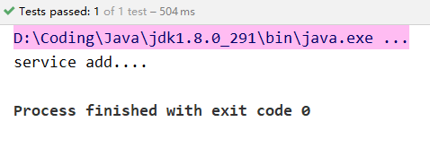

**注解：** 是代码特殊标记，可以作用在类、方法、属性上，使用注解可以简化xml配置
**格式：**`@注解名称(属性名称 =属性值,  属性名称 =属性值....)`

使用注解方式管理Bean需要引入相关依赖

## 用于创建对象的注解

相当于xml文件中的`<bean id="" class="">`

| 注解          | 描述                                                         |
| :------------ | :----------------------------------------------------------- |
| `@Component`  | **作用：** 把资源让 spring 来管理。相当于在 xml 中配置一个 bean。<br/>**属性：**`value`：指定 bean 的 id。如果不指定 value 属性，默认 bean 的 id 是==当前类首字母小写的类名==。 |
| `@Controller` | 一般用于表现层的注解，作用与属性和@Component相同             |
| `@Service`    | 一般用于业务层的注解，作用与属性和@Component相同             |
| `@Repository` | 一般用于持久层的注解，作用与属性和@Component相同             |

>  **上面四个注解功能是一样的，都可以用来创建bean的实例**
>  如果注解中有且只有一个属性要赋值时，且名称是 value，则 value 在赋值是可以不写。

### 快速入门
使用注解需要先开启**组件扫描**，需要用到spring中`xmlns:context`的约束

```xml
<beans xmlns="http://www.springframework.org/schema/beans"
       xmlns:xsi="http://www.w3.org/2001/XMLSchema-instance"
       xmlns:context="http://www.springframework.org/schema/context"
       xsi:schemaLocation=" http://www.springframework.org/schema/beans http://www.springframework.org/schema/beans/spring-beans.xsd
       http://www.springframework.org/schema/context http://www.springframework.org/schema/context/spring-context.xsd">

    <!-- 
    开启组件扫描
	base-package="run.arbor.spring5demo4"：配置需要扫描的包		
	 -->
    <context:component-scan base-package="run.arbor.spring5demo4"/>
</beans>
```

开启组件扫描后，创建类，并且在类上添加创建对象的注解

```java
@Component(value = "userService")
public class UserService {
    public void add() {
        System.out.println("service add....");
    }
}
```

这里的`@Component(value = "userService")`相当于xml形式的

```xml
<bean id="userService" class="..."/>
```

而`value`属性可以省略不写，不写的话默认设置id为==首字母小写的当前类名==，比如`UserService`则默认为`userService`。

`@Component`也可以变更为其他三个注解，因为效果是一样的，四种不同的注解可以做区分效果，比如Service层的类可以使用`@Service`注解，Dao层的类可已使用`@Repository`注解

```java
@Test
public void testService() {
    ApplicationContext context = new ClassPathXmlApplicationContext("bean4_1.xml");
    UserService userService = context.getBean("userService", UserService.class);
    userService.add();
}
```

通过上面的测试方法可以得到以下结果，说明注解方式使用成功



### `context:component-scan`标签

#### 设置扫描的包

开启组件扫描设置扫描的包有**两种方法**：

1. 如果需要扫描多个包，可以使用逗号隔开

这里扫描的就是`run.arbor.spring5demo4`中的dao包和service包

```xml
<context:component-scan base-package="run.arbor.spring5demo4.dao,run.arbor.spring5demo4.service"/>
```

2. 需要扫描包的上层目录

这里扫描的就是`run.arbor.spring5demo4`中的类和所有子包中的类

```xml
<context:component-scan base-package="run.arbor.spring5demo4"/>
```

#### 设置扫描的内容

如果想扫描`run.arbor.spring5demo4`包中所有带`@Controller`的类，不想扫描带`@Service`或者其他两个注解的类，可以使用filter来完成相关功能

- `use-default-filters="false"`：不使用默认的filter，自定义filter
- `<context:include-filter>`：设置扫描哪些内容
	* `type="annotation" `：扫描注解
	* `expression="org.springframework.stereotype.Controller"`：扫描使用**Controller**注解的类

```xml
<!-- 不使用默认的过滤器，只扫描run.arbor.spring5demo4包中带有@Controller的类 -->
<context:component-scan base-package="run.arbor.spring5demo4" use-default-filters="false">
	<context:include-filter type="annotation" expression="org.springframework.stereotype.Controller"/>
</context:component-scan>
```

#### 设置不扫描的内容

如果想扫描`run.arbor.spring5demo4`包中所有除了带`@Controller`的类，可以使用`<context:exclude-filter>`标签

- `<context:exclude-filter>`：设置不扫描哪些内容
	* `type="annotation" `：扫描注解
	* `expression="org.springframework.stereotype.Controller"`：不扫描使用**Controller**注解的类

```xml
<!-- 使用默认的过滤器,但是不扫描run.arbor.spring5demo4包中带有@Controller的类 -->
<context:component-scan base-package="run.arbor.spring5demo4" use-default-filters="false">
	<context:exclude-filter type="annotation" expression="org.springframework.stereotype.Controller"/>
</context:component-scan>
```

## 用于注入属性的注解

相当于xml文件的：`<property name="" ref=""> `，`<property name="" value="">`

| 注解 | 描述 |
|:----|:----|
| `@Autowired` | **自动按照类型注入。** 只能注入其他 bean 类型，set 方法可以省略。当有多个类型匹配时，需要使用`@Qualifier`注解来指定 bean 的 id。 |
| `@Qualifier` | **作用：** 在自动按照类型注入的基础之上，再按照 Bean 的 id 注入。它在给字段注入时不能独立使用，必须和 `@Autowired` 一起使用；但是给方法参数注入时，可以独立使用。<br/>**属性：** `value`：指定 bean 的 id。 |
| `@Resource` | **作用：** 直接按照 Bean 的 id 注入。它也只能注入其他 bean 类型。<br/>**属性：** `name`：指定 bean 的 id。 |
| `@Value` | **作用：** 注入基本数据类型和 String 类型数据的属性<br/>**属性：** `value`：用于指定值 |

### 使用`@Autowired`和`@Qualifier`注解

创建dao对象

```java
// value可以自定义对象的名字
@Repository(value = "userDaoImpl")
public class UserDaoImpl implements UserDao{
    @Override
    public void add() {
        System.out.println("dao add...");
    }
}
```

> 如果UserDao有多个实现类的话，必须使用`@Qualifier`来确定注入的是哪个对象，如果只有一个实现类那么写不写 **@Qualifier** 都可以，如果写的话，`value`属性必须和UserDao对象创建时的value值相同，比如：**@Repository(value = "userDaoImpl111")**，那么就必须是 **@Qualifier(value = "userDaoImpl111")** 

```java
@Component(value = "userService")
public class UserService {

    // 使用@Autowired注解，定义UserDao类型的属性，可以不用set方法
    @Autowired
    @Qualifier(value = "userDaoImpl")  // 根据名称注入
    private UserDao userDao;

    public void add() {
        System.out.println("service add...");
        userDao.add();
    }
}
```

### 使用`@Resource`注解

因为@Resource注解是Java的拓展包，不是Spring官方提供的，所以更建议使用上面两个注解

> 如果UserDao有多个实现类的话，必须使用`name`属性值来确定注入的是哪个对象，如果只有一个实现类那么写不写`name`都可以

```java
@Component(value = "userService")
public class UserService {

//    @Resource   // 根据类型注入
    @Resource(name = "userDaoImpl1")    // 根据名称注入
    private UserDao userDao;

    public void add() {
        System.out.println("service add...");
        userDao.add();
    }
}
```

### 使用`@Value`注解

注入基本数据类型和 String 类型数据的属性

```java
@Component(value = "userService")
public class UserService {

    @Resource(name = "userDaoImpl1")
    private UserDao userDao;

    @Value(value = "abc")   // 基本类型注入和String类型注入
    private String name;

    public void add() {
        System.out.println("service add...");
        System.out.println(name);
        userDao.add();
    }
}
```

也可以通过spring的表达式获取配置文件中的值

### `@Scope`用于改变Bean作用范围的注解

相当于：`<bean id="" class="" scope="">`的`scope=""`

**作用：** 指定 bean 的作用范围。
**属性：** `value`：指定范围的值。

value取值：

| 值 | 描述 |
|:----|:----|
| `singleton` | 默认值，单例的 |
| `prototype` | 多例的 |
| `request` | WEB 项目中，Spring 创建一个 Bean 的对象，将对象存入到 request 域中 |
| `session` | WEB 项目中，Spring 创建一个 Bean 的对象，将对象存入到 session 域中 |
| `globalsession` | WEB 项目中，应用在 Portlet 环境。如果没有 Portlet 环境那么globalSession 相当于 session |


### 和Bean生命周期相关的注解

相当于：`<bean id="" class="" init-method="" destroy-method="" >`的`init-method="" destroy-method=""`

| 注解 | 描述 |
|:----|:----|
| `@PostConstruct` | 用于指定初始化方法 |
| `@PreDestroy` | 用于指定销毁方法 |

## 完全使用注解开发

在上面的代码中，使用注解需要先在xml文件中开启**组件扫描**，这样还是需要配置文件，这一步也可以使用注解配置

| 注解 | 描述 |
|:----|:----|
| `@Configuration` | **作用：** 指定当前类是一个 spring 配置类，当创建容器时会从该类上加载注解。<br/>获取容器时需要使用AnnotationConfigApplicationContext（有@Configuration 注解的类.class）。<br/>**属性：** `value`：用于指定配置类的字节码|
| `@ComponentScan` | **作用：** 用于指定 spring 在初始化容器时要扫描的包。作用和xml配置文件中的：`<context:component-scan base-package="run.arbor"/>` 是一样的。<br/>**属性：**<br/> - `basePackages`：用于指定要扫描的包。<br/>- `value`：和basePackages的属性作用一样|
| `@Bean` | **作用：** 该注解只能写在方法上，表明使用此方法创建一个对象，并且放入 spring 容器。<br/>**属性：** `name`：给当前`@Bean`注解方法创建的对象指定一个名称（即 bean 的 id）。 |
| `@PropertySource` | **作用：** 用于加载 ==.properties==文件中的配置。例如配置数据源时，可以把连接数据库的信息写到 properties 配置文件中，就可以使用此注解指定 properties 配置文件的位置。 <br/>**属性：** `value[]`：用于指定 properties 文件位置。如果是在类路径下，需要写上`classpath:` |
| `@Import` | **作用：** 用于导入其他配置类，在引入其他配置类时，可以不用再写@Configuration 注解，写上也没问题。<br/>**属性：** `value[]`：用于指定其他配置类的字节码。

### 使用`@Configuration`和`@ComponentScan`注解

**第一步：** 创建配置类，用于替代xml配置文件，类名随意

工作中一般会创建一个config包用于放配置类

```java
@Configuration  // 告诉spring这是一个配置类
@ComponentScan(basePackages = {"run.arbor"})  // 用于指定 spring 在初始化容器时要扫描的包。
// 相当于xml文件的：<context:component-scan base-package="run.arbor"/>
public class SpringConfig {
}
```

**第二步：** 此时再使用Spring创建的对象的时候，需要使用`AnnotationConfigApplicationContext`来获取，而参数中应该传入刚刚写的添加了`@Configuration`和`@ComponentScan`注解的类

```java
@Test
public void testService() {
	// 使用AnnotationConfigApplicationContext
    ApplicationContext context = new AnnotationConfigApplicationContext(SpringConfig.class);
    UserService userService = context.getBean("userService", UserService.class);
    userService.add();
}
```

### 使用`@PropertySource`和`@Bean`注解

**第一步：** 比如我们要配置一个数据源，可以在`src`目录下写一个==jdbc.properties==文件：

```java
jdbc.driver=com.mysql.jdbc.Driver
jdbc.url=jdbc:mysql://localhost:3306/day44_ee247_spring
jdbc.username=root
jdbc.password=1234
```

**第二步：** 创建一个配置类

```java
@Configuration
@PropertySource("classpath:jdbc.properties")	// 因为在src目录下，可以使用classpath:写相对路径
public class JdbcConfig{
    
    @Value("${jdbc.driver}")
    private String driver;
    @Value("${jdbc.url}")
    private String url;
    @Value("${jdbc.username}")
    private String username;
    @Value("${jdbc.password}")
    private String password;
    
    /**
	* 创建一个数据源，并存入 spring 容器中
	* @Bean：创建一个数据源对象
	* name：该对象的名字
	* 该方法的返回值就是创建的对象的类型
	*/
	@Bean(name="dataSource")
	public DataSource createDataSource() {
		try {
			ComboPooledDataSource ds = new ComboPooledDataSource();
			ds.setDriverClass(driver);
            ds.setJdbcUrl(url);
            ds.setUser(username);
            ds.setPassword(password);
			return ds;
		} catch (Exception e) {
			throw new RuntimeException(e);
		}
    }
    
	/**
	* 创建一个 DBAssit，并且也存入 spring 容器中
	*/
	@Bean(name="dbAssit")
	public DBAssit createDBAssit(DataSource dataSource) {
		return new DBAssit(dataSource);
	}
}
```

### 使用`@Import`注解

在上一小节的基础上，使用`@Import`注解将刚刚创建的配置类引入

```java
@Configuration
@ComponentScan(basePackages = "run.arbor.spring")
@Import({JdbcConfig.class})	// 将刚刚创建的配置类引入
public class SpringConfiguration {
}
```

此时可以在测试方法中，通过`SpringConfiguration`类(↑这个类)来创建对象。

```java
ApplicationContext ac = 
new AnnotationConfigApplicationContext(SpringConfiguration.class);
```

### 配置类和配置文件可以写在类路径下的任意位置

## 注解和 XML 的选择

**注解的优势：**
配置简单，维护方便（找到类，就相当于找到了对应的配置）。

**XML 的优势：**
修改时，不用改源码。不涉及重新编译和部署。

基于注解的 Spring IOC 配置中，bean 对象的特点和基于 XML 配置是一模一样的。

### Spring 管理 Bean 方式的比较

| | 基于XML配置 | 基于注解配置 |
|:----|:----|:----|
| Bean定义 | `<bean id="..." class="..."/>` | `@Component`<br/>衍生类 `@Repository`、`@Service`、`@Controller` |
| Bean名称 | 通过id或name执行 | `@Component("这里指定")` |
| Bean注入 | `<property>`或者p命名空间 | `@Autowired` 按类型注入<br/>`@Qualifier`按名称注入 |
|生命过程、Bean作用范围 | `init-method`、`destroy-method`；范围`scope`属性 | `@PostConstruct`初始化<br/>`@PreDestroy`销毁<br/>`@Scope`设置作用范围 |
| 适用场景 | Bean来自第三方 | Bean的实现类由自己开发（工作中常用） |