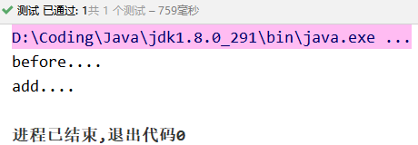
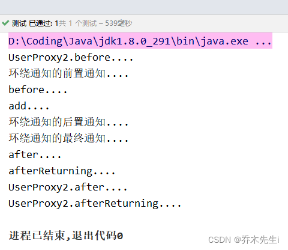

Spring框架一般都是基于AspectJ实现AOP操作。

**AspectJ**不是Spring组成部分，是一个独立的AOP框架，一般把AspectJ和Spring框架一起使用，来进行AOP操作。

在项目工程中引入AOP相关依赖


## 切入点表达式

**execution** ，匹配方法的执行(常用)，让spring知道对哪个类中的哪个方法进行增强。

`execution(表达式)`

```java
execution([权限修饰符] [返回值类型] 包名.类名.方法名(参数列表))
```

**全匹配方式：**

```java
public void com.arbor.service.impl.AccountServiceImpl.saveAccount(com.arbor.domain.Account)
```

**访问修饰符可以省略：**

```java
void com.arbor.service.impl.AccountServiceImpl.saveAccount(com.arbor.domain.Account)
```

**返回值可以使用`*`号，表示任意返回值：**

```java
* com.arbor.service.impl.AccountServiceImpl.saveAccount(com.arbor.domain.Account)
```

**包名可以使用`*`号，表示任意包，有几级包，需要写几个`*`：** 

```java
* *.*.*.*.AccountServiceImpl.saveAccount(com.arbor.domain.Account)
```

**使用`..`来表示当前包，及其子包：**

```java
* com..AccountServiceImpl.saveAccount(com.arbor.domain.Account)
```

**类名可以使用`*`号，表示任意类：**

```java
* com..*.saveAccount(com.arbor.domain.Account)
```

**方法名可以使用*号，表示任意方法：**

```java
* com..*.*( com.arbor.domain.Account)
```

**参数列表可以使用`*`，表示参数可以是任意数据类型，但是必须有参数：**

```java
* com..*.*(*)
```

**参数列表可以使用`..`表示有无参数均可，有参数可以是任意类型：**

```java
* com..*.*(..)
```

**全通配方式：**

```java
* *..*.*(..)
```

通常情况下，是对业务层的方法进行增强，所以切入点表达式都是切到业务层实现类：

```java
execution(* com.arbor.service.impl.*.*(..))
```

## 基于注解方式

**常用注解**

`@Aspect`：把当前类声明为切面类

`@Before`：把当前方法看成是前置通知
`@AfterReturning`：把当前方法看成是后置通知
`@AfterThrowing`：把当前方法看成是异常通知
`@After`：把当前方法看成是最终通知
> 上面四个注解的参数：
> `value`：用于指定切入点表达式，还可以指定切入点表达式的引用

**使用案例**

① 创建一个Spring的配置文件，开启注解扫描和开启aop

```xml
<?xml version="1.0" encoding="UTF-8"?>
<beans xmlns="http://www.springframework.org/schema/beans"
       xmlns:aop="http://www.springframework.org/schema/aop"
       xmlns:context="http://www.springframework.org/schema/context"
       xmlns:xsi="http://www.w3.org/2001/XMLSchema-instance"
       xsi:schemaLocation="http://www.springframework.org/schema/beans
		http://www.springframework.org/schema/beans/spring-beans.xsd
		http://www.springframework.org/schema/aop
		http://www.springframework.org/schema/aop/spring-aop.xsd
		http://www.springframework.org/schema/context
        http://www.springframework.org/schema/context/spring-context.xsd">

    <!-- 告知 spring，在创建容器时要扫描的包 -->
    <context:component-scan base-package="run.arbor"/>
    <!-- 开启 spring 对注解 AOP 的支持 -->
    <aop:aspectj-autoproxy/>
    
</beans>
```

② 创建一个类和方法，对该类中的方法做增强

```java
@Component
public class User {
    public void add() {
        System.out.println("add....");
    }
}
```

③ 创建增强类，在增强类中创建方法，不同的方法代表不同的通知类型，并配置不同类型的通知

```java
@Component
@Aspect // 生成代理对象，表明当前类是一个切面类
public class UserProxy {
    // @Before表示前置通知，会在方法执行前执行
    @Before("execution(* run.arbor.spring5.aop_anno.User.add(..))")
    public void before() {
        System.out.println("before....");
    }
}
```

④ 测试

```java
@Test
public void testAnno() {
    ApplicationContext context = new ClassPathXmlApplicationContext("bean1.xml");
    User user = context.getBean("user", User.class);
    user.add();
}
```
可以得到以下结果：



⑤ 其他几个通知大同小异：

```java
@Component
@Aspect // 生成代理对象，表明当前类是一个切面类
public class UserProxy {

    // @Before表示前置通知，会在方法执行前执行
    @Before("execution(* run.arbor.spring5.aop_anno.User.add(..))")
    public void before() {
        System.out.println("before....");
    }
	
	// 后置通知，方法执行后后执行，如果出现异常，则不执行
    @AfterReturning("execution(* run.arbor.spring5.aop_anno.User.add(..))")
    public void afterReturning() {
        System.out.println("afterReturning....");
    }

	// 异常通知，方法出现异常会执行
    @AfterThrowing("execution(* run.arbor.spring5.aop_anno.User.add(..))")
    public void afterThrowing() {
        System.out.println("afterThrowing....");
    }

	// 最终通知，不管方法有没有出现异常都会执行
    @After("execution(* run.arbor.spring5.aop_anno.User.add(..))")
    public void after() {
        System.out.println("after....");
    }
}
```

可以得到结果：


> 最终通知是方法执行完毕后执行，而后置通知是在方法返回之后执行，所以最终通知要优先于后置通知和异常通知
> **通知的执行顺序：**
> 前置通知 → 执行方法 → 最终通知 → 后置通知/异常通知

### 环绕通知

spring提供了一个接口：`ProceedingJoinPoint`，它可以作为环绕通知的方法参数。
在环绕通知执行时，spring提供该接口的实现类对象，直接使用即可

这里通知的执行顺序和上面的一样

**常用注解**

`@Around`：把当前方法看成是环绕通知

```java
@Around("execution(* run.arbor.spring5.aop_anno.User.add(..))")
public Object around(ProceedingJoinPoint pjp) {
    // 定义返回值，被增强的方法的返回值
    Object rtVal = null;
    try {
        // 获取被增强方法的参数列表
        Object[] args = pjp.getArgs();
        System.out.println("环绕通知的前置通知....");
        // 执行被增强的方法，并传入参数，如果确定没有返回值或者没有参数可以不写
        rtVal = pjp.proceed(args);
        System.out.println("环绕通知的后置通知....");
    } catch (Throwable e) {
        System.out.println("环绕通知的异常通知....");
        e.printStackTrace();
    } finally {
        System.out.println("环绕通知的最终通知....");
    }
    // 将被增强方法的返回值返回
    return rtVal;
}
```

可以得到结果：


### 切入点表达式注解

`@Pointcut`：指定切入点表达式

```java
@Component
@Aspect
public class UserProxy {

    // 定义切除点表达式
    @Pointcut("execution(* run.arbor.spring5.aop_anno.User.add(..))")
    private void pt1() {}

    @Around("pt1()") //注意：千万别忘了写括号
    public Object around(ProceedingJoinPoint pjp) {
        // 定义返回值，被增强的方法的返回值
        Object rtVal = null;

        try {
            // 获取被增强方法的参数列表
            Object[] args = pjp.getArgs();

            System.out.println("环绕通知的前置通知....");

            // 执行被增强的方法，并传入参数，如果确定没有返回值或者没有参数可以不写
            rtVal = pjp.proceed(args);

            System.out.println("环绕通知的后置通知....");
        } catch (Throwable e) {
            System.out.println("环绕通知的异常通知....");
            e.printStackTrace();
        } finally {
            System.out.println("环绕通知的最终通知....");
        }
        // 将被增强方法的返回值返回
        return rtVal;
    }
}
```

### 多个增强类的优先级

`@Order`：设置增强类的优先级，值越小，优先级越高

定义另一个增强类，并设置优先级：

```java
@Component
@Aspect
@Order(1)	// 设置优先级
public class UserProxy2 {

    @Pointcut("execution(* run.arbor.spring5.aop_anno.User.add(..))")
    private void pt1() {}

    @Before("pt1()")
    public void before() {
        System.out.println("UserProxy2.before....");
    }

    @AfterReturning("pt1()")
    public void afterReturning() {
        System.out.println("UserProxy2.afterReturning....");
    }

    @AfterThrowing("pt1()")
    public void afterThrowing() {
        System.out.println("UserProxy2.afterThrowing....");
    }

    @After("pt1()")
    public void after() {
        System.out.println("UserProxy2.after....");
    }

}
```

给之前的UserProxy类设置为3：

```java
@Component
@Aspect
@Order(3)
public class UserProxy {
	...
}
```

执行测试方法：



**可以看到：**

> @Order的值越小的增强类，会优先执行。
> 而同一个类中，同时有环绕通知和普通的通知时，环绕通知会优先执行

### 不使用XML文件开启AOP注解

定义一个配置类，使用`@EnableAspectJAutoProxy`注解

```java
@Configuration
@ComponentScan(basePackages="run.arbor")
@EnableAspectJAutoProxy
public class SpringConfiguration {
}
```

## 基于XML配置文件方式

**常用配置**

`<aop:config>`：声明开始aop的配置

`<aop:aspect>`：用于配置切面

> **参数：**
> id：给切面提供一个唯一标识
ref：引用配置好的通知类bean的id

`<aop:pointcut>`：配置切入点表达式(指定对哪些类的哪些方法进行增强)

> **参数：**
> expression：定义切入点表达式
id：给切入点表达式提供一个唯一标识


`<aop:before>`：配置前置通知(指定增强的方法在切入点方法之前执行)
`<aop:after-returning>`：用于配置后置通知
`<aop:after-throwing>`：用于配置异常通知
`<aop:after>`：用于配置最终通知

> **上面四个配置的参数：**
> method：指定通知类中的增强方法名称
poinitcut：指定切入点表达式
ponitcut-ref：指定切入点的表达式的引用

**配置文件的约束：**
```xml
<?xml version="1.0" encoding="UTF-8"?>
<beans xmlns="http://www.springframework.org/schema/beans"
	xmlns:xsi="http://www.w3.org/2001/XMLSchema-instance"
	xmlns:aop="http://www.springframework.org/schema/aop"
	xsi:schemaLocation="http://www.springframework.org/schema/beans 
		http://www.springframework.org/schema/beans/spring-beans.xsd
		http://www.springframework.org/schema/aop 
		http://www.springframework.org/schema/aop/spring-aop.xsd">
    
</beans>
```

**使用案例**

① 创建一个类和方法，对该类中的方法做增强

```java
public class Book {
    public void buy() {
        System.out.println("buy....");
    }
}
```

② 创建增强类，用于增强对应的方法

```java
public class BookProxy {

    public void before() {
        System.out.println("before....");
    }

    public void afterReturning() {
        System.out.println("afterReturning....");
    }

    public void afterThrowing() {
        System.out.println("afterThrowing....");
    }

    public void after() {
        System.out.println("after....");
    }
}
```

③ 创建Spring的配置文件，bean2.xml

```xml
<?xml version="1.0" encoding="UTF-8"?>
<beans xmlns="http://www.springframework.org/schema/beans"
       xmlns:aop="http://www.springframework.org/schema/aop"
       xmlns:xsi="http://www.w3.org/2001/XMLSchema-instance"
       xsi:schemaLocation="http://www.springframework.org/schema/beans
		http://www.springframework.org/schema/beans/spring-beans.xsd
		http://www.springframework.org/schema/aop
		http://www.springframework.org/schema/aop/spring-aop.xsd">

    <!-- 创建Book对象 -->
    <bean id="book" class="run.arbor.spring5.aop_xml.Book"/>
    <bean id="bookProxy" class="run.arbor.spring5.aop_xml.BookProxy"/>

    <!-- 配置AOP的增强 -->
    <aop:config>

        <!-- 配置切入点 -->
        <aop:pointcut expression="execution(* run.arbor.spring5.aop_xml.Book.buy(..))" id="pt1"/>

        <!-- 配置切面 -->
        <aop:aspect ref="bookProxy">
            <!--配置通知的类型要写在此处-->
            <aop:before method="before" pointcut-ref="pt1"/>
            <aop:after method="after" pointcut-ref="pt1"/>
            <aop:after-returning method="afterReturning" pointcut-ref="pt1"/>
            <aop:after-throwing method="afterThrowing" pointcut-ref="pt1"/>
        </aop:aspect>

    </aop:config>
</beans>
```

④ 测试

```java
@Test
public void testXml() {
    ApplicationContext context = new ClassPathXmlApplicationContext("bean2.xml");
    Book book = context.getBean("book", Book.class);
    book.buy();
}
```
 
 运行可以看到：
 


### 环绕通知

`<aop:around>`：用于配置环绕通知

> **参数：**
> method：通知中方法的名称
pointct：定义切入点表达式
pointcut-ref：指定切入点表达式的引用

spring提供的一种可以在代码中手动控制增强代码什么时候执行的方式，通常情况下，环绕通知都是独立使用的。

① 创建环绕通知类

```java
public class BookProxy {
    public Object around(ProceedingJoinPoint pjp) {
        // 定义返回值，被增强的方法的返回值
        Object rtVal = null;

        try {
            // 获取被增强方法的参数列表
            Object[] args = pjp.getArgs();

            System.out.println("环绕通知的前置通知....");

            // 执行被增强的方法，并传入参数，如果确定没有返回值或者没有参数可以不写
            rtVal = pjp.proceed(args);

            System.out.println("环绕通知的后置通知....");
        } catch (Throwable e) {
            System.out.println("环绕通知的异常通知....");
            e.printStackTrace();
        } finally {
            System.out.println("环绕通知的最终通知....");
        }
        // 将被增强方法的返回值返回
        return rtVal;
    }
}
```

② 编写XML文件

```xml
<?xml version="1.0" encoding="UTF-8"?>
<beans xmlns="http://www.springframework.org/schema/beans"
       xmlns:aop="http://www.springframework.org/schema/aop"
       xmlns:xsi="http://www.w3.org/2001/XMLSchema-instance"
       xsi:schemaLocation="http://www.springframework.org/schema/beans
		http://www.springframework.org/schema/beans/spring-beans.xsd
		http://www.springframework.org/schema/aop
		http://www.springframework.org/schema/aop/spring-aop.xsd">

    <!-- 创建Book对象 -->
    <bean id="book" class="run.arbor.spring5.aop_xml.Book"/>
    <bean id="bookProxy" class="run.arbor.spring5.aop_xml.BookProxy"/>

    <!-- 配置AOP的增强 -->
    <aop:config>

        <!-- 配置切入点 -->
        <aop:pointcut expression="execution(* run.arbor.spring5.aop_xml.Book.buy(..))" id="pt1"/>

        <!-- 配置切面 -->
        <aop:aspect ref="bookProxy">
            <!--配置通知的类型要写在此处-->
            <aop:around method="around" pointcut-ref="pt1"/>
        </aop:aspect>

    </aop:config>
</beans>
```

③ 测试


