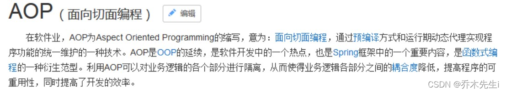

## AOP 概述

**AOP：** 全称是Aspect Oriented Programming，即：**面向切面编程**。它把程序重复的代码抽取出来，在需要执行的时候，使用动态代理的技术，在不修改源码的基础上，对已有方法进行增强。



**作用：** 在程序运行期间，不修改源码对已有方法进行增强
**优势：** 减少重复代码、提高开发效率、维护方便、
**实现方式：** 使用动态代理技术

## 动态代理

字节码随用随创建，随用随加载。静态代理是字节码一上来就创建好，并完成加载。装饰者模式就是静态代理的一种体现。

**动态代理常用的有两种方式：**
- **基于接口的动态代理**
	* **提供者：** JDK 官方的`Proxy`类。
	* **要求：** 被代理类最少实现一个接口。
- **基于子类的动态代理**
	* **提供者：** 第三方的`CGLIB`，如果报 asmxxxx 异常，需要导入`asm.jar`。
	* **要求：** 被代理类不能用 final 修饰的类（最终类）。

## 使用JDK动态代理

使用`java.lang.reflect.Proxy`类里面的`newProxyInstance()`方法创建代理对象

方法介绍：

- `newProxyInstance(ClassLoader loader, Class<?>[] interfaces, InvocationHandler h) `：返回一个指定接口的代理类实例，该接口可以将方法调用指派到指定的调用处理程序。
	* `ClassLoader loader`：定义代理类的类加载器
	* `Class<?>[] interfaces`：代理类要实现的接口列表，支持多个接口
	* `InvocationHandler h`：实现`InvocationHandler`接口，创建代理对象，写增强的方法。

**第一步：** 创建一个接口，待增强的接口

```java
public interface UserDao {
    int add(int a, int b);
    String update(String id);
}
```

**第二步：** 创建接口实现类，并实现方法

```java
public class UserDaoImpl implements UserDao {
    @Override
    public int add(int a, int b) {
    	System.out.println("add方法执行了...");
        return a + b;
    }

    @Override
    public String update(String id) {
    	System.out.println("update方法执行了...");
        return id;
    }
}
```

**第三步：** 创建JDK的接口实现类代理对象

UserDaoProxy类在第四步
```java
public class JDKProxy {
    public static void main(String[] args) {
        // 创建jdk的代理对象
        Class[] interfaces = {UserDao.class};
        UserDaoImpl userDao = new UserDaoImpl();
        UserDao dao = (UserDao) Proxy.newProxyInstance(JDKProxy.class.getClassLoader(), interfaces, new UserDaoProxy(userDao));
    }
}
```

**第四步：** 创建代理对象

```java
class UserDaoProxy implements InvocationHandler {
    // 增强的逻辑
    @Override
    public Object invoke(Object proxy, Method method, Object[] args) throws Throwable {
        return null;
    }
}
```

**第五步：** 将需要增强的对象传递进来

```java
class UserDaoProxy implements InvocationHandler {
    
    // 这是谁的代理对象，就把谁传递进来
    // 可以使用有参构造传递，这里使用Object可以更通用一点，只要是UserDao的实现类都可以传入
    public UserDaoProxy(Object obj) {
        this.obj = obj;
    } 
    
    private Object obj;
    
    // 增强的逻辑
    @Override
    public Object invoke(Object proxy, Method method, Object[] args) throws Throwable {
        return null;
    }
}
```

**第六步：** 编写增强代码的逻辑

```java
class UserDaoProxy implements InvocationHandler {

    // 这是谁的代理对象，就把谁传递进来
    // 可以使用有参构造传递，这里使用Object可以更通用一点，只要是UserDao的实现类都可以传入
    public UserDaoProxy(Object obj) {
        this.obj = obj;
    }

    private Object obj;

    // 增强的逻辑
    @Override
    public Object invoke(Object proxy, Method method, Object[] args) throws Throwable {

        // 方法执行之前的操作
        System.out.println("方法执行之前的操作...." + method.getName() + "：传递的参数..." + Arrays.toString(args));

        // 方法执行
        Object res = method.invoke(obj, args);

        // 方法执行之后的操作
        System.out.println("方法执行之后的操作...." + obj + "，方法的返回值：" + res);

        // 将方法的返回值返回
        return res;
    }
}
```

**第七步：** 调用增强方法

```java
public class JDKProxy {
    public static void main(String[] args) {
        // 创建jdk的代理对象
        Class[] interfaces = {UserDao.class};
        UserDaoImpl userDao = new UserDaoImpl();
        UserDao dao = (UserDao) Proxy.newProxyInstance(JDKProxy.class.getClassLoader(), interfaces, new UserDaoProxy(userDao));
        int res = dao.add(1, 5);
        System.out.println("测试时方法的返回值为：" + res);
    }
}
```

可以得到结果：


## AOP相关术语
Joinpoint(连接点)
> 指被拦截到的点。在spring中，指的是方法，因为spring只支持方法类型的连接点。
> **简单地说：类里面哪些方法可以被增强，就称为连接点。**

#### Pointcut(切入点)

> 指要进行拦截的Joinpoint的定义。
> **通俗地说：实际上被增强的方法，就称为切入点。**

#### Advice(通知/增强)

> 指拦截到Joinpoint之后所要做的事情。 
> **实际增强的逻辑部分，就叫做通知(增强)**

**通知的类型：** 
前置通知：被增强的方法执行之前的通知
后置通知：被增强的方法执行之后的通知
异常通知：被增强的方法出现异常后的通知
最终通知：不管有没有异常都会执行，类似于异常的finally
环绕通知：被增强的方法执行之前之后都做的通知

#### Aspect(切面)

> 是切入点和通知（引介）的结合。
> **简单地说：把通知应用到切入点的过程**

#### Introduction(引介)

> 是一种特殊的通知，在不修改类代码的前提下，可以在运行期为类动态地添加一些方法或Field。

#### Target(目标对象)

> 代理的目标对象。

#### Weaving(织入)

> 把增强应用到目标对象来创建新的代理对象的过程。spring采用动态代理织入，而AspectJ采用编译期织入和类装载期织入。

#### Proxy(代理)

> 一个类被AOP织入增强后，就产生一个结果代理类。

Spring框架监控切入点方法的执行。一旦监控到切入点方法被运行，使用代理机制，动态创建目标对象的代理对象，根据通知类别，在代理对象的对应位置，将通知对应的功能织入，完成完整的代码逻辑运行。
