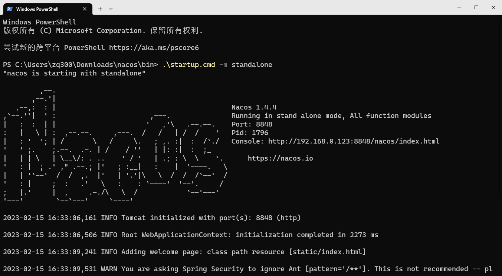
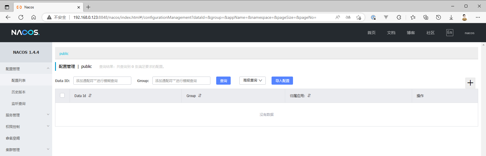
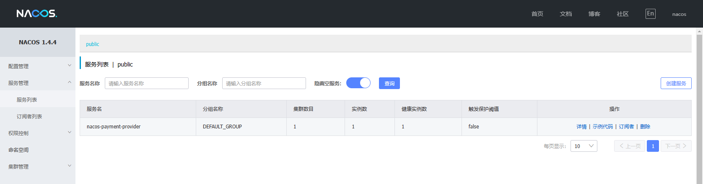
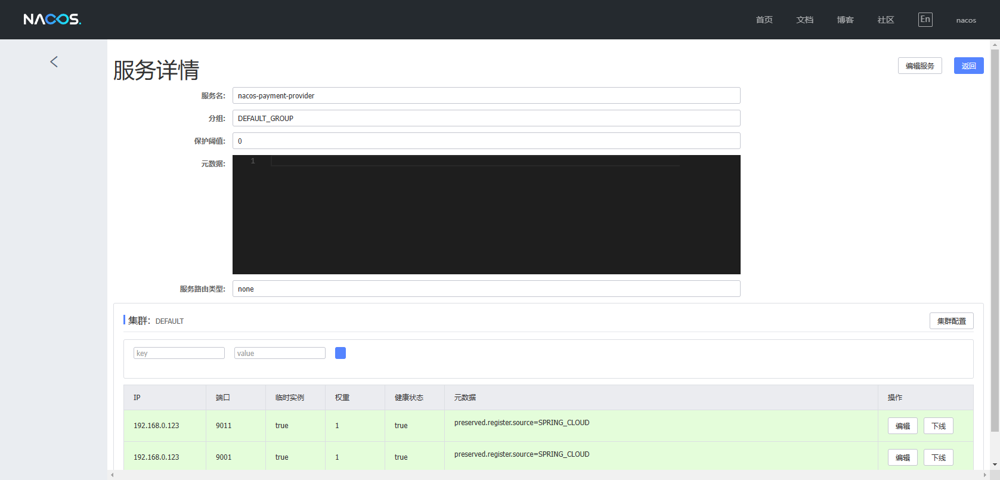
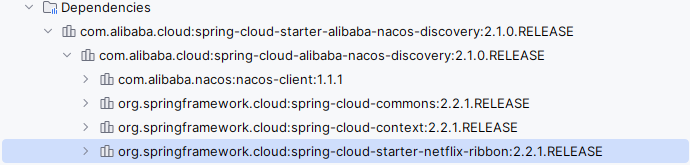
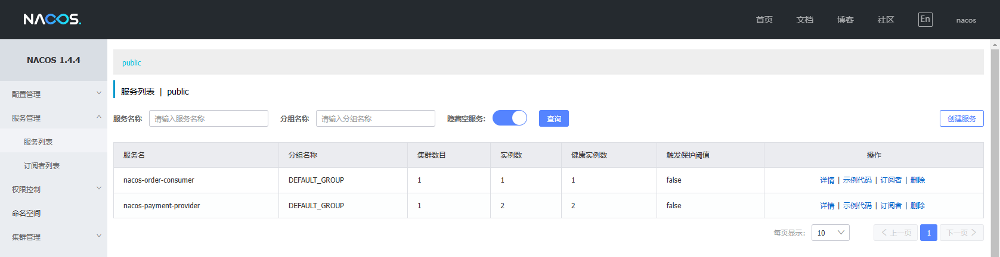
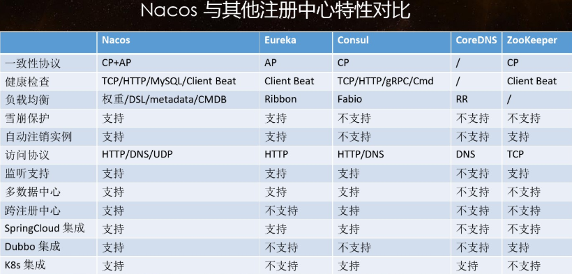
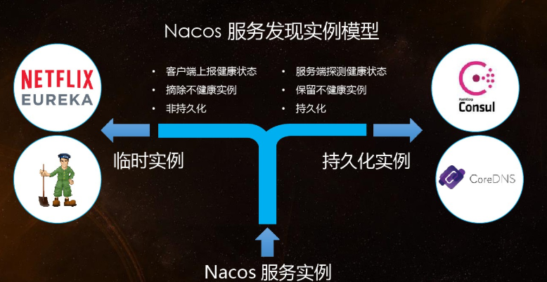

Nacos是SpringCloudAlibaba的组件，而SpringCloudAlibaba也遵循SpringCloud中定义的服务注册、服务发现规范。因此使用Nacos和使用Eureka对于微服务来说，并没有太大区别。

主要差异在于：
- 依赖不同
- 服务地址不同


解压后用终端打开（单机模式）：`.\startup.cmd -m standalone`



  

命令运行成功后直接访问http://localhost:8848/nacos，默认账号密码都是nacos



  

## 服务提供者

为父pom文件加入依赖：

```xml
<dependency>
   <groupId>com.alibaba.cloud</groupId>
   <artifactId>spring-cloud-alibaba-dependencies</artifactId>
   <version>2.1.0.RELEASE</version>
   <type>pom</type>
   <scope>import</scope>
</dependency>
```
  

创建一个微服务 cloudalibaba-provider-payment9001

添加nacos的依赖：

```xml
<dependency>
   <groupId>com.alibaba.cloud</groupId>
   <artifactId>spring-cloud-starter-alibaba-nacos-discovery</artifactId>
</dependency>
```
  

配置yml文件：

```yml
server:
  port: 9001

spring:
  application:
   name: nacos-payment-provider
  cloud:
   nacos:
     discovery:
       server-addr: localhost:8848 #配置Nacos地址
  
management:
  endpoints:
   web:
     exposure:
       include: '*'
```
  

创建主启动类，并添加服务发现注解@EnableDiscoveryClient：

```java
@EnableDiscoveryClient
@SpringBootApplication
public class PaymentMain9001 {
   public static void main(String[] args) {
       SpringApplication.run(PaymentMain9001.class, args);
   }
}
```
  



发现服务提供者的服务已经在nacos的服务列表中了。

再创建一个相同的微服务作为服务提供者，端口号为9011。



  

## 服务消费者

nacos支持负载均衡：



  

新建Module，cloudalibaba-consumer-nacos-order83

pom依赖、主启动类都跟上面的一样

  

配置yml文件：

```yml
server:
  port: 83

spring:
  application:
    name: nacos-order-consumer
  cloud:
    nacos:
      discovery:
        server-addr: localhost:8848


# 消费者将要去访问的微服务名称(注册成功进nacos的微服务提供者)
service-url:
  nacos-user-service: http://nacos-payment-provider
```

  

因为没有使用open feign，这里需要配置RestTemplate：

```java
@Configuration
public class ApplicationContextConfig {

   @Bean
   @LoadBalanced
   public RestTemplate getRestTemplate() {
       return new RestTemplate();
   }
}
```
  

添加业务类：

```java
@RestController
public class OrderNacosController {

   @Resource
   private RestTemplate restTemplate;
  
   @Value("${service-url.nacos-user-service}")
   private String serverURL;

   @GetMapping(value = "/consumer/payment/nacos/{id}")
   public String paymentInfo(@PathVariable("id") Long id) {
       return restTemplate.getForObject(serverURL + "/payment/nacos/" + id, String.class);
   }

}
```
  

启动并测试：

http://localhost:83/consumer/payment/nacos/13




可以看到以轮询的方式进行负载均衡。

  

## 注册中心对比

### Nacos全景图所示


  

### Nacos和CAP





  

### Nacos 支持AP和CP模式的切换

C是所有节点在同一时间看到的数据是一致的；而A的定义是所有的请求都会收到响应。

何时选择使用何种模式？

一般来说，如果不需要存储服务级别的信息且服务实例是通过nacos-client注册，并能够保持心跳上报，那么就可以选择AP模式。当前主流的服务如 Spring cloud 和 Dubbo 服务，都适用于AP模式，AP模式为了服务的可能性而减弱了一致性，因此AP模式下只支持注册临时实例。

如果需要在服务级别编辑或者存储配置信息，那么 CP 是必须，K8S服务和DNS服务则适用于CP模式。

CP模式下则支持注册持久化实例，此时则是以 Raft 协议为集群运行模式，该模式下注册实例之前必须先注册服务，如果服务不存在，则会返回错误。

```bash
curl -X PUT '$NACOS_SERVER:8848/nacos/v1/ns/operator/switches?entry=serverMode&value=CP'
```