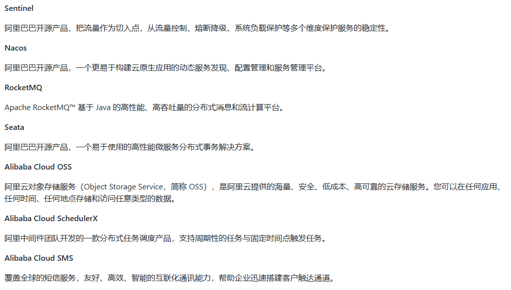
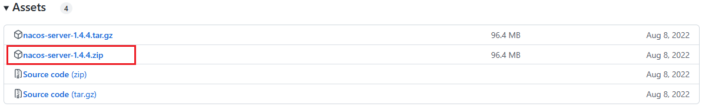
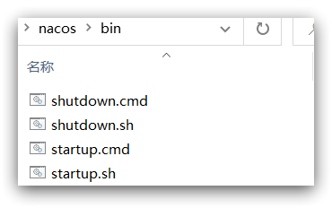
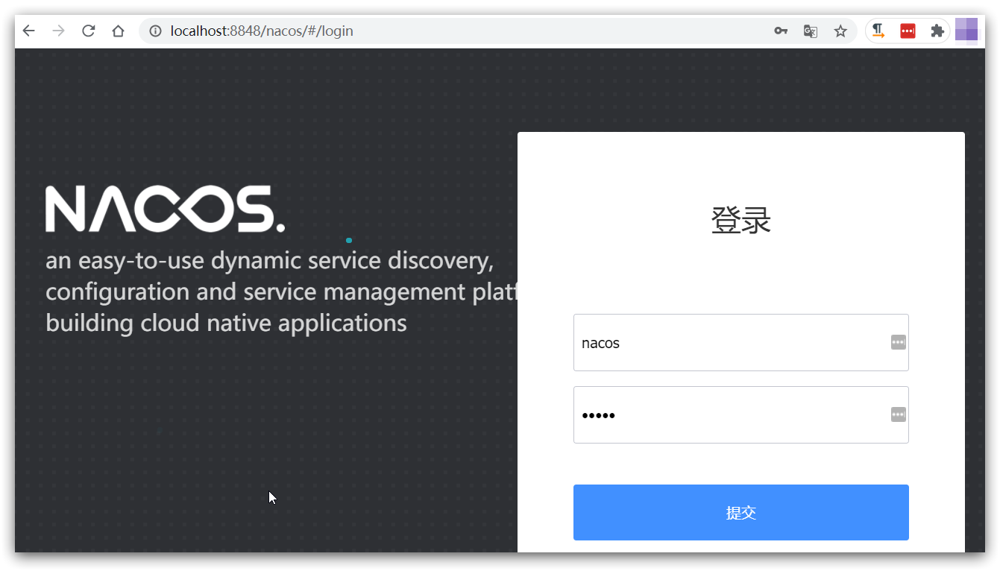

## SpringCloud Alibaba

官网：[https://github.com/alibaba/spring-cloud-alibaba/blob/master/README-zh.md](https://github.com/alibaba/spring-cloud-alibaba/blob/master/README-zh.md)

诞生：2018.10.31，Spring Cloud Alibaba 正式入驻了 Spring Cloud 官方孵化器，并在 Maven 中央库发布了第一个版本。


  

作用：

- 服务限流降级：默认支持 WebServlet、WebFlux、OpenFeign、RestTemplate、Spring Cloud Gateway、Zuul、Dubbo 和 RocketMQ 限流降级功能的接入，可以在运行时通过控制台实时修改限流降级规则，还支持查看限流降级 Metrics 监控。
- 服务注册与发现：适配 Spring Cloud 服务注册与发现标准，默认集成了 Ribbon 的支持。
- 分布式配置管理：支持分布式系统中的外部化配置，配置更改时自动刷新。
- 消息驱动能力：基于 Spring Cloud Stream 为微服务应用构建消息驱动能力。
- 分布式事务：使用 @GlobalTransactional 注解， 高效并且对业务零侵入地解决分布式事务问题。
- 阿里云对象存储：阿里云提供的海量、安全、低成本、高可靠的云存储服务。支持在任何应用、任何时间、任何地点存储和访问任意类型的数据。
- 分布式任务调度：提供秒级、精准、高可靠、高可用的定时（基于 Cron 表达式）任务调度服务。同时提供分布式的任务执行模型，如网格任务。网格任务支持海量子任务均匀分配到所有 Worker（schedulerx-client）上执行。
- 阿里云短信服务：覆盖全球的短信服务，友好、高效、智能的互联化通讯能力，帮助企业迅速搭建客户触达通道。



Spring官网资料：[https://spring.io/projects/spring-cloud-alibaba#overview](https://spring.io/projects/spring-cloud-alibaba#overview)

GitHub：

- 英文：[https://github.com/alibaba/spring-cloud-alibaba](https://github.com/alibaba/spring-cloud-alibaba)，[https://spring-cloud-alibaba-group.github.io/github-pages/greenwich/spring-cloud-alibaba.html](https://spring-cloud-alibaba-group.github.io/github-pages/greenwich/spring-cloud-alibaba.html)

- 中文：[https://github.com/alibaba/spring-cloud-alibaba/blob/master/README-zh.md](https://github.com/alibaba/spring-cloud-alibaba/blob/master/README-zh.md)


## Nacos安装

一个更易于构建云原生应用的动态服务发现、配置管理和服务管理平台。

Nacos: Dynamic Naming and Configuration Service，前四个字母分别为Naming和Configuration的前两个字母，最后的s为Service。

Nacos就是注册中心 + 配置中心的组合 等价于 Nacos = Eureka+Config +Bus

- 替代Eureka做服务注册中心
- 替代Config做服务配置中心

官方文档：

- [https://github.com/alibaba/Nacos](https://github.com/alibaba/Nacos)
- [https://nacos.io/zh-cn/index.html](https://nacos.io/zh-cn/index.html)
- [https://spring-cloud-alibaba-group.github.io/github-pages/greenwich/spring-cloud-alibaba.html#_spring_cloud_alibaba_nacos_discovery](https://spring-cloud-alibaba-group.github.io/github-pages/greenwich/spring-cloud-alibaba.html#_spring_cloud_alibaba_nacos_discovery)


据说 Nacos 在阿里巴巴内部有超过 10 万的实例运行，已经过了类似双十一等各种大型流量的考验。

下载：



### Windows安装

将这个包解压到任意非中文目录下，如图：


目录说明：

- bin：启动脚本
- conf：配置文件


启动非常简单，进入bin目录，结构如下：



然后执行命令即可：

```bash
startup.cmd -m standalone
```
  

命令运行成功后直接访问http://localhost:8848/nacos，默认账号密码都是nacos




## Nacos的依赖

父工程：

```xml
<dependency>
    <groupId>com.alibaba.cloud</groupId>
    <artifactId>spring-cloud-alibaba-dependencies</artifactId>
    <version>2.2.5.RELEASE</version>
    <type>pom</type>
    <scope>import</scope>
</dependency>
```
  

客户端：
```xml
<!-- nacos客户端依赖包 -->
<dependency>
   <groupId>com.alibaba.cloud</groupId>
   <artifactId>spring-cloud-starter-alibaba-nacos-discovery</artifactId>
</dependency>
```