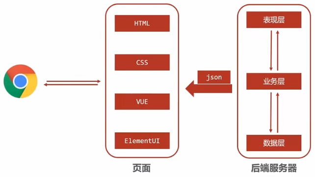

SpringMVC 是一种基于 Java 的实现 MVC 设计模型的请求驱动类型的轻量级 Web 框架，属于SpringFrameWork 的后续产品，已经融合在 Spring Web Flow 中。

SpringMVC 已经成为目前最主流的MVC框架之一，并且随着Spring3.0 的发布，全面超越 Struts2，成为最优秀的 MVC 框架。它通过一套注解，让一个简单的 Java 类成为处理请求的控制器，而无须实现任何接口。同时它还支持 RESTful 编程风格的请求。

三层架构




导入SpringMVC相关坐标

```xml
<!--Spring坐标-->
<dependency>
    <groupId>org.springframework</groupId>
    <artifactId>spring-context</artifactId>
    <version>5.0.5.RELEASE</version>
</dependency>
 
<!--SpringMVC坐标-->
<dependency>
    <groupId>org.springframework</groupId>
    <artifactId>spring-webmvc</artifactId>
    <version>5.0.5.RELEASE</version>
</dependency>
 
<!--Servlet坐标-->
<dependency>
    <groupId>javax.servlet</groupId>
    <artifactId>servlet-api</artifactId>
    <version>2.5</version>
</dependency>
 
<!--Jsp坐标-->
<dependency>
    <groupId>javax.servlet.jsp</groupId>
    <artifactId>jsp-api</artifactId>
    <version>2.0</version>
</dependency>
```


配置SpringMVC核心控制器DispathcerServlet

```xml
<servlet>
    <!-- servlet的别名 -->
    <servlet-name>DispatcherServlet</servlet-name>
    <!--servlet对应的类-->
    <servlet-class>org.springframework.web.servlet.DispatcherServlet</servlet-class>
    <!--servlet初始化-->
    <init-param>
        <param-name>contextConfigLocation</param-name>
        <param-value>classpath:spring-mvc.xml</param-value>
    </init-param>
    <!-- servlet的创建时机，可写可不写 -->
    <load-on-startup>1</load-on-startup>
</servlet>
 
<!-- 映射，将servlet与url绑定 -->
<servlet-mapping>
    <!-- servlet的名称，要和上面的名称一致-->
    <servlet-name>DispatcherServlet</servlet-name>
    <!-- servlet的访问路径-->
    <url-pattern>/</url-pattern>
</servlet-mapping>
```

也可以使用配置类替换web.xml

```java
public class ServletContainersInitConfig extends AbstractDispatcherServletInitializer {

    /**
     * 加载springmvc配置类
     */
    @Override
    protected WebApplicationContext createServletApplicationContext() {
        //初始化WebApplicationContext对象
        AnnotationConfigWebApplicationContext ctx = new AnnotationConfigWebApplicationContext();
        //加载指定配置类
        ctx.register(SpringMvcConfig.class);
        return ctx;
    }

    /**
     * 设置由springmvc控制器处理的请求映射路径
     */
    @Override
    protected String[] getServletMappings() {
        return new String[]{"/"};
    }

    /**
     * 加载spring配置类
     */
    @Override
    protected WebApplicationContext createRootApplicationContext() {
        return null;
        // 上面是因为之加入了MVC的依赖，如果项目中还有Spring的配置文件，则需要加入下面的代码：
        // AnnotationConfigWebApplicationContext ctx = new AnnotationConfigWebApplicationContext();
        // ctx.register(SpringConfig.class);
        // return ctx;
    }
}
```

上述的配置方式，Spring还提供了一种更简单的配置方式，可以不用再去创建`AnnotationConfigWebApplicationContext`对象，不用手动`register`对应的配置类：

```java
public class ServletContainersInitConfig extends AbstractAnnotationConfigDispatcherServletInitializer {

    protected Class<?>[] getRootConfigClasses() {
        return new Class[]{SpringConfig.class};
    }

    protected Class<?>[] getServletConfigClasses() {
        return new Class[]{SpringMvcConfig.class};
    }

    protected String[] getServletMappings() {
        return new String[]{"/"};
    }
}
```

创建Controller类和视图页面
使用注解配置Controller类中业务方法的映射地址

> 如果方法直接返回字符串，springmvc会把字符串当成页面的名称在项目中进行查找返回，因为不存在对应返回值名称的页面，所以会报404错误，找不到资源。**设置返回数据为json格式(加`@ResponseBody`注解)。**

```java
@Controller
public class UserController {
    
    @ResponseBody
    @RequestMapping("/save")
    public String save(){
        System.out.println("user save ...");
        return "{'info':'springmvc'}";
    }
}
```

配置SpringMVC核心文件 spring-mvc.xml

```xml
<beans xmlns="http://www.springframework.org/schema/beans"
    xmlns:mvc="http://www.springframework.org/schema/mvc"
    xmlns:context="http://www.springframework.org/schema/context"
    xmlns:xsi="http://www.w3.org/2001/XMLSchema-instance"
    xsi:schemaLocation="http://www.springframework.org/schema/beans
    http://www.springframework.org/schema/beans/spring-beans.xsd
    http://www.springframework.org/schema/mvc
    http://www.springframework.org/schema/mvc/spring-mvc.xsd
    http://www.springframework.org/schema/context
    http://www.springframework.org/schema/context/spring-context.xsd">
 
    <!--配置注解扫描-->
    <context:component-scan base-package="com.qaomuu"/>
</beans>
```

也可以创建配置类，指定要扫描的包

```java
@Configuration
@ComponentScan("com.qaomuu")
public class SpringMvcConfig {
}
```

客户端发起请求测试，部署到Tomact中，并启动，访问`http://localhost:8080/save`