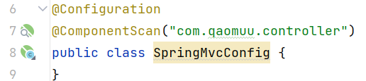
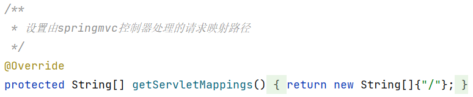

1. 用户发送请求至前端控制器`DispatcherServlet`。
2. `DispatcherServlet`收到请求调用`HandlerMapping`处理器映射器。
3. 处理器映射器找到具体的处理器(可以根据xml配置、注解进行查找)，生成处理器对象及处理器拦截器(如果有则生成)一并返回给`DispatcherServlet`。
4. `DispatcherServlet`调用`HandlerAdapter`处理器适配器。
5. `HandlerAdapter`经过适配调用具体的处理器(Controller，也叫后端控制器)。
6. `Controller`执行完成返回`ModelAndView`。
7. `HandlerAdapter`将controller执行结果`ModelAndView`返回给`DispatcherServlet`。
8. `DispatcherServlet`将`ModelAndView`传给`ViewReslover`视图解析器。
9. `ViewReslover`解析后返回具体View。
10. `DispatcherServlet`根据View进行渲染视图（即将模型数据填充至视图中）。`DispatcherServlet`响应用户。

## 启动服务器初始化过程

1. 服务器启动，执行`ServletContainersInitConfig`类，初始化web容器，类似于以前的web.xml
2. 执行`createServletApplicationContext`方法，创建了`WebApplicationContext`对象

> 该方法加载SpringMVC的配置类SpringMvcConfig来初始化SpringMVC的容器

3. 加载SpringMvcConfig配置类

4. 执行`@ComponentScan`加载对应的bean
   * 扫描指定包及其子包下所有类上的注解，如Controller类上的`@Controller`注解
5. 加载UserController，每个`@RequestMapping`的名称对应一个具体的方法

> 此时就建立了`/save`和 save方法的对应关系

6. 执行`getServletMappings`方法，设定SpringMVC拦截请求的路径规则

> `/`代表所拦截请求的路径规则，只有被拦截后才能交给SpringMVC来处理请求

## 单次请求过程

1. 发送请求`http://localhost/save`
2. web容器发现该请求满足SpringMVC拦截规则，将请求交给SpringMVC处理
3. 解析请求路径`/save`
4. 由`/save`匹配执行对应的方法`save(）`

> 上面的第五步已经将请求路径和方法建立了对应关系，通过`/save`就能找到对应的save方法

5. 执行`save()`
6. 检测到有`@ResponseBody`直接将`save()`方法的返回值作为响应体返回给请求方

