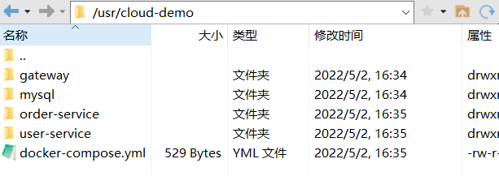

Docker Compose可以基于Compose文件快速部署分布式应用，而无需手动一个个创建和运行容器。

Compose文件是一个文本文件，通过指令定义集群中的每个容器如何运行。


举例：

```yaml
version: "3.8"

services:
  mysql:
    image: mysql:8.0.29
    environment:
      MYSQL_ROOT_PASSWORD: root1019
    volumes:
     - "/var/lib/mysql/log:/var/log/mysql"
     - "/var/lib/mysql/data:/var/lib/mysql"
     - "/var/lib/mysql/conf:/etc/mysql/conf.d"

  web:
    build: .
    ports:
     - "8090:8090"

```


上面的services就对应着之前的MySQL操作：

```bash
docker run --name mysql    \
    -p 3306:3306    \
    -v /usr/cloud-demo/mysql/log:/var/log/mysql    \
    -v /usr/cloud-demo/mysql/data:/var/lib/mysql    \
    -v /usr/cloud-demo/mysql/conf:/etc/mysql/conf.d    \
    -e MYSQL_ROOT_PASSWORD=123    \
    -d    \
    mysql:8.0.29    \
```


下面的web对应之前自定义Java服务的操作：

```bash
docker build -t javaweb:1.0 .
# -t：镜像的名字和版本号
# .：dockerfile所在的目录，因为这里就在当前目录，所以写个 .
```


DockerCompose官方文档：[https://docs.docker.com/compose/compose-file/](https://docs.docker.com/compose/compose-file/)


### **下载**

```bash
# 安装
curl -L https://github.com/docker/compose/releases/download/1.23.1/docker-compose-`uname -s`-`uname -m` > /usr/local/bin/docker-compose
```

也可以将对应的文件上传到`/usr/local/bin` 中


### **修改文件权限**

```bash
chmod +x /usr/local/bin/docker-compose
```


### **Base自动补全命令**

```bash
curl -L https://raw.githubusercontent.com/docker/compose/1.29.1/contrib/completion/bash/docker-compose > /etc/bash_completion.d/docker-compose
```

如果报错的话，先执行下面的命令：

```bash
echo "199.232.68.133 raw.githubusercontent.com" >> /etc/hosts
```


### **部署微服务集群\[例\]**

把对应的文件上传到服务器



docker-compose.yml文件内容如下：

```yaml
version: "3.2"

services:
  nacos:
    image: nacos/nacos-server
    environment:
      MODE: standalone
    ports:
      - "8848:8848"
  mysql:
    image: mysql:5.7.25
    environment:
      MYSQL_ROOT_PASSWORD: 123
    volumes:
      - "$PWD/mysql/data:/var/lib/mysql"
      - "$PWD/mysql/conf:/etc/mysql/conf.d/"
  userservice:
    build: ./user-service
  orderservice:
    build: ./order-service
  gateway:
    build: ./gateway
    ports:
      - "10010:10010"
```

* `nacos`：作为注册中心和配置中心
  * `image: nacos/nacos-server`： 基于nacos/nacos-server镜像构建
  * `environment`：环境变量
  * `MODE: standalone`：单点模式启动
  * `ports`：端口映射，这里暴露了8848端口
* `mysql`：数据库
  * `image: mysql:5.7.25`：镜像版本是mysql:5.7.25
  * `environment`：环境变量
  * `MYSQL_ROOT_PASSWORD: 123`：设置数据库root账户的密码为123
  * `volumes`：数据卷挂载，这里挂载了mysql的data、conf目录，其中有我提前准备好的数据
* `userservice`、`orderservice`、`gateway`：都是基于Dockerfile临时构建的


执行命令

```bash
docker compose up -d
```


