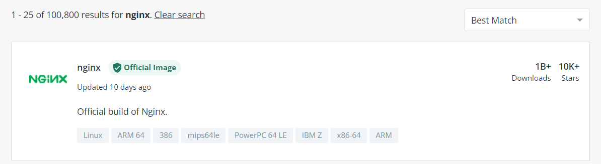
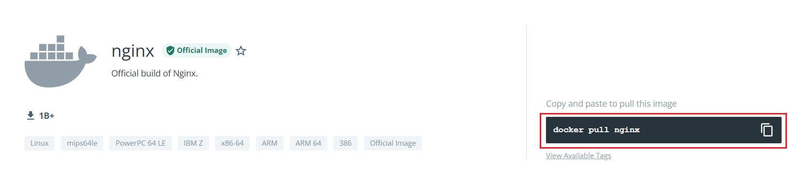
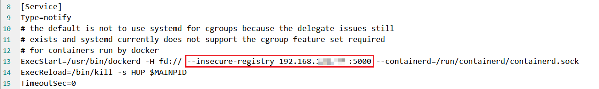

## 镜像名称

镜名称一般分两部分组成：`[repository]:[tag]`。

在没有指定`tag`时，默认是`latest`，代表最新版本的镜像。


这里的`mysql`就是`repository`，`5.7`就是`tag`，合一起就是镜像名称，代表5.7版本的MySQL镜像。


## 镜像命令

帮助文档

```bash
# 查看帮助文档，会列出docker所有的命令
docker --help
# 查看某个命令的详解
docker [命令] --help
```


镜像操作命令

```bash
# 构建镜像
docker build
docker build [OPTIONS] PATH | URL |

# 查看镜像
docker images
docker images [OPTIONS] [REPOSITORY[:TAG]]
# 删除镜像
docker rmi
docker rmi [OPTIONS] IMAGE [IMAGE...]

# 推送镜像到服务
docker push
docker push [OPTIONS] NAME[:TAG]
# 从服务拉取镜像
docker pull
docker pull [OPTIONS] NAME[:TAG|@DIGEST]

# 保存镜像为一个压缩包
docker save
docker save [OPTIONS] IMAGE [IMAGE...]
# 加载压缩包为镜像
docker load
docker load [OPTIONS]
```


### 下载Nginx镜像\[例\]

镜像仓库地址：[https://hub.docker.com/](https://hub.docker.com/)


#### 搜索需要的镜像




#### 使用推荐命令，或者指定版本



#### 拉取镜像

```bash
docker pull nginx
```


#### 查看镜像

```bash
docker images
```


#### 导出镜像

```bash
docker save -o nginx.tar nginx:latest
```


#### 删除镜像

```bash
docker rmi nginx:latest
```


#### 加载打包好的镜像

```bash
docker load -i nginx.tar
```


## 镜像结构

镜像是将应用程序及其需要的系统函数库、环境、配置、依赖打包而成。


简单来说，镜像就是在系统函数库、运行环境基础上，添加应用程序文件、配置文件、依赖文件等组合，然后编写好启动脚本打包在一起形成的文件。

构建镜像，其实就是实现上述打包的过程。


### Dockerfile语法

构建自定义的镜像时，并不需要一个个文件去拷贝，打包。

只需要告诉Docker镜像的组成，需要哪些BaseImage、需要拷贝什么文件、需要安装什么依赖、启动脚本是什么，Docker就会构建镜像。

而描述上述信息的文件就是`Dockerfile`文件。


* Dockerfile的本质是一个文件，通过指令描述镜像的构建过程
* Dockerfile的第一行必须是FROM，从一个基础镜像来构建
* 基础镜像可以是基本操作系统，如Ubuntu。也可以是其他人制作好的镜像，例如：java:8-alpine


**Dockerfile**就是一个文本文件，其中包含一个个的**指令(Instruction)**，用指令来说明要执行什么操作来构建镜像。每一个指令都会形成一层Layer。


官网文档： [https://docs.docker.com/engine/reference/builder](https://docs.docker.com/engine/reference/builder)


## 构建Java项目

### 基于Ubuntu镜像构建\[例\]

创建一个文件夹，将JDK和jar包文件放入该文件夹下，还有写好的Dockerfile文件


##### Dockerfile文件内容

```vim
# 指定基础镜像
FROM ubuntu:16.04
# 配置环境变量，JDK的安装目录
ENV JAVA_DIR=/usr/local

# 拷贝jdk和java项目的包
COPY ./jdk8.tar.gz $JAVA_DIR/
COPY ./docker-demo.jar /tmp/app.jar

# 安装JDK
RUN cd $JAVA_DIR \
 && tar -xf ./jdk8.tar.gz \
 && mv ./jdk1.8.0_144 ./java8

# 配置环境变量
ENV JAVA_HOME=$JAVA_DIR/java8
ENV PATH=$PATH:$JAVA_HOME/bin

# 暴露端口
EXPOSE 8090
# 入口，java项目的启动命令
ENTRYPOINT java -jar /tmp/app.jar
```


#### 构建镜像

```bash
docker build -t javaweb:1.0 .
# -t：镜像的名字和版本号
# .：dockerfile所在的目录，因为这里就在当前目录，所以写个 .
```


#### 启动容器

```bash
docker run --name web -p 8090:8090 -d javaweb:1.0
```


### 基于java8构建\[例\]

虽然可以基于Ubuntu基础镜像，添加任意安装包，构建镜像，但是却比较麻烦。大多数情况下，可以在一些安装了部分软件的基础镜像上做改造。

构建java项目的镜像，可以在已经准备了JDK的基础镜像基础上构建。基于java:8-alpine镜像。


#### Dockerfile文件内容

```vim
FROM java:8-alpine
COPY ./app.jar /tmp/app.jar
EXPOSE 8090
ENTRYPOINT java -jar /tmp/app.jar
```

其他的操作和上面的一样。


## 搭建镜像仓库

### 简化版仓库

Docker官方的Docker Registry是一个基础版本的Docker镜像仓库，具备仓库管理的完整功能，但是没有图形化界面。

命令如下：

```bash
docker run -d \
    --restart=always \
    --name registry	\
    -p 5000:5000 \
    -v registry-data:/var/lib/registry \
    registry
```

命令中挂载了一个数据卷registry-data到容器内的`/var/lib/registry`目录，这是私有镜像库存放数据的目录。


访问`http://YourIp:5000/v2/_catalog`可以查看当前私有镜像服务中包含的镜像。


### 图形化界面仓库

使用DockerCompose部署带有图象界面的DockerRegistry，命令如下：

```bash
version: '3.0'
services:
  registry:
    image: registry
    volumes:
      - ./registry-data:/var/lib/registry
  ui:
    image: joxit/docker-registry-ui:static
    ports:
      - 5000:80
    environment:
      - REGISTRY_TITLE=乔木先生私有仓库
      - REGISTRY_URL=http://registry:5000
    depends_on:
      - registry
```


### 配置信任地址

私服采用的是http协议，默认不被Docker信任，所以需要做一个配置：

```bash
# 打开要修改的文件
vi /etc/docker/daemon.json
# 添加内容：
"insecure-registries":["http://192.168.120.100:5000"]
# 重加载
systemctl daemon-reload
# 重启docker
systemctl restart docker
```


如果这里还报错：


```bash
Get "https://192.168.120.100:5000/v2/": http: server gave HTTP response to HTTPS client
```


在下面的文件中，第13行左右增加`--insecure-registry ip地址:端口号`

```bash
vim /usr/lib/systemd/system/docker.service
```



然后重启docker即可

```bash
# 重新加载
systemctl daemon-reload
# 重启docker
systemctl restart docker
```


最后进入放置docker-compose.yml的文件夹中执行命令：

```bash
docker-compose up -d
```


## 推送、拉取镜像

推送镜像到私有镜像服务必须先tag，步骤如下：

① 重新tag本地镜像，名称前缀为私有仓库的地址：`192.168.120.100:5000/`

```bash
docker tag nginx:latest 192.168.150.101:8080/nginx:1.0 
```

② 推送镜像

```bash
docker push 192.168.150.101:8080/nginx:1.0 
```

③ 拉取镜像

```bash
docker pull 192.168.150.101:8080/nginx:1.0 
```