---
tags:
  - Linux/VMware
---


VMware安装后，可以使用VMware在Windows中更好的使用和管理虚拟机，==**设置Windows和CentOS共享文件夹**==

## 安装VMware Tools

> 进入CentOS，**右键选择**桌面上的光驱图标，点击**弹出**，没有的话不用弹

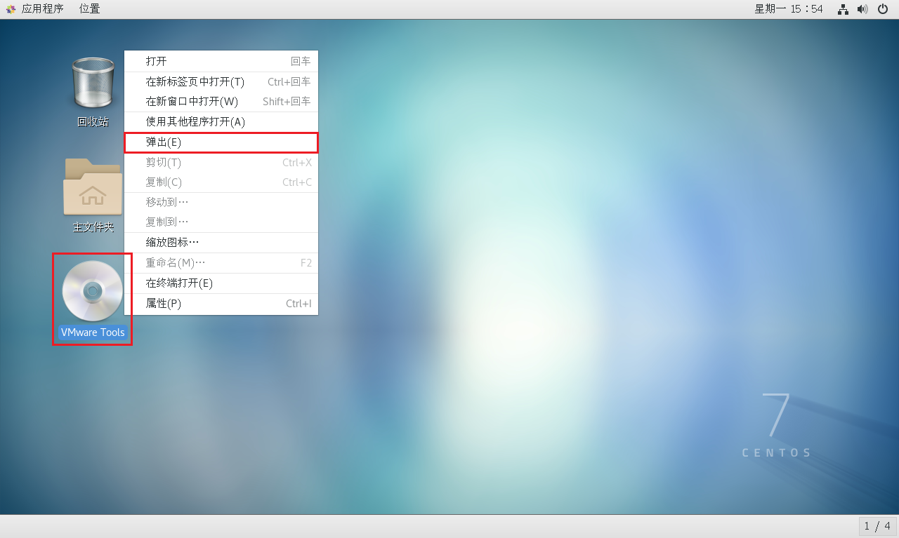

> 点击菜单的栏中的**重新安装 VMware Tools**，如果不是重新安装的话，就点安装VMtools即可

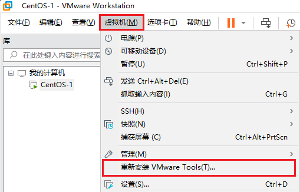


> CentOS会出现一个`VMware Tools`的安装包，如果没有的话重复上一步点击取消安装，再重新安装一次试试

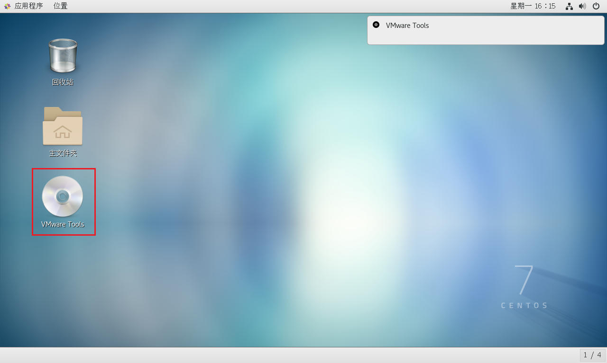

> 打开这个光驱，可以看到一个`VMwareTools...tar.gz`的文件，把它拷贝到 `/opt`目录下
>
> 1. 双击主文件夹
> 2. 选择“其他位置”
> 3. 双击“计算机”
> 4. 双击“opt”目录

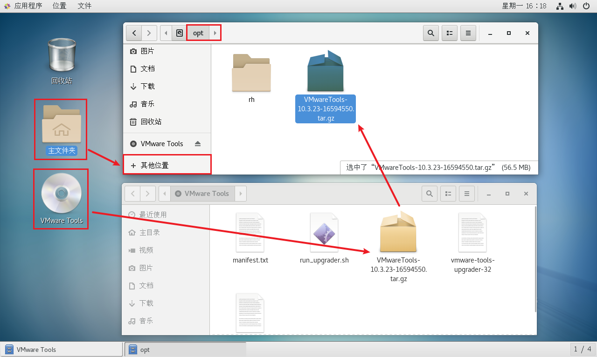


> 右键桌面，点击**打开终端**
>
> 执行下面的命令(一行一行执行)，第二行最后的是刚刚复制的文件名，改成自己的就好
>
> 手打麻烦的话，可以先输入文件名开头几个字母，比如`VM`，然后使用`Tab`键选择对应的文件

```bash
cd /opt
tar -zxvf VMwareTools...tar.gz
```

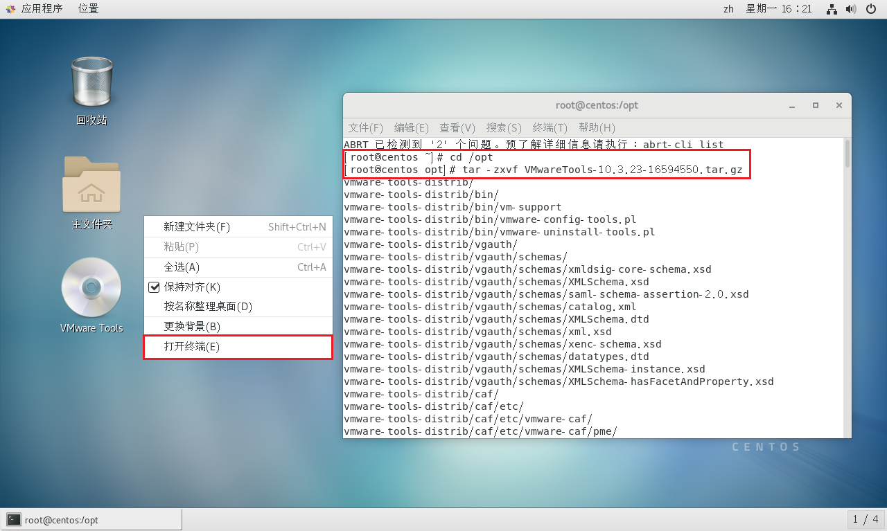

> 解压后，可以看到 `/opt`文件夹下，多了一个文件夹
>
> 使用终端进入这个目录，以下命令依次执行，如果跟自己的文件名不一样，需要改成自己的

```bash
cd vmware-tools-distrib/
./vmware-install.pl
```

> 这两条命令执行后，遇到选项直接一路回车，安装前确保系统有安装GCC，否则安装失败的（输入命令 `gcc - v` 如果有输出信息，说明有安装）

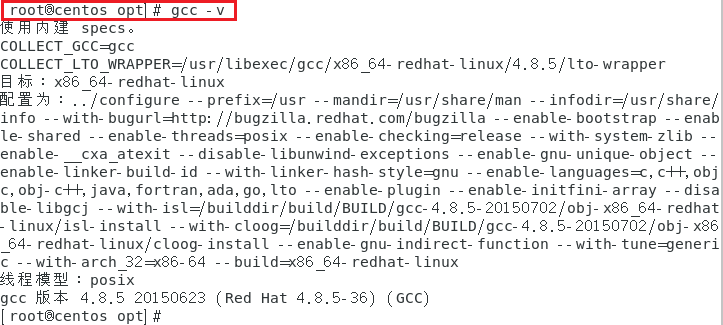

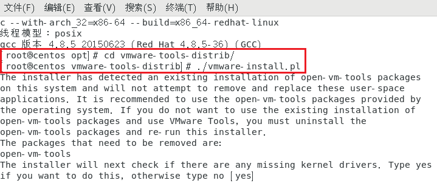

> 看到这个说明安装成功

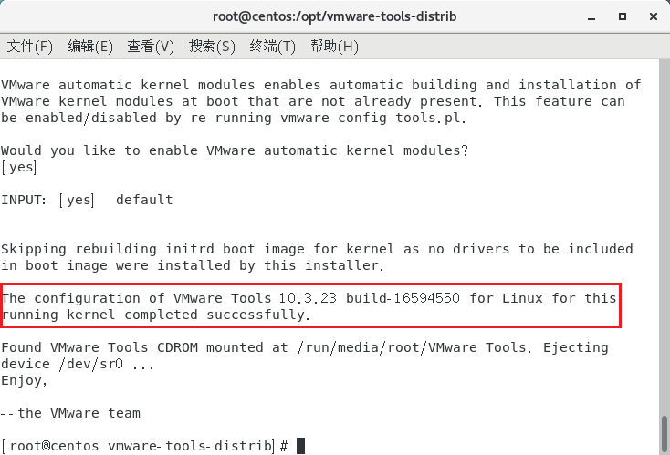


## 添加共享文件夹

> 首先在本地创建一个文件夹，里面随便放一个文件

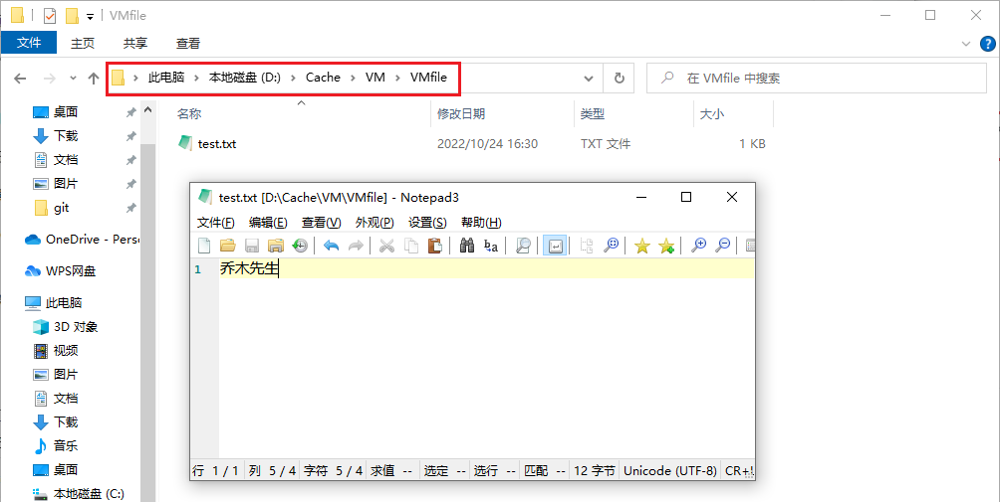


> 右键需要共享文件夹的虚拟机，**选择设置**

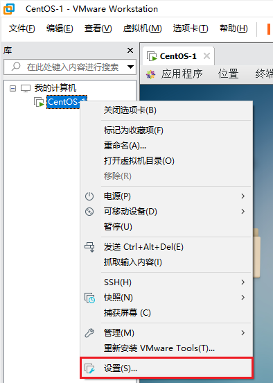

> 依次选择下面的选项

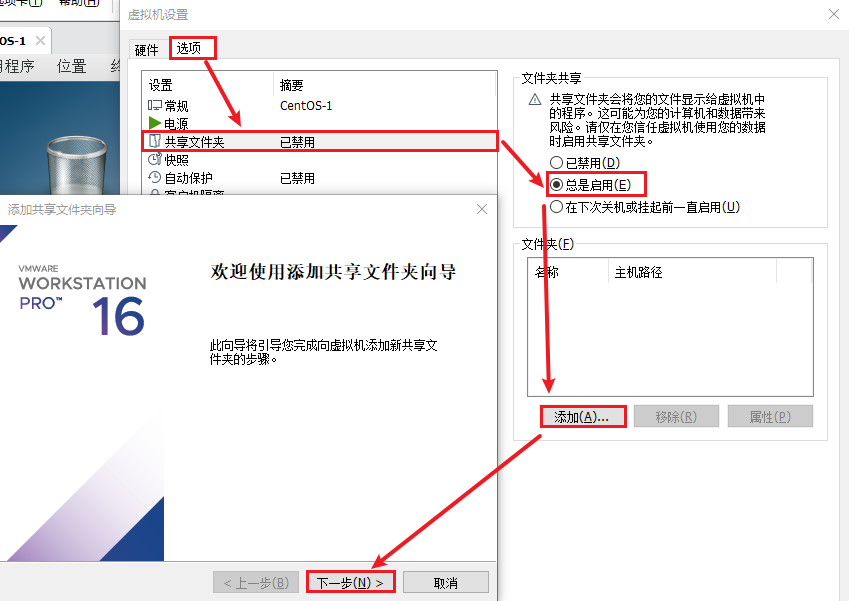


> 选择刚刚创建的文件夹，然后**点击下一步**
>
> 选择**启用次共享**，然后点击**完成**，再点**确定**

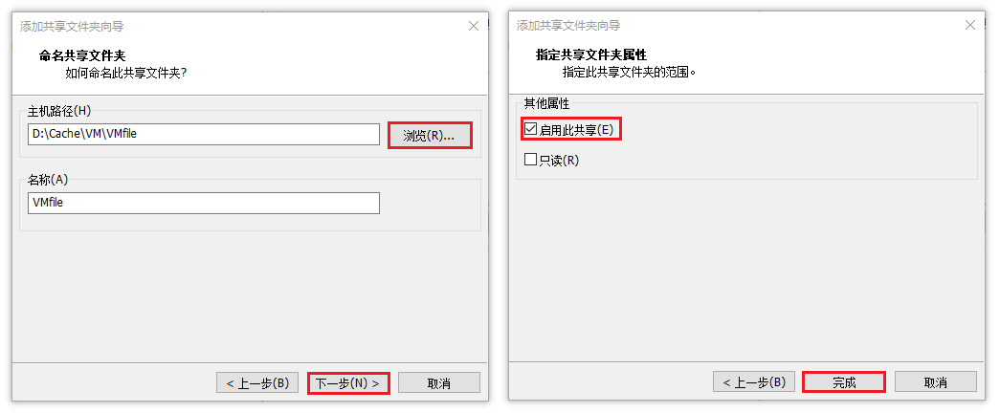


> 在CentOS中，选择**其他位置**，再选择**计算机**，进入**mnt**文件夹
>
> 依次往下点击，可以看到刚刚创建的**共享文件夹**，也能看到刚刚创建的**共享的文件**

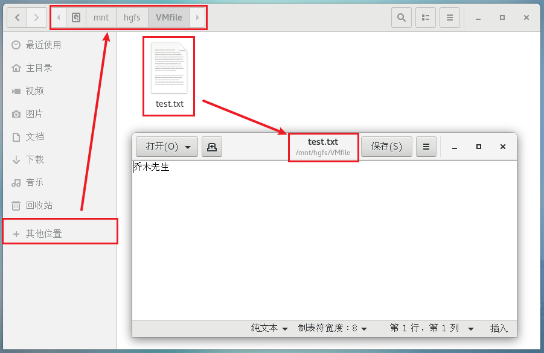

