---
tags:
- Linux/VMware
- Linux/CentOS
---

> 新建虚拟机

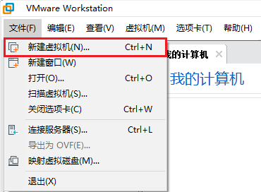

> 选择**典型**，下一步

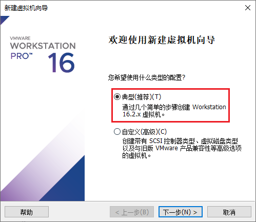

> 选择**稍后安装操作系统**，下一步

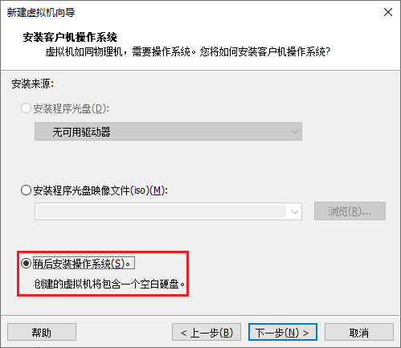

> 客户机操作系统选择**Linux**，版本选择**Red Hat Enterprise Linux 7 64 位**，
> 因为CentOS是 `RedHat(红帽)` 的分支，安装的是7.6的版本所以这里选择红帽7的版本，下一步

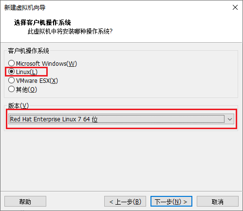

> 给**虚拟机命名**，以及**选择安装位置**，下一步

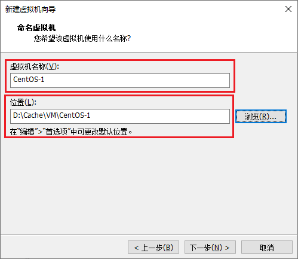

> **最大磁盘大小填写20GB**(不够以后还可以扩充)，选择**将虚拟磁盘拆分成多个文件**，下一步

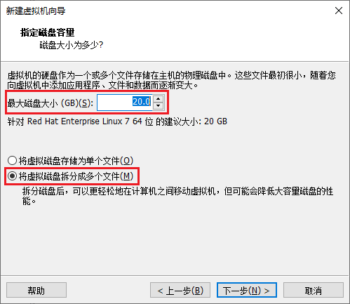

> 点击**自定义硬件**

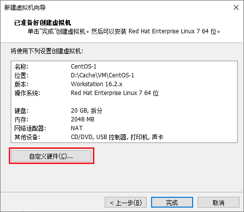

- **内存**

  > **内存和虚拟内存**按照建议的来，一般**2GB**够用
  
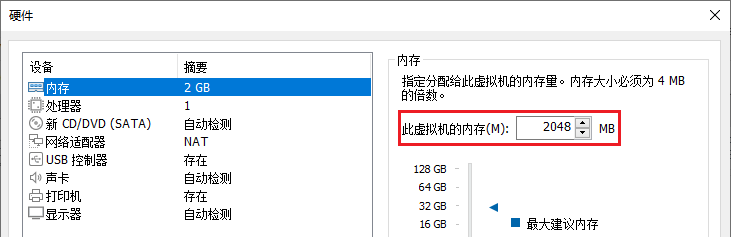

- **处理器**

  > 根据主机的处理器来配置，我的主机只有一个CPU处理器，一共有8个内核，自身主机也需要使用，这里给出一半，**每个处理器的内核数量为4**

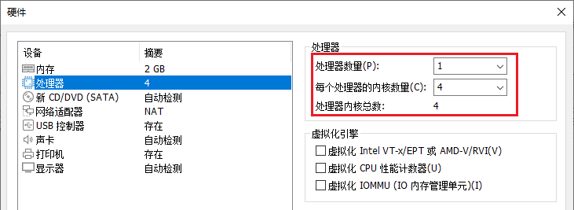

- **网络适配器**

  > 网络连接中**选择NAT模式**
  >
  > - **桥接模式：** 虚拟系统可以和外部系统通迅，但是容易造成IP冲突
  > - **NAT模式：** 网络地址转换模式，虚拟系统可以和外部系统通迅，不造成IP冲突
  > - **仅主机模式：** 独立的系统

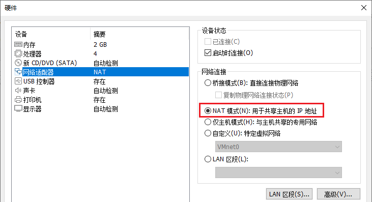

- **其他**

  > 其他的**默认**即可

> **点击关闭**，再**点击完成**，选择刚刚创建好的虚拟机，**右键**选择**设置**

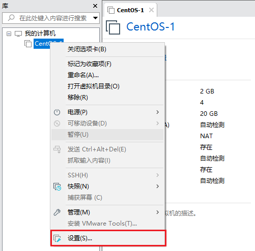

> 选择**CD/DVD**，在**使用ISO映像文件**中**选择下载的ContOS的镜像文件**，点击**确定**

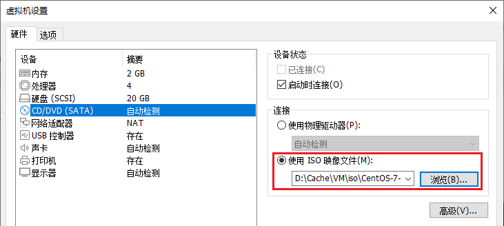

> **开启此虚拟机**，双击黑色窗口，即可将鼠标和键盘进入虚拟机中，等待一会后，进入设置界面

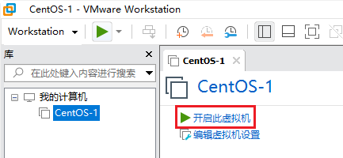

