---
tags:
- Linux/VMware
---

如果已经安装了一台Linux操作系统，没有必要重新安装，只需要克隆就可以了，有两种方式。

1. **直接拷贝一份安装好的虚拟机文件**
2. **使用VMware的克隆操作，克隆时需要先关闭Linux系统**

克隆的新系统的账户密码和被克隆机器的一样的，也可以复制到其他机器上

## 直接拷贝

找到虚拟机的本地文件夹，右键**点击复制**

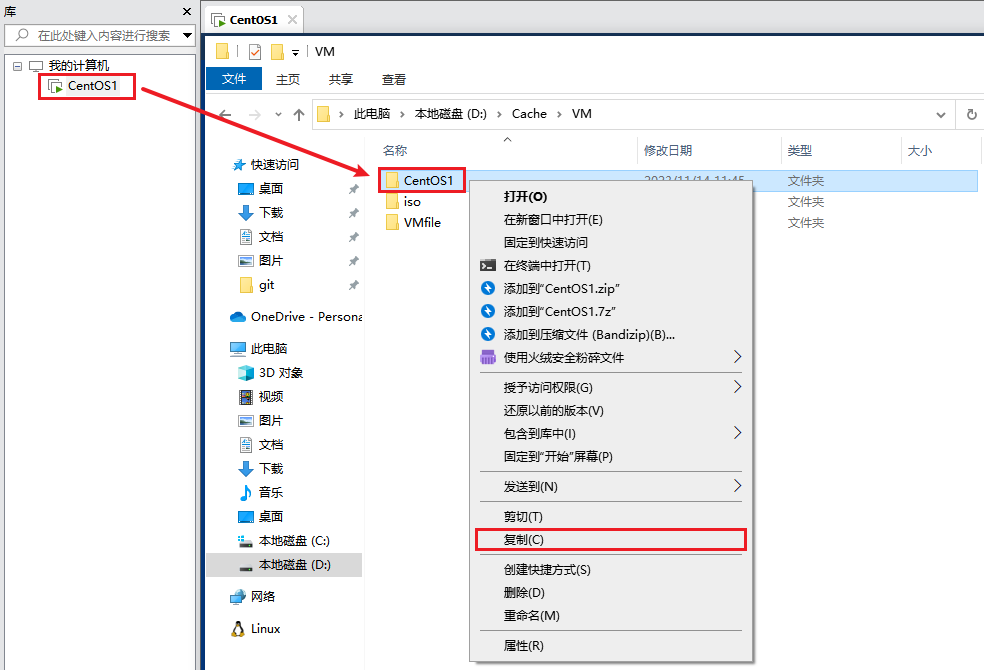

**粘贴**到要存放虚拟机的目录，然后将文件夹改名即可，这里将名字改成了`centos2`

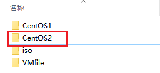

在VMware软件中，点击**文件**，选择**打开**

选中复制的文件夹中的`.vmx`文件，然后点击**打开**

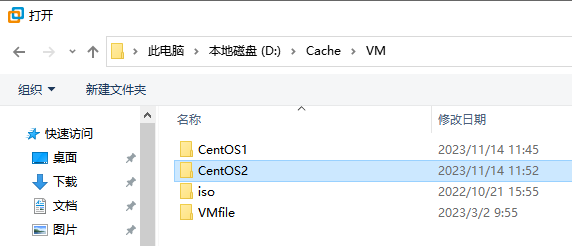

**右击重命名**，更改即可

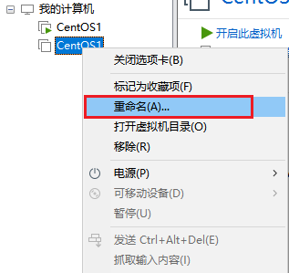

## 克隆操作

选择需要克隆的机器(先将虚拟机关机)，**单击右键**，**选择管理**，再**选择克隆**

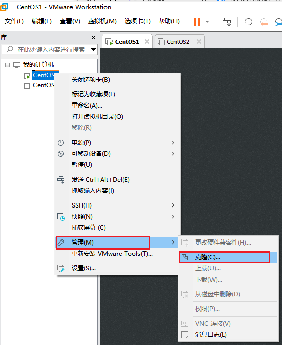

点击**下一页**

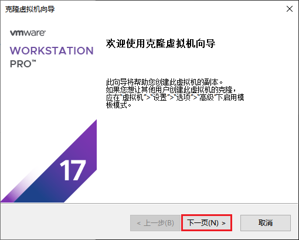

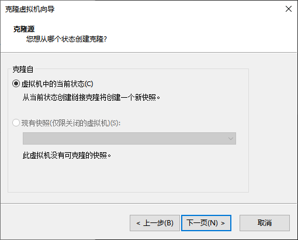

这里第一个选项引用，克隆后的系统和原系统用的是同一个系统，所以这里选择第二个，创建**完整克隆**

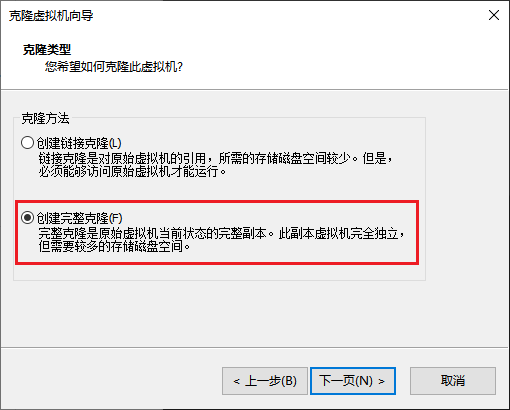

修改虚拟机的名字和创建的位置，然后**点击完成**

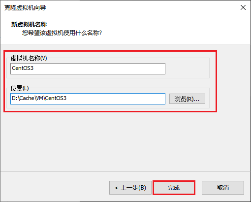

等待克隆完，**关闭**此窗口即可

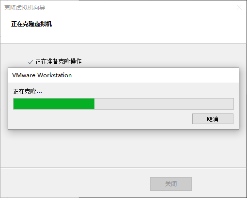

此时刚刚克隆的虚拟机就出来了

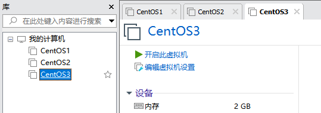

