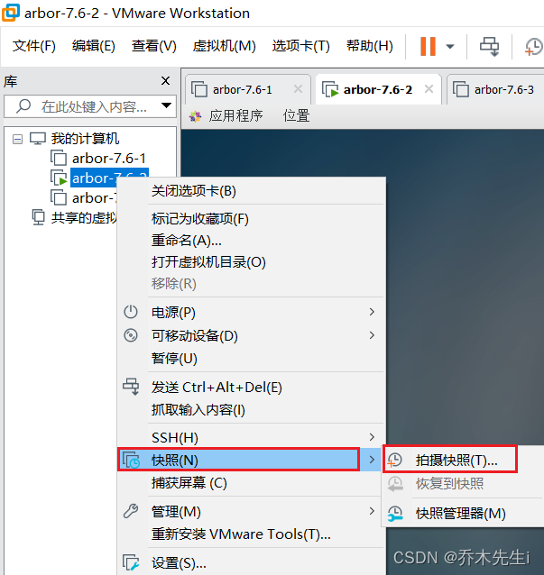
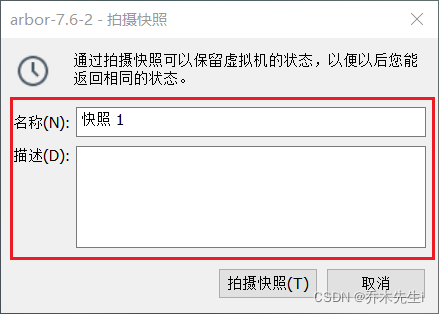
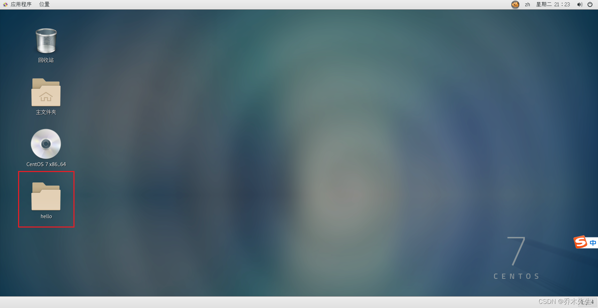
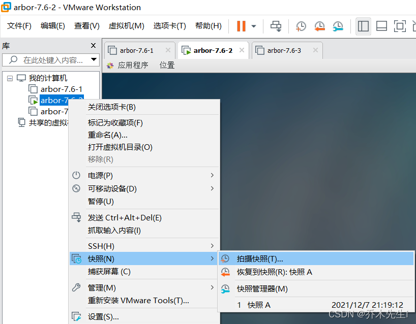
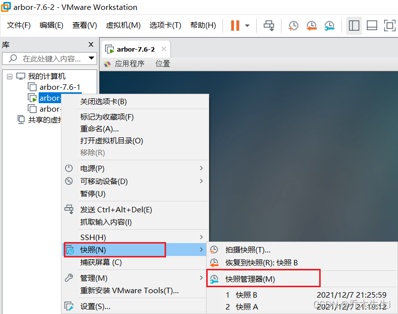
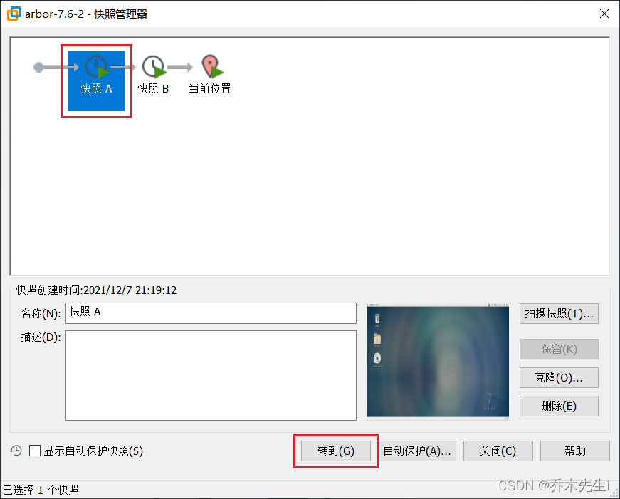
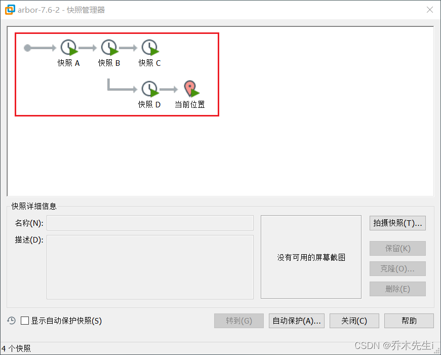

---
tags:
  - Linux/VMware
---

如果担心接下来的操作可能会导致系统异常，需要回到原先某个正常运行的状态，VMware提供了这样的功能，叫做快照管理。

安装好系统以后，先做一个快照A，然后开机新建一个文件夹，然后保存一个快照B，然后返回到快照A的状态。

选择需要快照的虚拟机，**右键单击**，**选择快照**，再选择**拍摄快照**

给快照添加**名称**和**描述**，然后点击**拍摄快照**

此时可以验证一下，可以在被快照后的机器上**新建一个文件夹**

再创建一个快照B

在快照管理中恢复

选择需要回到快照节点，然后**点击转到**，即可返回对应的快照的位置

快照也可以有分支，例如下图

因为每创建一次快照，也会消耗一定的储存空间，所以建议如果不是特别需要，没有必要频繁的创建快照。