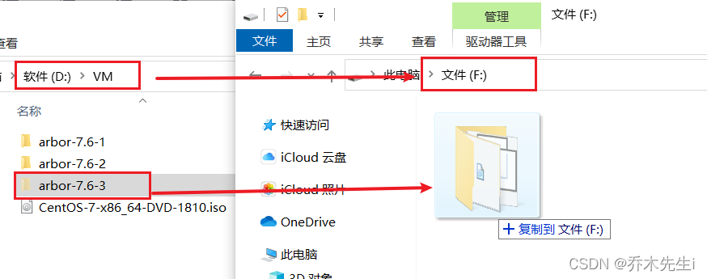
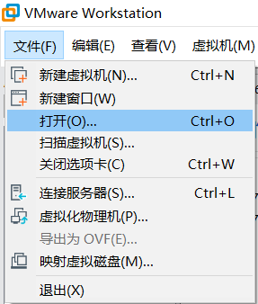
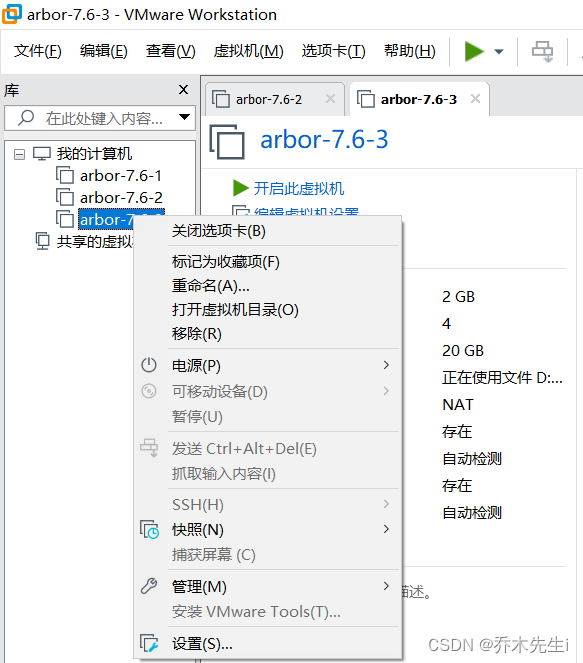
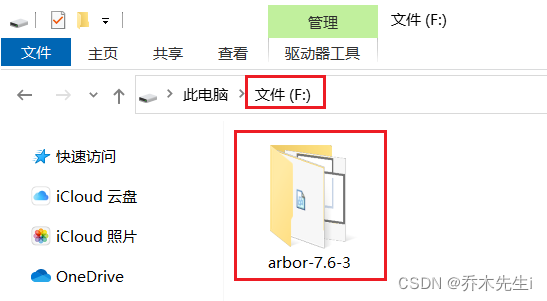

---
tags:
  - Linux/VMware
---

虚拟机系统安装好后，它的本质就是文件(在创建虚拟机的文件夹中)。所以虚拟机系统的迁移非常的方便。

## 迁移

首先将虚拟机的文件**复制**或者**剪切**到需要迁移到的文件夹中

右上角**文件**，然后选择**打开**

选择刚刚复制过来的`.vmx`文件，然后点击**打开**即可

## 删除

选中想要删除的虚拟机，**单击右键**，选择**移除**

然后再将虚拟机的本地文件删除即可

